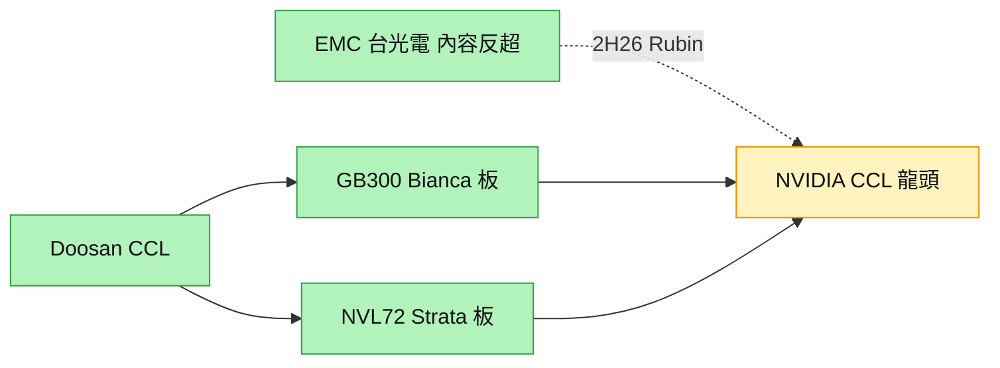

# 000150.KR(doosan)

## 基本資料
Doosan（斗山）旗下 Doosan Electro-Materials（斗山電子材料）為 **NVIDIA CCL（銅箔基板）供應商**。過去 12 個月（2025-06～2026-05）為 NVIDIA CCL 供應商中價值占比第一，但 SemiAnalysis 指出此地位自 2026-06 起將被 [[2383_台光電（市）]]（EMC）超越。資料來源：[[報告_SemiAnalysis_NvidiaCCL_20260702]]。

## 核心技術／競爭優勢
- **既有 NVIDIA 板卡地位**：GB300 供應 Bianca 板；VR NVL72 供應 Strata 板。
- **CCL 材料能力**：高階伺服器用低損耗 CCL，長期為 NVIDIA 主要 CCL 來源。
- **競爭壓力**：在 VR NVL72 世代，EMC（台光電）板卡料號與內容成長顯著快於 Doosan，EMC 內容加總反超約 1.51x。

## 產品與應用
| 產品 / 服務 | 應用 | 相關客戶 / 下游 |
|-------------|------|-----------------|
| CCL（銅箔基板） | GB300 Bianca 板、VR NVL72 Strata 板 | [[NVDA.US(nvidia)]] |

## 圖片 / 架構圖

圖說：Doosan 供 NVIDIA 的 Bianca/Strata 板卡 CCL，但隨 Rubin 放量，台光電 CCL 內容自 2026-06 反超成為龍頭。

## 時間軸
| 時間 | 事件 | 類型 | 重要性 | 備註 |
|------|------|------|--------|------|
| 2026-06 | NVIDIA CCL 價值龍頭被 EMC 超越 | 路線轉向 | ⭐⭐⭐ | Rubin 放量驅動 |

→ 對照 [[時程_2026記憶體與AI催化劑]]

## 供應鏈位置
- 下游：NVIDIA（CCL）
- 所屬供應鏈：[[供應鏈_AI伺服器PCB]]；相關技術 [[技術_CCL]]

## 相關公司
| 公司 | 關係 | 說明 |
|------|------|------|
| [[2383_台光電（市）]] | 競爭 | NVIDIA CCL 供應市占爭奪，2H26 被反超 |
| [[1303_南亞（市）]] | 競爭 / 第二來源 | 南亞塑膠為 NVIDIA CCL 潛在第二來源 |
| [[NVDA.US(nvidia)]] | 客戶 | CCL 主要買方 |

> [!warning] 風險與注意事項
> - 市占流失：VR NVL72／Rubin 世代 CCL 內容成長落後 EMC，價值占比被反超。
> - 第二來源崛起：南亞塑膠 M7/M8 通過 NVIDIA 認證，稀釋既有供應占比。

## 來源
- [[報告_SemiAnalysis_NvidiaCCL_20260702]] — SemiAnalysis，2026-07-02
