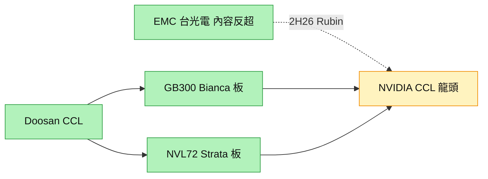

# 000150.KR(doosan)

## 基本資料
Doosan（斗山）旗下 Doosan Electro-Materials（斗山電子材料）為 **NVIDIA CCL（銅箔基板）供應商**。過去 12 個月（2025-06～2026-05）為 NVIDIA CCL 供應商中價值占比第一，但 SemiAnalysis 指出此地位自 2026-06 起將被 [[2383_台光電（市）]]（EMC）超越。資料來源：[[報告_SemiAnalysis_NvidiaCCL_20260702]]。

## 核心技術／競爭優勢
- **既有 NVIDIA 板卡地位**：GB300 供應 Bianca 板；VR NVL72 供應 Strata 板。
- **CCL 材料能力**：高階伺服器用低損耗 CCL，長期為 NVIDIA 主要 CCL 來源。
- **競爭壓力**：在 VR NVL72 世代，EMC（台光電）板卡料號與內容成長顯著快於 Doosan，EMC 內容加總反超約 1.51x。

## 產品與應用
| 產品 / 服務 | 應用 | 相關客戶 / 下游 |
|-------------|------|-----------------|
| CCL（銅箔基板） | GB300 Bianca 板、VR NVL72 Strata 板 | [[NVDA.US(nvidia)]] |
| 光模組 PCB 高頻材料（M7 以上） | 800G／1.6T mSAP 光模組 PCB | 頭部光模組客戶指定；PCB 廠為加工方（2026-09-30 匿名訪談） |

## 圖片 / 架構圖

```mermaid
flowchart LR
    DOO[Doosan CCL] --> BIA[GB300 Bianca 板]
    DOO --> STR[NVL72 Strata 板]
    EMC[EMC 台光電 內容反超] -.2H26 Rubin.-> NV[NVIDIA CCL 龍頭]
    BIA --> NV
    STR --> NV
    classDef mat fill:#b2f2bb,stroke:#2f9e44,color:#111;
    classDef cust fill:#fff3bf,stroke:#f08c00,color:#111;
    class DOO,EMC,BIA,STR mat;
    class NV cust;
```
圖說：Doosan 供 NVIDIA 的 Bianca/Strata 板卡 CCL，但隨 Rubin 放量，台光電 CCL 內容自 2026-06 反超成為龍頭。

## 時間軸
| 時間 | 事件 | 類型 | 重要性 | 備註 |
|------|------|------|--------|------|
| 2026-06 | NVIDIA CCL 價值龍頭被 EMC 超越 | 路線轉向 | ⭐⭐⭐ | Rubin 放量驅動 |

→ 對照 [[時程_2026記憶體與AI催化劑]]

## 供應鏈位置
- 下游：NVIDIA（CCL）
- 所屬供應鏈：[[供應鏈_AI伺服器PCB]]；相關技術 [[技術_CCL]]

## 相關公司
| 公司 | 關係 | 說明 |
|------|------|------|
| [[2383_台光電（市）]] | 競爭 | NVIDIA CCL 供應市占爭奪，2H26 被反超 |
| [[1303_南亞（市）]] | 競爭 / 第二來源 | 南亞塑膠為 NVIDIA CCL 潛在第二來源 |
| [[NVDA.US(nvidia)]] | 客戶 | CCL 主要買方 |

> [!warning] 風險與注意事項
> - 市占流失：VR NVL72／Rubin 世代 CCL 內容成長落後 EMC，價值占比被反超。
> - 第二來源崛起：南亞塑膠 M7/M8 通過 NVIDIA 認證，稀釋既有供應占比。

### 光模組 PCB 材料地位（2026-09-30 匿名訪談）

紅板科技相關匿名訪談稱，800G／1.6T mSAP 光模組 PCB 的核心材料由頭部客戶指定，以 Doosan 為主、[[2383_台光電（市）]] 為輔；M7 以上材料交期逾 4.5 個月，PCB 廠以中長期保量協議與約 6 個月安全庫存因應。壓合時 Doosan 規格書要求 220°C 高溫段維持 60 分鐘以上。客戶同步驗證生益、南亞新材、華正新材與 [[1303_南亞（市）]] 作備援，2028 年後國產材料導入可能壓抑材料漲價。

> [!warning] 與 AI 伺服器 CCL 地位分開
> 本節是光模組 PCB 材料的單一匿名渠道口徑（信心低），與上方 SemiAnalysis 對 NVIDIA 伺服器 CCL 價值占比被台光電反超的判斷屬不同應用，不互相覆蓋。

來源：[[memo_AceCamp_紅板科技光模組PCB與mSAP_20260930]]（2026-09-30）；見 [[技術_mSAP]]、[[分析_20260929-30專家紀要受訪公司辨識與供給驗證]]。

## 來源
- [[報告_SemiAnalysis_NvidiaCCL_20260702]] — SemiAnalysis，2026-07-02
- [[memo_AceCamp_紅板科技光模組PCB與mSAP_20260930]] — AceCamp Tech，2026-09-30，紅板科技相關匿名訪談；光模組 PCB 指定材料以 Doosan 為主，低信心。

## 相關頁面
- [[技術_mSAP]]
- [[分析_20260929-30專家紀要受訪公司辨識與供給驗證]]
