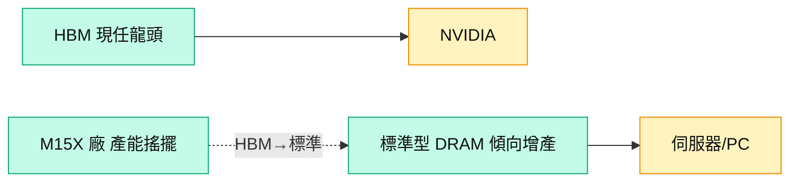

# 000660.KR(sk_hynix)

## 基本資料
SK 海力士（SK hynix）為 **HBM 現任市占龍頭**，DRAM/NAND 大廠。在 AI 記憶體循環中受惠 HBM 需求與 LTA。摩根士丹利維持 OW；惟大和指出其 HBM 市占「高到不正常」，未來將回歸正常水準，2H26 起競爭轉守。資料來源：[[260702_ms_nand-industry]]、[[大和 韓國記憶體產業電話會議摘要]]。

## 核心技術／競爭優勢
- **HBM 先發優勢**：目前 HBM 市占最高，但美光、三星積極追趕；分析師觀察其市占正在下滑。
- **HBM4E 進度**：樣品已出貨；DRAM 製程由 1b → 1c，惟 logic die 可能仍用 N12（取得 N3 有困難），為相對弱點。
- **產能策略轉向**：M15X 廠規劃從 HBM4 → HBM3 → 現改為 HBM + 標準型 DRAM，反映更傾向生產標準型 DRAM；被解讀為 HBM 市占下滑訊號。

## 產品與應用
| 產品 / 服務 | 應用 | 相關客戶 / 下游 |
|-------------|------|-----------------|
| HBM3/HBM4 | AI GPU | [[NVDA.US(nvidia)]] |
| 標準型 DRAM | 伺服器、PC、手機 | CSP、品牌 |
| NAND / eSSD | 資料中心儲存 | 資料中心 |

## 圖片 / 架構圖

圖說：海力士仍是 HBM 市占龍頭，但 M15X 產能配置由 HBM 轉向標準型 DRAM，被視為市占回落的訊號。

## 時間軸
| 時間 | 事件 | 類型 | 重要性 | 備註 |
|------|------|------|--------|------|
| 2026-07-10 | ADR 新股發行完成（2.5%） | 事件 | ⭐⭐ | 被動資金流入，短期正面但多已 priced in |
| 2027 | HBM4E 量產、logic die 製程受限 | 規格升級 | ⭐⭐⭐ | N3 取得困難為競爭變數 |

→ 對照 [[時程_2026記憶體與AI催化劑]]

## 供應鏈位置
- 上游：半導體設備、hybrid bonding（下單量 > 出貨量）、Hanmi TC bonder
- 下游：NVIDIA、CSP
- 所屬供應鏈：[[供應鏈_記憶體]]；相關技術 [[技術_HBM高頻寬記憶體]]

## 相關公司
| 公司 | 關係 | 說明 |
|------|------|------|
| [[005930.KR(samsung)]] | 同業 / 競爭 | HBM 市占爭奪主要對手 |
| [[MU.US(micron)]] | 同業 | HBM/DRAM 競爭者 |
| [[NVDA.US(nvidia)]] | 客戶 | HBM 主要買方 |

> [!warning] 風險與注意事項
> - 市占回落：HBM 市占被視為偏高、正向常態回歸，三星／美光追趕。
> - 製程受限：HBM4E logic die 若卡在 N12、難取得 N3，效能／競爭力受壓。

## 來源
- [[260702_ms_nand-industry]] — 摩根士丹利，2026-07-02
- [[大和 韓國記憶體產業電話會議摘要]] — 大和，2026-07-02

## 相關頁面

- [[分析_記憶體超級循環2026]]
