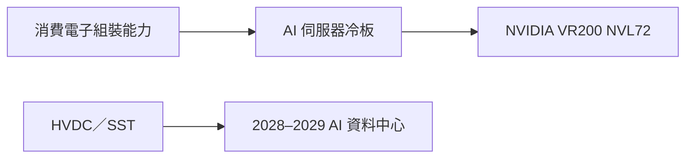

# 00285.HK(byd_electronic)

## 基本資料

比亞迪電子（BYD Electronics，00285.HK）提供電子產品組裝、零組件與新能源車相關產品。GF Securities 2026-08-28 報告指出，2026 上半年營收為人民幣 822 億元、毛利率 4.9%，AI 基礎設施收入約人民幣 7.52 億元；目前投資觀察重點由手機組裝轉向 AI 伺服器冷板與高壓直流／連接產品。

## 核心技術／競爭優勢

- 組裝與零組件製造規模大，可將既有消費電子製造能力延伸至 AI 基礎設施。
- 冷板產品可切入 NVIDIA Vera Rubin VR200 NVL72，並透過 Lead Wealth 供應，具備由專案導入轉向放量的可能性。
- 報告指出公司規劃將冷板相關產能由約 40,000 平方公尺擴至 200,000 平方公尺，形成 AI 散熱業務的供給彈性；此為券商轉述／estimate，非公司正式產能指引。

## 產品與應用

| 產品／服務 | 應用 | 相關客戶／下游 |
|---|---|---|
| 電子產品組裝 | 智慧型手機與消費電子 | 品牌客戶，來源未逐一揭露 |
| 冷板（Cold Plate） | VR200 NVL72 AI 伺服器 | NVIDIA 平台供應鏈，2026 年 9 月起預計出貨 |
| HVDC／SST 與連接產品 | 下一代 AI 資料中心 | 2028–2029 年仍屬早期布局 |

## 圖片／架構圖

*圖說：BYD Electronics 由組裝與零組件能力延伸至 VR200 NVL72 冷板，HVDC／SST 則仍在較早期的產品開發階段。*

## EPS 預估

| 年度 | 營收（人民幣百萬元） | 淨利（人民幣百萬元） | EPS（人民幣） | 來源與性質 |
|---|---:|---:|---:|---|
| 2026E | 187,324 | 2,288 | 1.0 | GF Securities 2026-08-28 estimate |
| 2027E | 206,981 | 3,856 | 1.7 | GF Securities 2026-08-28 estimate |
| 2028E | 225,479 | 5,045 | 2.2 | GF Securities 2026-08-28 estimate |

## 目標價與評等

| 券商 | 報告發布日 | 評等 | 目標價 | 評價基礎 | 來源 |
|---|---|---|---:|---|---|
| GF Securities (Hong Kong) Brokerage | 2026-08-28 | Hold | HK$30 | 15x 2027E P/E | [[GFHK - BYDE 1H26 Results]] |

## 時間軸

| 時間 | 事件 | 類型 | 重要性 | 備註 |
|---|---|---|---|---|
| 2026-09 | VR200 冷板開始出貨 | 放量 | ⭐⭐⭐ | 券商轉述，經由 Lead Wealth；需以實際出貨確認 |
| 2026Q4 | VR200 冷板放量 | 放量 | ⭐⭐⭐ | GF Securities estimate |
| 2028–2029 | HVDC／SST 與連接產品貢獻擴大 | 技術下線 | ⭐⭐ | 仍屬早期布局，信心低至中 |

→ 跨公司散熱供應鏈詳見 [[供應鏈_AI伺服器散熱]]

## 供應鏈位置

- 組裝與零組件製造：消費電子與 AI 伺服器零組件供應商。
- AI 散熱：VR200 NVL72 冷板候選供應商，位於 [[供應鏈_AI伺服器散熱]] 的冷板環節。

## 相關公司

| 公司 | 關係 | 說明 |
|---|---|---|
| [[NVDA.US(nvidia)]] | 平台／下游 | VR200 NVL72 冷板需求來源，為券商供應鏈判斷 |

> [!warning] 風險與注意事項
> - AI 冷板出貨與放量時程目前來自券商與管理層展望，尚非可獨立驗證的正式客戶訂單。
> - 手機組裝、記憶體與匯率逆風可能壓縮毛利率；AI 基礎設施收入仍不足以抵銷傳統業務波動的風險。

## 來源

- [[GFHK - BYDE 1H26 Results]]（GF Securities (Hong Kong) Brokerage，2026-08-28）

## 相關頁面

- [[供應鏈_AI伺服器散熱]]
- [[時程_2026Q3Q4_AI網通與硬體催化劑]]
