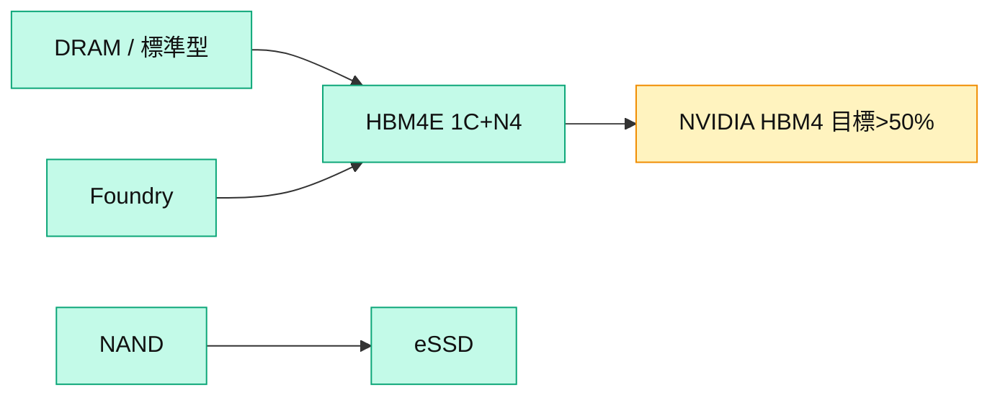

# 005930.KR(samsung)

## 基本資料
三星電子（Samsung Electronics）為全球 **DRAM 龍頭**，並跨足 NAND、晶圓代工（foundry）與手機／消費電子。在 2026 記憶體超級循環中，DRAM 與 HBM 是獲利核心。摩根士丹利將三星列為亞洲科技與記憶體 **Top Pick**，看好其市場領導地位與強化的股東回饋；大和亦看好其 HBM 市占回升與積極庫藏股。資料來源：[[260702_ms_nand-industry]]、[[大和 韓國記憶體產業電話會議摘要]]。

## 核心技術／競爭優勢
- **DRAM 規模領導**：3Q26 估 DRAM 漲價 20–30%，帶動獲利上修與 P/E 穩定（2027e ~5.2x）。
- **HBM4E 卡位**：HBM4E 已出樣品，採 1C DRAM + N4 logic die，效能較 HBM4 提升逾 20%；目標在 NVIDIA HBM4 供應占比 > 50%。大和預估三星 2027 年 HBM 市占回升至約 50%、重返第一。
- **股東回饋**：員工 incentive 庫藏股（年約 3tn 韓圜、OP 10%）下周啟動；3 年期回饋計畫最後一年，超額現金 80–100tn 韓圜可能分批執行、提前至 3Q26 買庫藏股並註銷，年底或配特別股利。

## 產品與應用
| 產品 / 服務 | 應用 | 相關客戶 / 下游 |
|-------------|------|-----------------|
| DRAM / HBM | AI 伺服器、資料中心 | [[NVDA.US(nvidia)]]、CSP |
| NAND / eSSD | 儲存 | 資料中心、消費 |
| 晶圓代工 | HBM logic die、SoC | 記憶體、外部客戶 |

## 圖片 / 架構圖

圖說：三星以 DRAM/HBM 為獲利核心，並用自有 foundry 供 HBM4E logic die，目標拉高 NVIDIA HBM4 供應占比。

## 時間軸
| 時間 | 事件 | 類型 | 重要性 | 備註 |
|------|------|------|--------|------|
| 2026-07（下周） | preliminary 財報公告 | 事件 | ⭐⭐ | 分批公告，獲利可達上修後預估 |
| 2026Q3 | 提前啟動庫藏股買進並註銷 | 事件 | ⭐⭐ | 股東回饋加大 |
| 2027 | HBM 市占回升至約 50% | 放量 | ⭐⭐⭐ | 重返第一（大和估） |

→ 對照 [[時程_2026記憶體與AI催化劑]]

## 供應鏈位置
- 上游：半導體設備（AMAT/LAM/TEL/ASML/BESI）、hybrid bonding
- 下游：NVIDIA、CSP、手機／PC
- 所屬供應鏈：[[供應鏈_記憶體]]；相關技術 [[技術_HBM高頻寬記憶體]]、[[技術_NAND快閃記憶體]]

## 相關公司
| 公司 | 關係 | 說明 |
|------|------|------|
| [[000660.KR(sk_hynix)]] | 同業 / 競爭 | HBM/DRAM 主要競爭者 |
| [[MU.US(micron)]] | 同業 | DRAM/NAND/HBM 競爭者 |
| [[NVDA.US(nvidia)]] | 客戶 | HBM4/HBM4E 主要買方 |

> [!warning] 風險與注意事項
> - HBM 執行：HBM4E 良率與 NVIDIA 認證進度決定市占回升力道。
> - 循環節奏：YoY 漲價 4Q26 可能觸頂，短期缺乏催化劑須待 2028 供給紀律明朗。

## 來源
- [[260702_ms_nand-industry]] — 摩根士丹利，2026-07-02
- [[大和 韓國記憶體產業電話會議摘要]] — 大和，2026-07-02

## 相關頁面

- [[009150.KR(semco)]]
- [[SNDK.US(sandisk)]]
- [[分析_記憶體超級循環2026]]
