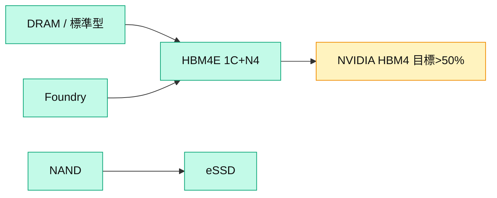

# 005930.KR(samsung)

## 基本資料
三星電子（Samsung Electronics）為全球 **DRAM 龍頭**，並跨足 NAND、晶圓代工（foundry）與手機／消費電子。在 2026 記憶體超級循環中，DRAM 與 HBM 是獲利核心。摩根士丹利將三星列為亞洲科技與記憶體 **Top Pick**，看好其市場領導地位與強化的股東回饋；大和亦看好其 HBM 市占回升與積極庫藏股。資料來源：[[260702_ms_nand-industry]]、[[大和 韓國記憶體產業電話會議摘要]]。

## 核心技術／競爭優勢
- **DRAM 規模領導**：3Q26 估 DRAM 漲價 20–30%，帶動獲利上修與 P/E 穩定（2027e ~5.2x）。
- **HBM4E 卡位**：HBM4E 已出樣品，採 1C DRAM + N4 logic die，效能較 HBM4 提升逾 20%；目標在 NVIDIA HBM4 供應占比 > 50%。大和預估三星 2027 年 HBM 市占回升至約 50%、重返第一。
- **股東回饋**：員工 incentive 庫藏股（年約 3tn 韓圜、OP 10%）下周啟動；3 年期回饋計畫最後一年，超額現金 80–100tn 韓圜可能分批執行、提前至 3Q26 買庫藏股並註銷，年底或配特別股利。

## 產品與應用
| 產品 / 服務 | 應用 | 相關客戶 / 下游 |
|-------------|------|-----------------|
| DRAM / HBM | AI 伺服器、資料中心 | [[NVDA.US(nvidia)]]、CSP |
| NAND / eSSD | 儲存 | 資料中心、消費 |
| 晶圓代工 | HBM logic die、SoC | 記憶體、外部客戶 |

## 圖片 / 架構圖

![[報告_高盛_三星HBM與獲利預估_20260930_p04.png]]
圖說：高盛 2026-09-30 的三星 HBM 量價、營收組合與 DRAM／NAND 利潤率模型；2027 HBM US$74bn、占 DRAM 營收 19% 均屬預估。

```mermaid
flowchart LR
    DRAM[DRAM / 標準型] --> HBM[HBM4E 1C+N4]
    HBM --> NV[NVIDIA HBM4 目標>50%]
    NAND[NAND] --> SSD[eSSD]
    FND[Foundry] --> HBM
    classDef mem fill:#c3fae8,stroke:#0ca678,color:#111;
    classDef cust fill:#fff3bf,stroke:#f08c00,color:#111;
    class DRAM,HBM,NAND,SSD,FND mem;
    class NV cust;
```
圖說：三星以 DRAM/HBM 為獲利核心，並用自有 foundry 供 HBM4E logic die，目標拉高 NVIDIA HBM4 供應占比。

![[報告_UBS_全球智慧型手機8月銷售_20261005_003.png]]
> UBS／Counterpoint 各品牌手機量年增率：左為 1H26 sell-in（UBSe）對 sell-through，右為 2026 年 8 月 YTD sell-through。三星 YTD -4.1% 優於小米、OPPO、vivo、傳音的 -18% 至 -23%，僅次於 Apple +8.7%。

## EPS 預估

高盛 2026-09-30 預估，來源 [[報告_高盛_三星HBM與獲利預估_20260930]]。

| 年度 | 普通股基本 EPS（KRW） | 前次高盛 | 屬性／信心 |
|---|---:|---:|---|
| 2026E | 45,177 | 46,078 | estimate／中 |
| 2027E | 74,034 | 71,848 | estimate／中 |
| 2028E | 89,363 | 87,588 | estimate／中 |

高盛維持 **Buy、普通股 TP KRW490,000、優先股 KRW360,000**，以 2026–2027E EV/EBITDA SOTP 評價。基本 EPS 與第 7 頁 2026E 稀釋 EPS KRW45,103 是不同口徑，不合併；來源 [[報告_高盛_三星HBM與獲利預估_20260930]]，estimate／中信心。

## 時間軸

### 本批驗證節點

| 時間 | 事件 | 類型 | 重要性 | 備註 |
|---|---|---|---|---|
| 2026Q3（預估） | 營業利益約 KRW106 兆，較前次約 112 兆下修 | 財報驗證 | ⭐⭐⭐ | 高盛 2026-09-30，匯率與 DRAM 供應限制；非已公告實績 |
| 2027（預估） | HBM 營收約 US$74bn／KRW100 兆、位元約 210 億 Gb | 放量／定價 | ⭐⭐⭐ | 高盛 estimate／中；客戶採用、價格與位元需各別驗證 |
| 2027H2（預估） | Foundry／System LSI 轉盈窗口 | 營運驗證 | ⭐⭐ | 假設稼動率逾 90%；estimate／中低；[[時程_2026-2028九月底AI材料與算力驗證]] |

### 既有時間軸
| 時間 | 事件 | 類型 | 重要性 | 備註 |
|------|------|------|--------|------|
| 2026-07（下周） | preliminary 財報公告 | 事件 | ⭐⭐ | 分批公告，獲利可達上修後預估 |
| 2026Q3 | 提前啟動庫藏股買進並註銷 | 事件 | ⭐⭐ | 股東回饋加大 |
| 2027 | HBM 市占回升至約 50% | 放量 | ⭐⭐⭐ | 重返第一（大和估） |
| 2026-08-07 | Galaxy Z Fold8 Ultra／Fold8／Flip8 上市；8 月新摺疊機 sell-through 280 萬支 | 產品／銷售 | ⭐⭐ | UBS 2026-10-05 引 Counterpoint；fact（第三方統計）／中 |
| 2027 | DDI 委外聯電（MS 推估），支撐聯電 8 吋漲價 | 供應鏈 | ⭐⭐ | MS 2026-10-05 estimate／中低 |

→ 對照 [[時程_2026記憶體與AI催化劑]]

## 供應鏈位置
- 上游：半導體設備（AMAT/LAM/TEL/ASML/BESI）、hybrid bonding
- 下游：NVIDIA、CSP、手機／PC
- 所屬供應鏈：[[供應鏈_記憶體]]；相關技術 [[技術_HBM高頻寬記憶體]]、[[技術_NAND快閃記憶體]]

## 相關公司
| 公司 | 關係 | 說明 |
|------|------|------|
| [[000660.KR(sk_hynix)]] | 同業 / 競爭 | HBM/DRAM 主要競爭者 |
| [[MU.US(micron)]] | 同業 | DRAM/NAND/HBM 競爭者 |
| [[NVDA.US(nvidia)]] | 客戶 | HBM4/HBM4E 主要買方 |
| [[GOOGL.US(alphabet)]] | TPU HBM 需求關聯 | 高盛 2026-09-30 認為三星在 Google TPU 等 ASIC HBM 供應具較強位置；券商渠道 estimate／中，未揭露份額或新增合約 |
| [[2303_聯電（市）]] | 潛在代工夥伴 | MS 2026-10-05 預期三星 DDI 委外聯電；未經雙方公告 |
| [[AAPL.US(apple)]] | 手機競爭 | 全球手機兩大品牌；2026 年 8 月 YTD Apple +8.7%、三星 -4.1%（UBS／Counterpoint） |

> [!warning] 風險與注意事項
> - HBM 執行：HBM4E 良率與 NVIDIA 認證進度決定市占回升力道。
> - 循環節奏：YoY 漲價 4Q26 可能觸頂，短期缺乏催化劑須待 2028 供給紀律明朗。

## 2026-10-05 手機業務與晶圓代工委外

- **手機（UBS）：** 2026 年 8 月三星 sell-through 2,030 萬支，年增 0.9%，為 2026 年 3 月以來首度轉正；主因 8 月 7 日上市的 Galaxy Z Fold8 Ultra／Fold8／Flip8。新摺疊機 8 月賣出 280 萬支，只比 2025 年 7+8 月舊機型少 30 萬支（-7.5%），且銷售期少兩週。年初至今仍年減 4.1%，UBS 估 2026E sell-in 年增 4.4%，理由為旗艦機韌性與中階市占提升；維持 Buy（APAC Key Call，2026-10-02 股價 KRW 276,000）。
- **委外（MS）：** MS 預期三星把 DDI（顯示驅動 IC）委外 [[2303_聯電（市）]]，是聯電 2027 年 8 吋漲價與 2028E 獲利上修理由之一；屬券商推估，非公司公告。
- 來源：[[報告_UBS_全球智慧型手機8月銷售_20261005]]（UBS，2026-10-05）、[[報告_MorganStanley_台積電3Q26預覽與聯電2027_20261005]]（Morgan Stanley，2026-10-05）。

## 2026-09-30 高盛：獲利分部與 HBM 量價

- **3Q26 下修原因：** OP 由約 KRW112 兆調為 106 兆，主要是平均 USD/KRW 約 1,418、低於原假設 1,460，以及 DRAM 供應限制。DRAM 位元 +4% QoQ、ASP +14%，HBM 位元接近 +50% QoQ；NAND 位元 +7%、ASP +17%，均為高盛 estimate／中。
- **HBM 2027：** ASP 約 US$3.6/Gb（+130% YoY）、位元約 210 億 Gb（逾 +60%），營收約 US$74bn／KRW100 兆（+274%），占 DRAM 營收約 19%（2026 約 8%）。Google TPU 等 ASIC 與 NVIDIA HBM4 供應份額改善屬渠道 estimate，沒有新增合約或固定份額。
- **Foundry／System LSI：** 3Q26 虧損估由 KRW1.2 兆擴至 1.7 兆；2027 損失縮小約 5 兆、2H27 轉盈須稼動率逾 90%，是條件式預估。
- **MX 成本壓力：** 3Q26 手機業務虧損估由 KRW1.4 兆擴至 1.8 兆；高記憶體成本使 2027／28 MX OP 估計下修 40%–50%。Display 3Q26 OP 約 1 兆維持；記憶體強勢不能直接推為所有分部同幅受惠。

來源：[[報告_高盛_三星HBM與獲利預估_20260930]]（高盛，2026-09-30）；模型驗證見 [[分析_AgenticAI需求到供電與材料獲利的驗證_20260929]]。

## 來源
- [[報告_高盛_三星HBM與獲利預估_20260930]] — Goldman Sachs，2026-09-30；EPS／TP、3Q26 OP、2027 HBM 量價與 Foundry／MX
- [[報告_UBS_全球智慧型手機8月銷售_20261005]] — UBS，2026-10-05；8 月手機 sell-through、摺疊機銷售與 2026E sell-in
- [[報告_MorganStanley_台積電3Q26預覽與聯電2027_20261005]] — Morgan Stanley，2026-10-05；三星 DDI 委外聯電推估
- [[260702_ms_nand-industry]] — 摩根士丹利，2026-07-02
- [[大和 韓國記憶體產業電話會議摘要]] — 大和，2026-07-02

- [[20260626_0803_JPM_Micron_Technology_Su_2026-06-25_5345710 (1)]]（2026-06-25）
- [[Nvidia (NVDA.US)_1150902_JPM]]（2026-09-02）
- [[cxmt-dram-ipo]]（2026-06-23）
- [[報告_IMAPS_JohnLau_2.3D整合FOCoS綜述_20230501]]（2023-05-01）
- [[報告_Nomura_亞洲AI半導體_20260630]]（2026-06-30）
- [[報告_UBS_CXMT首次覆蓋_20260807]]（2026-08-07）
- [[報告_摩根士丹利_韓國記憶體小幅波動_20260806]]（2026-08-06）
- [[大和 Nvidia 2QFY27法說摘要]]（2026-08-27）

- [[報告_JPM_HBM市場更新_20260922]]（2026-09-22）
- [[報告_UBS_智慧型手機記憶體成本_20260922]]（2026-09-22）

## 相關頁面

- [[1810.HK(xiaomi)]]
- [[時程_2026Q3Q4_AI網通與硬體催化劑]]
- [[分析_中國基礎模型_Token經濟與算力瓶頸_20260905]]
- [[CXMT（未）]]
- [[分析_CXMT_DRAM_IPO分析]]
- [[009150.KR(semco)]]
- [[SNDK.US(sandisk)]]
- [[分析_記憶體超級循環2026]]
