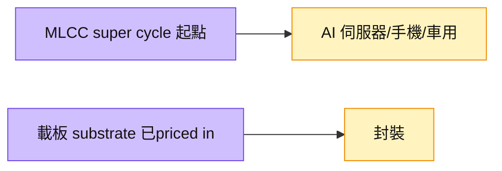

# 009150.KR(semco)

## 基本資料
SEMCO（Samsung Electro-Mechanics，三星電機）為 **MLCC 與載板（substrate）** 大廠。大和記憶體分析師 SK Kim 在 2026-07 電話會議中表示，其目前**最看好 SEMCO**——認為 MLCC 將進入超級循環，「現在的 MLCC 就像 3Q25 的記憶體剛開始」，而載板題材大致已 priced in。資料來源：[[大和 韓國記憶體產業電話會議摘要]]。

## 核心技術／競爭優勢
- **MLCC 超級循環題材**：分析師視 MLCC 為下一個 super cycle 起點，重點在 MLCC 而非已反映的載板。
- **產品組合**：MLCC + 半導體載板（substrate），跨 AI 伺服器、手機、車用。

## 產品與應用
| 產品 / 服務 | 應用 | 相關客戶 / 下游 |
|-------------|------|-----------------|
| MLCC | AI 伺服器、手機、車用 | 系統廠、模組廠 |
| 半導體載板 | 封裝基板 | 晶片／封裝客戶 |

## 圖片 / 架構圖

圖說：大和看好 SEMCO 的 MLCC 進入超級循環（重心在 MLCC，載板已反映），對應被動元件族群上行。

## 時間軸
| 時間 | 事件 | 類型 | 重要性 | 備註 |
|------|------|------|--------|------|
| 2026H2 | MLCC 超級循環起點（分析師觀點） | 規格升級 | ⭐⭐ | 類比 3Q25 記憶體起漲 |

→ 對照 [[時程_2026記憶體與AI催化劑]]

## 供應鏈位置
- 下游：AI 伺服器、手機、車用系統廠
- 所屬供應鏈：[[供應鏈_被動元件]]；相關技術（MLCC）
- 相關族群：被動元件（MLCC）與載板

## 相關公司
| 公司 | 關係 | 說明 |
|------|------|------|
| [[005930.KR(samsung)]] | 集團關聯 | 三星集團體系 |
| [[2327_國巨（市）]] | 同業 | MLCC 競爭／台系對照 |

> [!warning] 風險與注意事項
> - 觀點來源單一：MLCC 超級循環目前主要為賣方（大和 SK Kim）觀點，待更多需求數據佐證。
> - 載板已反映：substrate 上行空間可能有限。

## 來源
- [[大和 韓國記憶體產業電話會議摘要]] — 大和，2026-07-02

## 相關頁面

- [[供應鏈_記憶體]]
- [[分析_記憶體超級循環2026]]
