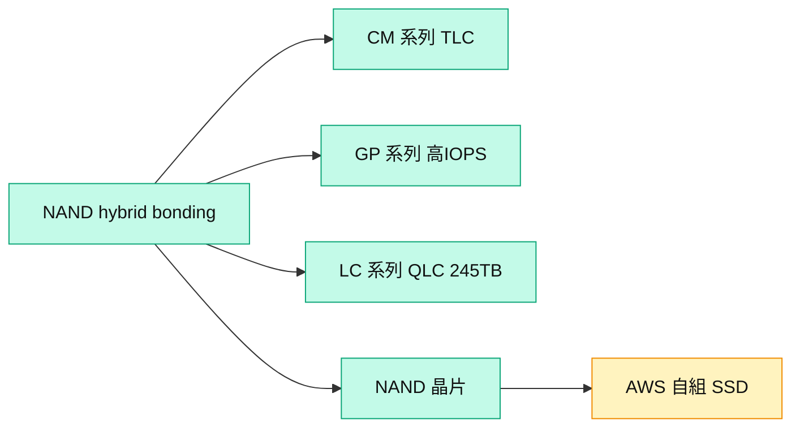

# 285A.JP(kioxia)

## 基本資料
Kioxia（鎧俠）為**純 NAND 廠**，摩根士丹利日本半導體 **Top Pick**，看好其 FCF 生成與股東回饋潛力。以 hybrid bonding 取得成本優勢，並具完整 AI 儲存 SSD 產品線。AWS 為其最大客戶（僅採購 NAND 晶片、自組 SSD），故其 server SSD 市占 << NAND 市占。資料來源：[[260702_ms_nand-industry]]、[[大和 韓國記憶體產業電話會議摘要]]。

## 核心技術／競爭優勢
- **Hybrid bonding 成本優勢**：純 NAND 廠中具製程成本優勢，2027 有望積極擴 capex、拉升市占。
- **AI 儲存產品線**：CM 系列（KV cache、高吞吐低延遲 TLC）、GP 系列（Super High IOPS，可補 HBM）、LC 系列（245TB QLC SSD 已量產出貨）。
- **FCF 與回饋**：FY3/27–3/28 年 FCF 估 ¥4.0–5.0trn，管理層暗示大部分超額 FCF 可回饋股東；2027 配息、規劃 FY27 ADR、股票分割。

## 產品與應用
| 產品 / 服務 | 應用 | 相關客戶 / 下游 |
|-------------|------|-----------------|
| CM 系列 TLC SSD | KV cache 推論 AI | 資料中心 |
| GP 系列 SSD | Super High IOPS | AI 伺服器 |
| LC 系列 QLC 245TB | 大規模 AI 儲存 | hyperscaler |
| NAND 晶片 | 外部組 SSD | CSP、AWS |

## 圖片 / 架構圖

圖說：Kioxia 以 hybrid bonding NAND 為基礎鋪 AI 儲存 SSD 三大系列；最大客戶 AWS 僅買 NAND 晶片自組 SSD。

## 時間軸
| 時間 | 事件 | 類型 | 重要性 | 備註 |
|------|------|------|--------|------|
| 2026-07（下周） | preliminary 財報 | 事件 | ⭐⭐ | 接三星、Hynix 後公告 |
| 2027 | 開始配息、擴 capex | 事件 | ⭐⭐ | ADR、股票分割規劃 |
| CY27 | LTA 覆蓋 > 50% 出貨 | 事件 | ⭐⭐ | CY28 約維持 50% 保留彈性 |

→ 對照 [[時程_2026記憶體與AI催化劑]]

## 供應鏈位置
- 上游：NAND 設備、hybrid bonding
- 下游：AWS（最大客戶，買晶片自組）、資料中心、SSD 模組廠
- 所屬供應鏈：[[供應鏈_記憶體]]；相關技術 [[技術_NAND快閃記憶體]]

## 相關公司
| 公司 | 關係 | 說明 |
|------|------|------|
| [[SNDK.US(sandisk)]] | 合資夥伴 / 同業 | 共同 NAND 廠背景、DC 儲存競合 |
| [[005930.KR(samsung)]] | 同業 | NAND 競爭者 |
| [[MU.US(micron)]] | 同業 | NAND 競爭者 |

> [!warning] 風險與注意事項
> - 客戶集中：AWS 為最大客戶且僅買晶片，server SSD 市占遠低於 NAND 市占。
> - ASP 假設：股東回饋規模綁 FCF，若 NAND ASP 反轉則回饋空間縮小。

## 來源
- [[260702_ms_nand-industry]] — 摩根士丹利，2026-07-02
- [[大和 韓國記憶體產業電話會議摘要]] — 大和，2026-07-02

## 相關頁面

- [[分析_記憶體超級循環2026]]
