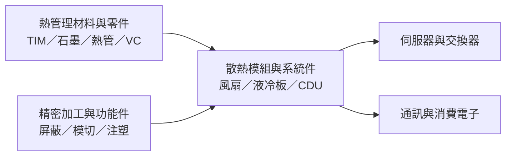

# 300602.CN(feirongda)

## 基本資料
深圳市飛榮達科技股份有限公司（飛榮達）成立於 1993 年，2017 年於深圳證券交易所創業板上市，代號 300602。公司業務涵蓋電磁屏蔽、熱管理、基站天線、防護與輕量化材料及功能元件；散熱產品包括導熱介面材料、石墨材料、熱管、均熱板、風扇及液冷板。公司年報稱其產品應用於通訊、消費電子、新能源及資料中心等領域，並表示伺服器、交換器及資料中心散熱業務持續成長；客戶名稱與個別供應份額多未公開。[[供應鏈_AI伺服器散熱]]

依公司 2025 年年報，2025 年營收人民幣 65.27 億元、年增 24.74%；歸母淨利人民幣 3.65 億元、年增 59.97%；EPS 人民幣 0.63 元。這是公司正式披露的歷史財務數據，不代表 2026 年預估。官方年報另稱伺服器及交換器營收持續成長，部分散熱產品已批量交付，另有專案仍在送樣或試產階段。([公司簡介](https://www.frd.cn/about.aspx?FId=n1%3A1%3A1)、[2025 年年報](https://static.cninfo.com.cn/finalpage/2026-04-28/1225207278.PDF))

## 核心技術／競爭優勢
- **多種熱管理方案**：公司公開產品涵蓋 TIM、石墨、熱管、VC、風扇、液冷板及液冷模組，可按終端設備的空間、熱通量與散熱架構提供零件或模組。
- **材料與精密加工整合**：熱管理產品與電磁屏蔽、模切、注塑及結構件能力同屬公司產品組合；可服務需要多材料與結構整合的電子設備，但單一客戶的導入狀態仍須分別核實。
- **伺服器散熱品項拓展**：2025 年報列出風扇、3D VC、液冷板、流量控制及 CDU 等資料中心散熱產品，並稱已進入國內外主流伺服器供應鏈；年報同時指出部分專案仍處於驗證階段，不能將供應鏈資格等同於量產訂單。

## 產品與應用
| 產品 / 服務 | 應用 | 相關客戶 / 下游 |
|-------------|------|-----------------|
| 風扇與風扇模組 | 伺服器、交換器與通訊設備氣冷 | 公司年報稱供應主流伺服器供應鏈，未具名；匿名訪談另稱有 H 公司相關出貨，尚非公司確認 |
| VC、熱管、導熱材料 | 消費電子、伺服器與高熱流密度設備 | 客戶未具名；應用依公司產品資料 |
| 液冷板、流量控制與 CDU | 資料中心液冷 | 公司年報列為產品方向；部分專案仍在驗證或試產 |
| 電磁屏蔽、輕量化與功能件 | 通訊、消費電子、新能源 | 依公司公開業務介紹，個別客戶未具名 |

## 圖片 / 架構圖

圖說：依公司公開產品組合整理；圖示表示產品與應用關係，不代表特定客戶的認證、訂單或供應份額。

## EPS 記錄
| 期間 | EPS（人民幣元） | YoY | 備註 |
|------|----------------|-----|------|
| 2025 全年 | 0.63 | +61.54% | 公司 2025 年報披露；非券商預估 |

## 時間軸（催化劑）
| 時間 | 事件 | 類型 | 重要性 | 備註 |
|------|------|------|--------|------|
| 2025 | 伺服器、交換器及資料中心散熱業務持續成長；部分產品批量交付 | 營運／出貨 | ⭐⭐ | 公司 2025 年報；另有專案仍在送樣或試產 |
| 2026H2（匿名訪談估計） | H 公司相關風扇業務後續增長觀察 | 客戶驗證／放量 | ⭐ | 訪談稱 2025 年相關風扇銷售額約人民幣 5,000–7,000 萬元；匿名且未獲公司證實，不視為公司指引。見 [[時程_2026Q3Q4_AI網通與硬體催化劑]] |

## 供應鏈位置
- **熱管理零件與模組**：提供風扇、VC、熱管、熱介面材料、液冷板及其他散熱產品；公司披露的伺服器客戶未具名。
- **應用端**：資料中心伺服器、交換器、通訊與消費電子設備。伺服器散熱供應鏈脈絡見 [[供應鏈_AI伺服器散熱]]。
- **客戶關係邊界**：AceCamp 匿名訪談提及華為／H 公司及組裝廠渠道，但不同段落包含渠道估算與專家判斷；本文只作低信心追蹤線索，不寫入 `related_companies`，不視為公司公告的客戶或份額資訊。

## 相關公司
| 公司 | 關係 | 說明 |
|------|------|------|
| 尚未列入 | 客戶待確認 | 匿名訪談提到 H 公司與多家組裝廠；公司年報未具名披露，暫不建立公司關聯。 |

> [!warning] 風險與注意事項
> - 客戶名稱、伺服器風扇銷售額及華為供應份額來自匿名付費訪談，非公司確認資料；不得與公司年報的未具名伺服器供應鏈描述合併推定。
> - 年報提及部分伺服器散熱專案仍在送樣或試產，產品清單、供應鏈資格與批量營收貢獻需分開追蹤。
> - 風扇與液冷模組須面對既有散熱供應商競爭、客戶認證及產品可靠性要求；新專案進度可能影響量產時點。

## 來源
- [[memo_AceCamp_飛榮達散熱與華為業務_20260827]]（AceCamp Tech 匿名專家訪談，2026-08-27；付費來源；客戶、銷售額與供應份額屬未經公司確認的低信心線索）
- [飛榮達公司簡介](https://www.frd.cn/about.aspx?FId=n1%3A1%3A1)（公司官方網站，查閱 2026-10-01）
- [飛榮達產品頁](https://www.frd.cn/products.aspx)（公司官方網站，查閱 2026-10-01）
- [飛榮達 2025 年年度報告](https://static.cninfo.com.cn/finalpage/2026-04-28/1225207278.PDF)（巨潮資訊／公司公告，2026-04-28）
