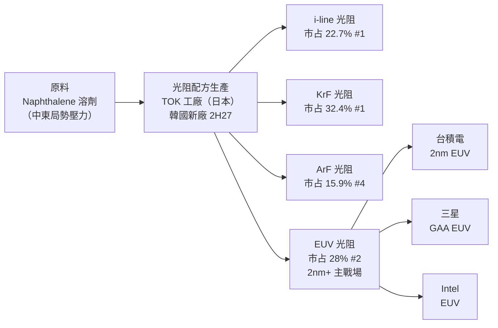

# 4186.JP(tokyo ohka kogyo)

## 基本資料

東京應化工業（Tokyo Ohka Kogyo, TOK），全球主要半導體光阻劑（Photoresist）製造商，在 i-line（第一）、KrF（第一）、EUV（第二）光阻劑擁有重要市占。EUV 光阻劑是 TOK 最重要的市占拓展機會，隨 2nm 與更先進節點進入量產，台灣、韓國、美國主要 EUV 客戶已採用 TOK 材料。光阻劑原料（Naphthalene 萘系溶劑）受中東地緣政治緊張影響，成本壓力顯著，3Q26 起推動漲價。

主要資料來源：[[報告_GF廣發_日本科技巡訪_202606]]（GF Securities HK，~2026-06）。

## 核心競爭優勢

- **i-line 和 KrF 市占第一**：i-line 22.7%、KrF 32.4% 居市場首位，客戶切換成本高（製程驗證耗時），護城河強
- **EUV 市占第二（28%）**：2nm 及以後節點關鍵市占拓展機會；台灣、韓國、美國主要 EUV 客戶已採用
- **漲價較易執行**：客戶利用率高、轉換光阻供應商意願低，支撐成本轉嫁；3Q26 漲價進行較順利
- **韓國+台灣高純度化學新產能**：1H27 新生產線投產、2H27 韓國新化工廠，增強高端材料供應能力

## 產品與應用

| 產品 | 市占率 | 市場排名 | 說明 |
|------|--------|--------|------|
| i-line 光阻 | 22.7% | 第一 | 成熟製程；份額轉移有限 |
| KrF 光阻 | 32.4% | 第一 | 0.18μm–90nm；份額穩固 |
| ArF 光阻 | 15.9% | 第四 | 先進製程主力之一；競爭激烈 |
| EUV 光阻 | 28% | 第二 | 2nm+ 最重要成長機會；台/韓/美客戶採用 |

## 圖片 / 架構圖

*TOK 光阻供應鏈：原料受中東地緣政治影響（Naphthalene 溶劑漲價）；EUV 光阻是最重要增長機會，已進入台積電、三星、Intel EUV 供應鏈。資料來源：GF Securities Japan Tech Tour ~2026-06。*

## 時間軸

| 時間 | 事件 | 類型 | 重要性 | 備註 |
|------|------|------|--------|------|
| 2026Q2 | 中國客戶庫存拉升至 4-5 個月（vs 正常 2-3 個月）| 庫存 | ⭐⭐ | 出口管制消息刺激；TOK 預期影響短暫 |
| 2026-04 | 供應商通知漲價 → 5 月起與客戶談判 | 成本 | ⭐⭐ | Naphthalene 溶劑漲價（中東局勢）|
| 3Q26 | 漲價生效；2Q26 GPM 短暫壓縮 | 財務 | ⭐⭐⭐ | 轉嫁時間差導致 2Q26 毛利承壓 |
| 1H27 | 日本高純度化學新生產線投產 | 量產 | ⭐⭐ | 高純度化學品產能擴充 |
| 2H27 | 韓國新化工廠投產 | 量產 | ⭐⭐⭐ | 韓國 EUV 客戶就近供應 |

## 供應鏈位置

- **EUV 光阻主要競爭對手**：JSR（第一，2nm EUV），Shin-Etsu Chemical（信越化學），Sumitomo Chemical
- **EUV 光阻客戶**：台積電、三星、Intel（均已採用 TOK EUV 材料）
- **所屬供應鏈**：無對應現有供應鏈頁

## 相關公司

| 公司 | 關係 | 說明 |
|------|------|------|

> [!warning] 風險與注意事項
> - **原料成本壓力**：Naphthalene 溶劑受中東局勢影響，成本轉嫁時間差（2Q26 GPM 壓縮）
> - **EUV 市占提升不確定性**：EUV 光阻市場競爭激烈，JSR/信越/住友均積極爭取；TOK 第二名地位需持續維護
> - **中國庫存波動**：中國客戶預防性囤貨（2Q26 衝量）導致短期需求失真，後續正常化後收入可能出現短暫下滑

## 來源

- [[報告_GF廣發_日本科技巡訪_202606]]（GF Securities HK，~2026-06；Japan Tech Tour 實地拜訪）
