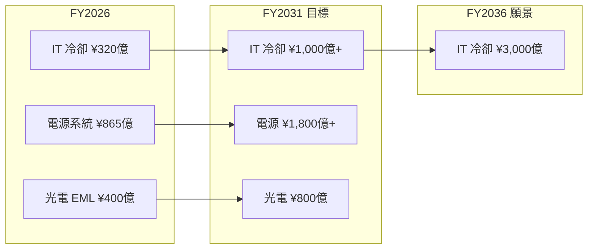

# 6503.JP(mitsubishi electric)

## 基本資料

三菱電機（Mitsubishi Electric），日本綜合電機大廠，主要業務橫跨工業自動化（FA）、電力電子（Power Devices）、空調、電梯、防衛航太與社會基礎設施。在 AI 伺服器供應鏈中，三個關鍵切入點：
1. **CDU（Cooling Distribution Unit）液冷**：已開始出貨資料中心液冷系統，與 NVIDIA 共同開發 800VDC 供電暨冷卻系統；
2. **EML 光電晶片**：超高速光元件（EML chips）供應 AI 光通訊模組；
3. **SiC 功率半導體**：8 吋 SiC 晶圓廠已投產，鎖定資料中心 UPS 與車載電源模組。

主要資料來源：[[報告_GF廣發_日本科技巡訪_202606]]（GF Securities HK，~2026-06）。

## 核心競爭優勢

- **液冷技術與 NVIDIA 合作**：CDU 已出貨（FY2025 IT 冷卻業務 ¥320 億），與 NVIDIA 共同開發 800VDC 供電冷卻系統，商業化目標 FY2028；與 Zutacore 合作熱交換系統（氣媒冷卻）
- **EML 光電元件**：供應超高速 EML chips 支援生成式 AI 市場擴張；FY2026 光電業務 ¥400 億，目標 FY2031 ¥800 億（+100%）
- **8 吋 SiC 量產**：Surabaya（印尼）8 吋 SiC 晶圓廠已投產接單，全球 No.2 SiC 功率模組市佔（僅次 Infineon），擅長功率模組封裝技術
- **策略合作網絡**：富士康（Hon Hai）EV 平台 50/50 JV；Toshiba + Rohm 功率元件三方 JV（目標 2030 年¥4,000 億營收）

## 產品與應用

| 產品 / 業務 | FY2026 營收 | FY2031 目標 | 應用 |
|-------------|------------|------------|------|
| IT 冷卻系統（CDU）| ¥320 億 | ¥1,000 億+ | AI 資料中心液冷 |
| 電源系統（UPS/電池）| ¥865 億 | ¥1,800 億+ | 資料中心供電穩定 |
| 光電元件（EML chips）| ¥400 億 | ¥800 億 | 生成式 AI 光通訊 |
| 監控控制 / FA 元件 | ¥200 億 | ¥400 億 | 工廠自動化 |
| SiC 功率模組 | — | — | EV、資料中心 UPS |

## 圖片 / 架構圖

AI 資料中心業務成長路線（FY2026 → FY2036）：

*三菱電機 AI DC 業務：液冷系統 FY2036 目標 ¥3,000 億，為 FY2026 的近 10 倍。資料來源：GF Securities Japan Tech Tour ~2026-06。*

## 時間軸

| 時間 | 事件 | 類型 | 重要性 | 備註 |
|------|------|------|--------|------|
| FY2025 | IT 冷卻業務營收 ¥320 億 | 業績 | ⭐⭐ | CDU 液冷出貨基礎 |
| FY2026 | 8 吋 SiC 晶圓廠（印尼 Surabaya）投產 | 量產 | ⭐⭐⭐ | 大量出貨中期展望 |
| FY2026 | 與 Hon Hai 成立 EV 平台 50/50 JV | 合作 | ⭐⭐ | 涵蓋動力總成與自駕 |
| FY2028 | 800VDC 供電冷卻系統商業化（與 NVIDIA JV）| 技術里程碑 | ⭐⭐⭐ | Zutacore 熱交換合作 |
| FY2028 | Toshiba/Rohm 三方功率元件 JV 目標 ¥4,000 億 | 合作 | ⭐⭐ | 強化全球競爭力 |
| FY2031 | IT 冷卻業務目標 ¥1,000 億+ | 中期目標 | ⭐⭐⭐ | 電源系統 ¥1,800 億+ |
| FY2036 | IT 冷卻業務願景 ¥3,000 億 | 長期目標 | ⭐⭐ | 含液冷完整方案 |

## 供應鏈位置

- **客戶（液冷/電源）**：AI 資料中心運營商（hyperscaler）、[[NVDA.US(nvidia)]]（800VDC 合作）
- **SiC 模組競爭者**：Infineon（全球第一）、Rohm（合作/競爭）
- **合作夥伴**：Hon Hai（EV JV）、Toshiba、Rohm（功率元件 JV）、Zutacore（熱交換）
- **所屬供應鏈**：[[技術_800VDC供電架構]]、[[供應鏈_AI伺服器散熱]]

## 相關公司

| 公司 | 關係 | 說明 |
|------|------|------|
| [[NVDA.US(nvidia)]] | 技術夥伴 | 共同開發 800VDC 供電冷卻系統（FY2028 商業化） |

> [!warning] 風險與注意事項
> - **800VDC 時程風險**：Nvidia 主導的 800VDC 量產已推遲至 2028+；若進一步延後，IT 冷卻業務成長節奏受影響
> - **SiC 競爭激烈**：Infineon、Onsemi、Wolfspeed 等積極擴產；三菱主打封裝技術護城河但規模相對小
> - **EML 市場高度競爭**：需與 Lumentum、II-VI（Coherent）、苗蘆（中國）競爭高速光電元件

## 來源

- [[報告_GF廣發_日本科技巡訪_202606]]（GF Securities HK，~2026-06；Japan Tech Tour 實地拜訪）
