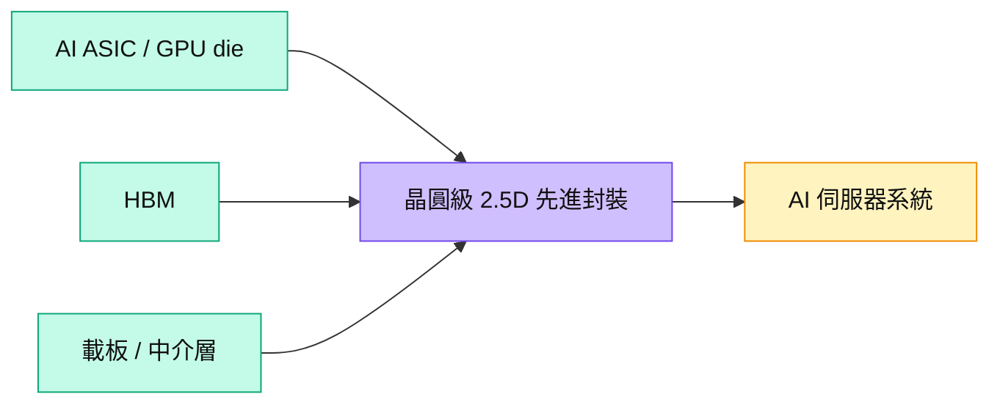

# 688820.SH(sj_semiconductor)

## 基本資料

盛合晶微半導體（SJ Semiconductor）是中國晶圓級先進封裝廠，2026-04-21 以 688820 於上交所科創板掛牌。其公開定位是多晶粒整合封裝；本次匿名訪談的 CoWoS-S／L 產能結構、在地 AI 加速器客戶與自製中介層描述，與該定位高度吻合，因此將會議受訪主體判為盛合晶微，但不將訪談中的客戶、產能、良率或價格當作公司公告。來源：[[memo_AceCamp_盛合晶微CoWoS-L封裝_20260820]]、[上交所上市公告](https://big5.sse.com.cn/site/cht/www.sse.com.cn/disclosure/announcement/listing/ipo/c/c_20260420_10815741.shtml)。

## 核心技術／競爭優勢

- **晶圓級多晶粒整合**：公開資料指出公司已量產多晶粒整合封裝平台，是承接中國 AI 加速器異質整合需求的技術基礎。
- **CoWoS 類 2.5D 路線**：匿名受訪者描述 CoWoS-S／L 產能可調度與自製 interposer；此為受訪者說法，不能視為公司認證規格。
- **境內供應鏈定位**：來源稱先進封裝需求受 HBM、載板與散熱等上游限制，代表封裝產能本身並非唯一瓶頸。

## 產品與應用

| 產品 / 服務 | 應用 | 相關客戶 / 下游 |
|-------------|------|-----------------|
| 晶圓級多晶粒整合封裝 | AI 加速器、異質整合晶片 | 中國 AI 晶片設計業者；本次訪談提及的客戶關係未獲公司公告確認 |
| CoWoS 類 2.5D 封裝 | GPU／ASIC 與 HBM 整合 | 受 HBM、載板與熱管理供給共同約束 |

## 圖片 / 架構圖

圖說：中國 AI 加速器的 2.5D 封裝須同步取得晶粒、HBM、載板／中介層與封裝產能；訪談只提供其中一個供應端的渠道觀察。

## 時間軸

| 時間 | 事件 | 類型 | 重要性 | 備註 |
|------|------|------|--------|------|
| 2026 年底（匿名訪談） | CoWoS-S／L 合計月產能目標約 1.5 萬片 | 擴產／驗證 | ⭐⭐⭐ | 受訪者估計，非公司公告；須以產能、稼動率與交付驗證 |
| 2027（匿名訪談） | 月產能遠期目標約 2 萬片 | 擴產／驗證 | ⭐⭐ | 依 HBM、載板與客戶需求而定，非已確認資本支出 |

→ 跨公司追蹤詳見 [[時程_2026Q3Q4_AI網通與硬體催化劑]]。

## 供應鏈位置

- 上游：AI 晶粒、HBM、載板／中介層材料與封裝設備。
- 下游：AI 加速器設計商與資料中心系統。
- 相關技術：[[技術_CoWoS與先進封裝]]；載板脈絡：[[供應鏈_先進封裝載板]]。

## 相關公司

| 公司 | 關係 | 說明 |
|------|------|------|
| — | — | 訪談提及多家客戶與同業，但無足夠公司公告交叉確認，暫不建立確定關係。 |

> [!warning] 風險與注意事項
> - **身分辨識不等於內部資訊確認**：受訪主體為盛合晶微屬 thesis（中高信心）；產能、客戶、良率、報價與訂單皆是匿名專家說法。
> - **供給瓶頸不只封裝**：即使封裝轉換週期短，HBM、載板、CCL 與散熱供應也可能限制整機交付。

## 來源

- [[memo_AceCamp_盛合晶微CoWoS-L封裝_20260820]] — AceCamp Tech 匿名專家會議，2026-08-20。
- [上海證券交易所上市公告](https://big5.sse.com.cn/site/cht/www.sse.com.cn/disclosure/announcement/listing/ipo/c/c_20260420_10815741.shtml) — 2026-04-20（股票代碼與上市資訊）。

## 相關頁面

- [[分析_20260820專家會議受訪公司辨識]]
