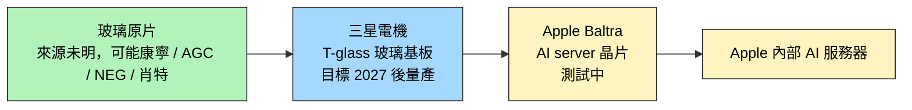

# AAPL.US(apple)

> [!note] 本頁範圍說明
> 本頁僅就本次 ingest 涵蓋的主題 — **Baltra AI server 晶片的玻璃基板路線** — 記錄 Apple 的角色。Apple A 系列、M 系列、iPhone、Vision Pro 等其他主題等之後 ingest 對應主題的來源時再補。
> 
> **內容單薄警告**：本次來源（[[報告_其他_玻璃基板_20260511]]）對 Apple 的描述僅一段，故本頁深度有限，不代表 Apple 業務全貌。

## 基本資料
Apple（蘋果），全球消費電子龍頭，本次主題範圍內的角色是**內部 AI server 晶片 Baltra 的玻璃基板路線採用者**。Apple 並未自製玻璃基板，而是與 **三星電機**（Samsung Electro-Mechanics）合作採用 T-glass 路徑。

主要資料來源：[[報告_其他_玻璃基板_20260511]]（國金證券，2026-05-11）。

## 核心技術／競爭優勢

- **Baltra AI server 晶片玻璃基板測試**：Apple 已啟動 Baltra AI 服務器晶片的玻璃基板測試
- **採用三星電機 T-glass**：玻璃基板供應商為三星電機（Samsung Electro-Mechanics）
- **量產時程（三星電機目標）**：三星電機目標 **2027 年後** 實現量產（claim 類型 thesis、信心中；注意：這是供應商目標，不等於 Apple 出貨時點）
- **路線差異**：相對於 [[INTC.US(intel)]] 自製、[[2330_台積電（市）]] 走 CoPoS 對外服務，Apple 走**品牌客戶 + 三星電機供應**路徑

## 產品與應用

| 產品 / 服務 | 應用 | 上游玻璃基板供應 |
|-------------|------|------------------|
| Baltra AI server 晶片 | Apple 內部 AI 加速器 | 三星電機（T-glass） |

## 圖片 / 架構圖

![[報告_GFHK_Apple_20260915_001.png]]

圖說：GF Securities (Hong Kong) 對 iPhone 各世代季度 build plan 的預估；iPhone 18 的 2026 年配置與年增率均屬券商模型，應以實際供應鏈出貨驗證。（2026-09-15）

`[待補來源圖]` 需 Apple 官方供應鏈揭露或第三方拆解報告佐證；上方為自製供應鏈示意圖。

## EPS 記錄
（本次來源未涉及）

| 季度 | EPS (USD) | YoY | 備註 |
|------|-----------|-----|------|
| — | — | — | 本次來源未揭露 |

## EPS 預估
（本次來源未涉及）

## 目標價與評等
（本次來源未涉及）

## 時間軸

| 時間             | 事件                          | 類型     | 重要性 | 備註                  |
| -------------- | --------------------------- | ------ | --- | ------------------- |
| 2026-05（報告日點到） | Baltra AI server 晶片啟動玻璃基板測試 | 路線確認   | ⭐⭐  | 國金引述                |
| 2027 後         | 三星電機目標量產 T-glass            | 上游量產目標 | ⭐⭐  | 三星電機目標，不等於 Apple 出貨 |

## 供應鏈位置
- **上游玻璃基板**：三星電機（Samsung Electro-Mechanics，T-glass，未建頁）
- **上游玻璃原片**：未明（可能康寧 / AGC / NEG / 肖特之一，本次來源未指明）
- **核心代工**：[[2330_台積電（市）]]（Apple 主要晶圓代工夥伴，本次範圍外但有上下游關係）
- **下游**：Apple 內部 AI 服務器（自家使用）
- **所屬供應鏈**：[[供應鏈_先進封裝載板]]

## 相關公司

| 公司 | 關係 | 說明 |
|------|------|------|
| [[2330_台積電（市）]] | 上游代工 | Apple 主要晶圓代工夥伴（本次範圍外） |
| [[INTC.US(intel)]] | 玻璃基板路線同儕 / 競爭 | 不同採購策略：Intel 自製、Apple 走三星電機 |
| 三星電機（Samsung Electro-Mechanics） | 玻璃基板供應商 | T-glass 供應，本次未建頁 |

> [!warning] 風險與注意事項（本次範圍）
> - **量產時點 = 三星電機目標**：「2027 後」是三星電機的內部量產目標，不是 Apple Baltra 出貨時點。實際 Apple 產品上線時點可能更晚
> - **規格未公開**：T-glass 規格、Baltra 晶片規格、產量規劃均未在本次來源中揭露
> - **資料來源限制**：本份報告為國金證券二手引述，原始 Apple 對 Baltra / 玻璃基板的官方說法應另查蘋果官方與三星電機投資人關係

## 來源
- [[報告_其他_玻璃基板_20260511]]（國金證券「玻璃基板行業深度」，2026-05-11；分析師李陽 S1130524120003）
- [[事件分析_Apple iPhone 18 Preview_090826]]（富邦投顧，2026-09-08；iPhone 18 與 Fold 售價、鏡頭與 BOM 推估）

- [[報告_GFHK_Apple_20260915]]（2026-09-15）
- [[報告_MS_Apple發表會_20250909]]（2025-09-09）
- [[活動_JPM_頎邦訪談_20260527]]（2026-05-27）

## 2026-09 iPhone 18 事件觀察

富邦投顧估算 iPhone 18 Pro Max／Fold 定價可能達 US$1,799／2,399，成本上升主因包括 2nm 晶圓、記憶體與快閃記憶體，以及鏡頭／軸承升規；這是券商模型，不是 Apple 定價或產品規格公告。報告並預期可變光圈鏡頭首度導入 iPhone 18，潛在受惠者為 [[3008_大立光（市）]]。

## 2026-09-15 GFHK iPhone 18 更新

- GF Securities (Hong Kong) 維持 Hold／目標價 US$369（35x FY27E EPS）。該行以預購等待期偏短、規格升級有限與高容量機型加價，判斷 iPhone 18 Pro／Pro Max 初期需求偏溫和；此為券商通路觀察與估值判斷。
- 報告將 2026 年 iPhone Duo EMS 產量由 700 萬支降至 600 萬支，並將 iPhone 18 Pro／Pro Max build plan 降至 7,200 萬支，理由為轉軸與可變光圈鏡頭約束；DRAM／NAND 成本上升亦可能壓縮定價彈性。上述皆為券商 estimate，須以 Apple 財報、供應鏈營收與實際交期驗證。

來源：[[報告_GFHK_Apple_20260915]]（GF Securities (Hong Kong)，2026-09-15）。

## 相關頁面

- [[6147_頎邦（櫃）]]
- [[分析_頎邦矽光GoldBump與營運轉型2026]]
- [[2317_鴻海（市）]]
- [[技術_ABF載板]]
- [[技術_玻璃基板]]
