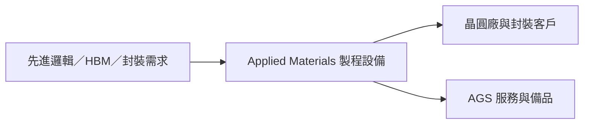

# AMAT.US(applied_materials)

## 基本資料

Applied Materials（AMAT）是半導體製程設備與服務供應商，核心應用涵蓋先進邏輯、HBM、先進封裝與顯示器製程。

### 2026-08-14 更新

- 國泰期貨整理 FY26Q3 營收約 US$9.1bn、Non-GAAP EPS US$3.50，並預估 FY26 EPS US$12.45、FY27 EPS US$14.95；後者為券商 estimate。
- EPIC Center 合作方包括 TSMC、Micron、Samsung、SK Hynix、Broadcom 與 Advantest；AI 晶片升級與設備服務是主要成長驅動。

## 圖片 / 架構圖

圖說：Applied Materials 以製程設備切入晶圓製造與先進封裝，並以 AGS 服務形成 recurring revenue。

## 供應鏈位置

- 上游：半導體製程材料與設備零組件供應商。
- 下游：[[2330_台積電（市）]]、記憶體與先進封裝廠。

## 來源

- [[Applied Materials（AMAT US）0814]]（國泰期貨，2026-08-14）
