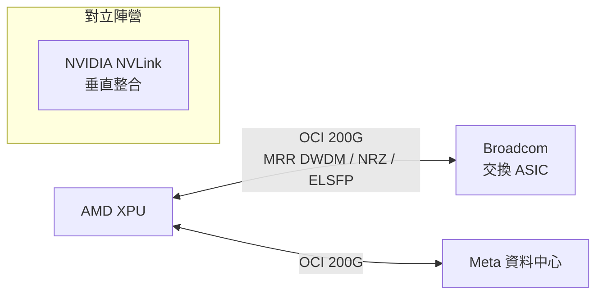

# AMD.US(amd)

## 基本資料

Advanced Micro Devices（AMD）是全球第二大 x86 CPU 製造商，也是 AI 加速器（Instinct MI 系列）的主要供應商。在光互連戰略上，AMD 是 **OCI 200G MSA 的三家共同編輯之一**（與 Meta、Broadcom），以 XPU 廠商角色參與定義 scale-up 光互連開放標準，直接對抗 NVIDIA 垂直整合的 NVLink。

資料來源：[[research_simpletechtrend_CPO矽光子ECTC2026_20260629]]（2026-06-29）

## 核心技術 / 競爭優勢

- **OCI 200G MSA 共編**：AMD（Matt Streshinsky、Mike Li、Krishna Settaluri）與 Meta、Broadcom 共同編輯 OCI 200G v1.0（2026-03-11）
- **Instinct MI 系列**：AI 訓練加速器，採 [[2330_台積電（市）]] 先進製程
- **供應鏈影響**：OCI 強制 ELSFP 外接雷射，為 CW DFB 雷射供應商（Coherent、Lumentum）劃定市場

詳見 [[技術_OCI]]

## 圖片 / 架構圖

`[待補來源圖]` 需官方 OCI 200G MSA 規格圖或 Instinct MI 系列架構圖佐證；上方為自製業務結構示意圖。
## 產品與應用

| 產品 / 服務 | 應用 | 相關客戶 / 下游 |
|-------------|------|-----------------|
| Instinct MI 加速器 | AI 訓練 | 雲端大廠（AWS、Azure、Google） |
| EPYC CPU | 資料中心 | 廣泛伺服器 |
| OCI 200G MSA 共編 | scale-up 光互連標準 | Meta、Broadcom 陣營 |

## 供應鏈位置

- 晶圓代工：[[2330_台積電（市）]]（Instinct 4nm）
- 記憶體：[[MU.US(micron)]]、SK Hynix（HBM）
- 光互連標準：OCI MSA（與 [[META.US(meta)]]、[[AVGO.US(broadcom)]]）

## 相關公司

| 公司 | 關係 | 說明 |
|------|------|------|
| [[META.US(meta)]] | OCI 共編夥伴 | 買方（CSP）角色 |
| [[AVGO.US(broadcom)]] | OCI 共編夥伴 | 交換 ASIC + 光 |
| [[NVDA.US(nvidia)]] | 競爭對手 | NVLink 垂直整合 vs OCI 開放路線 |
| [[2330_台積電（市）]] | 晶圓代工 | Instinct 製造 |
| [[MU.US(micron)]] | 上游 HBM | AI 加速器記憶體 |

## 來源

- [[research_simpletechtrend_CPO矽光子ECTC2026_20260629]]（OCI 200G MSA，2026-06-29）
- [[報告_中信_AMD_OpenAI合作_20251006]]（中信投顧，AMD+OpenAI 合作評析，2025-10-06）

## 相關頁面

- [[COHR.US(coherent)]]
- [[技術_CPO]]
- [[技術_光互連]]
