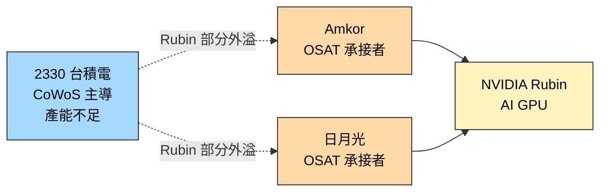

# AMKR.US(amkor)

## 基本資料

Amkor Technology（NASDAQ: AMKR）全球第二大 OSAT（委外封測）大廠，僅次於[[3711_日月光投控（市）]]（ASE Group）。主要業務涵蓋傳統封裝（FC-BGA、WLP）、先進封裝（CoWoS 外包）及測試服務。

**在 AI 先進封裝的角色**：承接 [[2330_台積電（市）]] CoWoS 外溢訂單（on-substrate 後段），與 ASE 矽品瓜分 TSMC 外包量。競爭格局：TSMC 傾向維持 ASE（主要）+ Amkor（次要）雙軌以避免供應商單一化。

主要資料來源：[[報告_其他_玻璃基板_20260511]]（國金證券，2026-05-11）；[[memo_日月光_CoWoS_CPO_專家會議_20260520]]（封測商視角，2026-05）。

## 核心技術／競爭優勢

- **OSAT 先進封裝能力**：能承接 TSMC CoWoS 外溢的 OSAT 之一（另一家是 ASE 矽品）
- **CoWoS on-substrate 後段**：主承接 on-substrate 組裝（Chip-on-Wafer 由 TSMC 自留）
- **CoWoS-R 主承接**（2025 Q4 起）：TSMC 不再接 CoWoS-R，100% 外包；Amkor 2025 Q4 全承、2026 年 **Amkor 70% / ASE 30%**
- **美國在地化**：競爭優勢為美國政府政策支持；2027 Q3-Q4 美國廠房量產

## CoWoS 產能擴張計畫（2026-05 管道）

> 來源：[[memo_日月光_CoWoS_CPO_專家會議_20260520]]（信心：中）

| 時間點 | Amkor CoWoS 月產能 |
|--------|------------------|
| 2026 年初 | **14,000 片/月** |
| 2026 年底目標 | **20,000–25,000 片/月** |
| 2027 年目標 | **27,000 片/月** |

**美國新廠**：
- 2026 年：土建階段
- 2027 Q2：設備移入與驗證
- 2027 Q3-Q4：量產啟動，一期 **6,000 片/月**，總規劃 **12,000 片/月**

**ASE vs Amkor 市場格局**（CoWoS 外包 on-substrate）：
- 台積電在選擇外包商時有供應商制衡策略，以 ASE 為主（55-60%），Amkor 為次（40-45%）
- 良率要求：兩家都需達到 90%+ 才能正常承接量產訂單，差異不大

## 產品與應用

| 產品 / 服務 | 應用 | 相關客戶 / 上游 |
|-------------|------|------------------|
| CoWoS on-substrate（TSMC 外包）| AI GPU / ASIC 封裝 | 上游：[[2330_台積電（市）]] / 終端：[[NVDA.US(nvidia)]]、Broadcom、AMD |
| CoWoS-R（100% 外包，主承）| NVIDIA Vera CPU、chiplet | Amkor 70% 份額 |
| 美國本地製造 | 地緣政治多元化 | 美系客戶 |

## 圖片 / 架構圖

![[AMKR Q2 Earnings Call memo_Fubon 20260728_002.png]]

> Amkor 2026Q2 法說資料圖，對應 AI／HPC 與先進封裝帶動的產品組合及產能利用率改善。

`[待補來源圖]` 需官方 CoWoS 外溢封裝流程圖或法說截圖佐證；上方為自製供應鏈示意圖。
## EPS 記錄
（本次來源未涉及）

| 季度 | EPS (USD) | YoY | 備註 |
|------|-----------|-----|------|
| — | — | — | 本次來源未揭露 |

## EPS 預估
（本次來源未涉及）

## 目標價與評等
（本次來源未涉及）

## 時間軸

| 時間 | 事件 | 類型 | 重要性 | 備註 |
|------|------|------|--------|------|
| 2025 Q4 | CoWoS-R 100% 外包啟動，全由 Amkor 承接 | 業務里程碑 | TSMC 不再接 R 型，以 L 產能替代 |
| 2026 年初 | CoWoS on-sub 月產能 14K，CoWoS-R Amkor 70%/ASE 30% | 產能基準 | — |
| 2026 年底目標 | on-sub 月產能 20-25K | 擴產里程碑 | — |
| 2027 Q2-Q4 | 美國廠房驗證→量產（6K/月一期）| 美國本地化 | — |
| 2026（報告日點到，Rubin 時程）| NVIDIA Rubin 部分 CoWoS 外包给 Amkor + 日月光 | 供應鏈外溢 | ⭐⭐⭐ | TSMC CoWoS 產能不足首次公開信號 |

## 供應鏈位置
- **上游 / CoWoS 外包來源**：[[2330_台積電（市）]]
- **下游 / 終端客戶**：[[NVDA.US(nvidia)]] Rubin 系列
- **同業 / 共同承接**：日月光投控（未建頁，3711.TW）
- **所屬供應鏈**：[[供應鏈_先進封裝載板]]、[[供應鏈_CPO]]

## 相關公司

| 公司 | 關係 | 說明 |
|------|------|------|
| [[2330_台積電（市）]] | 上游 / CoWoS 外包來源 | CoWoS 產能不足時的外溢出口 |
| [[NVDA.US(nvidia)]] | 終端客戶 | Rubin 部分 CoWoS 承接 |
| [[3711_日月光投控（市）]] | 同業 / 共同承接 | CoWoS oS ASE 主（55-60%）、Amkor 次（40-45%）；CoWoS-R ASE 30%、Amkor 70% |
| [[INTC.US(intel)]] | 先進封裝同業 / 競爭 | Intel 自製垂直整合，Amkor OSAT 外包 |

> [!warning] 風險與注意事項（本次範圍）
> - **外包訂單規模未公開**：「部分 CoWoS」具體佔比、wafer 數量、營收貢獻均未在本次來源揭露
> - **後續擴大可能性**：若 TSMC CoWoS 產能持續吃緊，後續更多 SKU / 客戶可能外包，但也可能 TSMC 擴產後收回
> - **資料來源限制**：本份為國金證券引述，原始說法應另查 NVIDIA / TSMC / Amkor 法說

## 2026Q2 法說重點（富邦，2026-07-28）

- 2026Q2 營收 US$1.898bn、毛利率 16.8%、non-GAAP EPS US$0.70；AI、HPC 與先進封裝帶動利用率與產品組合改善。
- Computing 業務 Q3 預估季增近 30%，HDFO CPU 專案與多項 2.5D 專案放量；Bridge 等新一代封裝預計 2028 年開始貢獻。
- 2.5D 已有 11 家客戶、HDFO 有 5 家客戶及 10 項開發案；2026 年預計有 4 項 HDFO 產品量產，屬公司／法說轉述 fact。
- SiP 產能由韓國移往越南造成的通訊業務壓力可能延續至 2027H1，但釋出的韓國產能將配置 AI 與先進封裝。

| 年度 | 富邦預估 EPS（USD，報告日：2026-07-28） |
|------|----------------------------------------|
| FY2026F | 2.14 |
| FY2027F | 2.59 |
| FY2028F | 3.21 |

來源：富邦研究，2026-07-28（原始報告頁尚未落地）。

## 來源
- [[報告_其他_玻璃基板_20260511]]（國金證券「玻璃基板行業深度」，2026-05-11；分析師李陽 S1130524120003）
- [[報告_Snapshot_半導體設備封測展望2026_20251124]]（Snapshot Research，封測展望，2025-11-24）
- [[memo_日月光_CoWoS_CPO_專家會議_20260520]]（封測商管道，2026-05；Amkor 產能 14K→20-25K→27K、CoWoS-R Amkor 70%、美國廠 2027 Q3-Q4）

## 相關頁面

- [[時程_2026記憶體與AI催化劑]]
- [[分析_先進封裝與RDL]]
- [[分析_日月光深度報告]]
- [[7769_鴻勁精密（市）]]
- [[供應鏈_半導體測試設備]]
- [[3711_日月光投控（市）]]
- [[供應鏈_CPO]]
- [[技術_CPO]]
- [[技術_ABF載板]]
- [[3037_欣興（市）]]
- [[技術_CoWoS與先進封裝]]
- [[8046_南電（市）]]
