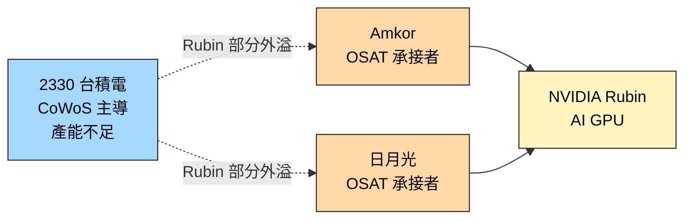

# AMKR.US(amkor)

> [!note] 本頁範圍說明
> 本頁僅就本次 ingest 涵蓋的主題 — **NVIDIA Rubin CoWoS 外溢承接** — 記錄 Amkor 的角色。Amkor 全業務（傳統封裝、汽車、5G 等）等之後 ingest 對應主題的來源時再補。
>
> **內容最薄警告**：本次來源（[[報告_其他_玻璃基板_20260511]]）對 Amkor 的描述僅一句，故本頁深度極有限。

## 基本資料
Amkor Technology，全球 OSAT（委外封測）大廠之一，本次主題範圍內的角色是**接 TSMC CoWoS 外溢產能**。具體事件是 [[NVDA.US(nvidia)]] **Rubin** 部分 CoWoS 訂單，因 [[2330_台積電（市）]] 自家 CoWoS 產能不足，外包给 Amkor 與日月光分擔。

這是 CoWoS 訂單**首次公開外溢至 OSAT** 的訊號，代表 TSMC CoWoS 產能不足已嚴重到必須外包頂級客戶（NVIDIA）。

主要資料來源：[[報告_其他_玻璃基板_20260511]]（國金證券，2026-05-11）。

## 核心技術／競爭優勢（本次範圍）

- **OSAT 先進封裝能力**：能承接 TSMC CoWoS 外溢的 OSAT 之一（另一家是日月光）
- **NVIDIA Rubin CoWoS 承接者**：與日月光分擔 NVIDIA Rubin 部分 CoWoS 訂單（claim 類型 fact、信心中；本次來源直接引述）

## 產品與應用（本次範圍）

| 產品 / 服務 | 應用 | 相關客戶 / 上游 |
|-------------|------|------------------|
| CoWoS 衍生先進封裝服務 | AI GPU 封裝（Rubin） | 上游：[[2330_台積電（市）]] / 終端：[[NVDA.US(nvidia)]] |

## 圖片 / 架構圖

`[待補來源圖]` 需官方 CoWoS 外溢封裝流程圖或法說截圖佐證；上方為自製供應鏈示意圖。
## EPS 記錄
（本次來源未涉及）

| 季度 | EPS (USD) | YoY | 備註 |
|------|-----------|-----|------|
| — | — | — | 本次來源未揭露 |

## EPS 預估
（本次來源未涉及）

## 目標價與評等
（本次來源未涉及）

## 時間軸（本次範圍）

| 時間 | 事件 | 類型 | 重要性 | 備註 |
|------|------|------|--------|------|
| 2026（報告日點到，Rubin 時程） | NVIDIA Rubin 部分 CoWoS 外包给 Amkor + 日月光 | 供應鏈外溢 | ⭐⭐⭐ | TSMC CoWoS 產能不足首次公開信號 |

## 供應鏈位置
- **上游 / CoWoS 外包來源**：[[2330_台積電（市）]]
- **下游 / 終端客戶**：[[NVDA.US(nvidia)]] Rubin 系列
- **同業 / 共同承接**：日月光投控（未建頁，3711.TW）
- **所屬供應鏈**：[[供應鏈_先進封裝載板]]

## 相關公司

| 公司 | 關係 | 說明 |
|------|------|------|
| [[2330_台積電（市）]] | 上游 / CoWoS 外包來源 | CoWoS 產能不足時的外溢出口 |
| [[NVDA.US(nvidia)]] | 終端客戶 | Rubin 部分 CoWoS 承接 |
| 日月光投控（3711.TW，未建頁） | 同業 / 共同承接 | 與 Amkor 分擔 NVIDIA Rubin 外包 |
| [[INTC.US(intel)]] | 先進封裝同業 / 競爭 | Intel 自製垂直整合，Amkor OSAT 外包 |

> [!warning] 風險與注意事項（本次範圍）
> - **外包訂單規模未公開**：「部分 CoWoS」具體佔比、wafer 數量、營收貢獻均未在本次來源揭露
> - **後續擴大可能性**：若 TSMC CoWoS 產能持續吃緊，後續更多 SKU / 客戶可能外包，但也可能 TSMC 擴產後收回
> - **資料來源限制**：本份為國金證券引述，原始說法應另查 NVIDIA / TSMC / Amkor 法說

## 來源
- [[報告_其他_玻璃基板_20260511]]（國金證券「玻璃基板行業深度」，2026-05-11；分析師李陽 S1130524120003）
- [[報告_Snapshot_半導體設備封測展望2026_20251124]]（Snapshot Research，封測展望，2025-11-24）

## 相關頁面

- [[3711_日月光投控（市）]]
- [[供應鏈_CPO]]
- [[技術_CPO]]
- [[技術_ABF載板]]
- [[3037_欣興（市）]]
- [[8046_南電（市）]]
