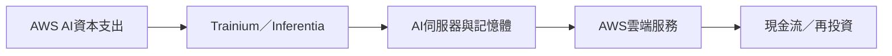

# AMZN.US(amazon)

## 基本資料
Amazon 是全球電子商務、雲端與廣告平台；AWS 為 AI 基礎設施與自研晶片需求的主要業務。富邦 2026-07-31 法說 memo 指出 2Q26 營收約 US$2,006 億、AWS 年增 37%，AI 業務與自研晶片是主要成長動能。

## 核心技術／競爭優勢
- AWS 雲端平台與既有企業客戶生態系。
- Trainium／Inferentia 自研晶片降低 AI 推論成本並增加供應鏈控制力。
- 電商、廣告與雲端現金流可支撐高資本支出。

## 產品與應用
| 產品 | 應用 | 相關下游 |
|---|---|---|
| AWS | AI 訓練、推論、企業雲端 | 企業與 AI 開發者 |
| Trainium／Inferentia | AI 加速器 | [[3443_創意電子（市）]]、伺服器供應鏈 |

## 圖片 / 架構圖

> AWS 的 AI 資本支出透過自研晶片與伺服器供應鏈，回到雲端服務成長與再投資循環。

## 時間軸
| 時間 | 事件 | 類型 | 重要性 | 備註 |
|---|---|---|---|---|
| 2026Q3 | 營收指引 US$1,970–2,020 億 | 財測 | ⭐⭐⭐ | 公司指引，來源為富邦 memo |
| 2026H2 | AWS AI 與自研晶片年化營收持續成長 | 放量 | ⭐⭐⭐ | 公司說法／券商整理 |

## 供應鏈位置
- 下游：AI 伺服器、記憶體、ASIC 設計服務；相關主題見 [[供應鏈_記憶體]]。

## 相關公司
| 公司 | 關係 | 說明 |
|---|---|---|
| [[3443_創意電子（市）]] | ASIC 設計服務 | 報告提及自研 AI 晶片供應鏈 read-through，非已確認訂單 |

> [!warning] 風險與注意事項
> - AI 資本支出回收期、電力與晶片供給限制可能壓縮報酬。
> - AWS 成長若放緩或雲端競爭加劇，估值與投資循環可能反轉。

## 來源
- [[AMZN Q2 Earnings Call memo_Fubon 20260731]]（富邦證券，2026-07-31）

## 相關頁面

- [[2480_敦陽科（市）]]

- [[分析_2026-08記憶體_AI需求與液冷ASIC更新]]
- [[時程_2026記憶體與AI催化劑]]
