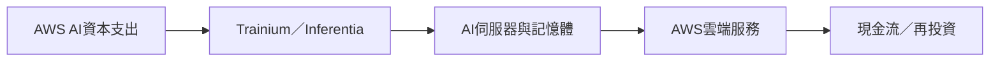

# AMZN.US(amazon)

## 基本資料
Amazon 是全球電子商務、雲端與廣告平台；AWS 為 AI 基礎設施與自研晶片需求的主要業務。富邦 2026-07-31 法說 memo 指出 2Q26 營收約 US$2,006 億、AWS 年增 37%，AI 業務與自研晶片是主要成長動能。

## 核心技術／競爭優勢
- AWS 雲端平台與既有企業客戶生態系。
- Trainium／Inferentia 自研晶片降低 AI 推論成本並增加供應鏈控制力。
- 電商、廣告與雲端現金流可支撐高資本支出。

## 產品與應用
| 產品 | 應用 | 相關下游 |
|---|---|---|
| AWS | AI 訓練、推論、企業雲端 | 企業與 AI 開發者 |
| Trainium／Inferentia | AI 加速器 | [[3443_創意電子（市）]]、伺服器供應鏈 |

## 圖片 / 架構圖

```mermaid
flowchart LR
  Capex[AWS AI資本支出] --> Chips[Trainium／Inferentia]
  Chips --> Servers[AI伺服器與記憶體]
  Servers --> Cloud[AWS雲端服務]
  Cloud --> Cash[現金流／再投資]
```
> AWS 的 AI 資本支出透過自研晶片與伺服器供應鏈，回到雲端服務成長與再投資循環。

## 時間軸
| 時間 | 事件 | 類型 | 重要性 | 備註 |
|---|---|---|---|---|
| 2026Q3 | 營收指引 US$1,970–2,020 億 | 財測 | ⭐⭐⭐ | 公司指引，來源為富邦 memo |
| 2026H2 | AWS AI 與自研晶片年化營收持續成長 | 放量 | ⭐⭐⭐ | 公司說法／券商整理 |

## 供應鏈位置
- 下游：AI 伺服器、記憶體、ASIC 設計服務；相關主題見 [[供應鏈_記憶體]]。

## 相關公司
| 公司 | 關係 | 說明 |
|---|---|---|
| [[3443_創意電子（市）]] | ASIC 設計服務 | 報告提及自研 AI 晶片供應鏈 read-through，非已確認訂單 |

> [!warning] 風險與注意事項
> - AI 資本支出回收期、電力與晶片供給限制可能壓縮報酬。
> - AWS 成長若放緩或雲端競爭加劇，估值與投資循環可能反轉。

## 來源
- [[AMZN Q2 Earnings Call memo_Fubon 20260731]]（富邦證券，2026-07-31）

- [[20260721_歐洲半導體：全球科技網路直播—ASML管理層路演、儲存創新與蘋果AI_MS]]（2026-07-21）
- [[2480 敦陽科｜20260825｜富邦]]（2026-08-25）
- [[2Q財報驗證AI需求，資本回報成新焦點-CTBC20260805]]（2026-08-05）
- [[報告_MorganStanley_緯穎2Q26財報_20260809]]（2026-08-09）

- [[報告_UBS_ASIC_CPU驅動CoWoS擴產_20260922]]（2026-09-22）
- [[報告_統一_AmazonBedrock新聞評析_20260922]]（統一投顧，2026-09-22；Kimi K3 接入 Bedrock 與 EPS／目標價評析）
- [[memo_索爾思光電專家會議_日期不詳]]（使用者提供；來源稱 AWS 尚無送樣／出貨或明確採購需求，會議日期未提供）

- [[報告_Macquarie_世芯_20260918]]（2026-09-18）
- [[報告_UBS_智邦_20260918]]（2026-09-18）
- [[報告_UBS_緯穎_20260918]]（2026-09-18）

## 相關頁面

- [[INTC.US(intel)]]
- [[2345_智邦（市）]]
- [[3661_世芯-KY（市）]]
- [[6669_緯穎（市）]]
- [[2480_敦陽科（市）]]

- [[分析_2026-08記憶體_AI需求與液冷ASIC更新]]
- [[時程_2026記憶體與AI催化劑]]
- [[時程_2026Q3Q4_AI網通與硬體催化劑]]
- [[供應鏈_AI光互聯]]
- [[索爾思光電（未）]]
- [[分析_索爾思光電800G與1.6T出貨追蹤]]

### 2026-09-22 Amazon Bedrock 生態更新

- 報告轉述 Kimi K3 接入 Amazon Bedrock；對 Amazon 的短期財務貢獻有限，但增加第三方模型供給與平台黏著度的可能性。
- Bedrock 若持續採用更多開放權重模型，可能提高 Token、推論、儲存、資料庫與 Agent 服務用量；這是平台商業模式推論，不是已確認收入。
- 統一投顧估 FY26／FY27 本業 EPS US$7.67／9.94、目標價 US$379，屬券商 estimate／valuation。
