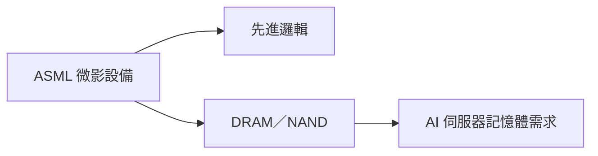

# ASML.NL(asml)

## 基本資料
ASML Holding 是荷蘭半導體微影設備商，核心產品為 EUV、DUV 與量測／檢測相關系統，供應先進邏輯與記憶體製程。2026-07-21 Morgan Stanley 路演資料聚焦 ASML 管理層、記憶體創新與 Apple AI；公司股票於 Euronext Amsterdam 與 Nasdaq 掛牌。

## 核心技術／競爭優勢
- EUV 微影設備的高進入障礙與長供應鏈整合。
- 先進製程客戶的設備驗證週期長，形成高客戶黏著。
- 記憶體製程升級與先進邏輯節點帶動長期設備需求。

## 產品與應用
| 產品 | 應用 | 相關下游 |
|---|---|---|
| EUV／DUV 微影 | 先進邏輯、DRAM | [[2408_南亞科技（市）]]、先進晶圓廠 |
| 量測與檢測 | 製程控制 | 半導體製造商 |

## 圖片 / 架構圖

> ASML 位於半導體設備上游，記憶體與先進邏輯擴產是主要需求傳導路徑。

## 2026-09-01 UBS 結構性成長觀察

- UBS 重申 Buy，目標價由 €2,250 上調至 €2,350；其核心 thesis 是 EUV／浸潤式 DUV 定價權、微影強度提升與記憶體需求由週期因子轉為結構性成長引擎，均屬券商 estimate。
- UBS 估 2026E 記憶體占 ASML 產品銷售約 45%，並預期 2027–28 年 EUV 與 DUV 產能擴增約 30%；新世代 EUV 的有效晶圓處理能力增幅則可達約 45%。
- High-NA 採用、10 月財報的 2027 成長展望、Intel potential CMD 與 1 月 backlog 揭露為後續驗證事件；UBS 估年底 backlog €55–60bn，較共識約 €45bn 高。

## EPS 預估

| 年度 | UBS EPS（報告日：2026-09-01） | 備註 |
|---|---:|---|
| 2026E | €39.51 | estimate |
| 2027E | €58.41 | estimate；高於共識 €53.45 |
| 2028E | €85.17 | estimate；高於共識 €68.25 |

## 目標價與評等

| 券商 | 報告發布日 | 評等 | 目標價 | 評價基礎 | 來源 |
|---|---|---|---:|---|---|
| UBS | 2026-09-01 | Buy | €2,350 | DCF | [[報告_UBS_ASML_20260901]] |

## 時間軸
| 時間 | 事件 | 類型 | 重要性 | 備註 |
|---|---|---|---|---|
| 2026H2 | 記憶體製程升級與設備需求追蹤 | 放量 | ⭐⭐ | Morgan Stanley 路演資料，屬產業觀察 |
| 2026-10 | ASML 財報與 2027 成長指引 | 財報／驗證 | ⭐⭐⭐ | UBS 觀察，非公司已公告指引 |
| 2027–2029 | High-NA EUV 導入與有效產能提升 | 技術驗證 | ⭐⭐⭐ | UBS estimate；採用節奏與客戶資本支出仍待驗證 |

## 供應鏈位置
- 上游：精密光學、雷射與真空零組件。
- 下游：先進邏輯與記憶體晶圓廠；相關主題見 [[供應鏈_記憶體]]。

## 相關公司
| 公司 | 關係 | 說明 |
|---|---|---|
| [[2408_南亞科技（市）]] | 下游 | DRAM 製程升級與設備需求觀察標的 |
| [[2330_台積電（市）]] | 下游客戶 | 先進邏輯微影需求與 EUV 採用觀察標的 |
| [[MU.US(micron)]] | 下游客戶 | DRAM EUV 層數與 1-delta 製程升級觀察標的 |

> [!warning] 風險與注意事項
> - 設備交期、出口管制與客戶資本支出可能造成波動。
> - 本批報告為券商路演與產業觀察，不將設備訂單時程視為已確認事實。

## 來源
- [[20260721_歐洲半導體：全球科技網路直播—ASML管理層路演、儲存創新與蘋果AI_MS]]（Morgan Stanley，2026-07-21）
- [[報告_UBS_ASML_20260901]]（UBS，2026-09-01；定價權、記憶體 EUV、High-NA 與 backlog estimate）

## 相關頁面

- [[6829_千附精密（市）]]
