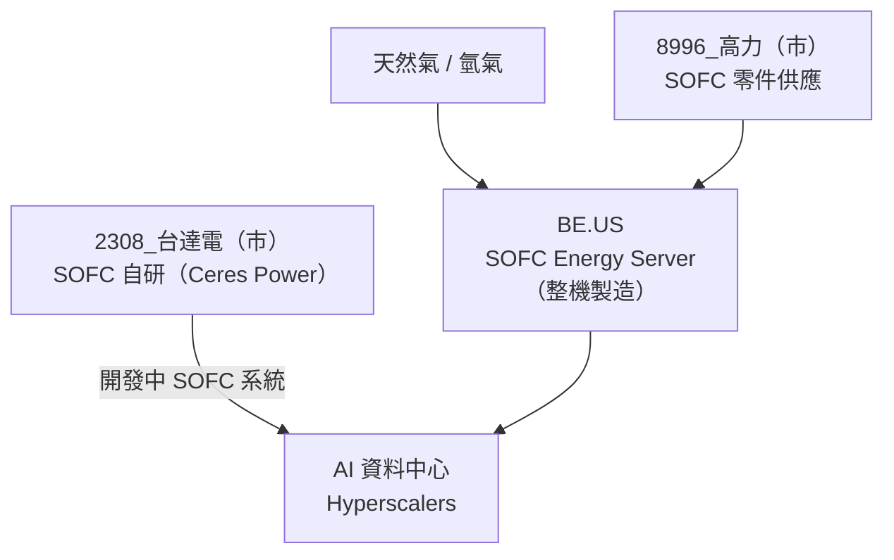

# BE.US(bloom_energy)

## 基本資料

Bloom Energy（NYSE: BE）是美國最領先的固態氧化物燃料電池（SOFC）整機製造商，其 Energy Server 系列產品可提供超高效率、低排放的分散式電力給資料中心、工業設施等。

核心投資邏輯：
1. **AI 資料中心電力需求**：超大規模資料中心（Hyperscaler）面臨電網容量不足，SOFC 可提供快速部署、高效率的現場電力解決方案
2. **SOFC 出貨指引持續上調**：管理層計畫在下一次財報電話上再次上調 SOFC 出貨指引
3. **指數化需求**：2026-06 末納入 Russell 1000 指數，被動資金流入帶動流動性
4. **Delta 新增需求**：台達電 (2308) 透過 Ceres Power 技術授權啟動 SOFC 自研，主要零件將向 Kaori 採購（使 Kaori 成為 BE 供應鏈中的核心），間接擴大 SOFC 整體 TAM

資料來源：[[memo_AI半導體_top_picks_UMC_ABF_MLCC_ASIC_20260601]]（2026-06-01）、[[memo_AI半導體_top_picks_UMC_Kaori_ABF_Yageo_Delta_20260615]]（2026-06-15）

## 核心技術／競爭優勢

- **SOFC 技術領先**：固態氧化物燃料電池轉換效率達 60%+，遠高於傳統 UPS 或柴油發電機（30-35%）
- **模組化部署**：Energy Server 模組可快速安裝於現有設施，繞過電網連接等待
- **燃料彈性**：可使用天然氣、氫氣、沼氣，具備向純氫轉移的技術路徑
- **資料中心認證**：已通過多大型超大規模客戶資料中心認證，具備高進入門檻

## 產品與應用

| 產品 / 方案 | 應用場景 | 客戶類型 |
|------------|---------|---------|
| Energy Server（SOFC 模組） | 資料中心現場發電、工業分散式電力 | Hyperscalers、工業 |
| 氫能 SOFC | 未來潔淨氫燃料電池 | 長期淨零路徑 |

## 圖片 / 架構圖

BE 為 SOFC 整機製造商，台灣供應鏈以高力（Kaori）為核心 SOFC 零件供應商。

## 目標價與評等

| 分析來源 | 報告日 | 評等 | 目標價 | 備註 | 來源 |
|---------|--------|------|--------|------|------|
| 買方研究員 | 2026-06-01 | US 首選 Top Pick | — | "Power [Delta (2308 TT), BE]" | [[memo_AI半導體_top_picks_UMC_ABF_MLCC_ASIC_20260601]] |
| 買方研究員 | 2026-06-15 | US Top Pick | — | "US stock top pick should be BE" | [[memo_AI半導體_top_picks_UMC_Kaori_ABF_Yageo_Delta_20260615]] |

## 時間軸

| 時間 | 事件 | 類型 | 重要性 | 備註 |
|------|------|------|--------|------|
| 2026-06末 | 納入 Russell 1000 指數 | 指數化 | ⭐⭐⭐ | 被動資金流入催化劑 |
| 2026 下半（預期） | 上調 SOFC 出貨指引 | 基本面催化劑 | ⭐⭐⭐ | 管理層計畫於下次財報電話宣布 |
| 2026-27 | Delta SOFC 訂單向 Kaori 採購開始 | 供應鏈影響 | ⭐⭐ | 擴大 SOFC 生態系 |
| 2026-04 | Oracle/STACK New Mexico 替換氣機申請 → 改採 Bloom 燃料電池 | 合約 | ⭐⭐⭐ | FERC Section 7 阻擋氣體管線後的替代方案；Bloom 申請 37 tpy NOx |

## 供應鏈位置

- 上游零件：[[8996_高力（市）]]（SOFC 板材/零件，Kaori）
- 競爭對手（SOFC）：Ceres Power（英國，技術授權商）、Bloom Energy 技術路徑近似廠商
- 下游應用：AI 超大規模資料中心（AWS、Microsoft、Google 等）
- 台灣相關供應鏈：[[8996_高力（市）]]（最直接受益）、[[2308_台達電（市）]]（自研 SOFC 新玩家）

## 相關公司

| 公司 | 關係 | 說明 |
|------|------|------|
| [[8996_高力（市）]] | 上游 / 供應商 | SOFC 板式熱交換器/零件主要外包對象，台灣最直接受益 |
| [[2308_台達電（市）]] | 生態影響 | Ceres Power 技術授權，SOFC 自研開發，擴大 SOFC 市場 TAM |

> [!warning] 風險與注意事項
> - **電力法規障礙**：資料中心 SOFC 現場發電需取得地方電力許可，各州規定不一
> - **天然氣依賴**：純天然氣 SOFC 仍有碳排，部分 ESG 標準下受限制
> - **氫氣轉型不確定性**：向純氫轉型的時程及成本仍具挑戰

## 來源

- [[memo_AI半導體_top_picks_UMC_ABF_MLCC_ASIC_20260601]]（2026-06-01）
- [[memo_AI半導體_top_picks_UMC_Kaori_ABF_Yageo_Delta_20260615]]（2026-06-15）
- [[memo_AI半導體_top_picks_update_UMC_Kaori_ABF_20260615v2]]（2026-06-15）

## 相關頁面

- [[分析_美國資料中心產能延誤澄清]]
- [[分析_美國電網BTM資料中心]]
