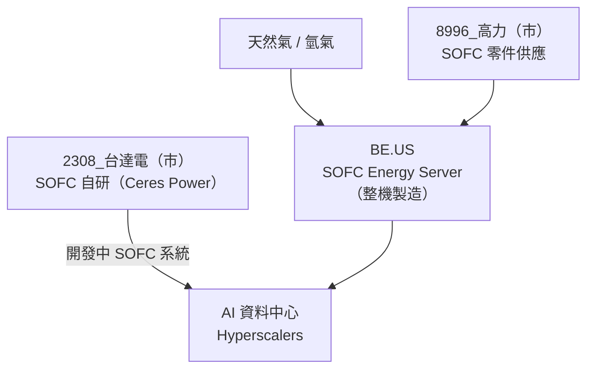

# BE.US(bloom_energy)

## 基本資料

Bloom Energy（NYSE: BE）是美國最領先的固態氧化物燃料電池（SOFC）整機製造商，其 Energy Server 系列產品可提供超高效率、低排放的分散式電力給資料中心、工業設施等。

核心投資邏輯：
1. **AI 資料中心電力需求**：超大規模資料中心（Hyperscaler）面臨電網容量不足，SOFC 可提供快速部署、高效率的現場電力解決方案
2. **SOFC 出貨指引持續上調**：管理層計畫在下一次財報電話上再次上調 SOFC 出貨指引
3. **指數化需求**：2026-06 末納入 Russell 1000 指數，被動資金流入帶動流動性
4. **Delta 新增需求**：台達電 (2308) 透過 Ceres Power 技術授權啟動 SOFC 自研，主要零件將向 Kaori 採購（使 Kaori 成為 BE 供應鏈中的核心），間接擴大 SOFC 整體 TAM

資料來源：[[memo_AI半導體_top_picks_UMC_ABF_MLCC_ASIC_20260601]]（2026-06-01）、[[memo_AI半導體_top_picks_UMC_Kaori_ABF_Yageo_Delta_20260615]]（2026-06-15）

## 核心技術／競爭優勢

- **SOFC 技術領先**：固態氧化物燃料電池轉換效率達 60%+，遠高於傳統 UPS 或柴油發電機（30-35%）
- **模組化部署**：Energy Server 模組可快速安裝於現有設施，繞過電網連接等待
- **燃料彈性**：可使用天然氣、氫氣、沼氣，具備向純氫轉移的技術路徑
- **資料中心認證**：已通過多大型超大規模客戶資料中心認證，具備高進入門檻

## 產品與應用

| 產品 / 方案 | 應用場景 | 客戶類型 |
|------------|---------|---------|
| Energy Server（SOFC 模組） | 資料中心現場發電、工業分散式電力 | Hyperscalers、工業 |
| 氫能 SOFC | 未來潔淨氫燃料電池 | 長期淨零路徑 |

## 圖片 / 架構圖

```mermaid
graph TD
    NG["天然氣 / 氫氣"]
    BE["BE.US<br/>SOFC Energy Server<br/>（整機製造）"]
    Kaori["8996_高力（市）<br/>SOFC 零件供應"]
    Delta["2308_台達電（市）<br/>SOFC 自研（Ceres Power）"]
    DC["AI 資料中心<br/>Hyperscalers"]
    
    NG --> BE
    Kaori --> BE
    Delta -->|開發中 SOFC 系統| DC
    BE --> DC
```

BE 為 SOFC 整機製造商，台灣供應鏈以高力（Kaori）為核心 SOFC 零件供應商。

## 目標價與評等

| 分析來源 | 報告日 | 評等 | 目標價 | 備註 | 來源 |
|---------|--------|------|--------|------|------|
| 買方研究員 | 2026-06-01 | US 首選 Top Pick | — | "Power [Delta (2308 TT), BE]" | [[memo_AI半導體_top_picks_UMC_ABF_MLCC_ASIC_20260601]] |
| 買方研究員 | 2026-06-15 | US Top Pick | — | "US stock top pick should be BE" | [[memo_AI半導體_top_picks_UMC_Kaori_ABF_Yageo_Delta_20260615]] |
| 中國信託投顧 | 2026-09-11 | Overweight | US$294.60 | 13x FY2027E P/S | [[報告_中信投顧_BloomEnergy_20260911]] |

## 2026Q2 財報與資金更新

- 2Q26 營收 US$1.065bn（季增 42%、年增 166%），產品收入 US$0.94bn，SOFC 出貨帶動單季營收創高；整體毛利率 34.3%、產品業務毛利率 36.5%、EPS US$0.78，均優於中信與市場預期。
- 公司 2026 年指引上修至營收 US$3.9–4.2bn、SOFC 出貨 1.14–1.25GW、non-GAAP 營業利益 US$0.8–0.9bn、EPS US$2.55–2.80；屬公司指引，仍須由後續專案落地與出貨驗證。
- Brookfield 將融資架構承諾擴大至 US$25bn，IDF／Oaktree／MUFG／Morgan Stanley 等機構累計提供 US$2.6bn。第三方融資有助降低終端客戶的前期資本支出，但也提高公司對融資可得性與專案執行的敏感度。

## 時間軸

### 本批匿名訪談觀察（入庫 2026-10-01）

| 時間 | 事件 | 類型 | 資訊狀態 |
|---|---|---|---|
| 2026Q3／2027（預估） | 專家稱年化產能約 2GW／更大擴產 | 放量驗證 | 非全年交付或確認公司指引；[[時程_2026-2028_SOFC與載板DCI驗證]] |

### 既有時間軸

| 時間 | 事件 | 類型 | 重要性 | 備註 |
|------|------|------|--------|------|
| 2026-06末 | 納入 Russell 1000 指數 | 指數化 | ⭐⭐⭐ | 被動資金流入催化劑 |
| 2026-09-11 | 2Q26 超預期、全年 SOFC 出貨指引上修至 1.14–1.25GW | 基本面催化劑 | ⭐⭐⭐ | 公司指引；訂單與融資轉實際出貨仍待驗證 |
| 2026-27 | Delta SOFC 訂單向 Kaori 採購開始 | 供應鏈影響 | ⭐⭐ | 擴大 SOFC 生態系 |
| 2026-04 | Oracle/STACK New Mexico 替換氣機申請 → 改採 Bloom 燃料電池 | 合約 | ⭐⭐⭐ | FERC Section 7 阻擋氣體管線後的替代方案；Bloom 申請 37 tpy NOx |

## 供應鏈位置

- 上游零件：[[8996_高力（市）]]（SOFC 板材/零件，Kaori）
- 競爭對手（SOFC）：Ceres Power（英國，技術授權商）、Bloom Energy 技術路徑近似廠商
- 下游應用：AI 超大規模資料中心（AWS、Microsoft、Google 等）
- 台灣相關供應鏈：[[8996_高力（市）]]（最直接受益）、[[2308_台達電（市）]]（自研 SOFC 新玩家）

## 相關公司

| 公司 | 關係 | 說明 |
|------|------|------|
| [[8996_高力（市）]] | 上游 / 供應商 | SOFC 板式熱交換器/零件主要外包對象，台灣最直接受益 |
| [[2308_台達電（市）]] | 生態影響 | Ceres Power 技術授權，SOFC 自研開發，擴大 SOFC 市場 TAM |

> [!warning] 風險與注意事項
> - **電力法規障礙**：資料中心 SOFC 現場發電需取得地方電力許可，各州規定不一
> - **天然氣依賴**：純天然氣 SOFC 仍有碳排，部分 ESG 標準下受限制
> - **氫氣轉型不確定性**：向純氫轉型的時程及成本仍具挑戰

## 2026-08-29 專家訪談：合格電堆與場址啟用

資料為上游供應鏈及產業／客戶端匿名專家視角，**不是 Bloom 管理層紀要**。70565484 疑似三環相關人士，身分未確認；原始文本重複段落不作第二份證據。

- 製程：隔膜成形／燒結 → 陽極印刷與燒結 → 陰極印刷與燒結 → 電池片組堆 → 密封／還原 → 模組與系統。上游隔膜良率不能直接代表最後可交付功率。
- 70565484 稱密封與還原後綜合良率約 50–60%；70566304 稱電堆約 70–80%，更換設備初期可能更低。站點、設備成熟度及分母不同，皆為 estimate／中低信心，不平均成公司確定良率。
- 9,000 萬片 × 30W 約為 2.7GW 理論隔膜量，未扣後段損失；不能視為系統出貨。膜片量、製造量與庫存交付亦須分開。
- 2026 出貨：08-29 的略高於 1GW／含庫存 1.7–1.8GW 估計不同；既有 09-11 中信研究記錄 1.14–1.25GW 較晚指引，不以舊訪談覆蓋。
- [[ORCL.US(oracle)]] 為下游資料中心應用／案例客戶。訪談稱個案設備已安裝但供氣與營運許可仍待完成，屬 rumor／中低信心，非全公司部署狀態。
- [[GEV.US(ge_vernova)]] 的渦輪為現場供電替代方案；比較須包含交期、燃料、排放許可與全成本。渦輪交期改善是 SOFC 時效優勢的反證。

### 製程瓶頸與降本路徑

70566304 描述箱式爐以約十多個電堆分批、約七天週期處理，密封與還原是關鍵站點；70565484 描述新增爐體可由標準設備改裝，但設備到位與製程良率恢復是不同時間。此為特定流程的 estimate／中低信心，不能將爐體交期直接視為可交付產能。

70565484 稱隔膜報價從 2024 年每片人民幣 30 多元、2025 年約 27–28 元，至 2026 年約 24–25 元；提出增加供應商、薄化與提高單片功率等降本方向。膜片約 120µm，該來源以 80–100µm 為目標區間；70566304 的理論下限約 50µm 不是已量產厚度。來源亦談單片約 25W 向 30–33W 改善與互連片減重，皆為 estimate／中低信心，不能僅按膜片價格推算整機成本。

膜片配方、流延／燒結控制、電極支撐型態與運轉溫度共同影響可靠度。兩份紀要對支撐型態／溫度有轉錄或描述不一致，保留原文，不編成確定路線圖；約五年運轉壽命、兩萬小時與其他供應商實驗數字的條件不同，不直接排序。客戶端少數 Oracle 案例效率、原文初始／生命週期效率及冷啟動時間同樣不可混為統一規格。

來源：[[memo_AceCamp_SOFC隔膜供應商與Bloom交付_20260829_70565484]]、[[memo_AceCamp_SOFC電堆製程與供應鏈_20260829_70566304]]、[[memo_AceCamp_AI資料中心現場供電_20260829_70565950]]（2026-08-29）；辨識與衝突詳見 [[分析_20260828-29專家紀要公司辨識與供給瓶頸]]。

## 2026-09-08 KV Materials 訪談：材料供應與技術風險

本來源的受訪主體為 KV Materials，非 Bloom 管理層。其稱自身以 ScSZ 粉體供應三環集團，後者再製成隔膜片並對 Bloom 做小批量驗證；這是上游供應鏈說法，不能確認為 Bloom 已認證的第二來源或已量產供應關係。

來源強調氧化鈧供給、高溫熱循環、密封與 BOP 是 SOFC 的成本／壽命限制，並提出 Oracle 案例與部署數字。所有材料消耗、性能、壽命、專案規模與交付時程均為匿名 estimate，且與本頁公司指引、既有 Oracle 案例口徑可能不同；保留並列，不回推 Bloom 營收或出貨。詳見 [[分析_20260901-08專家紀要受訪公司辨識與供給觀察]]。

## 2026-09-29 xAI 供應鏈端訪談：採購限制與競品比較

[[memo_AceCamp_xAI_Terafab與供應鏈_20260929]] 的未具名受訪者自述為 xAI／SpaceX 供應鏈端觀點，**不是 Bloom 管理層或客戶公告**。其稱 xAI 當時未將 Bloom 列入優先採購，理由包括歐洲擴產未對應美國需求、2027 年交期可能拉長、稀土材料依賴與長期維護成本疑慮；同時將燃氣渦輪視為較可行的短期選項。這些均為匿名渠道 estimate／低信心，不能據此推論 Bloom 失去任何訂單或調整公司指引。

來源亦提到大型資料中心可能同時比較燃氣渦輪、電網與 SOFC，故應追蹤實際場址許可、交期、全生命周期成本與可用燃料，而非將單一客戶端偏好外推為整體 SOFC 需求。

## 來源

- [[memo_AceCamp_SOFC隔膜供應商與Bloom交付_20260829_70565484]] — AceCamp Tech，2026-08-29，匿名專家紀要。
- [[memo_AceCamp_SOFC電堆製程與供應鏈_20260829_70566304]] — AceCamp Tech，2026-08-29，匿名專家紀要。
- [[memo_AceCamp_AI資料中心現場供電_20260829_70565950]] — AceCamp Tech，2026-08-29，匿名專家紀要。
- [[memo_AceCamp_KVMaterials_Bloom_SOFC_20260908]] — AceCamp Tech，2026-09-08，KV Materials 相關匿名訪談；材料、性能與供應鏈觀察，低至中信心。

- [[memo_AI半導體_top_picks_UMC_ABF_MLCC_ASIC_20260601]]（2026-06-01）
- [[memo_AI半導體_top_picks_UMC_Kaori_ABF_Yageo_Delta_20260615]]（2026-06-15）
- [[memo_AI半導體_top_picks_update_UMC_Kaori_ABF_20260615v2]]（2026-06-15）
- [[報告_中信投顧_BloomEnergy_20260911]]（中國信託投顧，2026-09-11；2Q26 財報、全年指引與第三方融資）
- [[memo_AceCamp_xAI_Terafab與供應鏈_20260929]]（AceCamp Tech，2026-09-29；xAI／SpaceX 端匿名供應鏈訪談，低信心）

- [[us-grid-btm]]（2026-06-25）

## 相關頁面

- [[3605_宏致（市）]]
- [[分析_美國資料中心產能延誤澄清]]
- [[分析_美國電網BTM資料中心]]
- [[時程_2026能源與AI電力設備]]
- [[分析_20260918-29專家紀要公司辨識與光互連供給觀察]]
