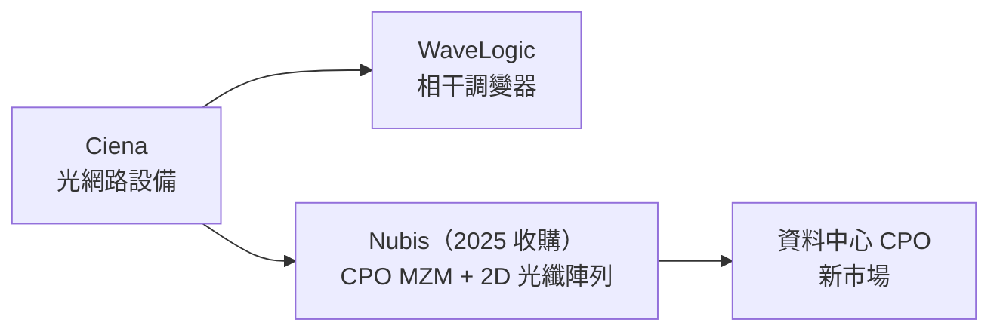

# CIEN.US(ciena)

## 基本資料

Ciena（NYSE: CIEN）是光網路設備與軟體供應商，主要產品包含 WaveLogic 光調變器芯片系列、分組光網路設備、BluePlanet 網路智能軟體。2025 年 10 月收購 Nubis Communications（CPO MZM 與 2D 光纖陣列方案商），切入 CPO 光引擎領域。

資料來源：[[research_simpletechtrend_CPO矽光子ECTC2026_20260629]]（2026-06-29）

## 核心技術／競爭優勢

- **WaveLogic 光調變器**：高頻寬相干調變器，骨幹網路核心競爭力
- **Nubis 收購（2025-10）**：切入 CPO 光引擎（MZM、2D 光纖陣列），擴展資料中心市場
- **FY26 財報**：營收年增 40%、EPS 年增 290%（來源：Fierce Network）——財報亮眼但股價仍一度重挫約 14%

## 圖片 / 架構圖

`[待補來源圖]` 需官方年報業務架構圖或 WaveLogic/Nubis 產品截圖佐證；上方為自製業務結構示意圖。
## 供應鏈位置

- 競爭對手：[[COHR.US(coherent)]]、[[LITE.US(lumentum)]]（光通訊設備/元件）
- 收購：Nubis Communications（2025-10，CPO 光引擎）

## 相關公司

| 公司 | 關係 | 說明 |
|------|------|------|
| [[COHR.US(coherent)]] | 競爭對手 | 光通訊設備與調變器 |
| [[LITE.US(lumentum)]] | 競爭對手 | 光通訊元件 |

## 來源

- [[research_simpletechtrend_CPO矽光子ECTC2026_20260629]]（光通訊三雄 W26 市場，2026-06-29）
- [[技術_CPO]]（Nubis → Ciena 收購記載）

## 相關頁面

- [[4979_華星光（櫃）]]
