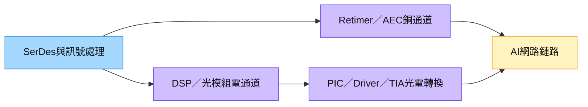

# CRDO.US — Credo Technology Group

## 基本資料

| 項目 | 內容 |
|------|------|
| 全名 | Credo Technology Group Holding Ltd. |
| 代號 | CRDO（Nasdaq） |
| 成立 | 2008年；2022年1月Nasdaq IPO |
| 總部 | 美國加州聖荷西（矽谷）；員工600+人 |
| 財年 | 5月起、止於4月（FY26 = May25-Apr26） |

## 業務概況

- 專為AI資料中心、雲端、超大規模（Hyperscale）網路提供高效能、低功耗連接解決方案
- 核心技術：**專有PAM4 SerDes IP / DSP / Retimer**
- 主要產品：HiWire AEC（主動電纜）、光學DSP、PCIe Retimer、SerDes Chiplet、IP授權
- FY25產品組合：硬體94% / 硬體工程服務3% / IP授權3%

## 圖片/架構圖

圖說：AEC與光模組共用高速訊號處理能力，但光模組另需光電轉換零件；圖為功能示意，不代表各零件均由Credo內製。9/30來源是純文字，來源圖待補。

## 核心競爭力：AEC市場

### AEC（Active Electrical Cable）優勢
- 400G/800G AEC市場先行者；FY24-1HFY26市占率 **~70%+**
- 有效距離：1-7公尺（NIC-to-ToR scale-out）；ALC 則支援 30-50m
- vs AOC 優勢：耗電少25-50%、成本低~50%、可靠性更高（無光纖易損問題）
- 主要客戶（FY3Q26占比）：Amazon ~39% / Microsoft ~32% / xAI ~17%；另有Meta、Oracle
- **主要製造夥伴**：[[3665_貿聯-KY（市）]]（BizLink）為 AEC 和 ALC 的主要製造供應商

### AEC 技術路線（2026-07 更新）
- 100gig/lane 仍為主流出貨；預計 200gig/lane 方案約 2028-29 年超越
- 1.6T 傳輸設計可用 8條×200gig 或 2埠×8條×100gig；部分超大規模客戶 Rubin 世代仍傾向 800G
- rack-rack 距離多為 ~5m；AEC 1-7m，ALC 30-50m

### AEC定價
| 規格 | 單價 |
|------|------|
| 800G AEC | ~US$320 |
| 400G AEC | ~US$170 |
| 100G AEC | ~US$85 |

### xAI Colossus 2
- 支援11萬櫃GB200 NVL72；GPU數量~80萬顆
- AEC需求產值估~US$23億；Credo為唯一供應商
- 每GPU對應AEC：設計依存，實際2-12條（理論最高18-24條）

## EPS 記錄

| 項目 | FY24A | FY25A | FY26E（凱基） | FY27E（凱基） |
|------|-------|-------|------------|------------|
| 營業收入（US$M） | 193 | 437 | 1,349 | 2,120 |
| 毛利率（%） | 62.5 | 65.0 | 68.1 | 66.9 |
| 營業利益率（%） | 1.4 | 26.4 | 47.6 | 47.2 |
| EPS（US$） | 0.09 | 0.70 | 3.36 | 4.62 |
| EPS成長（%） | — | +721.7 | +378.0 | +37.5 |

### 季度數據（FY3Q26 = Nov25-Jan26）
- 營收 US$407M（+52% QoQ, +202% YoY）；非GAAP EPS US$1.07（+60% QoQ）
- GM 68.6%；FY4Q26指引：營收~US$430M，毛利率預期降至~65%（DSP 3nm測試費+競爭加劇）

## 競爭威脅

| 類型 | 競爭者 |
|------|--------|
| 半導體 | Marvell「Golden Cable」、Astera Labs |
| 電纜廠 | TE Connectivity、Molex、Amphenol |
| 中國廠 | 立訊精密、溫州依華等（預計控制50%+高速模組市場） |
| 技術替代 | LPO（Linear Drive Optics）、SiPh、CPO |

- Marvell DSP晶片定價高Credo 30-50%；預期初期搶~10%市占，但價格競爭空間有限
- 1.6T AEC：物理極限~5公尺；3.2T AEC無法實用 → 長期趨勢全光學化

## 下一代產品

| 產品 | 技術 | 量產時程 |
|------|------|---------|
| Zero Flap Optics | 客製DSP+交換器SDK整合，解決訊號抖動 | FY1Q27（2026年中） |
| Active LED Cables（ALC） | microLED雷射，可達30-50m；購自Hyperlume（US$92M，Sep 2025）；[[3665_貿聯-KY（市）]]為主要製造夥伴 | OCP展示 2026-08/10；客戶樣品認證 FY27末-FY28上半 |
| OmniConnect Weaver Gearbox | 112G VSR SerDes記憶體-運算連接；10x I/O密度；支援6.4TB記憶體 | FY28 |

> [!info] ALC 進展更新（UBS NDR，2026-07-07）
> Credo 計畫於 2026 年 8月/10月 OCP 活動展示 ALC 方案；MediaTek 和 AUO 已開始探索 ALC 解決方案。Credo 確信其產品路線圖，客戶樣品認證目標 FY27 末至 FY28 上半年。[[3665_貿聯-KY（市）]]（BizLink）為 Credo AEC 與 ALC 的**主要製造夥伴**，並透過規格開發與競爭定價協助 Credo 贏得訂單。

## CPO風險

- Credo**無CPO佈局**；CPO為2027+大規模scale-up架構主流
- 2026-10-05 更新：管理層認為 CPO 至少還要數年，改以 NPO 用 PIC（DustPhotonics）、200G/lane scale-up Retimer 與微發光源切入 scale-up；NPO PIC 預計 FY28 貢獻營收（[[活動_Credo_凱基CallMemo_20261005]]，公司說法／中）
- PCIe retimer進入CPO市場，但此市場競爭激烈（NVDA NVLink、Intel等大廠）
- Yole預測：CPO for scale-up 2030市值US$56億；scale-out US$26億

## 券商追蹤

| 券商 | 評等 | TP（US$） | 估值基礎 |
|------|------|---------|---------|
| Rosenblatt（RB） | Neutral | **170** | 40x FY27E EPS $4.25 |
| 凱基投顧 | 增加持股 | **184** | 40x FY27F EPS $4.62 |

## 主要財務結構

- 現金：FY2Q26末US$8.14億（含ATM增資）；净現金無負債
- 客戶集中度高：前4大貢獻93%營收（FY2Q26）；FY25單一客戶67%

## TD Cowen 啟動覆蓋（2025-09-30）

| 項目 | 內容 |
|------|------|
| 評等 | **Buy** |
| 分析師 | Sean O'Loughlin（TD Cowen 資料中心連接專題） |

主要論點：Credo 在銅纜（AEC）和可插拔光學（LRO：Linear Receive-only Optics）兩個方向均為關鍵創新者，定位最佳。TD Cowen 認為 MRVL DSP 在 LRO 場景中有 >10% 市佔流失風險，而 Credo 的 LRO 解法是主要受益者之一。同時，Credo 在 AEC 市場的先發優勢（~70% 市占）使其在連接密集化趨勢中具強防禦性。

## 關聯頁面

- [[3665_貿聯-KY（市）]]（BizLink，主要 AEC/ALC 製造夥伴）
- [[COHR.US(coherent)]]（ZeroFlap Optics對比，Rosenblatt提及更有競爭優勢）
- [[LITE.US(lumentum)]]（光學競爭）
- [[技術_光互連]]
- [[AVGO.US(broadcom)]]（競爭者，CPO主要玩家）
- [[Datacenter Connectivity 250930 Bernstein ALAB MTSI SMTC CRDO]]（TD Cowen 啟動覆蓋）
- 報告_UBS_貿聯-KY_CredoNDR_20260707（2026-07-07，ALC/AEC 最新進展）

## 近期營運與研究更新

### 2026-09-02 GFHK F1Q27 更新

- F1Q27 營收 US$479mn（YoY +115%、QoQ +10%）、non-GAAP EPS US$1.20；F2Q27E 營收指引 US$525–535mn、毛利率 67%–69%，均為公司揭露的 fact／guidance。
- AEC 仍是 FY1H27 主要成長柱；光學產品 FY27E 營收目標維持 US$600mn 以上，量產高峰偏向 FY2H27，屬 management outlook。
- 券商預估 FY27E／FY28E EPS US$6.5／11.4，目標價 US$227、Buy，以 FY28E EPS 20 倍估值；來源：[[報告_GFHK_Credo_20260901]]。

### 2026-09-02 國泰證期 Call Memo 補充

- FY1Q27 營收 US$479mn（YoY +114.7%）與 non-GAAP EPS US$1.20；FY2Q27 指引營收 US$525–535mn、毛利率 67%–69%，屬公司揭露／指引。
- FY27 光通訊營收目標逾 US$600mn，ZeroFlap、SiPho PIC 與 DSP 各預期貢獻逾 US$100mn；屬 management outlook，須觀察 FY2H27 放量。
- NPO 設計導入、Active LED Cable 與 OmniConnect 主要指向 FY28；不應與已放量的 AEC 混為同一成熟度。

## 相關頁面

- [[分析_2026Q3_AI硬體需求與供應限制_20260903]]
- [[時程_2026Q3Q4_AI網通與硬體催化劑]]
- [[分析_貿聯-KY_2026Q2法說_AI基礎設施內容升級_20260821]]
- [[ALAB.US(astera labs)]]
- [[SMTC.US(semtech)]]

## 來源

- [[報告_MorganStanley_貿聯_20261006]]（Morgan Stanley，2026-10-06）：MS 指貿聯與 Credo 合作 ALC，作為 AEC 在 3.2T 前後可能觸及擴展極限時的光互連延伸；屬券商觀點。
- [[memo_AceCamp_Credo_800G光模組與1.6TAEC_20260930]] — AceCamp Tech匿名專家訪談，2026-09-30；主體辨識高信心，訂單、價格與量產時程低信心。
- [[活動_Credo_凱基CallMemo_20261005]] — 凱基主辦管理層電話會議逐字稿，2026-10-05 提供；1.6T 時程、ZeroFlap 毛利算式、DustPhotonics 與 scale-up 進度。
- [[活動_Credo_凱基CallMemo_校正逐字稿_20261005]] — 同一場電話會議的校正版逐字稿（使用者提供，2026-10-07 入庫）；更正 microVCSEL 屬雷射、scale-up Retimer 為 Blue Heron、協定為 UALink over Ethernet。

- [[20260709_0823_1308120]]（2026-07-03）
- [[20260709_0823_250708_ubs_bizlink]]（2026-07-07）
- [[CRDO_PDF_0120]]（2026-01-20）
- [[Datacenter Connectivity 250930 Bernstein ALAB MTSI SMTC CRDO]]（2025-09-30）
- [[Optical Networking 260312 Citrini AI connectivity optics]]（2026-03-12）
- [[RB_CRDO_0120]]（2026-01-20）
- [[凱基-Credo (CRDO.US)-20260303]]（2026-03-03）
- [[報告_GFHK_Credo_20260901]]（2026-09-02）
- [[報告_JPMorgan_貿聯-KY_20260902]]（2026-09-02）
- [[報告_MorganStanley_貿聯-KY_20260902]]（2026-09-02）
- [[memo_國泰證期_CredoCallMemo_20260902]]（國泰證期研究部，2026-09-02）
- [[活動_貿聯-KY_2026Q2法說_20260821]]（2026-08-21）

## 2026-09-30 ZeroFlap／1.6T匿名訪談

ZeroFlap產品與公司官網匹配，因此[[memo_AceCamp_Credo_800G光模組與1.6TAEC_20260930]] 的討論主體可高信心對應本公司；受訪者身分未確認。以下不取代公司指引、既有GFHK財測或正式客戶揭露。

| 項目 | 訪談說法 | 類型／信心 |
|---|---|---|
| 800G光模組 | 一個客戶已下單，首批目標2027-02～03交付；市場參考單價約US$350 | expert_memo／estimate，低；非合約ASP |
| 初期毛利 | 自研DSP仍未整合Driver，PIC、TIA外購，加上初期良率與代工費用 | field observation，低；後續自研路線為展望 |
| 1.6T AEC | final晶片預計2026-11返回，再測試2–3個月後排產；1.6T光模組較晚 | estimate，低；不代表已確定量產日期 |
| 代工與客戶關係 | 訪談提晶圓代工供給、第二來源選項與特定CSP訂單 | 未獲公司確認，保留於Raw，不新增確定供應商資格 |
| 交付風險 | 另一光學專案稱送樣從7月延到9月，東南亞製造與熟練度影響爬坡 | field observation，低；匿名專案不能合併為同一訂單 |

> [!warning] 資訊口徑與待確認
> 公司官方2026-09-15已發布1.6T ZeroFlap光模組，9/16另有產品介紹；匿名訪談的11月final晶片可能指特定版本或客戶。光模組發布、AEC晶片版本定案與量產屬不同產品及階段，不能混用。1.6T AEC定價倍數在原文前後不一致，不據此填入ASP。原文按機櫃數推導需求時沒有完整定義拓撲與端口，不用作收入模型。

官方交叉核對：[Credo產品](https://credosemi.com/products/)、[2026-09-15官方1.6T光模組發布](https://investors.credosemi.com/news-events/news/news-details/2026/Credo-Expands-ZeroFlap-Portfolio-with-224G-Based-1-6T-Optical-Transceivers-Addressing-the-Growing-Demand-for-AI-Network-Infrastructure/default.aspx)（2026-10-03核對）。

## 2026-10-05 凱基電話會議（管理層 Dan）

來源：[[活動_Credo_凱基CallMemo_20261005]]（凱基主辦，使用者 2026-10-05 提供語音辨識逐字稿；講者僅標示 Dan，通話日期未載明）。以下為管理層說法，屬 management outlook；判讀見 [[分析_Credo_ZeroFlap毛利結構與1.6T節奏_20261005]]。

| 主題 | 管理層說法 | 類型／信心 |
|---|---|---|
| 1.6T AEC／光學 DSP | 量產出貨落在 FY27 末～FY28 初，即 2027-04～06；CY27 年中開始放量，CY27 下半年確定放量；CY26 1.6T 營收為零 | guidance／中 |
| 1.6T 卡關因素 | 客戶交換器、NIC 等配套到位；最大客戶之一自研 NIC，下一代仍為 8×100G，何時轉 1.6T 不確定 | 公司說法／中 |
| 1.6T 拓撲 | 2 埠 800G 對 2 個交換器埠（兩條直連 AEC）、2 個 800G NIC 對 1 個 1.6T 埠（Y-cable），或 1.6T 直連；每顆 XPU 內容價值尚無法估算 | 公司說法／中 |
| 光學產能 | 已確保 FY27 末出貨達數十萬顆、FY28 再成長 2～3 倍所需供給；200G/lane 用 3nm，3nm 與雷射可能是最緊環節 | guidance／中 |
| ZeroFlap 溢價 | 預期「適度溢價」，幅度未定，依客戶而異；目前僅揭露 TensorWave（neocloud），未來預期 hyperscaler 占比最大 | 公司說法／中 |
| 毛利率 | FY27 毛利率目標 68%（單季 ±1 個百分點）；ZeroFlap、OmniConnect、ALC、Retimer、AEC 新產品整體落在 60% 高段；光模組靠自有矽避免層層加價 | guidance／中 |
| 渠道衝突 | 同時賣 DSP、剛開始賣 PIC 給模組廠，與 ZeroFlap 可能有渠道衝突但尚未發生；ZeroFlap ASP 三位數美元、DSP 二位數美元 | 公司說法／中 |
| DustPhotonics PIC | 收購後營收來自併購前取得的專案；第一代 ZeroFlap 用外購 PIC，自家 PIC 導入下一代約需再 9 個月；DSP＋PIC 套裝短期內不會有實質營收 | 公司說法／中 |
| Scale-up | NPO 用 PIC 設計導入預計 FY28 開始貢獻營收；200G/lane scale-up Retimer 打入網通 OEM 交換器板，該 OEM 與 GPU 廠合作，已有 US$50M 訂單；校正稿稱該 Retimer 為 Blue Heron，用於 UALink over Ethernet（200G/lane） | 公司說法／中；OEM 與 GPU 廠未具名 |
| 微發光源 | microLED 與 microVCSEL 都被視為「wide and slow」微發光源，兩者都會用；校正稿明確區分 microLED 非雷射、microVCSEL 屬雷射；Hyperlume 團隊兩者皆有專長；認為微發光源的可靠度與功耗適合 NPO | thesis／中 |
| CPO 時程 | 管理層認為 CPO 至少還要數年；scale-up 連結數約為 scale-out 的 8～10 倍，但市場仍在非常早期 | thesis／中 |

> [!warning] ZeroFlap 放量年度與既有口徑不一致
> 本次逐字稿稱 ZeroFlap 業務「預計 FY28 下半年開始放量」，原稿已標註 FY28 需回聽確認。既有來源：[[memo_國泰證期_CredoCallMemo_20260902]] 稱 FY27 光通訊營收逾 US$600mn、ZeroFlap 預期貢獻逾 US$100mn；[[報告_GFHK_Credo_20260901]] 稱光學量產高峰偏向 FY2H27；[[memo_AceCamp_Credo_800G光模組與1.6TAEC_20260930]] 稱首批 800G 光模組約 2027-02～03 交付完成。兩種說法並列保留：若確為 FY28，代表 FY27 光學貢獻偏向 DSP／PIC 或少量 ZeroFlap，hyperscaler 規模放量延後；若為辨識錯誤（FY27），則與既有指引一致。
> 2026-10-07 補充：校正版逐字稿 [[活動_Credo_凱基CallMemo_校正逐字稿_20261005]] 此處仍作「second half of fiscal 28」，未改變上述衝突判斷，仍需官方資料確認。

> [!note] 校正版逐字稿更正（2026-10-07）
> [[活動_Credo_凱基CallMemo_校正逐字稿_20261005]] 與初版為同一場通話。更正處：(1) 管理層原話為「microLED 非雷射、microVCSEL 屬雷射」，兩者同屬微發光源，初版「皆非雷射」為辨識錯誤；(2) scale-up Retimer 為 Blue Heron（初版辨識為 copper retimers）；(3) 協定為 UALink over Ethernet（初版為 UAL over Ethernet）；(4) 「we expect to have retimers」確認為 retimer。FY28 年度、XPU／SPU 與首家 AEC 客戶名仍未解決。

> [!note] 毛利率示意算式（管理層粗估，非實際成本）
> 以 800G 光模組售價 US$400、模組廠毛利率 40% 為例，COGS 約 US$240；其中外購 DSP 等矽晶片成本約 US$100（供應商毛利率約 80%）。Credo 自製同等矽內容成本約 US$20，可把 COGS 降到約 US$160，同價下毛利率約 60%；若 ZeroFlap 取得 25% 溢價（ASP US$500），毛利率約 68%。管理層同時表示，初期代工成本高於大型模組廠內部成本，毛利需隨量產改善。

## 時間軸：本次追蹤節點

| 時間 | 事件 | 類型 | 重要性 | 備註 |
|---|---|---|---|---|
| 2026-11（預估） | 1.6T final晶片版本返回 | 驗證 | ⭐⭐⭐ | [[memo_AceCamp_Credo_800G光模組與1.6TAEC_20260930]]，低信心 |
| 返回後2–3個月（預估） | 晶片與AEC測試，之後排產 | 驗證 | ⭐⭐⭐ | 不把測試終點等同大量交付 |
| 2027-02～03（預估） | 第一批800G光模組訂單交付 | 放量 | ⭐⭐⭐ | 客戶未具名；另一專案6–10個月另列 |
| 2027-04～06（指引） | 1.6T AEC 與光學 DSP 開始量產出貨（FY27 末～FY28 初） | 放量 | ⭐⭐⭐ | [[活動_Credo_凱基CallMemo_20261005]]，管理層說法／中 |
| 2027 年中～下半年（預估） | 1.6T 正式放量，取決於客戶交換器與 NIC 到位 | 放量 | ⭐⭐⭐ | 同上；最大客戶之一下一代 NIC 仍為 8×100G |
| 約 2027-07（預估） | DustPhotonics PIC 導入下一代 ZeroFlap 光模組 | 技術下線 | ⭐⭐ | 同上；「收購後約一年、再約 9 個月」推算 |
| FY28（2027-05～2028-04） | NPO 用 PIC 開始貢獻營收；ZeroFlap 放量（年度待確認） | 放量 | ⭐⭐⭐ | 同上；ZeroFlap 年度與既有 FY27 口徑衝突，見上方 warning |

跨公司追蹤：[[時程_2026-2027高速互連與分散式算力]]。
相關分析：[[分析_20260930專家紀要公司辨識與商業化驗證]]、[[分析_Credo_ZeroFlap毛利結構與1.6T節奏_20261005]]。
