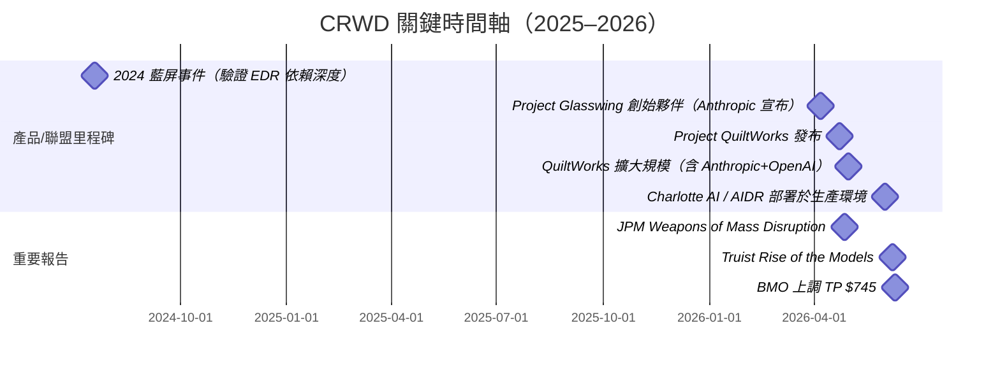

# CRWD.US(crowdstrike)

## 基本資料

CrowdStrike Holdings 是全球最大的雲原生終端安全與 AI 驅動資安平台，總部位於美國德州奧斯汀，2011 年由 George Kurtz（CEO）等人創辦，2019 年在 NASDAQ 上市。公司以 Falcon 平台起家，覆蓋終端偵測與回應（EDR）、身份安全（Identity）、雲端安全（Cloud Security）與 SIEM，2026 年以「AI-native 資安平台」定位主導資安整合浪潮，並在 Anthropic 的 Project Glasswing 中擔任 12 家創始合作夥伴之一（資安廠商僅 CRWD 與 PANW 兩家入選）。

**近期財務規模（截至 2026 年 6–7 月市場資料）**

| 指標 | 數值 | 來源 |
|---|---|---|
| 市值（2026-06-10） | ~$167-176B | BMO / Truist |
| 股價（2026-06-10） | $691.53 | BMO |
| NTM EV/FCF（2026-06） | 83.5x | BMO |
| FCF Margin（CY2026E） | 30.0% | BMO |
| FCF Margin（CY2027E） | 32.3% | BMO |
| Revenue Growth（CY2026E） | 23.3% | BMO |
| Revenue Growth（CY2027E） | 21.7% | BMO |
| EV/CY27E Revenue | 22.9x | BMO |

---

## 核心產品 / 競爭優勢

### Falcon 平台：資安整合的整合核心

Falcon 是 CRWD 的單一雲原生平台，覆蓋終端（EDR）、身份、網路、雲端、資料與 SIEM 六大領域，是目前資安市場中整合廣度最高的平台之一。

| 產品模組 | 說明 |
|---|---|
| Falcon EDR（Insight） | 業界領先終端偵測與回應；Kernel 層部署，替換成本極高 |
| Charlotte AI | AI 驅動的安全分析，自然語言查詢與自動化調查 |
| AIDR（AI Detection & Response） | AI 自動化偵測與回應，可完全接管 Tier-1/Tier-2 SOC |
| AgentWorks | 構建 Agentic Security Workforce 的工具集 |
| Falcon Identity | 身份威脅偵測（ITDR），含 CyberArk 整合 |
| Falcon Cloud Security | CSPM / CWPP / AI-SPM |
| Falcon SIEM / Next-Gen SIEM | 集中記錄分析與威脅相關性 |
| Charlotte AI Agentic SOC | 自主運行完整 SOC 工作流，無需人工干預 |

### 護城河分析

1. **資料飛輪**：Falcon 平台每天處理超過 5 兆個安全事件，形成競爭對手難以複製的遙測資料飛輪，驅動 AI 模型持續進化
2. **Kernel 層部署**：EDR 在作業系統最底層運行，客戶替換需要全面重建，是結構性黏性的來源（2024 年 CrowdStrike 藍屏事件反而驗證了依賴度之深）
3. **Project Glasswing 首選**：Anthropic 的封閉式 Mythos 防禦聯盟，資安廠商僅 CRWD 與 PANW 兩家入選 12 個創始夥伴，是資安界的最高信任背書
4. **AI-SOC 先發**：Falcon 已部署 Charlotte AI 在生產環境中完整接管 SOC Tier 1/2 工作，可觀測案例已達 100K+ 次自主調查（UBS Gartner 峰會，2026-06）

---

## Project QuiltWorks（2026 年重大里程碑）

QuiltWorks 是 CRWD 於 2026 年 4 月 23 日發布的業界聯盟，整合 Anthropic 與 OpenAI 的前沿模型，以 AI 驅動的方式掃描、優先排序並大規模修補企業應用程式中的漏洞。

| 要素 | 內容 |
|---|---|
| 啟動日期 | 2026-04-23，5 月擴大規模 |
| AI 模型夥伴 | Anthropic（Mythos）+ OpenAI（GPT-5.5-Cyber） |
| 系統整合商 | Accenture、EY、IBM、Kroll 等全球頂級 SI |
| 核心能力 | 「可利用性」（exploitability）優先排序，取代 CVSS 靜態評分 |
| 服務流程 | Assessment → AI 掃描 → 風險排序 → 指引修補 → 驗證 |
| 需求訊號 | Kroll 報告 90%+ 客戶已遭遇 AI 相關資安事件 |
| CEO 引言 | "48 million vulnerabilities were found" via QuiltWorks 合作夥伴回饋（George Kurtz，2026） |
| 商業意涵 | 板級風險報告推高 ASP，強化平台整合敘事，CrowdStrike 成為 CISO-to-Board 的核心對話廠商 |

![[報告_JPMorgan_資安_20260427_004.png]]
*JPMorgan（2026-04-27）：Project Glasswing 聯盟架構——52 個審核組織包含 12 家創始夥伴（CRWD、PANW、AWS、Apple、Broadcom、Cisco、Google、JPMorganChase、Linux Foundation、Microsoft、NVIDIA），CRWD 是唯二資安廠商之一。*

---

## 券商評等與目標價

| 報告日 | 券商 | 評等 | 目標價 | 當時股價 | 備註 |
|---|---|---|---|---|---|
| 2026-04-27 | J.P. Morgan | Overweight | — | $448.13 | Weapons of Mass Disruption 報告 |
| 2026-06-08 | Truist Securities | Buy | — | $671.02 | Rise of the Models |
| 2026-06-10 | BMO Capital Markets | Outperform | $745 | $691.53 | 上漲空間 7.7% |
| 2026-06-09 | UBS | 正面 | — | — | Gartner 峰會正面 |

---

## 估值比較（2026-06，BMO）

![[報告_BMO_資安可觀測性_20260612_001.png]]
*BMO（2026-06-12）：AI 感知度 vs 估值象限——CRWD 與 PANW 被歸類「感知安全領導者」，平均 NTM EV/FCF 62.6x，遠高於 AI 落後者板塊的 13x。*

| 指標 | CRWD | PANW | ZS | RBRK | DDOG |
|---|---|---|---|---|---|
| EV/CY26 Rev | 27.9x | 16.6x | 5.1x | 8.6x | 18.3x |
| EV/CY27 Rev | 22.9x | 14.2x | 4.4x | 7.1x | 15.2x |
| EV/CY26 FCF | 93.1x | 44.3x | 21.5x | 47.5x | 69.5x |
| EV/CY27 FCF | 71.0x | 36.4x | 17.3x | 34.6x | 56.4x |
| Rev Growth CY26 | 23.3% | 22.4% | 20.9% | 26.3% | 26.8% |
| FCF Margin CY27 | 32.3% | 38.9% | 25.6% | 20.4% | 26.9% |

（來源：BMO 2026-06-12，FactSet）

---

## 相關公司

| 關係 | 公司 | 備註 |
|---|---|---|
| 主要競品 | [[PANW.US(palo alto networks)]] | 雙雄格局，同為 Glasswing 創始夥伴，PANW 更偏平台整合 |
| 主要競品（終端） | [[S.US(sentinelone)]] | EDR 直接競品，SentinelOne Purple AI |
| 相關技術 | [[技術_可觀測性]] | CRWD Falcon 與 DDOG Observability 整合 |
| AI 模型合作夥伴 | Anthropic（未建頁） | Glasswing + QuiltWorks |
| AI 模型合作夥伴 | OpenAI（未建頁） | QuiltWorks，TAC |
| 合作 SI | Accenture、EY、IBM（未建頁） | QuiltWorks 系統整合夥伴 |

---

## 時間軸 / 關鍵催化劑

---

## 來源

- [[報告_JPMorgan_資安_20260427]] — J.P. Morgan，Weapons of Mass Disruption，2026-04-27
- [[報告_Truist_MythosAndDaybreak_20260608]] — Truist，Rise of the Models，2026-06-08
- [[報告_UBS_Gartner資安峰會_20260609]] — UBS，Gartner 安全峰會，2026-06-09
- [[報告_BMO_資安可觀測性_20260612]] — BMO，資安可觀測性，2026-06-12
- [[報告_Jefferies_資安_20260416]] — Jefferies VAR Survey，2026-04-16
- [[報告_Jefferies_資安_20260427]] — Jefferies 小型資安股 Preview，2026-04-27
