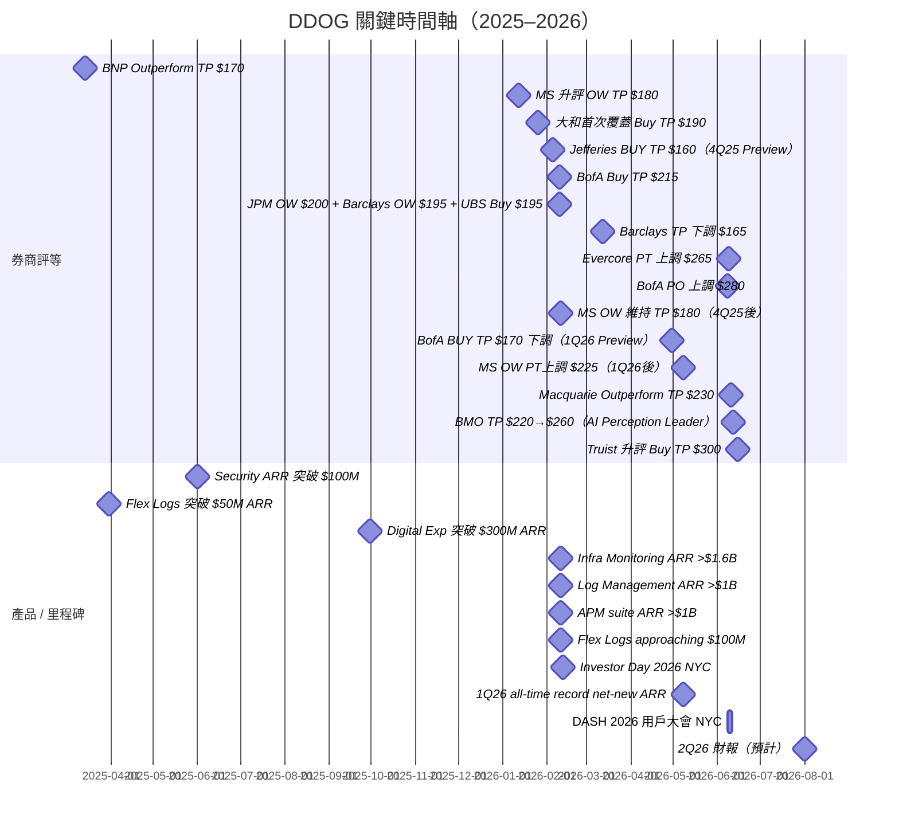

# DDOG.US(datadog)

## 基本資料

Datadog 是全球領先的雲端可觀測性（Observability）與監控平台，總部位於美國紐約，2010 年由 Olivier Pomel 與 Alexis Lê-Quôc 共同創辦，2019 年 9 月在 NASDAQ 上市（代號：DDOG）。

公司定位為「雲原生時代的統一監控平台」，核心價值在於整合基礎設施監控（Infrastructure Monitoring）、應用效能監控（APM）與日誌管理（Log Management）三大支柱，提供 DevOps 與 SRE 團隊跨整個技術堆疊的即時可觀測性。

2022 年後，DDOG 向資安領域擴張，Cloud Security（SIEM、ASM、CSPM/CWPP）成為第二條成長曲線，但規模仍遠低於可觀測性核心業務（截至 2025Q3，Security ARR 超過 $100M，為整體 ARR 佔比約 3-4%）。

**近期財務規模（截至 2025 全年）**

| 指標                   | 數值                  | 來源                          |
| -------------------- | ------------------- | --------------------------- |
| FY25 Revenue         | $3,427M（+27.7% YoY） | 公司財報（Macquarie / Truist 引用） |
| 總客戶數（1Q26）           | 33,200              | Macquarie 2026-06-10        |
| 客戶數 >$100K ARR（1Q26） | 4,550（+21% YoY）     | Macquarie 2026-06-10        |
| 客戶數 >$1M ARR（FY25）   | 603（+31% YoY）       | Macquarie 2026-06-10        |
| NRR（1Q26）            | low-120%            | Macquarie 2026-06-10        |
| Gross Retention      | 95-99%              | Macquarie 2026-06-10        |
| 使用 2+ 產品客戶比例         | 85%（1Q26）           | Macquarie 2026-06-10        |
| 使用 4+ 產品客戶比例         | 56%（1Q26）           | Macquarie 2026-06-10        |
| Fortune 500 滲透率        | ~62%（DASH 2026 揭露；Investor Day 口徑 ~48%、中位數年消費 ~$450K） | Evercore 2026-06-09 / Jefferies 2026-02-13 |
| >$10M ARR 客戶數（CY25）  | 34（CY24：24；CY22：13；CY20：3） | Jefferies Investor Day 2026-02-13 |
| 市值（2026-06）          | ~$81-88B            | Macquarie / Truist / Evercore |

---

## 核心技術 / 競爭優勢

### 主業：可觀測性三柱（Observability Three Pillars）

DDOG 的主業建立在可觀測性三大支柱上，構成 >90% 的整體營收：

**1. Infrastructure Monitoring（基礎設施監控）**
監控雲端主機、容器、Kubernetes 叢集、網路設備。消費模型計費，用量隨客戶雲端規模自然成長。為 DDOG 最早也是最大的產品線。

**2. APM（Application Performance Monitoring，應用效能監控）**
追蹤分散式應用的請求鏈路（Traces）、服務依賴關係、錯誤率與延遲。APM 被 Truist（2026-06-15）點名為「最快速成長的核心支柱」，在 4Q25 法說中被管理層特別強調。
- **ARR 里程碑（4Q25）**：APM suite 突破 $1B+ ARR，核心 APM 以 mid-30% YoY 成長，三大支柱中成長最快（MS 2026-02-11）

**3. Log Management（日誌管理）**
大規模收集、索引與分析日誌。Flex Logs 為其次世代彈性日誌方案，1Q25 已突破 $50M ARR，是 DDOG 史上最快達到此規模的產品。

**三柱協同效應**：這三條產品線共用同一份遙測資料（Metrics + Traces + Logs），在單一 glass pane 中提供跨團隊的統一視角，是 DDOG 最核心的「platform consolidation」護城河。

### 副業：Cloud Security（資安，2022 後拓展）

DDOG 的資安業務從可觀測性資料自然延伸，利用已有的遙測上下文（context）提供更精準的威脅偵測：

| 產品類別                                     | 說明                                                      |
| ---------------------------------------- | ------------------------------------------------------- |
| Cloud SIEM                               | 雲原生 Security Information & Event Management，結合日誌分析與威脅偵測 |
| ASM（Application Security Management）     | 應用程式層資安監控                                               |
| CSPM（Cloud Security Posture Management）  | 雲端組態安全管理                                                |
| CWPP（Cloud Workload Protection Platform） | 雲端工作負載防護                                                |

截至 2025Q3，Security ARR 以中高 50% YoY 成長（2Q25 為中 40%），已突破 $100M ARR 里程碑，客戶數達 7,500（佔總客戶 24%）。

> [!info] DDOG 資安 vs 競品定位
> DDOG 的資安優勢在於「與可觀測性資料的整合」，而非純資安廠商的深度。Palo Alto Networks（PANW）旗下 Chronosphere（2025Q4 併購）直攻 Observability + Security 的融合市場，是目前最接近的重疊競爭點。Truist（2026-06-15）指出，OpenAI 同時維持 DDOG 與 PANW/Chronosphere 的雙重部署。

### 平台整合競爭優勢

- **單一整合平台**：取代多個點工具（point solutions），一個合約覆蓋 Infra + APM + Logs + Security + Digital Experience + Database Monitoring + Incident Management 等，吸引企業 IT 整合需求。
- **Integration Moat**：DDOG 整合超過 700+ 雲端服務與框架（AWS、GCP、Azure、Kubernetes 等），幾乎任何現代基礎設施部署後即可自動連入 DDOG，這是 DDOG 在「雲原生堆疊預設監控層」的核心護城河（Truist 2026-06-15）。
- **Gartner 第三方驗證**：Gartner Critical Capabilities for Observability Platforms（2025-07-08）評比 20 家廠商，DDOG 在 Interoperability 維度（4.4/5）為全場最高，且被認定適合全部 6 種使用情境（SRE / Platform Operations / Software Engineering / Business Insights / Cost Optimization / AI Engineering）。另在 Gartner Magic Quadrant for Digital Experience Monitoring（2025-10-27）中列為 **Leader**（四 Leaders：Datadog / Dynatrace / New Relic / Catchpoint，DDOG 在 Leaders 中 Ability to Execute 最高）；Gartner First Take（2026-06-10）肯定 DASH 2026 的 Autonomous Ops Loop（Bits Detection / Memories / Remediation）回應市場對自主維運的需求，同時提醒 governance / guardrails 是採用前提。廠商評比詳見 [[技術_可觀測性]]。
- **自研 SLM「Toto」**：Investor Day 2026 揭露 DDOG 自建小型語言模型 Toto 驅動其 AI 產品，以每小時數兆筆遙測事件的專有資料流持續訓練——此資料飛輪是 LLM 通用模型難以複製的護城河（BofA 2026-02-12）。
- **消費模型**：依使用量（hosts、log volume、spans）計費，隨客戶業務成長而自然擴張，是 NRR 維持 high-110% 至 low-120% 的結構性原因。
- **AI Native 先發優勢**：DDOG 正在重演「cloud native 時代的成長劇本」——先贏得 AI 原生新創（包含 OpenAI、Anthropic 等 frontier labs），再隨這些客戶規模化帶動平台消費。

---

## 產品與應用

| 產品 / 服務                            | 類別          | ARR 規模（2025）                    | 應用                            |
| ---------------------------------- | ----------- | ------------------------------- | ----------------------------- |
| Infrastructure Monitoring          | 主業核心        | >$1.6B ARR（4Q25）                | 雲端主機、容器、網路；三柱中最大              |
| APM                                | 主業核心        | >$1B ARR（4Q25，mid-30% YoY，成長最快） | 分散式應用追蹤；4Q25 為三柱成長最快          |
| Log Management                     | 主業核心        | >$1B ARR（4Q25）                  | 大規模日誌收集與分析                    |
| Flex Logs                          | 日誌延伸        | approaching $100M ARR（4Q25）     | 彈性日誌儲存，6 個月最快達標；4Q25 接近 $100M |
| Digital Experience / RUM           | 使用者體驗       | >$300M（Macquarie 3Q25 引用）       | 瀏覽器 / 行動端真實使用者監控              |
| Database Monitoring                | APM 延伸      | ~$50M（1Q25，+60% YoY）            | 資料庫查詢效能分析                     |
| Cloud Security（SIEM+ASM+CSPM/CWPP） | 副業資安        | >$100M（2Q25，+mid-50% YoY）       | 雲端威脅偵測與合規                     |
| LLM Observability                  | AI 新品       | 首季有意義帳單（Truist 2026）            | LLM 應用效能追蹤                    |
| GPU Monitoring                     | AI 新品       | GA（2026）                        | GPU 叢集健康、成本、效能                |
| Bits AI（SRE / Dev / Security）      | AI Agent 平台 | Preview（多數 2026）                | 自動化運維、開發、資安工作流                |

---

## 圖片 / 架構圖

### 核心業務成長趨勢

![[報告_MS_DDOG升評OW_20260112_001.png]]
*Exhibit 1（Morgan Stanley，2026-01）：DDOG ex-AI-Native 客戶營收成長加速至 3Q25 +20% YoY（vs 2Q25 +18%），顯示核心業務動能回升。*

![[報告_MS_DDOG升評OW_20260112_002.png]]
*Exhibit 2（Morgan Stanley，2026-01）：DDOG 在核心可觀測性市場多年持續居於市占率成長最快廠商（IDC Software Tracker）。*

### 市場機會與 TAM 擴張

![[報告_MS_DDOG升評OW_20260112_003.png]]
*Exhibit 3（Morgan Stanley，2026-01）：DDOG 可觸及市場達 $89B（2025），含可觀測性 $25B（10% CAGR）+ 資安 $40B（+15% CAGR）+ IT 服務管理 $24B，預計 2029 年達 $145B。*

### DASH 2026 產品發表

![[報告_Macquarie_DDOG_DASH2026產品發表_20260610_001.png]]
*Macquarie（2026-06-10）：DDOG 相對 S&P 500 股價表現及評等歷史，2026-05-01 起 +72% vs QQQ +4%。*

![[報告_Macquarie_DDOG_DASH2026產品發表_20260610_002.png]]
*Macquarie（2026-06-10）：DDOG DASH 2026 Bits AI 運維自動化產品架構圖（Operations loop：Detection → Investigation → Remediation）。*

![[報告_Macquarie_DDOG_DASH2026產品發表_20260610_003.png]]
*Macquarie（2026-06-10）：DDOG DASH 2026 Bits AI 開發自動化產品架構圖（Development loop：Coding → Release → Testing）。*

![[報告_Macquarie_DDOG_DASH2026產品發表_20260610_004.png]]
*Macquarie（2026-06-10）：DDOG 全平台產品圖（Infrastructure / Database / Logs / Digital Experience 更新）。*

![[報告_Macquarie_DDOG_DASH2026產品發表_20260610_005.png]]
*Macquarie Alpha Model 排名（2026-06）。*

![[報告_Macquarie_DDOG_DASH2026產品發表_20260610_006.png]]
*Macquarie（2026-06-10）：DDOG 股票 1 年 Total Return 拆解（股息 + 預期盈餘變化 + 估值倍數變化）。*

![[報告_Macquarie_DDOG_DASH2026產品發表_20260610_007.png]]
*Macquarie Alpha Model 因子分解（2026-06）：成長（GROWTH）與獲利能力（PROFITABILITY）在同業中排名最高。*

![[報告_Macquarie_DDOG_DASH2026產品發表_20260610_008.png]]
![[報告_Macquarie_DDOG_DASH2026產品發表_20260610_009.png]]
![[報告_Macquarie_DDOG_DASH2026產品發表_20260610_010.png]]
![[報告_Macquarie_DDOG_DASH2026產品發表_20260610_011.png]]
![[報告_Macquarie_DDOG_DASH2026產品發表_20260610_012.png]]
![[報告_Macquarie_DDOG_DASH2026產品發表_20260610_013.png]]

### DASH 2026 產品發表（Truist 視角）

![[報告_Truist_DDOG升評Buy_20260615_001.png]]
*Truist（2026-06-15）：DDOG 多產品客戶數與平均 ARR 相關性圖表 — 採用產品數越多，ARR 越高，驗證 platform consolidation 效應。*

![[報告_Truist_DDOG升評Buy_20260615_002.png]]
*Truist（2026-06-15）：DDOG DASH 2026 AI 聚焦產品策略圖（AI for Datadog + Datadog for AI 雙主軸）。*

![[報告_Truist_DDOG升評Buy_20260615_003.png]]
*Truist（2026-06-15）：DDOG 估值分析圖（Base $300 / Bear $140 / Bull $347）。*

### Investor Day 材料圖（MS 4Q25 Preview 整理，2026-02-04）

![[報告_MS_DDOG_4Q25預覽_20260204_004.png]]
*MS（2026-02-04，取自公司簡報）：DDOG 年度客戶世代（cohort）ARR 成長 —— 2013 年以前的世代最終消費為首年 18x、2019 世代 4.4x、2022 世代 1.3x，是 land-and-expand 消費模型黏性的最直接證據。*

![[報告_MS_DDOG_4Q25預覽_20260204_003.png]]
*MS（2026-02-04，取自公司簡報）：三柱 ARR 結構（4Q23 時點）—— Infrastructure Monitoring ~$1B、APM Suite 與 Log Mgmt 各 ~$0.6B；對照 Investor Day 2026 揭露（Infra >$1.6B、APM+DEM >$1B、Logs >$1B）可見三柱平衡放大。*

### BofA Securities 4Q25 分析圖

![[DDOG 260210 BofA_4Q25 results_001.png]]
*BofA（2026-02-10）：DDOG $100K+ ARR 客戶數與 YoY 成長率（1Q19A–4Q25A）—— 4Q25 客戶成長加速回升至 19%（from 16% in 3Q25），顯示大客戶擴張動能重啟。*

![[DDOG 260210 BofA_4Q25 results_002.png]]
*BofA（2026-02-10）：DDOG Rule-of-60 圖（Revenue growth + FCF margin，1Q19–4Q26E）—— 4Q25 仍維持在 60% 以上，兼具高成長與高自由現金流，為 SaaS 優質評分依據。*

### Jefferies 4Q25 Preview 分析圖（2026-02-05）

![[DDOG 260205_Jefferies 4Q25 Preview_001.png]]
*Jefferies（2026-02-05）：DDOG Revenue Guide YoY Growth 情境分析——觀測性板塊 YTD 疲弱（DDOG -20%）背景下，預期 4Q25 beat 但 CY26 guide 下修為主要風險。*

### BofA Securities 1Q26 Preview 分析圖（2026-04-30）

![[DDOG 260430_BofA 1Q26 Preview_005.png]]
*BofA（2026-04-30）：Non-AI-native 營收成長趨勢——4Q25 +23% YoY，從 2Q25/3Q25 +18% 低點顯著加速，驗證核心業務企穩回升。*

### Morgan Stanley 其他分析圖

![[報告_MS_DDOG升評OW_20260112_004.png]]
![[報告_MS_DDOG升評OW_20260112_005.png]]
![[報告_MS_DDOG升評OW_20260112_006.png]]
![[報告_MS_DDOG升評OW_20260112_007.png]]
![[報告_MS_DDOG升評OW_20260112_008.png]]
![[報告_MS_DDOG升評OW_20260112_009.png]]
![[報告_MS_DDOG升評OW_20260112_010.png]]
![[報告_MS_DDOG升評OW_20260112_011.png]]
![[報告_MS_DDOG升評OW_20260112_012.png]]
*MS（2026-01）：估值比較、平台功能架構、AI-Native ARR 拆解、成長驅動因素分析等圖表（_004 至 _012）。*

![[報告_MS_DDOG升評OW_20260112_013.png]]
*MS（2026-01）：DDOG 全球營收地理分佈。*

![[報告_MS_DDOG升評OW_20260112_014.png]]
*MS（2026-01）：MS 估值 vs 市場共識對比。*

---

## 券商評等與目標價時間軸

| 報告日        | 券商                | 評等                               | 目標價  | 當時股價    | 上漲空間   |
| ---------- | ----------------- | -------------------------------- | ---- | ------- | ------ |
| 2025-03-14 | BNP Paribas       | Outperform                       | $170 | $98.7   | +72%   |
| 2026-01-12 | Morgan Stanley    | Overweight（升評，from Equal-weight） | $180 | $125.49 | +43%   |
| 2026-01-26 | 大和資本市場       | Buy（1，首次覆蓋，DCF）             | $190 | $130.13 | +46%   |
| 2026-02-04 | Morgan Stanley    | Overweight（維持，4Q25 Preview，預期 guide 低於共識） | $180 | $129.05 | +39%   |
| 2026-02-05 | Jefferies         | Buy（維持，PT 下調）                  | $160（from $180）| $115.71 | +38%   |
| 2026-02-10 | J.P. Morgan       | Overweight（維持，Dec-26 PT）        | $200 | $114.01 | +75%   |
| 2026-02-10 | Barclays          | Overweight（維持，4Q25 First Take）  | $195 | $114.01 | +71%   |
| 2026-02-10 | UBS               | Buy（維持，43x CY27 EV/FCF）        | $195 | $130.32 | +50%   |
| 2026-02-10 | BofA Securities   | Buy（維持）                          | $215 | $130.62 | +64.6% |
| 2026-02-11 | Morgan Stanley    | Overweight（維持）                    | $180 | $129.67 | +39%   |
| 2026-02-12 | BofA Securities   | Buy（維持，Investor Day 評析）       | $215 | $126.13 | +70%   |
| 2026-02-13 | Jefferies         | Buy（維持，Investor Day 評析，DCF）  | $160 | $126.13 | +27%   |
| 2026-03-12 | Barclays          | Overweight（維持，NY Bus Tour，PT ⚠️ 下調自 $195） | $165 | $127.49 | +29.4% |
| 2026-04-08 | Guggenheim        | Buy（升評，from Neutral）              | $175 | $116.50 | +50%   |
| 2026-04-16 | Morgan Stanley    | Overweight（維持，1Q26 Preview）       | $180 | $121.06 | +49%   |
| 2026-04-30 | BofA Securities   | Buy（維持，PT ⚠️ 大幅下調）            | $170（from $215）| $133.98 | +27%   |
| 2026-05-08 | Morgan Stanley    | Overweight（維持，PT上調）             | $225 | ~$175   | +29%   |
| 2026-05-15 | William Blair     | Outperform（承接）                    | N/A  | $202.84 | —      |
| 2026-06-09 | Evercore ISI      | Outperform（維持，DASH 2026，PT 上調自 $225）| $265 | $227.34 | +17%   |
| 2026-06-10 | BofA Securities   | Buy（維持，DASH 2026，PO ⚠️ 大幅上調自 $170，established 6/8）| $280 | $227.63 | +23%   |
| 2026-06-10 | Macquarie         | Outperform（維持）                   | $230 | $227.63 | +1%    |
| 2026-06-15 | Truist Securities | Buy（升評，from Hold）                | $300 | $229.90 | +30.5% |

> [!warning] 資訊衝突：目標價差距
> - [[報告_Macquarie_DDOG_DASH2026產品發表_20260610]]（2026-06-10）：TP $230，隱含 12 個月上漲空間僅 1%，評論為「可能等拉回再加碼」
> - [[報告_Truist_DDOG升評Buy_20260615]]（2026-06-15）：TP $300，隱含上漲空間 30.5%，認為動能仍有延續空間
> - 兩份報告相隔 5 天（同一週！），目標價差距 $70（+30%）
> - 狀態：兩份均為當前有效預測，Macquarie 偏保守（以「Rule of X」估值框架為主），Truist 偏積極（DCF，假設 FY27 收入成長 25% vs 街頭共識 20.5%）

> [!warning] 資訊衝突：FY26 Revenue 預期大幅分歧（時間跨度造成）
> - [[報告_MS_DDOG升評OW_20260112]]（2026-01-12）：FY26E Revenue $3,965M（+17% YoY），擔心 OpenAI 流失拖累成長
> - [[報告_Macquarie_DDOG_DASH2026產品發表_20260610]]（2026-06-10）：FY26E Revenue $4,361M（+27.3% YoY）
> - [[報告_Truist_DDOG升評Buy_20260615]]（2026-06-15）：FY26E Revenue $4,340M（+26.6% YoY）
> - 差距原因：MS 在 2026-01 時 1Q26 實際數字未出，保守估計 OpenAI 衝擊；5 個月後 Macquarie / Truist 看到 1Q26 實際數字（$1,006M，+32.2% YoY），大幅上修。
> - 狀態：Macquarie / Truist（2026-06）為較新、含實際數字的估值，可信度更高。

> [!warning] 資訊衝突：OpenAI 關係評估差異
> - [[報告_MS_DDOG升評OW_20260112]]（2026-01）：OpenAI 估計佔 DDOG 約 10% 營收（ARR ~$330M），正在分散使用，視為最大下行風險；假設 FY26 OpenAI 貢獻維持 $274M（0% 成長）
> - [[報告_Truist_DDOG升評Buy_20260615]]（2026-06，DASH 會後）：在 DASH 現場，OpenAI Head of Platform 公開表示 Datadog 是「每次中斷都會拿出來的工具」，信心提升；PANW/Chronosphere 並存部署，非全面轉移
> - 狀態：Truist 更晚且有 DASH 現場消息，但 OpenAI 分散風險長期仍在（PANW Chronosphere 已超過 $200M ARR）

> [!warning] BofA 目標價劇烈擺盪：$215 → $170（2026-04-30）→ $280（2026-06-08）
> - [[DDOG 260210 BofA_4Q25 results]]（2026-02-10）：BUY TP $215，預期 1Q26 受益於強勁 AI 客戶消費
> - [[DDOG 260430_BofA 1Q26 Preview]]（2026-04-30）：⚠️ TP 下調至 $170（PO established 2026-04-22），估值基礎調整為 12.2x EV/CY27E revenue；1Q26E 預測 $956M（vs 管理層 guide $951-961M）
> - 下調背景：4月科技股廣泛壓力 + 可觀測性板塊估值整體收縮，並非基本面惡化
> - 後續：1Q26 實際 $1,006M（+32.2% YoY），大幅超越 BofA 預測，MS 同步升 TP 至 $225
> - [[報告_BofA_DDOG_DASH2026_20260610]]（2026-06-10）：⚠️ PO 大幅上調至 $280（established 2026-06-08，18.8x EV/CY27E revenue）。不到 6 週內從 $170 → $280（+65%），主因股價從 $134 漲至 $228 後追認 + DASH 需求 checks 轉正。BofA 估值基礎隨行情連續改動，參考價值需打折。

> [!warning] Barclays 目標價逆勢下調：$195（2026-02-10）→ $165（2026-03-12）
> - [[報告_Barclays_DDOG_4Q25業績_20260210]]（2026-02-10）：OW TP $195，4Q25 First Take 正面（+29% 增速、guide 好於預期）
> - [[報告_Barclays_DDOG更新_20260312]]（2026-03-12）：OW 維持但 TP 降至 $165，同期股價反而從 $114 回升至 $127
> - 解讀：Barclays 內容基調仍偏多（NY Bus Tour 肯定非 AI 工作負載四支柱），TP 下調應反映 3 月軟體板塊估值倍數收縮，與 BofA 4/30 下調同一邏輯

> [!info] MS 4Q25 Preview 的「guide 低於共識」預警未成真
> - [[報告_MS_DDOG_4Q25預覽_20260204]]（2026-02-04）：MS 預期 FY26 initial guide 僅 +17%（假設 OpenAI 零成長 + 核心 +18.5%），低於共識 +21%，並預警股價將負面反應
> - 實際（2026-02-10）：FY26 initial guide $4,060-4,100M（中值 +19%），優於 MS 的悲觀假設與買方 bogey（17-18%，UBS 說法），股價當日 +16%
> - 此案例顯示 MS 對 OpenAI 集中度風險的建模偏保守；其後 5/7 公司將全年 guide 上調至 $4,300-4,340M

---

## 財務指標追蹤

### 營收成長

| 財年 | Revenue | YoY 成長 | 來源 |
|---|---|---|---|
| FY22 | $1,675M | 63% | MS 歷史數據 |
| FY23 | $2,128M | 27% | MS 歷史數據 |
| FY24 | $2,684M | 26.1% | 公司財報 |
| FY25（實際） | $3,427M | 27.7% | 公司財報 |
| FY26E | $4,340-4,361M | 26.6-27.3% | Truist / Macquarie（2026-06） |
| FY27E | $5,429-5,558M | 25.1-27.4% | Truist / Macquarie（2026-06） |

> Non-AI-native 核心成長軌跡：4Q24 +20% → 1Q25/2Q25 +18%（低點）→ 3Q25 +20% → **4Q25 +23% YoY**（BofA 1Q26 Preview 確認；UBS 4Q25 評析同數字，並指出 2026 年 1 月核心加速延續），核心業務加速回升，與 AI-native 帶動形成雙輪驅動。

**4Q25 實際與 FY26 guide 演進**（Barclays / UBS 2026-02-10）：

| 項目 | 數字 | 備註 |
|---|---|---|
| 4Q25 營收 | $953M（+29% YoY） | 增速較 2Q/3Q25 的 +28% 再加速 |
| 4Q25 $100K+ ARR 客戶 | 4,310（+250 q/q） | Barclays：模型中最強單季淨增 |
| 1Q26 guide | $951-961M | vs 共識 $935.9M |
| FY26 initial guide（2/10） | $4,060-4,100M（中值 +19%） | non-GAAP OM ~21%、EPS $2.08-2.16 |
| FY26 raised guide（5/7） | $4,300-4,340M（+25-27%） | 1Q26 實際 $1,006M（+32.2%）後上調 |

### 獲利能力

| 指標 | FY24 | FY25 | FY26E | FY27E |
|---|---|---|---|---|
| Non-GAAP 毛利率 | 82.0% | 81.0% | ~80.8% | ~81.2% |
| Non-GAAP 營業利益率 | 25.1% | 22.4% | 22.2% | 22.5% |
| FCF（$M） | $775M | $915M | $1,137M | $1,191M |
| FCF 利益率 | 28.9% | 26.7% | 26.2% | 21.9% |

### EPS 預測（非 GAAP）

| 券商 | FY25 | FY26E | FY27E | FY28E |
|---|---|---|---|---|
| Morgan Stanley（2026-01） | $2.01 | $1.98 | $2.50 | — |
| 大和資本市場（2026-01-26，首次覆蓋） | $2.02（E） | $2.49 | — | — |
| Morgan Stanley（2026-02-04，4Q25 Preview） | $2.01（E） | $1.98 | $2.50 | — |
| Jefferies（2026-02-05，4Q25 Preview） | $2.01（E） | $2.20 | — | — |
| J.P. Morgan（2026-02-10，4Q25 快評） | $2.01（E） | $2.29 | — | — |
| Morgan Stanley（2026-02，4Q25 後）| $2.06（實際）| $2.12 | $2.54 | — |
| Guggenheim（2026-04-08，升評 Buy）| $2.06（實際）| $2.17 | $2.75 | — |
| Morgan Stanley（2026-04，1Q26 Preview）| $2.06（實際）| $2.12 | $2.54 | $3.41 |
| BofA Securities（2026-02，4Q25 後）| $2.06（實際）| $2.11 | $2.35 | $2.65 |
| Morgan Stanley（2026-05，1Q26 後）| $2.06（實際）| **$2.44** | **$2.82** | **$3.61** |
| William Blair（2026-05-15，承接 OW）| $2.06（實際）| $2.40 | $2.82 | — |
| Macquarie（2026-06） | $2.10（實際） | $2.50 | $3.00 | — |
| Truist（2026-06） | $2.06（實際） | $2.41 | $2.74 | — |
| UBS（2026-02-10，自家口徑*） | $2.56 | $3.10 | $3.93 | $4.73 |
| Evercore ISI（2026-06-09，自家口徑*） | $2.56（實際） | $3.03 | — | — |

> *UBS 與 Evercore 的 EPS 採自家調整口徑（FY25 $2.56 vs 共識 non-GAAP $2.06），數字系統性偏高，不可與其他券商直接比較；趨勢方向仍可參考。

> MS 2026-05 PT 上調至 $225（from $180）：1Q26 revenue +32% YoY（1Q22 以來最強），公司 FY26 guide 上調至 $4,300-4,340M（+25-27% YoY）；AI native ex-OpenAI 延續高速成長。

---

## Investor Day 2026 重點（2026-02-12，NYC）

DDOG 第二次 Investor Day（首次為 2024-02），4Q25 財報後兩天舉行。無財務目標更新（重申長期 non-GAAP OM 目標 25%+），重點在產品策略與營運 KPI 揭露。

### ARR 里程碑（公司揭露）

| 產品線 | ARR | 成長脈絡 |
|---|---|---|
| Infrastructure Monitoring | >$1.6B | 創始產品 |
| Log Management | >$1B | 2020 年以來成長 7x |
| APM + DEM | >$1B | — |
| Cloud SIEM | — | 2020 年以來成長 18x |

### 營運 KPI（Jefferies 2026-02-13 整理）

| 指標 | 數字 |
|---|---|
| >$10M ARR 客戶 | 34（CY24：24 → CY23：18 → CY22：13 → CY21：7 → CY20：3） |
| Fortune 500 滲透 | ~48%，中位數年消費 ~$450K |
| 全球可開發客戶數 | >470K，logo 滲透率僅 ~7% |
| 三柱全採用客戶 | 約半數（採用三柱客戶的單客營收為未採用者 15x）|
| Gross Retention | 企業 98% / SMB-中型 96% / 整體 97% |
| Bits AI SRE 使用客戶 | 2,000 家 |
| 資安客戶 | 8,500+（含 ~25% F500）；$1M+ ARR 客戶中 70% 已用 ≥1 資安產品，但資安僅佔該群 ARR ~2%（滲透空間大） |
| R&D 人力 | 4,000 人（+29% YoY）；企業端業務人力 CY25 +30%+ |

### 策略重點

- **自研 SLM Toto**：以專有遙測資料流（每小時數兆事件）訓練，驅動 Bits AI 產品（BofA：資料飛輪難以複製）
- **BYOC / CloudPrem**：讓大型企業把資料留在自己環境、仍用 DDOG 控制平面，瞄準受監管產業與 on-prem 偏好客戶（BofA：企業滲透可望加速）
- **BofA 解讀**：$50B+ 可觀測性 TAM 可能低估，AI 是 workload expander；維持 Buy $215
- **Jefferies 解讀**：企業飛輪加速（enterprise AE 進入第二年 monetization），維持 Buy $160（DCF，11x CY27 revenue）

## MCP Server 與 Agentic 平台延伸（Barclays NY Bus Tour，2026-03-12）

Barclays 於 2026-03-11 主持 CFO David Obstler 巴士參訪，重點：

- **非 AI 工作負載四支柱**：cloud migrations、SKU 擴張、從其他廠商整併（consolidation）、GTM 演進（quota capacity / channel / partnerships）
- **MCP Server 快速起量**：MCP connector volume 六個月成長 11x，tool calls 呈指數成長（2025-07 → 2026-01）；MCP Server 擷取生產資料、coding 工具與端到端軟體生產工作流，未來將按 DDOG 標準消費制計價（時點未定）
- **定價防禦力**：企業客戶留存率近 100%、SMB high-90s；僅 34 家客戶 >$10M ARR（集中度有限）；管理層認為降價只會減收不改變競爭結果
- **AI-native 客戶處理方式**：與 cloud-native 客戶相同的地域/銷售結構；DDOG 不參與模型訓練，隨推論與生產需求擴張

![[報告_Barclays_DDOG更新_20260312_001.png]]
*Barclays（2026-03-12，取自 DDOG 2026 Investor Day 材料）：Datadog MCP Server tool calls 自 2025-07 至 2026-01 呈指數成長，為 agentic 工作流變現的先行指標。*

## DASH 2026 產品發表重點（2026-06-10）

DDOG 在 NYC 舉辦的 DASH 2026 用戶大會是本次 ingest 的重要事件，Macquarie 與 Truist 均出席並做出即時評析。

### 雙主軸框架

- **AI for Datadog**（Bits AI）：利用 AI 自動化 DDOG 自身的運維、開發與資安工作流
- **Datadog for AI**：提供客戶 AI 堆疊的可觀測性與保護能力

### Bits AI 主要產品（DASH 2026 新發表）

**Operations 運維自動化**

| 產品 | 狀態 | 功能 |
|---|---|---|
| Bits Detection | Preview | 偵測系統健康問題 |
| Bits Memories | Preview | 保留重要運維洞察供未來使用 |
| Bits Remediation | Preview | 在 guardrails 內執行修復動作 |
| Bits Infrastructure Operations | Preview | 偵測、調查、修復基礎設施問題 |
| Bits Guardrails | Preview | 從核准制工作流逐步擴大自主範圍 |

**Development 開發自動化**

| 產品 | 狀態 | 功能 |
|---|---|---|
| Bits Release | Preview | 從 PR 到生產追蹤與驗證變更 |
| Bits Testing | Preview | 自動化合成測試生成與維護 |
| Bits Code | GA | 作為平台級 coding agent 生成程式修復 |

**AI Stack 可觀測性（Datadog for AI）**

| 產品 | 狀態 | 功能 |
|---|---|---|
| Agent Console | Preview | AI agent 集中監控（使用量、成本、延遲） |
| Agent Observability | GA | LLM 應用效能追蹤與評估 |
| GPU Monitoring | GA | GPU 叢集健康、成本、效能可視性 |
| Patterns | Preview | LLM 互動行為模式聚類分析 |
| Bits Evals | Preview | Agent 開發迭代評估自動化 |

**Security 資安新發表**

| 產品 | 狀態 | 功能 |
|---|---|---|
| AI Guard for Custom Agents | GA | 偵測 prompt injection、工具濫用、資料外洩 |
| AI Guard for Coding Agents | Preview | 保護 coding agent 工作流 |
| Runtime Prioritization Engine | Preview | 結合執行時上下文優先排序漏洞 |
| Bits Security Analyst | GA | 自主調查資安警報、生成可操作報告 |
| Bits Threat Hunting | Preview | 跨遙測資料的假設驅動威脅獵查 |

> [!tip] DASH 2026 評析
> Macquarie 指出多數 Bits AI 產品仍在 Preview 且尚未定價，不影響短期財務預測，但長期平台黏性與擴展性影響深遠。Truist 現場調查發現多位 7 位數客戶正在導入 DDOG 資安產品，反應正向。

### DASH 2026 現場 checks（BofA / Evercore，2026-06-09/10）

**採用與規模數據（Evercore 整理）**：

- Bits AI 已有 **3,000+ 組織**使用（含 Nasdaq）；Bits Chat 數千組織使用
- **LLM spans 送入 DDOG 量一年成長 >30x**（2025-05 → 2026-05），「Datadog for AI」需求快速上升
- 33,000+ 客戶、62% F500、「10 of 10」top AI companies 為客戶
- Eppo（2025 併購的 feature flag / A/B 測試）已完全整合進平台；Runtime Prioritization Engine 可削減 ~95% 漏洞告警噪音
- Federated Logs / BYOC Logs / Infinite Cardinality Metrics 直接補上 PB 級日誌與高基數指標短板——Evercore 點名這正是 PANW 併購 Chronosphere 的核心能力，等於正面回應投資人疑慮

**客戶語錄要點（BofA 現場訪談十餘家客戶）**：

- 平台整併動能強：多家客戶自 SolarWinds 等競品遷入、或洽談中；資安（Cloud Security / Session Replay）是下一步整併方向
- AI coding 拉動消費：一家大型科技公司 IT 團隊表示過去一年 DDOG 支出 **+40-50%**，因 AI 加速內部軟體出貨量
- Bits AI 評價正面但成本敏感：有客戶偏好用自有 Claude 預算透過 MCP 連接（成本相近），變現需要客戶找到新預算，放量需時
- 資安品牌力仍是短板：產品力獲肯定，但 CISO 端的品牌信任度尚未建立（Evercore 合作夥伴訪談）

**券商動作**：BofA 維持 Buy、PO 上調至 $280（6/8 established）；Evercore 維持 Outperform、PT $225 → $265（19x CY27 EV/Sales），認為 DDOG 可持續 >30% 營收成長。

---

## AI Native 客戶風險：OpenAI / Anthropic

DDOG 最大的單一客戶風險與機會同時集中在 frontier lab 客戶身上：

**OpenAI（DDOG 最大客戶）**
- MS 估計 OpenAI ARR ~$330M（FY25，佔 DDOG 約 10%）
- PANW CEO 聲稱旗下 Chronosphere 已超過 $200M ARR 來自「最大 frontier AI lab」，暗示轉移部分工作負載至 PANW
- Truist（DASH 2026 現場）：OpenAI Head of Platform 公開表達對 DDOG 的依賴，認為雙平台並存可能是結果

**Anthropic（快速成長的第二大 frontier lab 客戶）**
- 4Q25 季報法說：DDOG 宣佈與「leading AI model provider」簽下 8-figure 年化合約，MS（2026-02-11）判斷為 Anthropic；BofA（2026-02-10）則稱其為「AI financial model company」，雙方均視為重大新客戶
- **JPM 五點論證（2026-02-10）**：① 8-figure land（$10M-99M 區間）；② 管理層稱其為「biggest new-logo deal to date」（DDOG 史上最大新客戶簽約）；③ 描述為「one of the largest AI model companies」；④ 該客戶原有「cumbersome stack」，一次整併 >5 個產品上 DDOG 平台——屬長期戰略承諾而非短期戰術；⑤ 同場揭露 14 of top 20 AI-natives 已是客戶。JPM 結論：若 Anthropic 或其他 top-5 模型商上 DDOG，將直接反擊「OpenAI 集中度」空方論點
- JPM 另指出：隨 Claude Code 在企業滲透，投資人預期 Anthropic 營收規模未來數年可能接近 OpenAI——若成真，其可觀測性消費軌跡的重要性同步放大
- Truist 預計 Anthropic 成長軌跡類似 OpenAI 早期，將逐步填補 OpenAI 潛在下修的缺口
- Anthropic CPO Sholto Douglas 在 DASH 2026 出席，強調長上下文（long context）對可觀測性資料完整性的需求

**AI Native 整體（ex-OpenAI）**
- MS 估計 AI Native ex-OpenAI 收入在 3Q25 以 >135% YoY 成長，佔 ~3% 總收入
- **4Q25 里程碑**：~650 個 AI native 客戶，14 of top 20 AI-natives；19 個 AI-native 客戶年化消費 >$1M（MS 2026-02-11）
- 4Q25 大型交易：18 筆交易 TCV >$1,000 萬，包含 2 筆 >$1 億，以及 1 筆 8 位數 AI 模型供應商大單

---

## 相關公司

| 關係 | 公司 | 備註 |
|---|---|---|
| 最大客戶（AI native） | OpenAI（未建頁） | ARR ~$330M（MS 2026-01 估計），風險最大 |
| 快速成長客戶 | Anthropic（未建頁） | 2026 年快速成長，接棒 OpenAI 軌跡 |
| 主要競品：可觀測性 | [[DT.US(dynatrace)]] | 企業級傳統 Observability，Davis AI，大型企業強；NYSE：DT |
| 主要競品：可觀測性（開源） | Grafana（未建頁） | 開放架構，成本優勢，但無原生資安整合；DDOG 視其為主要競爭對手（by韭菜王 2026） |
| 主要競品：可觀測性 | New Relic（未建頁） | 已私有化，觀測性市場競品 |
| 主要競品：可觀測性 | Elastic（未建頁） | 日誌管理 / 搜尋引擎，部分重疊 |
| 主要競品：資安 + 觀測性整合 | [[PANW.US(palo alto networks)]] | 併購 Chronosphere，直接衝擊 DDOG 資安 + 觀測性業務；BMO TP $335 |
| 主要競品：資安 | [[CRWD.US(crowdstrike)]] | 終端安全，資安市場重疊；BMO TP $745，Glasswing 創始夥伴 |
| 主要競品：雲端資安 | Wiz（未建頁） | CSPM / 雲端資安，2024 年 Google 嘗試收購 |
| 主要競品：雲端資安 | [[ZS.US(zscaler)]] | SSE / ZTNA，資安市場重疊；BMO TP $178 |
| AI 研究平台競品 | [[SNOW.US(snowflake)]] | 資料平台，部分 AI 觀測性重疊；UBS（2026-02-10）視 DDOG 核心加速為 SNOW/MDB 的正面讀秒 |
| 基礎設施雲端 | AWS / GCP / Azure（未建頁） | 超大客戶，同時也是競爭者（捆綁監控工具） |
| 相關技術頁 | [[技術_可觀測性]] | 可觀測性三柱技術詳情 |

---

## 時間軸 / 關鍵催化劑

---

## 來源

- [[報告_BMO_資安可觀測性_20260612]] — BMO，資安可觀測性（DDOG AI Perception Leader、TP $220→$260、NTM EV/FCF 67x vs CRWD 83.5x），2026-06-12
- [[報告_BNP_DDOG季末IR電話會議_20250314]] — BNP Paribas，季末 IR 電話會議短評，2025-03-14
- [[報告_MS_DDOG升評OW_20260112]] — Morgan Stanley，升評 Overweight，2026-01-12
- [[DDOG 260210 BofA_4Q25 results]] — BofA Securities，4Q25 季報評析，Buy TP $215，2026-02-10
- [[DDOG 260211_MS 4Q25 Results]] — Morgan Stanley，4Q25 季報評析，OW TP $180，2026-02-11
- [[報告_Guggenheim_DDOG升評_20260408]] — Guggenheim，升評 Buy（from Neutral），PT $175，股價 $116.50，2026-04-08
- [[DDOG 260416_MS 1Q26 Preview]] — Morgan Stanley，1Q26 季前預覽，OW TP $180，股價 $121，2026-04-16
- [[DDOG 260508_MS 1Q26 Results]] — Morgan Stanley，1Q26 季報評析，OW TP $225，2026-05-08
- [[報告_WilliamBlair_DDOG承接OW_20260515]] — William Blair，承接 Outperform，股價 $202.84，2026-05-15
- [[報告_Macquarie_DDOG_DASH2026產品發表_20260610]] — Macquarie，DASH 2026 用戶大會評析，2026-06-10
- [[報告_Truist_DDOG升評Buy_20260615]] — Truist Securities，升評 Buy，2026-06-15
- [[Innovation_Insight__845549_ndx|Gartner_AI可觀測性_Innovation_Insight_20260526]] — Gartner，AI Observability 市場定義，DDOG 列為代表供應商，2026-05-26
- [[DDOG 260205_Jefferies 4Q25 Preview]] — Jefferies，4Q25 Preview，BUY TP $160（from $180），2026-02-05
- [[DDOG 260430_BofA 1Q26 Preview]] — BofA Securities，1Q26 Preview，BUY TP $170（⚠️ 下調自 $215），2026-04-30
- [[Critical_Capabilitie_822673_ndx|Gartner_Critical_Capabilities_Observability_20250708]] — Gartner，Observability Platforms Critical Capabilities，DDOG Interoperability 最高分（4.4/5），2025-07-08
- [[Market_Guide_for_Dat_839851_ndx|Gartner_Market_Guide_DataObservability_20260223]] — Gartner，Data Observability Tools Market Guide，DDOG 涵蓋全 5 觀測類別，2026-02-23
- [[報告_大和_DDOG首次覆蓋_20260126]] — 大和資本市場，首次覆蓋 Buy（1），TP $190（DCF），2026-01-26
- [[報告_MS_DDOG_4Q25預覽_20260204]] — Morgan Stanley，4Q25 Preview + Investor Day 前瞻，OW TP $180，2026-02-04
- [[報告_JPM_DDOG_4Q25業績_20260210]] — J.P. Morgan，4Q25 快評（Anthropic 五點論證），OW Dec-26 PT $200，2026-02-10
- [[報告_Barclays_DDOG_4Q25業績_20260210]] — Barclays，4Q25 First Take，OW TP $195，2026-02-10
- [[報告_UBS_DDOG_4Q25業績_20260210]] — UBS，4Q25 評析（core ex-AI +23% 加速），Buy TP $195，2026-02-10
- [[報告_BofA_DDOG_InvestorDay_20260212]] — BofA Securities，Investor Day 評析（Toto SLM / BYOC），Buy PO $215，2026-02-12
- [[報告_Jefferies_DDOG_InvestorDay_20260213]] — Jefferies，Investor Day KPI 整理，Buy TP $160，2026-02-13
- [[報告_Barclays_DDOG更新_20260312]] — Barclays，NY Bus Tour（MCP Server 11x），OW TP $165（下調），2026-03-12
- [[報告_BofA_DDOG_DASH2026_20260610]] — BofA Securities，DASH 2026 現場 checks，Buy PO $280（上調自 $170），2026-06-10
- [[報告_Evercore_DDOG_DASH2026_20260610]] — Evercore ISI，DASH 2026 產品/夥伴訪談全整理，Outperform PT $265（上調自 $225），2026-06-09
- [[Magic_Quadrant_for_D_823799_ndx|Gartner_MagicQuadrant_DEM_20251027]] — Gartner，Magic Quadrant for Digital Experience Monitoring，DDOG 列 Leader，2025-10-27
- [[First_Take_Datadog__858398_ndx|Gartner_FirstTake_DDOG自主維運_20260610]] — Gartner，First Take：DASH 2026 Autonomous Ops Loop 評析，2026-06-10
- [[Market_Guide_for_Tel_798131_ndx|Gartner_MarketGuide_TelemetryPipelines_20250902]] — Gartner，Telemetry Pipelines 市場指南（DDOG Observability Pipelines/Vector 列代表廠商），2025-09-02
- [[Market_Overview_for__852515_ndx|Gartner_MarketOverview_ObservabilityPipelines_20260403]] — Gartner，Observability Pipelines 市場概觀，2026-04-03
- [[分析_DDOG_Observability投資thesis]] — DDOG 投資論文（綜合分析頁）
- [[memo_DDOG_深度分析_韭菜王_20260500]] — 韭菜王，DDOG 深度分析，post-1Q26（約 2026-05）
- [[memo_DDOG_NEWR_SPLK_DT_四強比較_不誤正業R_20220101]] — 不誤正業R，四強比較整理
- [[分析_DevSecOps_AI安全衝擊]] — Claude Code Security 衝擊分析，DDOG 相對受益論點

