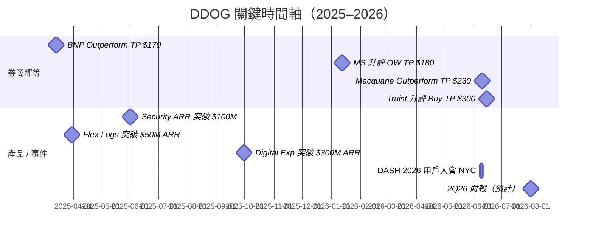

---
title: "DDOG.US(datadog)"
ticker: "DDOG"
market: US
exchange: NASDAQ
sector: Observability / APM
tags:
  - 公司/Datadog
  - 產業/觀測性
  - 產業/資安
  - 環節/SaaS平台
updated: 2026-06-26
aliases:
  - Datadog
  - DDOG
  - 達特狗
related_companies:
  - "[[技術_可觀測性]]"
  - "Palo Alto Networks（未建頁）"
---

# DDOG.US(datadog)

## 基本資料

Datadog 是全球領先的雲端可觀測性（Observability）與監控平台，總部位於美國紐約，2010 年由 Olivier Pomel 與 Alexis Lê-Quôc 共同創辦，2019 年 9 月在 NASDAQ 上市（代號：DDOG）。

公司定位為「雲原生時代的統一監控平台」，核心價值在於整合基礎設施監控（Infrastructure Monitoring）、應用效能監控（APM）與日誌管理（Log Management）三大支柱，提供 DevOps 與 SRE 團隊跨整個技術堆疊的即時可觀測性。

2022 年後，DDOG 向資安領域擴張，Cloud Security（SIEM、ASM、CSPM/CWPP）成為第二條成長曲線，但規模仍遠低於可觀測性核心業務（截至 2025Q3，Security ARR 超過 $100M，為整體 ARR 佔比約 3-4%）。

**近期財務規模（截至 2025 全年）**

| 指標                   | 數值                  | 來源                          |
| -------------------- | ------------------- | --------------------------- |
| FY25 Revenue         | $3,427M（+27.7% YoY） | 公司財報（Macquarie / Truist 引用） |
| 總客戶數（1Q26）           | 33,200              | Macquarie 2026-06-10        |
| 客戶數 >$100K ARR（1Q26） | 4,550（+21% YoY）     | Macquarie 2026-06-10        |
| 客戶數 >$1M ARR（FY25）   | 603（+31% YoY）       | Macquarie 2026-06-10        |
| NRR（1Q26）            | low-120%            | Macquarie 2026-06-10        |
| Gross Retention      | 95-99%              | Macquarie 2026-06-10        |
| 使用 2+ 產品客戶比例         | 85%（1Q26）           | Macquarie 2026-06-10        |
| 使用 4+ 產品客戶比例         | 56%（1Q26）           | Macquarie 2026-06-10        |
| 市值（2026-06）          | ~$81-84B            | Macquarie / Truist          |

---

## 核心技術 / 競爭優勢

### 主業：可觀測性三柱（Observability Three Pillars）

DDOG 的主業建立在可觀測性三大支柱上，構成 >90% 的整體營收：

**1. Infrastructure Monitoring（基礎設施監控）**
監控雲端主機、容器、Kubernetes 叢集、網路設備。消費模型計費，用量隨客戶雲端規模自然成長。為 DDOG 最早也是最大的產品線。

**2. APM（Application Performance Monitoring，應用效能監控）**
追蹤分散式應用的請求鏈路（Traces）、服務依賴關係、錯誤率與延遲。APM 被 Truist（2026-06-15）點名為「最快速成長的核心支柱」，在 4Q25 法說中被管理層特別強調。

**3. Log Management（日誌管理）**
大規模收集、索引與分析日誌。Flex Logs 為其次世代彈性日誌方案，1Q25 已突破 $50M ARR，是 DDOG 史上最快達到此規模的產品。

**三柱協同效應**：這三條產品線共用同一份遙測資料（Metrics + Traces + Logs），在單一 glass pane 中提供跨團隊的統一視角，是 DDOG 最核心的「platform consolidation」護城河。

### 副業：Cloud Security（資安，2022 後拓展）

DDOG 的資安業務從可觀測性資料自然延伸，利用已有的遙測上下文（context）提供更精準的威脅偵測：

| 產品類別                                     | 說明                                                      |
| ---------------------------------------- | ------------------------------------------------------- |
| Cloud SIEM                               | 雲原生 Security Information & Event Management，結合日誌分析與威脅偵測 |
| ASM（Application Security Management）     | 應用程式層資安監控                                               |
| CSPM（Cloud Security Posture Management）  | 雲端組態安全管理                                                |
| CWPP（Cloud Workload Protection Platform） | 雲端工作負載防護                                                |

截至 2025Q3，Security ARR 以中高 50% YoY 成長（2Q25 為中 40%），已突破 $100M ARR 里程碑，客戶數達 7,500（佔總客戶 24%）。

> [!info] DDOG 資安 vs 競品定位
> DDOG 的資安優勢在於「與可觀測性資料的整合」，而非純資安廠商的深度。Palo Alto Networks（PANW）旗下 Chronosphere（2025Q4 併購）直攻 Observability + Security 的融合市場，是目前最接近的重疊競爭點。Truist（2026-06-15）指出，OpenAI 同時維持 DDOG 與 PANW/Chronosphere 的雙重部署。

### 平台整合競爭優勢

- **單一整合平台**：取代多個點工具（point solutions），一個合約覆蓋 Infra + APM + Logs + Security + Digital Experience + Database Monitoring + Incident Management 等，吸引企業 IT 整合需求。
- **Integration Moat**：DDOG 整合超過 700+ 雲端服務與框架（AWS、GCP、Azure、Kubernetes 等），幾乎任何現代基礎設施部署後即可自動連入 DDOG，這是 DDOG 在「雲原生堆疊預設監控層」的核心護城河（Truist 2026-06-15）。
- **消費模型**：依使用量（hosts、log volume、spans）計費，隨客戶業務成長而自然擴張，是 NRR 維持 high-110% 至 low-120% 的結構性原因。
- **AI Native 先發優勢**：DDOG 正在重演「cloud native 時代的成長劇本」——先贏得 AI 原生新創（包含 OpenAI、Anthropic 等 frontier labs），再隨這些客戶規模化帶動平台消費。

---

## 產品與應用

| 產品 / 服務 | 類別 | ARR 規模（2025） | 應用 |
|---|---|---|---|
| Infrastructure Monitoring | 主業核心 | 最大（未揭露） | 雲端主機、容器、網路 |
| APM | 主業核心 | 最大（未揭露） | 分散式應用追蹤 |
| Log Management | 主業核心 | 最大（未揭露） | 大規模日誌收集與分析 |
| Flex Logs | 日誌延伸 | >$50M（1Q25） | 彈性日誌儲存，6 個月最快達標 |
| Digital Experience / RUM | 使用者體驗 | >$300M（Macquarie 3Q25 引用） | 瀏覽器 / 行動端真實使用者監控 |
| Database Monitoring | APM 延伸 | ~$50M（1Q25，+60% YoY） | 資料庫查詢效能分析 |
| Cloud Security（SIEM+ASM+CSPM/CWPP） | 副業資安 | >$100M（2Q25，+mid-50% YoY） | 雲端威脅偵測與合規 |
| LLM Observability | AI 新品 | 首季有意義帳單（Truist 2026） | LLM 應用效能追蹤 |
| GPU Monitoring | AI 新品 | GA（2026） | GPU 叢集健康、成本、效能 |
| Bits AI（SRE / Dev / Security） | AI Agent 平台 | Preview（多數 2026） | 自動化運維、開發、資安工作流 |

---

## 圖片 / 架構圖

### 核心業務成長趨勢

![[報告_MS_DDOG升評OW_20260112_001.png]]
*Exhibit 1（Morgan Stanley，2026-01）：DDOG ex-AI-Native 客戶營收成長加速至 3Q25 +20% YoY（vs 2Q25 +18%），顯示核心業務動能回升。*

![[報告_MS_DDOG升評OW_20260112_002.png]]
*Exhibit 2（Morgan Stanley，2026-01）：DDOG 在核心可觀測性市場多年持續居於市占率成長最快廠商（IDC Software Tracker）。*

### 市場機會與 TAM 擴張

![[報告_MS_DDOG升評OW_20260112_003.png]]
*Exhibit 3（Morgan Stanley，2026-01）：DDOG 可觸及市場達 $89B（2025），含可觀測性 $25B（10% CAGR）+ 資安 $40B（+15% CAGR）+ IT 服務管理 $24B，預計 2029 年達 $145B。*

### DASH 2026 產品發表

![[報告_Macquarie_DDOG_DASH2026產品發表_20260610_001.png]]
*Macquarie（2026-06-10）：DDOG 相對 S&P 500 股價表現及評等歷史，2026-05-01 起 +72% vs QQQ +4%。*

![[報告_Macquarie_DDOG_DASH2026產品發表_20260610_002.png]]
*Macquarie（2026-06-10）：DDOG DASH 2026 Bits AI 運維自動化產品架構圖（Operations loop：Detection → Investigation → Remediation）。*

![[報告_Macquarie_DDOG_DASH2026產品發表_20260610_003.png]]
*Macquarie（2026-06-10）：DDOG DASH 2026 Bits AI 開發自動化產品架構圖（Development loop：Coding → Release → Testing）。*

![[報告_Macquarie_DDOG_DASH2026產品發表_20260610_004.png]]
*Macquarie（2026-06-10）：DDOG 全平台產品圖（Infrastructure / Database / Logs / Digital Experience 更新）。*

![[報告_Macquarie_DDOG_DASH2026產品發表_20260610_005.png]]
*Macquarie Alpha Model 排名（2026-06）。*

![[報告_Macquarie_DDOG_DASH2026產品發表_20260610_006.png]]
*Macquarie（2026-06-10）：DDOG 股票 1 年 Total Return 拆解（股息 + 預期盈餘變化 + 估值倍數變化）。*

![[報告_Macquarie_DDOG_DASH2026產品發表_20260610_007.png]]
*Macquarie Alpha Model 因子分解（2026-06）：成長（GROWTH）與獲利能力（PROFITABILITY）在同業中排名最高。*

![[報告_Macquarie_DDOG_DASH2026產品發表_20260610_008.png]]
![[報告_Macquarie_DDOG_DASH2026產品發表_20260610_009.png]]
![[報告_Macquarie_DDOG_DASH2026產品發表_20260610_010.png]]
![[報告_Macquarie_DDOG_DASH2026產品發表_20260610_011.png]]
![[報告_Macquarie_DDOG_DASH2026產品發表_20260610_012.png]]
![[報告_Macquarie_DDOG_DASH2026產品發表_20260610_013.png]]

### DASH 2026 產品發表（Truist 視角）

![[報告_Truist_DDOG升評Buy_20260615_001.png]]
*Truist（2026-06-15）：DDOG 多產品客戶數與平均 ARR 相關性圖表 — 採用產品數越多，ARR 越高，驗證 platform consolidation 效應。*

![[報告_Truist_DDOG升評Buy_20260615_002.png]]
*Truist（2026-06-15）：DDOG DASH 2026 AI 聚焦產品策略圖（AI for Datadog + Datadog for AI 雙主軸）。*

![[報告_Truist_DDOG升評Buy_20260615_003.png]]
*Truist（2026-06-15）：DDOG 估值分析圖（Base $300 / Bear $140 / Bull $347）。*

### Morgan Stanley 其他分析圖

![[報告_MS_DDOG升評OW_20260112_004.png]]
![[報告_MS_DDOG升評OW_20260112_005.png]]
![[報告_MS_DDOG升評OW_20260112_006.png]]
![[報告_MS_DDOG升評OW_20260112_007.png]]
![[報告_MS_DDOG升評OW_20260112_008.png]]
![[報告_MS_DDOG升評OW_20260112_009.png]]
![[報告_MS_DDOG升評OW_20260112_010.png]]
![[報告_MS_DDOG升評OW_20260112_011.png]]
![[報告_MS_DDOG升評OW_20260112_012.png]]
*MS（2026-01）：估值比較、平台功能架構、AI-Native ARR 拆解、成長驅動因素分析等圖表（_004 至 _012）。*

![[報告_MS_DDOG升評OW_20260112_013.png]]
*MS（2026-01）：DDOG 全球營收地理分佈。*

![[報告_MS_DDOG升評OW_20260112_014.png]]
*MS（2026-01）：MS 估值 vs 市場共識對比。*

---

## 券商評等與目標價時間軸

| 報告日        | 券商                | 評等                               | 目標價  | 當時股價    | 上漲空間   |
| ---------- | ----------------- | -------------------------------- | ---- | ------- | ------ |
| 2025-03-14 | BNP Paribas       | Outperform                       | $170 | $98.7   | +72%   |
| 2026-01-12 | Morgan Stanley    | Overweight（升評，from Equal-weight） | $180 | $125.49 | +43%   |
| 2026-02-11 | Morgan Stanley    | Overweight（維持）                    | $180 | $129.67 | +39%   |
| 2026-05-08 | Morgan Stanley    | Overweight（維持，PT上調）             | $225 | ~$175   | +29%   |
| 2026-06-10 | Macquarie         | Outperform（維持）                   | $230 | $227.63 | +1%    |
| 2026-06-15 | Truist Securities | Buy（升評，from Hold）                | $300 | $229.90 | +30.5% |

> [!warning] 資訊衝突：目標價差距
> - [[報告_Macquarie_DDOG_DASH2026產品發表_20260610]]（2026-06-10）：TP $230，隱含 12 個月上漲空間僅 1%，評論為「可能等拉回再加碼」
> - [[報告_Truist_DDOG升評Buy_20260615]]（2026-06-15）：TP $300，隱含上漲空間 30.5%，認為動能仍有延續空間
> - 兩份報告相隔 5 天（同一週！），目標價差距 $70（+30%）
> - 狀態：兩份均為當前有效預測，Macquarie 偏保守（以「Rule of X」估值框架為主），Truist 偏積極（DCF，假設 FY27 收入成長 25% vs 街頭共識 20.5%）

> [!warning] 資訊衝突：FY26 Revenue 預期大幅分歧（時間跨度造成）
> - [[報告_MS_DDOG升評OW_20260112]]（2026-01-12）：FY26E Revenue $3,965M（+17% YoY），擔心 OpenAI 流失拖累成長
> - [[報告_Macquarie_DDOG_DASH2026產品發表_20260610]]（2026-06-10）：FY26E Revenue $4,361M（+27.3% YoY）
> - [[報告_Truist_DDOG升評Buy_20260615]]（2026-06-15）：FY26E Revenue $4,340M（+26.6% YoY）
> - 差距原因：MS 在 2026-01 時 1Q26 實際數字未出，保守估計 OpenAI 衝擊；5 個月後 Macquarie / Truist 看到 1Q26 實際數字（$1,006M，+32.2% YoY），大幅上修。
> - 狀態：Macquarie / Truist（2026-06）為較新、含實際數字的估值，可信度更高。

> [!warning] 資訊衝突：OpenAI 關係評估差異
> - [[報告_MS_DDOG升評OW_20260112]]（2026-01）：OpenAI 估計佔 DDOG 約 10% 營收（ARR ~$330M），正在分散使用，視為最大下行風險；假設 FY26 OpenAI 貢獻維持 $274M（0% 成長）
> - [[報告_Truist_DDOG升評Buy_20260615]]（2026-06，DASH 會後）：在 DASH 現場，OpenAI Head of Platform 公開表示 Datadog 是「每次中斷都會拿出來的工具」，信心提升；PANW/Chronosphere 並存部署，非全面轉移
> - 狀態：Truist 更晚且有 DASH 現場消息，但 OpenAI 分散風險長期仍在（PANW Chronosphere 已超過 $200M ARR）

---

## 財務指標追蹤

### 營收成長

| 財年 | Revenue | YoY 成長 | 來源 |
|---|---|---|---|
| FY22 | $1,675M | 63% | MS 歷史數據 |
| FY23 | $2,128M | 27% | MS 歷史數據 |
| FY24 | $2,684M | 26.1% | 公司財報 |
| FY25（實際） | $3,427M | 27.7% | 公司財報 |
| FY26E | $4,340-4,361M | 26.6-27.3% | Truist / Macquarie（2026-06） |
| FY27E | $5,429-5,558M | 25.1-27.4% | Truist / Macquarie（2026-06） |

### 獲利能力

| 指標 | FY24 | FY25 | FY26E | FY27E |
|---|---|---|---|---|
| Non-GAAP 毛利率 | 82.0% | 81.0% | ~80.8% | ~81.2% |
| Non-GAAP 營業利益率 | 25.1% | 22.4% | 22.2% | 22.5% |
| FCF（$M） | $775M | $915M | $1,137M | $1,191M |
| FCF 利益率 | 28.9% | 26.7% | 26.2% | 21.9% |

### EPS 預測（非 GAAP）

| 券商 | FY25 | FY26E | FY27E | FY28E |
|---|---|---|---|---|
| Morgan Stanley（2026-01） | $2.01 | $1.98 | $2.50 | — |
| Morgan Stanley（2026-02，4Q25 後）| $2.06（實際）| $2.12 | $2.54 | — |
| Morgan Stanley（2026-05，1Q26 後）| $2.06（實際）| **$2.44** | **$2.82** | **$3.61** |
| Macquarie（2026-06） | $2.10（實際） | $2.50 | $3.00 | — |
| Truist（2026-06） | $2.06（實際） | $2.41 | $2.74 | — |

> MS 2026-05 PT 上調至 $225（from $180）：1Q26 revenue +32% YoY（1Q22 以來最強），公司 FY26 guide 上調至 $4,300-4,340M（+25-27% YoY）；AI native ex-OpenAI 延續高速成長。

---

## DASH 2026 產品發表重點（2026-06-10）

DDOG 在 NYC 舉辦的 DASH 2026 用戶大會是本次 ingest 的重要事件，Macquarie 與 Truist 均出席並做出即時評析。

### 雙主軸框架

- **AI for Datadog**（Bits AI）：利用 AI 自動化 DDOG 自身的運維、開發與資安工作流
- **Datadog for AI**：提供客戶 AI 堆疊的可觀測性與保護能力

### Bits AI 主要產品（DASH 2026 新發表）

**Operations 運維自動化**

| 產品 | 狀態 | 功能 |
|---|---|---|
| Bits Detection | Preview | 偵測系統健康問題 |
| Bits Memories | Preview | 保留重要運維洞察供未來使用 |
| Bits Remediation | Preview | 在 guardrails 內執行修復動作 |
| Bits Infrastructure Operations | Preview | 偵測、調查、修復基礎設施問題 |
| Bits Guardrails | Preview | 從核准制工作流逐步擴大自主範圍 |

**Development 開發自動化**

| 產品 | 狀態 | 功能 |
|---|---|---|
| Bits Release | Preview | 從 PR 到生產追蹤與驗證變更 |
| Bits Testing | Preview | 自動化合成測試生成與維護 |
| Bits Code | GA | 作為平台級 coding agent 生成程式修復 |

**AI Stack 可觀測性（Datadog for AI）**

| 產品 | 狀態 | 功能 |
|---|---|---|
| Agent Console | Preview | AI agent 集中監控（使用量、成本、延遲） |
| Agent Observability | GA | LLM 應用效能追蹤與評估 |
| GPU Monitoring | GA | GPU 叢集健康、成本、效能可視性 |
| Patterns | Preview | LLM 互動行為模式聚類分析 |
| Bits Evals | Preview | Agent 開發迭代評估自動化 |

**Security 資安新發表**

| 產品 | 狀態 | 功能 |
|---|---|---|
| AI Guard for Custom Agents | GA | 偵測 prompt injection、工具濫用、資料外洩 |
| AI Guard for Coding Agents | Preview | 保護 coding agent 工作流 |
| Runtime Prioritization Engine | Preview | 結合執行時上下文優先排序漏洞 |
| Bits Security Analyst | GA | 自主調查資安警報、生成可操作報告 |
| Bits Threat Hunting | Preview | 跨遙測資料的假設驅動威脅獵查 |

> [!tip] DASH 2026 評析
> Macquarie 指出多數 Bits AI 產品仍在 Preview 且尚未定價，不影響短期財務預測，但長期平台黏性與擴展性影響深遠。Truist 現場調查發現多位 7 位數客戶正在導入 DDOG 資安產品，反應正向。

---

## AI Native 客戶風險：OpenAI / Anthropic

DDOG 最大的單一客戶風險與機會同時集中在 frontier lab 客戶身上：

**OpenAI（DDOG 最大客戶）**
- MS 估計 OpenAI ARR ~$330M（FY25，佔 DDOG 約 10%）
- PANW CEO 聲稱旗下 Chronosphere 已超過 $200M ARR 來自「最大 frontier AI lab」，暗示轉移部分工作負載至 PANW
- Truist（DASH 2026 現場）：OpenAI Head of Platform 公開表達對 DDOG 的依賴，認為雙平台並存可能是結果

**Anthropic（快速成長的第二大 frontier lab 客戶）**
- Truist 預計 Anthropic 成長軌跡類似 OpenAI 早期，將逐步填補 OpenAI 潛在下修的缺口
- Anthropic CPO Sholto Douglas 在 DASH 2026 出席，強調長上下文（long context）對可觀測性資料完整性的需求

**AI Native 整體（ex-OpenAI）**
- MS 估計 AI Native ex-OpenAI 收入在 3Q25 以 >135% YoY 成長，佔 ~3% 總收入
- >500 個 AI native 客戶，100+ 客戶 >$100K ARR，15+ 客戶 >$1M，3 客戶 >$10M（含 OpenAI）

---

## 相關公司

| 關係 | 公司 | 備註 |
|---|---|---|
| 最大客戶（AI native） | OpenAI（未建頁） | ARR ~$330M（MS 2026-01 估計），風險最大 |
| 快速成長客戶 | Anthropic（未建頁） | 2026 年快速成長，接棒 OpenAI 軌跡 |
| 主要競品：可觀測性 | Dynatrace（未建頁） | 企業級傳統 Observability，DT；BNP 給 Neutral |
| 主要競品：可觀測性 | New Relic（未建頁） | 已私有化，觀測性市場競品 |
| 主要競品：可觀測性 | Elastic（未建頁） | 日誌管理 / 搜尋引擎，部分重疊 |
| 主要競品：資安 + 觀測性整合 | Palo Alto Networks（未建頁）（未建頁） | 併購 Chronosphere，直接衝擊 DDOG 資安 + 觀測性業務 |
| 主要競品：資安 | CrowdStrike（未建頁） | 終端安全，資安市場重疊 |
| 主要競品：雲端資安 | Wiz（未建頁） | CSPM / 雲端資安，2024 年 Google 嘗試收購 |
| 主要競品：雲端資安 | Zscaler（未建頁） | SSE / ZTNA，資安市場重疊 |
| AI 研究平台競品 | Snowflake（未建頁） | 資料平台，部分 AI 觀測性重疊 |
| 基礎設施雲端 | AWS / GCP / Azure（未建頁） | 超大客戶，同時也是競爭者（捆綁監控工具） |
| 相關技術頁 | [[技術_可觀測性]] | 可觀測性三柱技術詳情 |

---

## 時間軸 / 關鍵催化劑

---

## 來源

- [[報告_BNP_DDOG季末IR電話會議_20250314]] — BNP Paribas，季末 IR 電話會議短評，2025-03-14
- [[報告_MS_DDOG升評OW_20260112]] — Morgan Stanley，升評 Overweight，2026-01-12
- [[報告_Macquarie_DDOG_DASH2026產品發表_20260610]] — Macquarie，DASH 2026 用戶大會評析，2026-06-10
- [[報告_Truist_DDOG升評Buy_20260615]] — Truist Securities，升評 Buy，2026-06-15
- [[DDOG 260211_MS 4Q25 Results]] — Morgan Stanley，4Q25 季報評析，2026-02-11
- [[DDOG 260508_MS 1Q26 Results]] — Morgan Stanley，1Q26 季報評析，2026-05-08
- [[分析_DDOG_Observability投資thesis]] — DDOG 投資論文（綜合分析頁）

