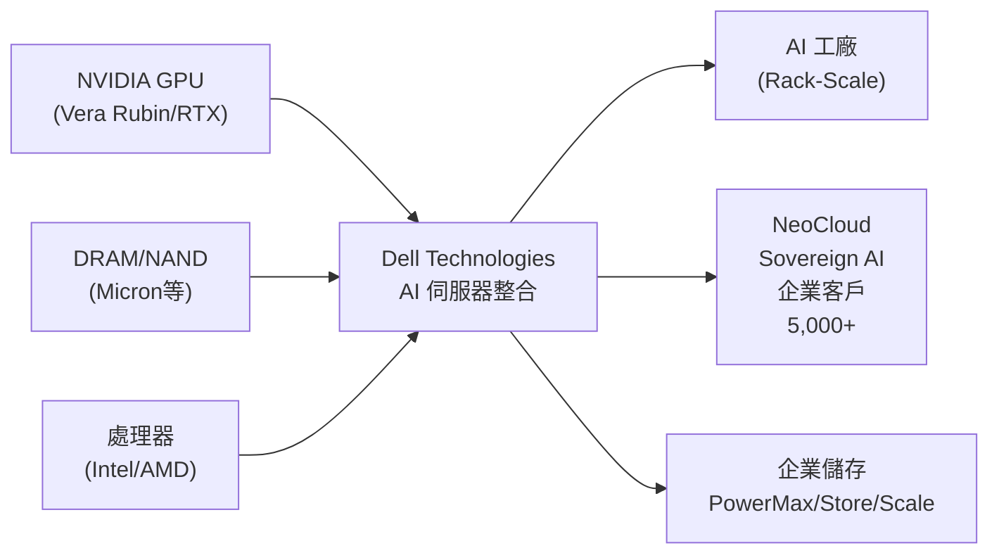

# DELL.US(dell)

## 基本資料

Dell Technologies（NYSE: DELL）是全球最大的 IT 基礎設施整合解決方案廠商，業務涵蓋 AI 伺服器組裝（ISG）、PC/工作站（CSG）、企業儲存及服務。在 AI 浪潮下，Dell 已從傳統 PC/企業 IT 廠轉型為 AI 基礎設施整合商，AI 伺服器（以 NVIDIA GPU 為核心）是最大成長引擎。

Dell FY27（Feb 2026–Jan 2027）Q1 創歷史紀錄：
- 總營收 USD 43.8B（YoY +88%），ISG（基礎設施解決方案群）USD 29.0B（YoY +181%）
- AI 伺服器季度認列營收 USD 16.1B；AI 訂單積壓創新高 USD 51.3B
- EPS USD 4.86（YoY +214%）

主要上游依賴：NVIDIA GPU（AI 伺服器核心）、DRAM/NAND（主要供應瓶頸，目前供應受限而非需求受限）、處理器（Intel/AMD）。AI 客戶超過 5,000 家，NeoCloud、Sovereign 及企業客戶廣泛成長。

資料來源：[[活動_Dell法說_20260528]]（FY27 Q1 法說，2026-05-28）

## 核心技術／競爭優勢

- **AI 伺服器整合規模**：Dell 具備從單一 GPU 系統到 AI 工廠（rack-scale）的完整整合能力，支援 NVIDIA Vera Rubin（GB300）、RTX GPU 系列、PowerRack 等全系列 AI 基礎設施
- **企業銷售網絡護城河**：直接企業客戶覆蓋廣，5,000+ AI 客戶中 NeoCloud/Sovereign/大型企業均有覆蓋；在波動市場中客戶因穩定性需求轉向 Dell，市佔率在所有主要區隔持續擴大
- **儲存業務 IP 差異化**：PowerMax、PowerStore、PowerScale、ObjectScale（PowerStore Elite 性能/密度提升 3 倍，資料縮減 6：1）連續多季雙位數成長，毛利率高於 AI 伺服器
- **財務紀律**：FY27 Q1 營業費用率降至 8.4%（20 年最低），即使 AI 伺服器年增近 800%，ISG 營業利潤率仍達 10.5%；AI 伺服器符合中個位數（mid-single digit）目標

## 產品與應用

| 產品 / 服務 | 應用 | 相關客戶 / 下游 |
|-------------|------|-----------------|
| AI 伺服器（PowerEdge AI、PowerRack）| AI 訓練/推論基礎設施 | NeoCloud、Sovereign AI、企業客戶、5,000+客戶 |
| 傳統伺服器（PowerEdge 18代）| 一般企業運算、虛擬化 | 企業、SMB |
| 企業儲存（PowerMax/PowerStore/PowerScale）| 儲存基礎設施 | 大型企業、CSP |
| AI 數據平台（ObjectScale、PowerFlex）| AI 資料管理 | 企業 AI 工作負載 |
| PC / 工作站（CSG）| 商用 PC、AI PC | 企業、消費者 |

## 圖片 / 架構圖

![[報告_GFHK_Dell_20260828_001.png]]

圖說：GF Securities 對 Dell 資本回報與自由現金流的預測；AI 伺服器擴張提高營收規模，但傳統企業／PC 需求與毛利率仍需同步追蹤（2026-08-28）。

> 自製 供應鏈及產品示意圖；來源：[[活動_Dell法說_20260528]]

## EPS 記錄

| 季度 | 總營收 | ISG 營收 | AI 伺服器營收 | EPS | 毛利率 | 備註 |
|------|--------|----------|--------------|-----|--------|------|
| FY27 Q1（2026-05）| USD 43.8B（+88%）| USD 29.0B（+181%）| **USD 16.1B** | **USD 4.86**（+214%）| 18.1% | AI 訂單積壓 USD 51.3B |

### FY27 展望（法說指引，2026-05-28）

| 期間 | 總營收 | ISG | CSG | EPS |
|------|--------|-----|-----|-----|
| FY27 Q2（指引）| USD 44–45B（中點 +50%）| +75% YoY | +20% YoY | — |
| FY27 全年（上調指引）| USD 165–169B（中點 +50%）| +80% YoY | 低雙位數 | 上調 USD 5 |

- ISG：傳統伺服器 +60%+，儲存 +中個位數
- FY27 Q1 現金流：營運現金流 USD 4.1B（季度紀錄）

## EPS 預估

| 年度 | 摩根士丹利 EPS（報告日：2026-06-23）| 市場共識 | MS vs 共識 |
|------|--------------------------------------|----------|------------|
| CY26 / FY27E | USD 20.73 | USD 17.95 | +15.5% |
| CY27 / FY28E | USD 23.83 | USD 21.57 | +10.5% |

## 目標價與評等

| 券商 | 報告發布日 | 評等 | 目標價 | 評價基礎 | 來源 |
|------|------------|------|--------|----------|------|
| 摩根士丹利 | 2026-06-23 | Equal-weight | USD 477 | 20x FY28E EPS $23.83 | 報告_MS_IT硬體企業伺服器_20260623 |

## 時間軸

| 時間 | 事件 | 類型 | 重要性 | 備註 |
|------|------|------|--------|------|
| 2026-05-28 | FY27 Q1 法說；創紀錄財報 + 全年指引大幅上調 | 財報 | ⭐⭐⭐ | 全年指引 +USD 270億 |
| 2026-06-23 | MS 上調 DELL PT $448→$477；AI 伺服器 FY27 預估升至 $91B | 評等 | ⭐⭐ | MS 維持 EW；傳統伺服器 Q2 +92% Y/Y |
| 2026 全年 | DRAM/NAND 持續供應限制，AI 訂單積壓持續創高 | 供需 | ⭐⭐⭐ | 供應受限非需求受限 |
| 2026 年底 | 預期 AI 訂單積壓仍顯著 | 展望 | ⭐⭐⭐ | |
| 持續 | AI 客戶數從 5,000 持續增長（過去 6 個月 +50%）| 業務 | ⭐⭐ | NeoCloud/Sovereign/企業 |

## 供應鏈位置

- **上游關鍵依賴**：
  - [[NVDA.US(nvidia)]]（AI GPU，最核心供應商）
  - [[MU.US(micron)]]（DRAM/NAND，目前最大瓶頸）
  - 半導體處理器（先進節點已全數分配，交期長達一年）
- **下游客戶**：NeoCloud、Sovereign AI（各國政府主導）、大型企業（所有區域雙位數成長）
- [[供應鏈_AI伺服器散熱]]：AI 伺服器組裝需大量散熱解決方案

## 相關公司

| 公司 | 關係 | 說明 |
|------|------|------|
| [[NVDA.US(nvidia)]] | 關鍵上游 | AI GPU 主要供應商；Vera Rubin / RTX |
| [[MU.US(micron)]] | 上游 / 瓶頸 | DRAM/NAND 最大供應瓶頸；SCA 客戶 |

> [!warning] 風險與注意事項
> - **供應鏈依賴**：DRAM/NAND 為最大限制因素，若 Micron/三星/SK Hynix 供應緊張持續（或反轉），Dell AI 伺服器出貨節奏直接受影響
> - **地緣政治 / 通膨**：法說明確表示指引未含貿易/地緣政治發展；通膨推升幾乎所有原材料（DRAM、NAND、CPU）價格，Dell 每日調整定價因應，但持續通膨環境可能壓縮毛利
> - **AI 需求週期**：目前需求由 AI capex、提前拉貨、舊設備換新多重因素疊加；若 CSP 資本支出計劃收縮，AI 訂單積壓消化可能快於預期，成長斜率下滑
> - **市佔率維持難度**：Dell 在 AI 伺服器市佔率擴大，但競爭者（HP Enterprise、超微等）持續跟進；長期市佔率能否維持尚待觀察

## 來源

- [[活動_Dell法說_20260528]]（FY27 Q1 法說，2026-05-28；Jeff Clarke CEO / David Kennedy CFO）
- 報告_MS_IT硬體企業伺服器_20260623（MS IT Hardware 企業伺服器需求報告，2026-06-23）
- [[報告_GFHK_Dell_20260828]]（GF Securities，2026-08-28；Neocloud AI 伺服器需求、Rubin 競爭、FY27/FY28E EPS 與目標價）

## GF Securities 2026-08-28 更新

- 維持 **Hold**、目標價 **US$428**，以 FY28E EPS 18 倍估值；FY27E／FY28E EPS 上修 11%／6% 至 US$22.0／23.8，均屬券商 estimate。
- Tier-2 Neocloud（IREN、NScale、Crusoe）AI 伺服器部署，以及 Oracle／SpaceX 的 Vera CPU 機架，支撐 Dell AI backlog；券商預估 FY27／FY28 NVL72 出貨 17k／20k。
- 風險轉向：企業與 PC 需求在 1H26 提前拉貨後出現放緩，記憶體供應亦限制傳統業務；GFHK 另判斷鴻海取得 SpaceX 多千套訂單，Dell 在 Rubin 週期的領先地位可能被侵蝕，仍屬券商 supply-chain check。

### 相關公司補充（GF Securities，2026-08-28）

| 公司 | 關係 | 說明 |
|------|------|------|
| [[2317_鴻海（市）]] | AI 伺服器競爭者 | GFHK 認為鴻海可能取得 SpaceX 多千套 Rubin 相關訂單，Dell 份額需驗證 |
| [[ORCL.US(oracle)]] | 下游客戶 | Vera CPU 機架出貨對象之一，來源為券商整理 |

## 相關頁面

- [[分析_2026-08_AI網通與硬體報告更新]]
- [[時程_2026記憶體與AI催化劑]]
- [[SNX.US(td_synnex)]]
