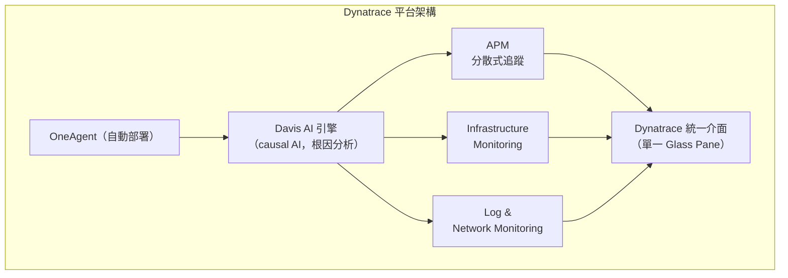

# DT.US(dynatrace)

## 基本資料

Dynatrace 是全球領先的企業級 AI 驅動可觀測性（AIOps / Observability）與應用效能監控（APM）平台，總部位於美國麻薩諸塞州 Waltham。最初於 2005 年在澳洲成立（Dynatrace Software），2011 年由 Compuware 收購，2014 年由私募基金 Thoma Bravo 買下整個 Compuware，2019 年 7 月 Dynatrace 業務從 Thoma Bravo 分拆重新獨立上市（NYSE：DT）。

**定位**：與 [[DDOG.US(datadog)]] 同屬可觀測性市場的兩大主力，但 Dynatrace 深耕大型傳統企業（Fortune Global 15,000），強調高度自動化的 Davis AI 引擎，而非廣度平台化。

**截至 2020 年（最新可取得財務數據）：**

| 指標 | 數值 | 時間點 |
|------|------|--------|
| FY2020 Q4 Revenue | $150.6M（YoY +29.6%） | 2020 |
| Non-GAAP 毛利率 | ~83% | 2020 |
| ARR | $573M（YoY +42%） | FY2020 Q4 |
| 總客戶數 | 2,373（YoY +74%） | FY2020 Q4 |
| DBNRR | 連續 8 季 ≥120%（FY21 預估 ~115%） | 2020 |
| 市場 Gartner 排名 | 「領導者」（與 New Relic 同列） | 2020 |

> [!warning] 財務資料警告
> 本頁財務數字來自 2020 年原始資料（[[memo_DDOG_NEWR_SPLK_DT_不誤正業R原文_20200720]]），為歷史基準參考；Dynatrace 目前實際規模顯著更大，需補充更新資料。

**資料來源：**
- [[memo_DDOG_NEWR_SPLK_DT_不誤正業R原文_20200720]] — 不誤正業R（Rlinco），2020-07-20
- [[memo_DDOG_NEWR_SPLK_DT_四強比較_不誤正業R_20220101]] — 不誤正業R 整理，2022 年觀察

---

## 核心技術／競爭優勢

1. **Davis AI 引擎（根因自動化分析）**：Dynatrace 的核心差異在於 Davis AI 不只提供「可能根因建議」，而是能給出精確的問題根源並自動建議解決方式。相比 Datadog 的機器學習（ML），Davis 更強調「確定性根因（causal AI）」，適合複雜的大型企業環境中快速定位問題。

2. **OneAgent 自動部署**：Dynatrace 的 OneAgent 技術讓客戶安裝後能自動探索環境中的所有服務與依賴，自動化程度高，對於大型、複雜的企業 IT 環境（混合雲、on-prem、傳統架構並存）特別適合，大幅降低導入與維運成本。

3. **大型企業黏著度**：目標客群為全球前 15,000 大企業，客單價高，DBNRR 連續多季維持 120%+。典型大型客戶（Kroger、Daimler、Samsung、Carnival 等）顯示 Dynatrace 在高複雜性企業環境的落地能力。

4. **完整 Observability 三柱**：APM、Infrastructure monitoring（含 Log / Network monitoring），與 Datadog 產品廣度相近，但整合方式更偏向「單一自動化引擎」而非「模組化交叉銷售」。

5. **高毛利率 SaaS 模型**：Non-GAAP 毛利率達 83%，訂閱/服務占總收入 98%，商業模式高度可預測。

---

## 產品與應用

| 產品 / 服務 | 應用場景 | 目標客戶 |
|-------------|----------|---------|
| APM（Application Performance Monitoring） | 程式碼層級追蹤、服務依賴、瓶頸定位；Davis AI 精確根因 | 金融、電商、製造等大型企業 DevOps/SRE 團隊 |
| Infrastructure Monitoring（含 Log/Network） | 伺服器、容器、網路設備健康監控；含 Log monitoring + Network monitoring | 混合雲 / 傳統 IT 環境的大型企業 |
| Davis AI / AIOps | 自動問題偵測、根因分析、修復建議；從「事後告警」升級為「事前預防」 | 需要高自動化、低人力介入的大型 IT 團隊 |

**定價（2020 年公開資訊）：**
- Full Package（APM + Infrastructure monitoring）：~$69/月
- Infrastructure-only：~$21/月

---

## 圖片 / 架構圖

*Dynatrace 架構圖：OneAgent 自動探索環境，所有遙測資料匯入 Davis AI 引擎進行根因分析，統一在單一介面呈現。（待補官方來源圖）*

---

## 時間軸 / 關鍵催化劑

| 時間 | 事件 | 類型 | 備註 |
|------|------|------|------|
| 2005 | Dynatrace Software 成立（澳洲） | 公司歷史 | |
| 2011 | Compuware 收購 | 併購 | |
| 2014 | Thoma Bravo 收購 Compuware | 私募 | |
| 2019-07 | NYSE 重新上市（DT） | IPO | Thoma Bravo 分拆，Thoma Bravo 持大部分股權 |
| 2020-07 | 4 大可觀測性競品比較（不誤正業R 文章） | 市場分析 | Gartner 將 DT 評為「領導者」 |
| 2023 | NEWR 私有化，SPLK 被 Cisco 收購 | 競爭格局 | 可觀測性市場主要獨立上市廠商剩 DDOG + DT |
| 2024 以後 | 與 DDOG 的對比更集中（市場僅剩兩強獨立上市） | 競爭格局 | 詳見 [[分析_DDOG_Observability投資thesis]] |
| 2025-07 | Gartner Critical Capabilities：SRE / AI Engineering 兩情境均第一（4.30 / 4.29，小幅領先 DDOG） | 第三方評比 | [[Critical_Capabilitie_822673_ndx\|Gartner CC 2025-07-08]] |
| 2025-10 | Gartner MQ DEM 列 **Leader**（Completeness of Vision 全場最右） | 第三方評比 | 強項：config-as-code（Monaco CLI）、多層 PII 遮罩、Davis AI/CoPilot 白話洞察；弱項：IPM 基礎、STM 無 IdP 聯邦、新手上手門檻。[[Magic_Quadrant_for_D_823799_ndx\|Gartner MQ DEM 2025-10-27]] |

---

## 供應鏈位置

- **Dynatrace 是純 SaaS 平台供應商**，無硬體或製造環節
- 所屬產業：企業 IT 可觀測性 / AIOps
- 主要受惠於：企業數位轉型、雲端採用、大型企業 DevOps 成熟化
- 所屬市場：[[技術_可觀測性]]（與 DDOG 同市場）

---

## 相關公司

| 公司 | 關係 | 說明 |
|------|------|------|
| [[DDOG.US(datadog)]] | 主要競爭對手（可觀測性） | DDOG 定位雲原生中大型企業，DT 定位傳統大型企業；共同瓜分可觀測性市場 |
| New Relic（未建頁） | 歷史競爭對手（已私有化） | 2023 年被私有化，已退出公開市場 |
| Splunk（未建頁） | 歷史競爭對手（已被 Cisco 收購） | 2024 年 3 月被 Cisco 完成收購 |
| Grafana（未建頁） | 競爭對手（開源 + 商業） | 開放架構，主打成本可控，部分客戶選擇 |

> [!warning] 風險與注意事項
> - **成長天花板**：大型傳統企業市場滲透率增加後，新增客戶成長可能趨緩（2020 年管理層已預示 DBNRR 從 120%+ 降至 115%）
> - **DDOG 競爭壓力**：Datadog 的平台廣度與快速產品創新對 Dynatrace 傳統企業客戶形成滲透壓力
> - **財務資料過時**：本頁主要財務數字來自 2020 年，需補充 2022 年後更新資料才能做當前投資判斷
> - **Thoma Bravo 持股**：私募股東持有大量股份，存在拋售壓力

---

## 來源

- [[memo_DDOG_NEWR_SPLK_DT_不誤正業R原文_20200720]] — 不誤正業R，2020-07-20，Rlinco
- [[memo_DDOG_NEWR_SPLK_DT_四強比較_不誤正業R_20220101]] — 不誤正業R 整理（2022 版），2022
