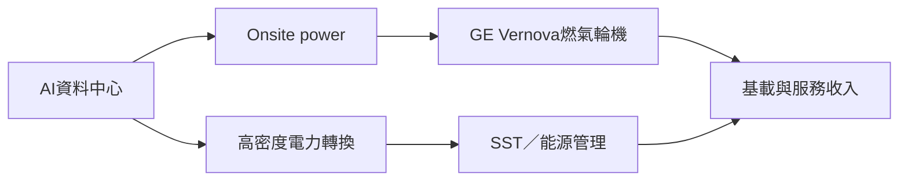

# GEV.US(ge_vernova)

## 基本資料

GE Vernova（GEV）涵蓋燃氣渦輪、發電設備與 Electrification。AI 資料中心供電瓶頸使其同時受惠於 onsite power、長週期燃氣輪機需求，以及電力轉換、固態變壓器與能源管理方案。

## 產品與供應鏈位置

| 產品 | 應用 | 投資觀察 |
|---|---|---|
| 航改型／工業級燃氣輪機 | onsite power、過渡供電 | 快速部署但交期與熱端零件受限 |
| H 級 CCGT | 大型資料中心長期基載 | 2028–2030 北美需求缺口仍可能支撐 backlog |
| SST／電氣化方案 | 中壓 AC 至 800VDC | 永豐投顧整理：2026-09 開始測試，商業化約 6 個月後，仍屬待驗證 |

## 圖片 / 架構圖

## 券商觀點與財務

- 永豐投顧 2026-08-23 給予買進、目標價 US$1,200；2028E EBITDA US$14.1bn、margin 22.4%，屬研究部 estimate，信心：中。
- 研究資料指出燃氣輪機產能約由 2025 年 52GW 增至 2028 年 90GW，但交付到實際運轉約需 18–24 個月；容量與 backlog 不等同已認列營收。

## 時間軸

| 時間 | 事件 | 類型 | 重要性 |
|---|---|---|---|
| 2026–2028 | 燃氣輪機產能與北美資料中心訂單擴張 | 放量 | ⭐⭐⭐ |
| 2026-09 | SST 測試窗口（估計） | 驗證 | ⭐⭐ |
| 2028–2030 | 北美 CCGT 供需缺口與長週期交付 | 產能 | ⭐⭐⭐ |

## 風險與注意事項

1. AI 資料中心資本支出放緩或電網併網加速。
2. 熱端葉片、高溫鑄件、大型鍛件與熟練人力限制擴產。
3. SST 商業化時程仍待客戶測試與正式訂單驗證。

## 來源

- [[Sinopac_電力設備]]（永豐投顧，2026-08-23）

## 相關頁面

- [[分析_AI資料中心供電與電熱整合]]
- [[時程_2026能源與AI電力設備]]
