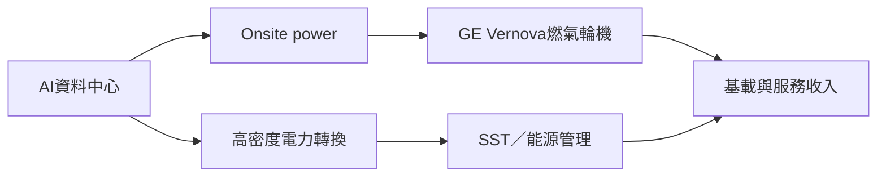

# GEV.US(ge_vernova)

## 基本資料

GE Vernova（GEV）涵蓋燃氣渦輪、發電設備與 Electrification。AI 資料中心供電瓶頸使其同時受惠於 onsite power、長週期燃氣輪機需求，以及電力轉換、固態變壓器與能源管理方案。

## 產品與供應鏈位置

| 產品 | 應用 | 投資觀察 |
|---|---|---|
| 航改型／工業級燃氣輪機 | onsite power、過渡供電 | 快速部署但交期與熱端零件受限 |
| H 級 CCGT | 大型資料中心長期基載 | 2028–2030 北美需求缺口仍可能支撐 backlog |
| SST／電氣化方案 | 中壓 AC 至 800VDC | 永豐投顧整理：2026-09 開始測試，商業化約 6 個月後，仍屬待驗證 |

## 圖片 / 架構圖

```mermaid
flowchart LR
  A[AI資料中心] --> B[Onsite power]
  B --> C[GE Vernova燃氣輪機]
  A --> D[高密度電力轉換]
  D --> E[SST／能源管理]
  C --> F[基載與服務收入]
  E --> F
```

## 券商觀點與財務

- 永豐投顧 2026-08-23 給予買進、目標價 US$1,200；2028E EBITDA US$14.1bn、margin 22.4%，屬研究部 estimate，信心：中。
- 研究資料指出燃氣輪機產能約由 2025 年 52GW 增至 2028 年 90GW，但交付到實際運轉約需 18–24 個月；容量與 backlog 不等同已認列營收。

## 時間軸

| 時間 | 事件 | 類型 | 重要性 |
|---|---|---|---|
| 2026–2028 | 燃氣輪機產能與北美資料中心訂單擴張 | 放量 | ⭐⭐⭐ |
| 2026-09 | SST 測試窗口（估計） | 驗證 | ⭐⭐ |
| 2028–2030 | 北美 CCGT 供需缺口與長週期交付 | 產能 | ⭐⭐⭐ |

## 風險與注意事項

1. AI 資料中心資本支出放緩或電網併網加速。
2. 熱端葉片、高溫鑄件、大型鍛件與熟練人力限制擴產。
3. SST 商業化時程仍待客戶測試與正式訂單驗證。

## 2026-08-29 現場供電替代方案觀察

[[BE.US(bloom_energy)]] 的 SOFC 與 GEV 渦輪在部分資料中心現場供電需求形成替代關係；此為客戶採購比較，非直接合作。

匿名專家稱部分大型渦輪採購需 3–4 年，另有許可／建置時間；SOFC 仍須天然氣、排放、建築及消防程序。設備交期與許可時間不能混用。SOFC 可有時間價值，渦輪則需比較全成本、負載調度與供應改善。此為 2026-08-29 estimate／中低信心，非 GEV 官方交期。

來源：[[memo_AceCamp_AI資料中心現場供電_20260829_70565950]]、[[memo_AceCamp_SOFC電堆製程與供應鏈_20260829_70566304]]；效率、啟動與生命週期成本差異見 [[分析_20260828-29專家紀要公司辨識與供給瓶頸]]。紀要對渦輪反應時間有不一致描述，不納入確定技術規格。

## 來源

- [[memo_AceCamp_SOFC電堆製程與供應鏈_20260829_70566304]] — AceCamp Tech，2026-08-29，匿名專家紀要。
- [[memo_AceCamp_AI資料中心現場供電_20260829_70565950]] — AceCamp Tech，2026-08-29，匿名專家紀要。

- [[Sinopac_電力設備]]（永豐投顧，2026-08-23）

## 相關頁面

- [[時程_2026Q3Q4_AI網通與硬體催化劑]]
- [[分析_AI資料中心供電與電熱整合]]
- [[時程_2026能源與AI電力設備]]
