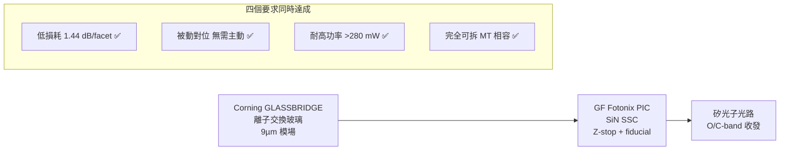

# GFS.US(globalfoundries)

## 基本資料

GlobalFoundries（GF）是全球第三大晶圓代工廠，以特殊製程（RF、汽車、SiPh）見長。**GF Fotonix** 是 GF 的 300mm 矽光子平台，在 CPO 可拆卸連接器領域取得重要突破——2026 年 ECTC 76th 與 Corning 合作，首次同時達成「低損耗 × 被動對位 × 耐高功率 × 可拆」四個可拆光 I/O 要求。

資料來源：[[research_simpletechtrend_CPO矽光子ECTC2026_20260629]]（2026-06-29）

## 核心技術／競爭優勢

### GF Fotonix × Corning GLASSBRIDGE 可拆連接器（ECTC 2026）

GF 與 Corning 合作把 GLASSBRIDGE 離子交換玻璃連接器整合到 Fotonix 300mm 矽光子 PIC：

| 指標 | 值 |
|------|----|
| TE 插入損耗 | **1.44 dB/facet** |
| TM 插入損耗 | 1.75 dB/facet |
| PDL | ~0.3 dB（預期真正光 I/O <0.1 dB）|
| 功率承受 | **>280 mW** |
| 對位方式 | 純被動（Z-stop + 微影 fiducial）|
| 可拆性 | MT 相容、可重工 |

**為何同時達成四個要求的關鍵**：
- **SiN SSC**（氮化矽斑點尺寸轉換器）同時解決「9 µm 模場匹配」與「高功率非線性吸收抑制」——純矽邊緣耦合在 >280 mW 下有非線性吸收，SiN 沒有
- **對位全靠晶片製程結構**：Z-stop 定垂直、微影 fiducial 定 X-Y，組裝時不需要主動光學回授

### GF Fotonix 平台特色

- 300mm 單片矽光子，支援 O-band 與 C-band
- V-groove 微影蝕刻（與 SSC 共製）
- 含機械 Z-stop 定義連接器放置高度

## 圖片 / 架構圖

`[待補來源圖]` 需官方 ECTC 2026 投影片或 GF Fotonix × Corning GLASSBRIDGE 論文截圖佐證；上方為自製技術合作示意圖。
## 產品與應用

| 產品 / 服務 | 應用 | 相關客戶 / 下游 |
|-------------|------|-----------------|
| GF Fotonix 矽光子代工 | CPO、光模組 PIC 代工 | Coherent、其他 PIC 設計廠 |
| 可拆光 I/O 方案 | CPO 可維修光連接器 | 系統整合商 |
| RF / 特殊製程 | 汽車、工業 | — |

## 供應鏈位置

- 合作夥伴：[[GLW.US(corning)]]（GLASSBRIDGE 玻璃連接器）
- 競爭對手：[[2330_台積電（市）]]（COUPE 平台）、Tower Semiconductor
- 所屬供應鏈：[[技術_矽光子（SiPh）]]

## 相關公司

| 公司 | 關係 | 說明 |
|------|------|------|
| [[GLW.US(corning)]] | 技術合作夥伴 | GLASSBRIDGE 連接器，CPO 可拆光 I/O |
| [[COHR.US(coherent)]] | 客戶 | Coherent 使用 GF Fotonix 代工 PIC |
| [[2330_台積電（市）]] | 競爭對手 | COUPE 平台 |

## 來源

- [[research_simpletechtrend_CPO矽光子ECTC2026_20260629]]（GF×Corning 可拆連接器 ECTC 2026，2026-06-29）

## 相關頁面

- [[分析_CPO_NPO_XPO與409.6T光互連轉折]]
- [[TSEM.US(tower semiconductor)]]
- [[INTC.US(intel)]]
- [[技術_玻璃基板]]
