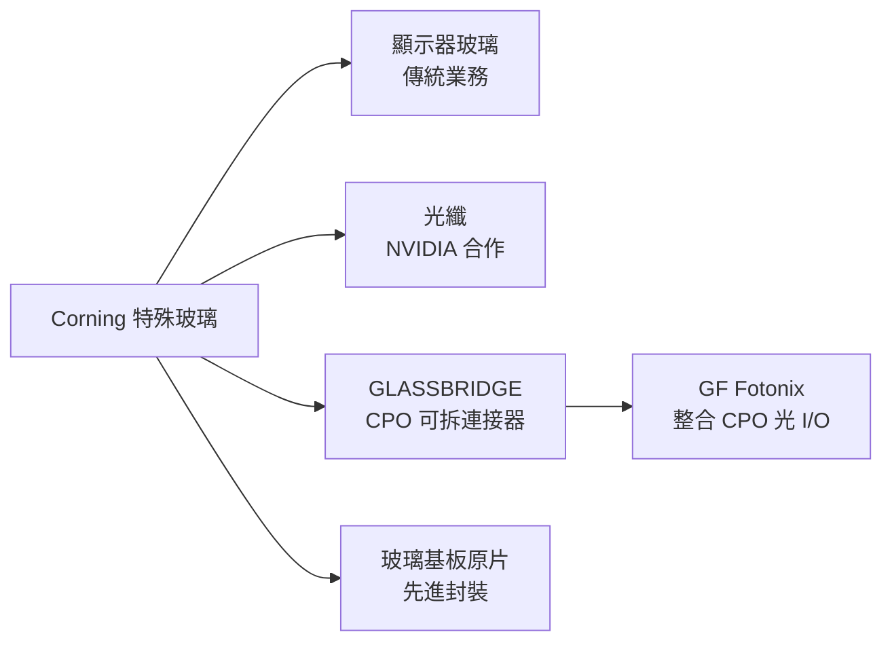

# GLW.US(corning)

## 基本資料

Corning（康寧，NYSE: GLW）是全球最大的特殊玻璃製造商，業務涵蓋光纖、玻璃基板（顯示器、先進封裝）、特殊玻璃等。在 AI 時代，Corning 的策略是把玻璃應用從顯示器擴展到光互連基礎設施：

1. **光纖**：NVIDIA×Corning 戰略合作（2026-05-06），光纖取代銅纜，「光進銅退」方向確認
2. **CPO 可拆光連接器**：GLASSBRIDGE 離子交換玻璃連接器，與 GF Fotonix 合作，ECTC 2026 首次同時達成四個 CPO 可拆光 I/O 要求
3. **玻璃基板原片**：先進封裝（Intel 3DGS、TSMC CoPoS）的核心原材料之一

資料來源：[[research_simpletechtrend_CPO矽光子ECTC2026_20260629]]（2026-06-29）；[[技術_玻璃基板]]

## 核心技術／競爭優勢

### GLASSBRIDGE 可拆光連接器（ECTC 2026）

Corning 的 GLASSBRIDGE 是離子交換（ion-exchange）製程製造的玻璃波導連接器，配合 GF Fotonix 的 SiN SSC 做 CPO 可拆光 I/O：
- 離子交換玻璃：9 µm 模場，匹配 SiN SSC
- MT 相容 ferrule，相容 solder reflow 條件
- 可多次拆裝（可重工）
- 整合後插入損耗：TE 1.44 dB/facet、TM 1.75 dB/facet
- 耐功率：>280 mW（靠 SiN SSC 抑制 Si 非線性吸收）

詳見 [[GFS.US(globalfoundries)]]

### 光纖業務（NVIDIA 戰略合作）

- 2026-05-06 NVIDIA×Corning 宣布戰略合作
- Corning 是高芯數多模光纖的全球領導廠商
- AI 叢集光纖佈線大幅增加（光纖取代銅纜）

## 圖片 / 架構圖

`[待補來源圖]` 需官方年報業務組合圖或 GLASSBRIDGE 產品截圖佐證；上方為自製業務結構示意圖。
## 產品與應用

| 產品 / 服務 | 應用 | 相關客戶 / 下游 |
|-------------|------|-----------------|
| GLASSBRIDGE 連接器 | CPO 可拆光 I/O | [[GFS.US(globalfoundries)]] Fotonix PIC |
| 光纖 | AI 叢集光纖佈線 | [[NVDA.US(nvidia)]] + 雲端大廠 |
| 保偏光纖（PMF）| 外置 ELS 至 CPO／NPO 光引擎的偏振維持光路 | 匿名專家列 Corning 與長飛為主要玩家；需以公司揭露驗證 |
| 玻璃基板原片 | 先進封裝 | [[INTC.US(intel)]] 3DGS、[[2330_台積電（市）]] CoPoS |
| 顯示器玻璃 | 電視 / 行動裝置面板 | 三星、LG、BOE |

## 供應鏈位置

- 技術合作：[[GFS.US(globalfoundries)]]（GLASSBRIDGE + Fotonix）
- 戰略合作：[[NVDA.US(nvidia)]]（光纖）
- 玻璃基板原片客戶：[[INTC.US(intel)]]、[[2330_台積電（市）]]

## 相關公司

| 公司 | 關係 | 說明 |
|------|------|------|
| [[GFS.US(globalfoundries)]] | 技術合作 | GLASSBRIDGE + Fotonix CPO 連接器 |
| [[NVDA.US(nvidia)]] | 戰略合作 | 光纖供應，光進銅退 |
| [[INTC.US(intel)]] | 玻璃客戶 | 3DGS 玻璃基板 |

## 相關技術

- [[技術_玻璃基板]]（Corning 是先進封裝玻璃原片主要供應商之一）
- [[技術_矽光子（SiPh）]]（GLASSBRIDGE 連接矽光子 PIC 與光纖）
- [[分析_CPO_NPO_XPO與409.6T光互連轉折]]（內／外置光源、PMF 與 FAU 價值量分流）

## 來源

- [[research_simpletechtrend_CPO矽光子ECTC2026_20260629]]（GF×Corning ECTC 2026，2026-06-29）
- [[技術_光互連]]（NVIDIA×Corning 戰略合作 2026-05-06）
- [[技術_玻璃基板]]（玻璃基板原片供應）
- [[memo_EML_InP_CW_ELS_NPO_CPO專家觀點_日期不詳]]（匿名專家將 Corning 列為保偏光纖主要玩家；日期不詳，2026-08-30 收錄，信心低）
