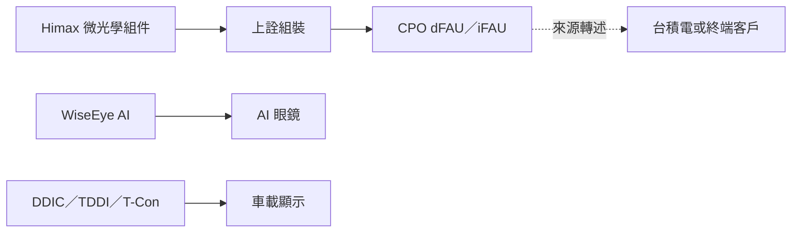

# HIMX.US(himax)

## 基本資料

奇景光電（Himax，NASDAQ: HIMX）為無晶圓廠半導體公司，產品涵蓋顯示驅動 IC、觸控與時序控制 IC，以及非驅動類產品。[[memo_KGI_HimaxCallMemo_20260916]] 指車用顯示 IC 為現階段主要現金流，並將 CPO 微光學與智慧眼鏡列為 2027 年後的成長選項；所有客戶、份額與時程均為券商 memo 轉述。

## 核心技術／競爭優勢

- **車用 DDIC／TDDI／T-Con**：來源稱車用產品在 3Q26 季增雙位數，為近期成長主軸。
- **CPO 微光學整組**：提供 Lens／Prism／玻璃 V-groove／Base，支援 Gen1、Gen2（6.4T）並啟動 Gen3 study；不拆售單一元件。
- **低功耗 WiseEye AI**：用於無顯示 AI 眼鏡，在前端辨識後僅傳輸結構化資料，應用價值與客戶採用仍待驗證。
- **LCoS AR 顯示**：針對含顯示 AR 眼鏡，量產時程被來源推估為 2028–2029 年。

## 產品與應用

| 產品／服務 | 應用 | 相關客戶／下游 |
|---|---|---|
| DDIC／TDDI／T-Con | 車載顯示系統 | 車廠與 Tier-1；來源未具名 |
| CPO 微光學組件 | dFAU／iFAU、CPO 光耦合 | [[3363_上詮（櫃）]] 組裝；後續客戶與流程待查證 |
| WiseEye AI | 無顯示 AI 眼鏡 | 北美客戶；未具名 |
| LCoS 模組 | AR 眼鏡 | 國際品牌；未具名 |

## 圖片 / 架構圖

> CPO 的組裝與下游流程為 KGI Call Memo 轉述，未見公司公告佐證；不可視為已確認的台積電供應資格。來源：[[memo_KGI_HimaxCallMemo_20260916]]。

## 時間軸（催化劑）

| 時間 | 事件 | 類型 | 重要性 | 備註 |
|---|---|---|---|---|
| 3Q26 | 車用 DDIC／TDDI／T-Con 預期雙位數季增 | 營運 | ⭐⭐⭐ | 券商轉述，待財報驗證 |
| 2027 | 無顯示 AI 眼鏡預期開始導入北美客戶 | 新產品／驗證 | ⭐⭐ | 公司時程，客戶與出貨未公開 |
| 2027 | Non-Driver 營收占比目標約 30% | 產品組合 | ⭐⭐ | 目標非財測 |
| 2028–2029（預估） | LCoS AR 眼鏡可能量產 | 技術下線 | ⭐⭐ | 券商推估，仍受產品與生態成熟度限制 |

## 供應鏈位置

- CPO 角色為微透鏡、稜鏡、玻璃 V-groove 與底座的整組光學元件供應，對應 [[技術_CPO]] 與 [[供應鏈_CPO]]。
- [[3363_上詮（櫃）]]：來源稱其負責組裝；[[2330_台積電（市）]] 或終端客戶為後段去向，均待公開資料驗證。

## 相關公司

| 公司 | 關係 | 說明 |
|---|---|---|
| [[3363_上詮（櫃）]] | CPO 組裝 | KGI memo 轉述由上詮組裝 Himax 的整組微光學元件 |
| [[2330_台積電（市）]] | 潛在後段去向 | KGI memo 提到後續交付「台積或終端客戶」，非已確認直接供應關係 |

## 風險與注意事項

> [!warning]
> - 車用市占、CPO 營收與 Non-Driver 占比均屬券商／公司口徑，需以財報及公開客戶資料驗證。
> - CPO Gen3、智慧眼鏡與 AR 量產時程長，研發進度不等同營收。
> - 來源未揭露 CPO 客戶、台積電供應資格、價格或驗收狀態。

## 來源

- [[memo_KGI_HimaxCallMemo_20260916]] — KGI，2026-09-16。
- [Himax 投資人關係頁](https://www.himax.com.tw/en/investors/) — NASDAQ: HIMX 掛牌資訊，2026-09-22 查閱。

## 相關頁面

- [[分析_Himax車用顯示_CPO微光學與AI眼鏡_20260916]]
- [[時程_2026Q3Q4_AI網通與硬體催化劑]]
