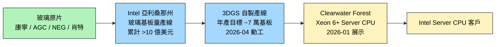

# INTC.US(intel)

> [!note] 本頁範圍說明
> 本頁僅就本次 ingest 涵蓋的主題 — **玻璃基板（3DGS / Clearwater Forest 路線）** — 記錄 Intel 的角色。其他主題（CPU 路線圖、晶圓代工服務 Intel Foundry、財務、Tower 併購等）等之後 ingest 對應主題的來源時再補。

## 基本資料
Intel（英特爾），全球 CPU 大廠，本次主題的關鍵角色是**玻璃基板領域第一個量產推動者**。在 ABF 載板 → 玻璃基板的世代交替敘事中，Intel 是路線最激進的一方：自製垂直整合、亞利桑那州量產線實體已動工，且首款搭載玻璃核心基板的 Server CPU 已展示。

主要資料來源：[[報告_其他_玻璃基板_20260511]]（國金證券，2026-05-11）。

## 核心技術／競爭優勢（本次範圍）

- **亞利桑那州玻璃基板量產線**：累計投入超過 10 億美元建設研發量產線（claim 類型 fact，信心中；來源僅引述未附文件編號）
- **首款玻璃基板 Server CPU 已展示**：2026 年 1 月展示搭載玻璃核心基板的 Xeon 6+ **"Clearwater Forest"** 處理器
- **3DGS 自有量產線動工**：2026 年 4 月，Intel 支持的 3DGS（3D Glass Substrate）計畫正式動工，目標**年產約 7 萬個**玻璃基板
- **時程窗口**：2026-2030 規劃大規模商用（claim 類型 thesis，信心中）
- **路線差異**：相對於 [[AAPL.US(apple)]] 走三星電機供應、[[2330_台積電（市）]] 走 CoPoS 對外服務，Intel 路線是**自製垂直整合**

## 產品與應用（本次範圍）

| 產品 / 服務 | 應用 | 相關客戶 / 下游 |
|-------------|------|-----------------|
| Xeon 6+ "Clearwater Forest" | Server CPU，首款搭載玻璃核心基板 | 自家 Server CPU 客戶 |
| 3DGS 玻璃基板自製產線 | 自家先進封裝載體 | 自家 CPU / AI 加速器產品 |

## 圖片 / 架構圖

`[待補來源圖]` 需官方 3DGS 技術白皮書或 Clearwater Forest 展示截圖佐證；上方為自製玻璃基板供應鏈示意圖。
## EPS 記錄
> 本次來源未涉及 Intel EPS 數據。後續 ingest 對應主題時補。

| 季度 | EPS (USD) | YoY | 備註 |
|------|-----------|-----|------|
| — | — | — | 本次來源未揭露 |

## EPS 預估
（本次來源未涉及）

## 目標價與評等
（本次來源未涉及）

## 時間軸（本次範圍）

| 時間 | 事件 | 類型 | 重要性 | 備註 |
|------|------|------|--------|------|
| 累計至 2026-05 | 亞利桑那州玻璃基板累計投入 >10 億美元 | 資本支出 | ⭐⭐⭐ | 玻璃基板實體投入規模最大者 |
| 2026-01 | 展示 Clearwater Forest（首款玻璃核心基板 Server CPU）| 產品里程碑 | ⭐⭐⭐ | 玻璃基板首個產品級展示 |
| 2026-04 | 3DGS 自製產線動工，目標年產 ~7 萬基板 | 產能里程碑 | ⭐⭐⭐ | 玻璃基板量產首條實體線 |
| 2026-2030 | 大規模商用窗口 | 商用節奏 | ⭐⭐ | 窗口較寬，實際 SKU 出貨節奏待觀察 |

## 供應鏈位置
- **上游玻璃原片**：康寧（Corning，美）、AGC（旭硝子，日）、NEG（電氣硝子，日）、肖特（Schott，德）等國際巨頭
- **核心製程**：自製（亞利桑那州 3DGS 量產線）
- **下游**：自家 Server CPU 產品線（Xeon 6+ 起）
- **所屬供應鏈**：[[供應鏈_先進封裝載板]]
- **路線同儕**：[[2330_台積電（市）]]（CoPoS）、[[AAPL.US(apple)]]（透過三星電機）

## 相關公司

| 公司 | 關係 | 說明 |
|------|------|------|
| [[2330_台積電（市）]] | 玻璃基板路線同儕 / 競爭 | TSMC 走 CoPoS 對外服務，Intel 走自製垂直整合 |
| [[AAPL.US(apple)]] | 玻璃基板路線同儕 | Apple 走三星電機 T-glass，Intel 自製 |
| [[AMKR.US(amkor)]] | 先進封裝服務同儕 | Amkor 接 TSMC CoWoS 外溢，Intel 走垂直整合 |
| [[3037_欣興（市）]] | 替代關係 | Intel 玻璃基板若成功量產 → 中期壓縮 ABF 載板需求 |
| [[8046_南電（市）]] | 替代關係 | 同上 |

> [!warning] 風險與注意事項（本次範圍）
> - **量產時點窗口寬**：2026-2030 是 5 年窗口，實際商用 SKU 出貨節奏未明（claim 類型 thesis、信心中）
> - **自製垂直整合的經濟性**：Intel 玻璃基板自製是否能在成本上勝過 ABF 載板外購尚未證實
> - **產能規模**：年產 ~7 萬基板對應的 CPU 出貨量級需釐清，相對於 TSMC CoWoS 月產 11.5-14 萬片載板量級
> - **資料來源限制**：本份報告為國金證券（中國研究機構）整理，部分 Intel 細節是二手引述，原始公司公告應另查 Intel 投資人關係與工程白皮書

## V-groove 玻璃耦合器（ECTC 2026）

ECTC 2026 Intel 發表 V-groove 矽光子 → 光纖被動對準玻璃耦合器：

| 指標 | 值 |
|------|----|
| 熱循環可靠度 | 450 TC（−40 → +125°C），插入損耗 <0.7 dB |
| 對準方式 | 完全被動（V-groove + 玻璃 fiducial）|
| 製程鎖定 | 玻璃製程，與 3DGS 玻璃基板同平台 |

Intel V-groove 路線與 [[GFS.US(globalfoundries)]] × [[GLW.US(corning)]] GLASSBRIDGE 路線並列為 2026 ECTC 主要玻璃光互連解法，詳見 [[技術_玻璃基板]]。

## 晶圓代工與 CPU 策略更新（Morgan Stanley Bus Tour，2026-06-15）

CEO Lip-Bu Tan 接任後的核心重點：

**14A 製程里程碑（晶圓廠關鍵節點）**：
- 2026-06 現況：缺陷密度 0.5 / yield ~40%
- 目標：2027 Q1 前達 0.1–0.2 缺陷密度
- 14A 0.5 PDK 已發布；0.9 PDK 預計 2026 年 10 月
- Risk production：2028；Volume：2029（與 TSMC 時程相當）
- Intel 自家產品將全數移至 14A；2027 年起內部測試晶片先跑，建立外部客戶量產前的實戰基礎

**EMIB（嵌入式多晶片互連橋接）**：被 Lip-Bu 形容為「秘密武器」——技術強，個別客戶機會可達數十億美元，但複雜度與可靠度問題仍需克服（自動化、可靠度驗證）。MS Asia 查核 EMIB 反應略為複雜，部分勝利還未完全確定。

**CPU 策略**：
- 重新加回 SMT 與 P-core / E-core 架構
- 聘 Alex Katouzian 提升低功耗競爭力（深化 ARM 相關能力）
- 若 Intel 執行得宜，管理層認為 9 個月內可停止對 AMD 的份額流失
- Agentic AI 可能帶動 CPU 需求，CPU:GPU 比例在某些場景達 4:1

**晶圓廠產能擴張**：Oregon、Arizona 仍有空間擴充；Ohio 加速推進；Germany 廠已關閉。Memory 短缺是 Intel 及其夥伴的關注點。

> MS 評語：「我們錯過了英特爾股票的這波上漲，主要是對路線圖的疑慮；我們認為市場預期份額對 AMD 的回升過於樂觀——AMD 的 Venice 仍具更多晶圓採購能力。短期來看，先進製程與 CPU 短缺提供正面盈餘環境。」

## 來源
- [[報告_其他_玻璃基板_20260511]]（國金證券「玻璃基板行業深度」，2026-05-11；分析師李陽 S1130524120003）
- [[research_simpletechtrend_CPO矽光子ECTC2026_20260629]]（V-groove 玻璃耦合器 ECTC 2026；450 TC IL <0.7dB 被動對準，2026-06-29）
- [[Semiconductors 260615 MS public company bus tour ALAB MRVL INTC]]（MS bus tour，2026-06-15）

## 相關頁面

- [[2303_聯電（市）]]
- [[技術_ABF載板]]
- [[技術_玻璃基板]]
- [[NVDA.US(nvidia)]]
