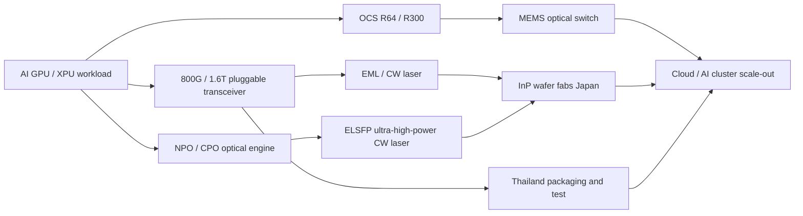

# LITE.US(lumentum)

> **資料更新：2026-08-27｜最新財報：FY26 Q4（截至 2026-06-27）**。FY26 10-K 截至本頁更新日尚待公司向 SEC 提交；全年數字以 2026-08-11 財報新聞稿／8-K 為主，風險與歷史揭露以 FY26 Q3 10-Q 及 FY25 10-K 補充。

## Quick Guide

Lumentum 是以 **InP（Indium Phosphide，磷化銦）雷射與光子元件**為核心的光通訊公司，向資料中心、電信網路與工業／感測客戶供應把電訊號變成光、再把光導回電所需的雷射、光模組、光交換器與子系統。公司已由低迷的傳統電信週期，轉入 AI 資料中心帶動的高速光互連週期。

FY26 Q4 營收 **$1,006.3m，QoQ +24.5%、YoY +109.3%**；Components $649.4m（64.5%）與 Systems $356.9m（35.5%）均創高。非 GAAP gross margin 50.4%、operating margin 36.6%、EPS $3.23。Q1 FY27 指引為營收 $1.225–1.275bn、非 GAAP operating margin 39.5–40.5%、EPS $4.05–4.35。

目前最重要的 5 條主線：

- **800G → 1.6T cloud transceiver**：FY26 Q4 800G 出貨創高，1.6T 已開始出貨，管理層預期 FY27 Q1 起加速並延續至 calendar 2027。
- **EML／CW／pump laser**：100G／200G per lane InP 雷射是元件收入與毛利改善的基礎；pump laser 仍近乎售罄，管理層預期未來數季出貨量約增四倍。
- **OCS（Optical Circuit Switching）**：MEMS 光交換器由電交換網路中取代部分 spine／switch fabric，FY27 Q1 預期首次達到三位數百萬美元單季營收，FY26H2 目標為 $400m+。
- **NPO／CPO／ELS**：NPO 是較快落地的近封裝路徑，CPO 是長期終局；公司已取得首張 ELS module 訂單，交付在 calendar 2027H2，但 NPO 尚未正式公告大單。
- **營運槓桿與產能**：FY26 non-GAAP operating margin 29.8%，Q4 達 36.6%；日本 InP wafer fabs、Rose Orchard 與泰國製造擴產支撐需求，但 substrate／供應鏈與執行是瓶頸。

主要風險是 AI 光互連需求與客戶庫存週期、價格／mix 對毛利的敏感度、NPO／CPO 時程延誤、中國 InP 供應商崛起、以及 FY26 債券換股造成 GAAP 大額一次性損失後的資本結構與估值波動。

## 基本資料與公司究竟替客戶解決什麼問題

資料中心的 GPU／XPU 之間需要大量、高速且低延遲的連線；銅線在更高 SerDes 速度與較長距離下，會受到損耗、功耗與訊號完整性限制。Lumentum 提供的元件與系統，讓客戶能在不同距離與架構下以光傳輸，降低每 bit 功耗或提高可用頻寬。

公司的產品分成兩層：**Components**（EML、CW、pump、narrow-linewidth tunable laser、放大器與 wavelength management）與 **Systems**（800G／1.6T datacom transceiver、OCS、電信／資料中心子系統）。Components 是技術與製程基礎；Systems 能把元件能力轉成較高的單筆內容價值，但也承擔更多整機、良率、認證與專案執行風險。

FY26 年營收 $3.014bn（YoY +83.2%），Components $2.006bn（YoY +79.7%），Systems $1.008bn（YoY +90.7%）。收入仍是 hardware／component shipment，並非 SaaS；長期供應協議、客戶認證、共同設計與部分 take-or-pay 安排則提高需求可見度。

## 產品與應用

| 產品／服務 | 白話解釋與技術 | 主要應用／客戶類型 | 經濟意義 |
|---|---|---|---|
| InP EML | DFB 雷射與 EAM 調變器單片整合；適合 100G／200G per lane | 800G、1.6T datacom、telecom | 已變現的高階元件主線；2026-12 季 EML unit YoY 目標 >50% |
| CW DFB laser | 連續輸出穩定光功率，搭配 silicon photonics 光引擎 | 800G／1.6T、NPO／CPO | 嚴格規格與良率支持 premium pricing |
| Ultra-high-power laser／ELSFP | 以板邊高功率 CW laser 供應附近 optical engine | CPO scale-out／scale-up、NPO | 尚在導入期、ASP 高；首張 ELS 訂單 2027H2 交付 |
| Pump laser | 為光纖放大器提供泵浦光源 | DCI、metro、long-haul、submarine | 既有高市占與長期關係；Q4 YoY +80%，未來數季目標約四倍出貨 |
| Narrow-linewidth laser | 窄頻寬可調雷射，讓長距離相干網路穩定 | Telecom、DCI、ZR／ZR+ | FY26 Q4 已連續第 10 季 QoQ 增長 |
| 800G／1.6T transceiver | 在交換器電訊號與光纖訊號間轉換的可插拔模組 | AI cluster scale-out、rack-to-rack | Systems 最大成長引擎；1.6T ASP 較高 |
| OCS R64／R300 | MEMS mirror 建立任意節點光路，減少 O-E-O processing | GPU cluster、DCI、spine replacement | FY27 Q1 首次 triple-digit million revenue quarter |
| ROADM／WSS／amplifier | 管理長途光纖不同波長的 add/drop、切換與放大 | Carrier、cloud backbone、submarine | 傳統電信基礎，提供 installed base |
| Industrial laser／sensing | 超快／UV 雷射用於 PCB 鑽孔；VCSEL 用於 3D sensing | AI XPU PCB、消費電子／感測 | 非目前估值主軸，提供產品週期選擇權 |

官方產品組合可概括為「雷射與光元件 → 可插拔模組 → 光交換／網路系統」；產品頁列出 EML 200G、ELSFP-350、1.6T 2×DR4 TRO 與 R300 OCS。[[技術_InP磷化銦]]、[[技術_CPO]]、[[技術_光互連]]

## 圖片 / 架構圖

> 圖說：Lumentum 以 InP 雷射與 MEMS 光交換為核心，向上延伸到 datacom transceiver、OCS 與 NPO／CPO／ELS 系統；圖依官方產品分類與 FY26 Q4 法說重整。

## Revenue Breakdown

| 類別 | FY26 Q4 營收 | 占比 | QoQ | YoY | 業務解讀 |
|---|---:|---:|---:|---:|---|
| Components | $649.4m | 64.5% | +21.8% | +102.7% | 雷射、pump、narrow-linewidth；800G／AI 與長距離連線驅動 |
| Systems | $356.9m | 35.5% | +29.7% | +122.6% | cloud transceiver 與 OCS；1.6T 初始出貨、OCS 內製擴產 |
| Total | $1,006.3m | 100.0% | +24.5% | +109.3% | FY26 Q4 高於指引上緣 |

| 類別 | FY26 | FY25 | YoY | 占 FY26 |
|---|---:|---:|---:|---:|
| Components | $2,005.6m | $1,116.3m | +79.7% | 66.6% |
| Systems | $1,008.4m | $528.7m | +90.7% | 33.4% |
| Total revenue | $3,014.0m | $1,645.0m | +83.2% | 100.0% |

FY26 Q4 non-GAAP gross margin 50.4%，較 Q3 +250bps、較 FY25 Q4 +1,260bps，管理層歸因於製造利用率、產品 mix 與部分產品加價。1.6T ASP 較高，OCS 收入增長更快，但 ELS module 毛利低於純雷射晶片，未來可能出現收入增加而毛利率稀釋的取捨。

## 財務結構、EPS 與資本配置

| 期間 | Revenue | Non-GAAP EPS | Non-GAAP GM | Non-GAAP OM | 備註 |
|---|---:|---:|---:|---:|---|
| FY26 Q4 | $1,006.3m | $3.23 | 50.4% | 36.6% | 800G 創高、1.6T 初始出貨、OCS 增長 |
| FY26 Q3 | $808.4m | $2.37 | 47.9% | 32.2% | 公司正式財報 |
| FY26 全年 | $3,014.0m | $8.67 | 46.0% | 29.8% | Revenue YoY +83.2% |
| FY25 全年 | $1,645.0m | $2.06 | 34.7% | 9.7% | 低基期復甦 |

FY26 GAAP net loss $6.9bn 不代表本業同幅度惡化：Q4 債券換股使公司減少約 $1.1bn、約 35% convertible debt，但產生 $7.8bn 一次性、非現金 debt extinguishment loss；FY26 Q4 GAAP net loss 為 $7.2bn。Q4 cash／短期投資約 $2.74bn，CapEx $167m，inventory $691.6m（QoQ +$59m）。

公司與客戶簽訂多個約三年的安排，部分具 take-or-pay 特性，可協助抵銷 Rose Orchard 擴產 CapEx，但不等同於所有需求均無風險。

## Guidance 與券商估計

| 期間／指標 | 公司正式展望 | 性質 |
|---|---:|---|
| FY27 Q1 revenue | $1.225–1.275bn，midpoint $1.25bn | Company guidance，2026-08-11 |
| FY27 Q1 non-GAAP OM | 39.5–40.5% | Company guidance |
| FY27 Q1 non-GAAP EPS | $4.05–4.35 | Company guidance，diluted shares 約 102m |
| EML unit growth | 2026-12 季 YoY >50% | Management target |
| OCS revenue | FY26H2 $400m+；FY27 Q1 首次三位數百萬美元單季 | Management target |
| Ultra-high-power laser | 2026 年底約 $50m；FY27 Q3 首個三位數百萬美元季度 | Management target |
| Greensboro | 2028 年初開始出貨，2028–29 爬坡 | Management target |

| 券商／日期 | 評等／目標價 | 主要假設與解讀 |
|---|---|---|
| Wolfe Research，2025-07-07 | Outperform／$120 | 16x CY26 EPS；AI traffic、InP、Western vendor consolidation、cloud transceiver 與 OCS 帶來 25%+ 成長；當時模型已被 FY26 Q4 實際結果大幅超越。[[Lumentum H-2025-07-07-LITE.OQ-Wolfe Research-Structural Winner_ Initiate at Outperform-116406363]] |
| Morgan Stanley，2026-08-12 | Equal-weight／$1,000 | 上調毛利、EML mix／pricing／yield；2027E EPS $21.10、2028E EPS $34.64；下一個估值催化劑是 NPO 正式合約／規模。[[ms_LITE_20260812]] |
| 元大，2026-07-23 | 未評等 | 產業模型估 800G+ 模組 2026／2027 約 5,500 萬／1.05 億個、NPO／CPO port 2028 約 1,000 萬；非公司指引。[[報告_元大_光通訊產業_20260723]] |

估值核心爭議已從「能否復甦」轉向「高毛利能否維持、NPO／CPO 能否在預期時間變成收入」。不同日期的目標價不可直接比較，需同時檢視報告時點、股價、EPS 與 multiple。

## Long-Term Thesis

1. **AI bandwidth → 高速光互連 → Components／Systems 同時增長**：FY26 Q4 已由 800G、1.6T、narrow-linewidth 與 OCS 共同推動；若 AI cluster 持續擴大，volume、mix、utilization 會傳導至 EPS。這是已有財務數據的 thesis。
2. **InP 雷射規格升級 → premium pricing 與門檻提高**：100G → 200G／300G per lane 需要更高效率、窄規格與可靠度；若客戶因 yield 願付 premium，可在中國供應商增加時維持毛利。已具 traction，但需追蹤 ASP／yield。
3. **Transceiver → NPO → CPO → optical TAM 擴大**：NPO 把 optical engine 放到 XPU 附近，CPO 再往 substrate／interposer 整合；Lumentum 可由賣模組延伸到 mid-power／high-power laser 與 ELS。部分已驗證，部分仍是選擇權。
4. **OCS → AI 網路 fabric 位置**：R64／R300 以 MEMS 建立低延遲、低功耗光路；若成為跨機櫃 scale-out 的 merchant supplier，Systems ASP、客戶黏著與內容價值會提高。FY27 Q1 是首個重要驗證點。
5. **長約與垂直整合 → CapEx 更可承受**：日本 InP fabs、Rose Orchard、泰國封裝與 Greensboro 形成供應鏈控制；若 take-or-pay 長約持續，可降低擴產閒置風險，但也會把需求錯估的資本負擔前移。

## 競爭與護城河

**雷射／光元件**：與 [[COHR.US(coherent)]]、Sumitomo、Furukawa、Broadcom 自供及中國 InP 廠商競爭。Lumentum 的相對優勢是內部 InP wafer、EML／CW／pump laser 垂直整合、資料中心認證與大規模製造；弱點是光元件仍有價格下行與週期性，中國廠商若完成量產，premium 可能收窄。

**Cloud transceiver**：與 Coherent、Broadcom、Sumitomo、模組商及 hyperscaler 內製競爭。Lumentum 優勢在 EML／CW 元件、Signal Integrity 與 1.6T 設計協同；弱點是客戶集中、認證延誤與多來源策略。Wolfe 2025-07 指出當時已供貨 Google、Meta、Microsoft，但各客戶尚未達完整 volume potential；FY26 Q4 1.6T 出貨是從認證進入量產的驗證點。

**OCS**：與 OCS startup、客戶內製及電交換 fabric 競爭。公司擁有 R64／R300、MEMS、SONiC-based control、gNMI 與量產紀錄；護城河在大 port-count 可靠度、軟體／系統整合、現場驗證與製造，而非單一元件。替代風險包括電交換效能改善、客戶內製與 PIC-based switch。

護城河不是 network effect；客戶在認證後仍可導入第二供應商。技術領先要持續跑在 200G／300G per lane 速度與良率前面，且 OCS／ELS 高 ASP 不必然等於高毛利。

## Recent Drivers / Key Debates

### 1. 800G／1.6T 是否已進入可持續量產曲線？

偏多證據是 FY26 Q4 800G 出貨創高、1.6T 開始出貨，管理層預期 FY27 Q1 起加速至 calendar 2027；保守點是特定零件仍緊張，cloud transceiver 受認證與庫存管理影響。追蹤 1.6T revenue／unit、客戶數與第二來源、ASP／yield、inventory days、Systems 毛利率。

### 2. OCS 能否成為大型長期業務？

偏多證據是 Q3 至 Q4 出貨翻倍、FY27 Q1 首次 triple-digit revenue、FY26H2 $400m+ 目標與 R64／R300 擴產；保守點是早期 supply-chain 問題、一位大客戶仍有內製版本。追蹤季度 OCS revenue、port count mix、gross margin、內製／外購比例與 FY27 order visibility。

### 3. NPO／CPO／ELS 何時真正貢獻？

偏多證據是 lead CPO 客戶計畫在軌、首張 ELS 訂單 2027H2 交付、多個 NPO engagements；保守點是 NPO 尚無正式公告合約，管理層把新 XPU／SerDes 導入放在 2027H2–2028，且產業研究已下修部分 CPO 時程。追蹤正式客戶公告、high-power laser run-rate、2027H2 出貨與 Greensboro 2028 revenue。

### 4. 50% 以上毛利是否可持續？

偏多證據是 Q4 non-GAAP GM 50.4%，pricing、mix、yield、utilization 仍有改善空間；保守點是毛利高度依賴 mix，ELS 毛利低於純雷射，供給恢復或競爭擴產可能壓價。追蹤各產品 mix、ASP、yield、GAAP／non-GAAP GM 與 inventory。

### 5. 產能擴張會不會先於需求？

日本兩座 InP fabs、Rose Orchard、泰國封裝與 Greensboro 都在擴充；三年、部分 take-or-pay 長約可降低閒置風險，但需求向量變化很快，錯估會使固定成本與 inventory 反噬 FCF。追蹤 CapEx、substrate／wafer 供應、利用率、存貨與長約覆蓋度。

## 時間軸

| 時間 | 事件 | 類型 | 重要性 | 狀態／備註 |
|---|---|---|---|---|
| 2026-08-11 | FY26 Q4／全年財報 | 財報 | ⭐⭐⭐ | Revenue $1.006bn、non-GAAP GM 50.4% |
| 2026-09 季 | FY27 Q1 revenue $1.225–1.275bn | 財報／驗證 | ⭐⭐⭐ | 驗證 1.6T、OCS triple-digit、毛利率 |
| 2026-12 季 | EML unit YoY >50% | 放量 | ⭐⭐⭐ | 公司目標；觀察 CW mix 對毛利 |
| 2026H2 | OCS revenue $400m+ | 放量 | ⭐⭐⭐ | 公司目標；目前按計畫追蹤 |
| 2027H2 | 首張 ELS module 交付、超高功率雷射放量前段 | 出貨 | ⭐⭐⭐ | 管理層展望，非已實現收入 |
| 2028 初 | Greensboro 首批 InP revenue | 技術下線／放量 | ⭐⭐ | GaAs → InP 轉換，2028–29 爬坡 |
| 2027–28 | NPO／CPO 新 XPU／rack 世代導入 | 規格升級 | ⭐⭐⭐ | NPO 略早於 lead CPO，正式合約待公告 |

→ 跨公司節點詳見 [[時程_2026記憶體與AI催化劑]]；技術背景詳見 [[技術_CPO]] 與 [[技術_InP磷化銦]]。

## 供應鏈位置

- **上游**：InP substrate、MOCVD／MBE 與 wafer process；[[3105_穩懋（櫃）]]為相關 InP／GaAs foundry 生態，Lumentum 另以日本內部 wafer fabs 與 AXTI 等夥伴補足 substrate。
- **製造**：日本 InP wafer fabs、Rose Orchard wafer capacity、泰國 transceiver packaging／test，及 Greensboro 既有 fab 轉 InP。
- **下游**：[[NVDA.US(nvidia)]] 的 CPO／ELS 與 AI networking、hyperscaler 的 800G／1.6T cloud transceiver、Google／Meta／Microsoft 等 cloud customers，以及 telecom NEM／carrier。
- **供應鏈主題**：[[供應鏈_CPO]]、[[供應鏈_AI光互聯]]、[[技術_光互連]]。

## 相關公司

| 公司 | 關係 | 說明 |
|---|---|---|
| [[NVDA.US(nvidia)]] | 客戶／策略合作 | CPO／ELS、AI cluster optical scale-up；ECTC 2026 DWDM CW-DFB 論文合作 |
| [[AVGO.US(broadcom)]] | 同業／替代 | switching／optical 生態與 CW laser 能力 |
| [[COHR.US(coherent)]] | 直接競爭 | Western optical components、EML／CW／transceiver；NPO／CPO 第二供應候選 |
| [[MTSI.US(macom)]] | 產業夥伴／競爭生態 | 光通訊 EIC／高速互連生態，與 Lumentum 互補或競爭 |
| [[3105_穩懋（櫃）]] | 上游／foundry 生態 | InP／GaAs wafer foundry |
| [[3450_聯鈞（市）]] | 下游／封裝 | CoS／光電封裝供應鏈，連結國際光元件廠 |

> [!warning] 風險與注意事項
> - **需求／庫存週期**：AI 資本支出強勁不代表 Lumentum 每季線性成長；客戶可能提前拉貨後修正。
> - **毛利 mix 風險**：Q4 50.4% non-GAAP GM 受 pricing、yield 與高價元件 mix 支撐；ELS／OCS／transceiver mix 可能讓 revenue 與 margin 方向不同。
> - **NPO／CPO 時程風險**：NPO 尚無正式大單；CPO／scale-up 高量仍是 2027H2–2028 展望，不能以 TAM 代替收入。
> - **供應與執行風險**：InP substrate、wafer、封裝與客戶認證任一環節不足都可能限制出貨；Q4 已披露部分供應緊張。
> - **競爭與客戶集中**：Coherent、Broadcom、Sumitomo 與中國 InP 廠可能壓價；hyperscaler 具有多來源與部分內製能力。
> - **會計／資本結構**：FY26 GAAP 大額淨損主要來自債券換股的一次性非現金損失；需分開看 GAAP、non-GAAP、diluted shares、debt 與 FCF。

## What Matters Most

Lumentum 的投資核心已由「傳統電信復甦」切換為「AI 把光從機櫃外帶進機櫃」。短期基本面由 800G／1.6T transceiver、EML／CW／pump laser 與 OCS 驅動，FY26 Q4 已證明 revenue 與 margin 的 operating leverage；中長期則是 NPO／CPO／ELS 提高每個 AI rack 的 optical content。最重要的判斷不是 AI 會不會需要光，而是 Lumentum 能否把需求轉成可持續的 1.6T／OCS 出貨、維持約 50% 毛利、取得 NPO／ELS 正式合約，並在 2027–28 產能擴張時避免供過於求。

未來幾季優先追蹤：FY27 Q1 revenue／EPS 是否落在指引、1.6T 量與 yield、OCS 是否超過 triple-digit、EML unit growth、pump laser 長約與出貨、NPO／ELS 客戶公告、毛利 mix、inventory／CapEx／FCF，以及 Greensboro 轉換進度。

## 來源

- [Lumentum FY26 Q4／全年正式財報新聞稿](https://investor.lumentum.com/financial-news-releases/news-details/2026/Lumentum-Announces-Fourth-Quarter-and-Full-Fiscal-Year-2026-Results/default.aspx)（2026-08-11；公司正式數字與 FY27 Q1 guidance）
- [SEC Form 8-K，Lumentum FY26 Q4](https://www.sec.gov/Archives/edgar/data/1633978/000162828026055726/lite-20260811.htm)（2026-08-11；監管文件）
- [Lumentum Q4 FY26 Earnings Call Transcript](https://www.fool.com/earnings/call-transcripts/2026/08/18/lumentum-lite-q4-2026-earnings-call-transcript/)（2026-08-18；第三方逐字稿，Q&A 以公司 webcast／SEC 為準）
- [[ms_LITE_20260812]]（Morgan Stanley，2026-08-12；券商估計與目標價）
- [[Lumentum H-2025-07-07-LITE.OQ-Wolfe Research-Structural Winner_ Initiate at Outperform-116406363]]（Wolfe Research，2025-07-07；初始覆蓋）
- [[報告_元大_光通訊產業_20260723]]（元大，2026-07-23；市場與競品背景）
- [[2026-02-03-2455.TW-Yuanta Research-光通訊產業 - AI席捲未來 光收發模組負傳輸重任-120122560]]（元大，2026-02-03；800G／1.6T 與 InP 背景）
- [[202503光通訊簡報AmyCiou]]（2025-03；CW／EML／VCSEL 技術背景）
- [Lumentum 官方產品總覽](https://www.lumentum.com/en/products)（2026-08-27；產品架構）
- [Lumentum 官方 OCS 產品頁](https://www.lumentum.com/en/products/data-center/optical-circuit-switches)（2026-08-27；R64／R300、MEMS 與軟體功能）
- [Lumentum 官方 Datacom Transceivers](https://www.lumentum.com/en/products/data-center/datacom-transceivers)（2026-08-27；800G／1.6T、TRO 與 AI 應用）

## 相關頁面

- [[技術_InP磷化銦]]
---
## 基本資料

Lumentum 是光通訊與雷射元件大廠，在 CPO 浪潮中的關鍵角色是**外部雷射源（ELS）供應商**——CPO 系統需較高功率的 CW DFB 雷射（每顆約 350mW）。SemiAnalysis 預期 Lumentum 為 Nvidia 初期 CPO 交換器出貨的**首批主要（甚至唯一）ELS 供應商**。供應鏈位置：光元件/雷射上游，供 CPO 光引擎所需雷射光源。資料來源：SemiAnalysis CPO Book（2026-01-02）。

## 核心技術／競爭優勢

- **高功率 CW DFB 雷射**：CPO 用雷射雖被視為相對標準化，但高功率雷射仍有一定護城河；Nvidia CPO 交換器 ELS 首批主要供應商
- **OCS（Optical Coherent Solution）**：Lumentum 為 Google 最主要的 OCS 供應商，OCS 較傳統可插拔光模組**節省 65% 功耗**，是超大規模資料中心降耗關鍵
- **泰國廠高速產能**：泰國工廠已具備 800G 年產 300 萬支、1.6T 年產 200 萬支的製造能力
- **EML 定價話語權**：100G / 200G EML 雷射元件報價持續上揚，受益 AI DC 互連需求擴張
- 既有可插拔 transceiver / 雷射元件業務基礎，跨足 CPO ELS

## 產品與應用

| 產品 / 服務 | 應用 | 相關客戶 / 下游 |
|-------------|------|-----------------|
| CW DFB 雷射 / ELS 模組 | CPO 光引擎光源 | [[NVDA.US(nvidia)]]（Q3450 用 18 ELS 模組、每模組 8 CW DFB）；Nvidia CPO sole supplier 候選 |
| OCS（光相干連接方案）| 超大規模 DC 長距互連 | Google（主要供應商）；vs 傳統模組節省 65% 功耗 |
| EML（電致吸收調製雷射）| 800G / 1.6T 光模組雷射源 | Coherent、Broadcom 光模組廠；ASP 上行（100G/200G） |
| 可插拔光元件 / 雷射 | scale-out 光模組 | 模組廠 |

## 圖片/架構圖

`[待補來源圖]` 需官方 IR 泵浦雷射或光源產品圖佐證，現有研究筆記不足以支撐產品示意圖。

## 泰國廠產能（小作文 2026-01）

| 產品 | 年產能 | 備註 |
|------|--------|------|
| 800G 模組 | 300 萬支 / 年 | 已投產，爬坡中 |
| 1.6T 模組 | 200 萬支 / 年 | 高速產品線 |

## 目標價（小作文 2026-01）

| 來源 | TP | 備註 |
|------|----|------|
| 小作文研究（2026-01）| USD 472 | OCS + CPO ELS 雙引擎；EML ASP 上行 |

## 供應鏈位置

- 下游客戶：[[NVDA.US(nvidia)]]（CPO 交換器 ELS）、Google（OCS）
- 所屬供應鏈：[[供應鏈_CPO]]（外部雷射源環節）
- 同環節（未建頁）：Coherent（COHR，預期第二供應）、Furukawa、Broadcom 自供、源傑/仕佳（中）

## 相關公司

| 公司 | 關係 | 說明 |
|------|------|------|
| [[NVDA.US(nvidia)]] | 下游客戶 | CPO 交換器 ELS 首批主供；sole supplier 候選 |
| [[AVGO.US(broadcom)]] | 同業 / 自供競爭 | Broadcom 亦具 CW laser 能力 |

## 券商觀點與催化劑

> [!warning] 資訊衝突：Lumentum 定位（半年內翻轉）
> - [[報告_Semianalysis_CPO_20260102]]（報告日：2026-01-02）：Nvidia 初期 CPO ELS **首批主要/唯一供應商**（正面定位）。
> - [[報告_Semianalysis_CPOand800VDC_20260609]]（報告日：2026-06-09）：對 Lumentum **轉趨負面**——CPO 量在其多頭論述占比高，而 CPO 時程下修使近期缺乏催化劑；同列入「CPO 量為多頭論述重要部分」而轉保守的名單（與 Coherent、Himax、Applied Optoelectronics 同組）。
> - 狀態：ELS 供應地位（結構正面）與 CPO 放量延後（近期偏空）的拉鋸，兩說並存、依時程演進判讀。

## FY26 Q3 實際結果（Jan–Mar 2026）

| 項目 | 說明 |
|------|------|
| 財報結果 | **beat 共識** |
| 股價反應 | **-8%**（beat & drop 模式，與 COHR -9%、AAOI -13% 同時）|

> **光通訊三雄 beat & drop（規則 #14）**：COHR / LITE / AAOI 同期財報均 beat，但股價全數下跌（-9% / -8% / -13%），顯示市場擔憂 AI 光互連溢價已過度計入，獲利了結壓力大於基本面催化。

## ECTC 2026 技術合作（NVIDIA × Lumentum × TSMC COUPE）

ECTC 2026 論文：Lumentum 與 NVIDIA、[[2330_台積電（市）]] COUPE 平台合作，共同發表 **DWDM CW-DFB 雷射陣列**論文——驗證 COUPE 架構下外部雷射多波長整合的可行性，是 Lumentum 進入 CPO ELS 生態的技術公信力確認。

- ELSFP（External Laser SFP）：OCI 200G MSA 定義的外部雷射規格，Lumentum 為主要供應候選
- 詳見 [[技術_OCI]]（OCI ELSFP 規格）

## 來源

- [[報告_Semianalysis_CPO_20260102]]（CPO Book，2026-01-02）
- [[報告_Semianalysis_CPOand800VDC_20260609]]（2026-06-09）
- [[research_simpletechtrend_CPO矽光子ECTC2026_20260629]]（FY26 Q3 beat -8%；ECTC 2026 COUPE 論文合作；OCI ELSFP，2026-06-29）

## 相關頁面

- [[技術_光電芯片]]
- [[時程_2026記憶體與AI催化劑]]
- [[分析_CPO_NPO_XPO與409.6T光互連轉折]]
- [[MTSI.US(macom)]]
- [[TSEM.US(tower semiconductor)]]
- [[供應鏈_AI光互聯]]
- [[技術_InP磷化銦]]
- [[3105_穩懋（櫃）]]
- [[3450_聯鈞（市）]]
- [[AAOI.US(applied optoelectronics)]]
- [[CIEN.US(ciena)]]
- [[COHR.US(coherent)]]
- [[CRDO.US(credo)]]
- [[META.US(meta)]]
- [[技術_CPO]]
- [[技術_光互連]]
- [[技術_光模塊]]
- [[技術_光電芯片]]
- [[供應鏈_CPO]]
- [[供應鏈_AI光互聯]]
- [[時程_2026記憶體與AI催化劑]]
- [[分析_CPO_NPO_XPO與409.6T光互連轉折]]
- [[技術_矽光子（SiPh）]]

### 2026-08-12 更新

- Morgan Stanley 將目標價由 USD 900 上調至 USD 1,000，維持 Equal-weight；FQ2 毛利率受價格、產品組合與良率改善支撐，2027E／2028E EPS 為 USD 21.10／34.64，屬券商 estimate。[[ms_LITE_20260812]]
- 下一個催化劑仍是 NPO 合約、時程與毛利結構的更正式揭露；公司表示可能要再過數季，故 NPO 放量不可視為已確定事件。[[ms_LITE_20260812]]

### 2026-08-27 券商共識更新

| 券商／報告日 | 評等／目標價 | 主要新增觀點 | 信心 |
|---|---|---|---|
| Jefferies／2026-08-11 | Buy／USD 1,200 | EML 需求超過供給 30% 以上；1.6T 自 FY27 Q1 加速；OCS 2H26 目標 USD 400m 以上；NPO 為新增 TAM，超高功率雷射預計 2H27 出貨 | 中 |
| TD Cowen／2026-08-11 | Hold／USD 820 | 1.6T 長期可能更偏 CW／矽光子；日本產能支援 CW 出貨，但中國 InP 擴產與未來供過於求仍是週期風險 | 中 |
| Barclays／2026-08-12 | Overweight／USD 1,000 | NPO 客戶興趣比 CPO 更廣；CPO scale-up 仍以 2H27 出貨、2028 部署為基準；pump laser 未來數季出貨有機會 4 倍 | 中 |
| BNP Paribas／2026-08-12 | Outperform／USD 1,380 | 1.6T、OCS、CPO／NPO 多引擎並行；NPO 可採中功率 CW 或外部超高功率 CW；首張 ELS module 訂單預計 2H27 出貨 | 中 |
| JPMorgan／2026-08-12 | Overweight／USD 1,280 | NPO 可能於 2027 年底開始 scale-up；merchant CW、ELS、in-tray OCS 與 pump laser 是既有模型外的增量機會 | 中 |

> [!warning] 本批資訊邊界
> 各券商對 NPO／CPO 導入節奏與目標價差異很大；NPO 客戶評估、ELS 首張訂單、OCS 收入與 2H27 超高功率雷射出貨，均須持續以公司公告、客戶部署與實際營收驗證，不視為已確認大規模量產。

## 圖片 / 架構圖（2026-08-27 來源附件）

![[2026-08-11-LITE.OQ-Jefferies-Delivering on Multiple Growth Vectors, NPO a New Leg to Scal...-123789110_003.png]]
*圖：Jefferies 2026-08-11 報告的 Lumentum 營收與 EPS 更新頁，反映 1.6T、OCS、EML／CW 雷射及 NPO／CPO 時程對模型的共同影響。*

## 來源（2026-08-27 更新）

- [[2026-08-11-LITE.OQ-Jefferies-Delivering on Multiple Growth Vectors, NPO a New Leg to Scal...-123789110]]（Jefferies，2026-08-11）
- [[2026-08-11-LITE.OQ-TD Cowen-Continued Strong Execution, But Cycle Questions Linger-123788973]]（TD Cowen，2026-08-11）
- [[2026-08-12-LITE.OQ-Barclays-Lumentum Holdings Inc. Several Moving Pieces, All in Right ...-123789088]]（Barclays，2026-08-12）
- [[2026-08-12-LITE.OQ-BNP Paribas-LUMENTUM HOLDINGS (+)  Lighting The Way-123789795]]（BNP Paribas，2026-08-12）
- [[2026-08-12-LITE.OQ-JPMorgan-Lumentum F4Q26 Review Executing Ahead of Plan With Incremen...-123791452]]（JPMorgan，2026-08-12）
