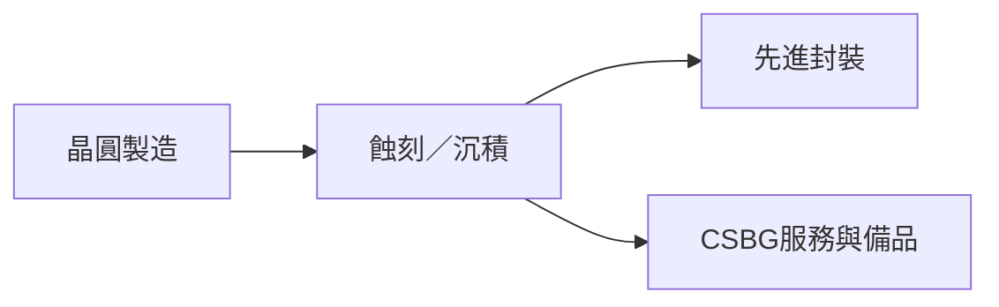

# LRCX.US(lam_research)

## 基本資料

Lam Research 是半導體製程設備商，覆蓋蝕刻、沉積與相關服務。中信投顧指出，公司 FY4Q26 財報與 FY1Q27 指引偏強，受 NAND、客戶支援業務及先進封裝設備需求帶動。

## 核心技術／競爭優勢

- 蝕刻與沉積設備服務先進邏輯、記憶體與先進封裝。
- CSBG 服務與備品業務受稼動率及先進封裝需求支持。
- 報告提及公司已交付 510×515mm² 面板系統，並規劃 310×310mm² 系統；為券商轉述。

## 產品與應用

| 產品／服務 | 應用 |
|---|---|
| 製程設備 | 邏輯、NAND、DRAM 製造 |
| 先進封裝設備 | 面板級與 2.5D 封裝製程 |
| CSBG | 設備服務與備品 |

## 圖片 / 架構圖

圖：Lam Research 的製程設備與服務橫跨晶圓廠和先進封裝資本支出。

## EPS 預估

| 年度 | 中信投顧 EPS（報告日：2026-07-30） |
|---|---:|
| FY2027E | US$9.25 |

## 目標價與評等

| 券商 | 報告日 | 評等 | 目標價 | 來源 |
|---|---|---|---:|---|
| 中信投顧 | 2026-07-30 | 買進（調升） | US$355 | [[報告_CTBC_LamResearch_20260730]] |

## 時間軸

| 時間 | 事件 | 類型 | 重要性 | 備註 |
|---|---|---|---|---|
| FY1Q27 | 營收指引 US$7.7–8.5bn | 公司指引 | ⭐⭐⭐ | 報告轉述 |
| 2026E | WFE 市場約 US$150bn | 市場預估 | ⭐⭐ | 公司／券商展望 |

## 供應鏈位置

- 所屬供應鏈：半導體資本支出與先進封裝設備。

## 相關公司

尚無本批可確認之公司級交易關係。

> [!warning] 風險與注意事項
> - 晶圓廠無塵室擴充與 WFE 資本支出可能低於預期。
> - 成熟製程、中國市場與車用／工控需求仍影響服務業務節奏。

## 來源

- [[報告_CTBC_LamResearch_20260730]]（2026-07-30）

## 相關頁面

- [[6829_千附精密（市）]]
