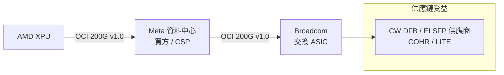

# META.US(meta)

## 基本資料

Meta Platforms 是 Facebook、Instagram、WhatsApp 的母公司，全球前五大雲端廠商之一（CSP）。在 AI 基礎建設戰略上，Meta 是 **OCI 200G MSA 的三家共同編輯之一**（買方角色），代表 CSP（資料中心買方）定義開放的 scale-up 光互連標準，與 Broadcom（交換/光）、AMD（XPU）結成對抗 NVIDIA 垂直整合的技術聯盟。

資料來源：[[research_simpletechtrend_CPO矽光子ECTC2026_20260629]]（2026-06-29）

## 核心技術 / 競爭優勢

### OCI 200G MSA 三巨頭共編（買方角色）

OCI 200G v1.0（2026-03-11）由 Meta（Amiralizadeh、Alduino、Peng）+ Broadcom + AMD 共同編輯。Meta 以 CSP 買方身份進入規範制定，等於把 scale-up 光互連需求「白紙黑字寫進規格」——供應鏈必須跟進。

詳見 [[技術_OCI]]

### 戰略意涵

- **買方（Meta）+ 交換/光（Broadcom）+ XPU（AMD）三角結盟**：需求端與供應端共同定義介面，推動開放 MSA 成為事實標準
- **外接雷射（ELSFP）強制化**：OCI 規範讓 CW DFB 雷射與 ELSFP 從「可選」變成「規格明確的供應環節」，直接拉動 Coherent、Lumentum 等供應商
- 對手：NVIDIA 的 NVLink 垂直整合路線

## 圖片 / 架構圖

`[待補來源圖]` 需官方 OCI 200G MSA 規格文件截圖或 Meta AI 基礎建設架構圖佐證；上方為自製三角聯盟示意圖。
## 供應鏈位置

- OCI 共編夥伴：[[AMD.US(amd)]]（XPU）、[[AVGO.US(broadcom)]]（交換/光）
- 光源供應鏈：[[COHR.US(coherent)]]、[[LITE.US(lumentum)]]（ELSFP 受益）
- 競爭對手（架構）：[[NVDA.US(nvidia)]] NVLink 垂直整合

## 相關公司

| 公司 | 關係 | 說明 |
|------|------|------|
| [[AVGO.US(broadcom)]] | OCI 共編夥伴 | 交換 ASIC + 光 IP |
| [[AMD.US(amd)]] | OCI 共編夥伴 | XPU |
| [[NVDA.US(nvidia)]] | 架構競爭對手 | NVLink 垂直整合 |
| [[COHR.US(coherent)]] | 光源供應商 | OCI ELSFP 規格受益 |
| [[LITE.US(lumentum)]] | 光源供應商 | OCI ELSFP 規格受益 |

## 來源

- [[research_simpletechtrend_CPO矽光子ECTC2026_20260629]]（OCI 200G MSA，2026-06-29）

## 相關頁面

- [[技術_CPO]]
- [[技術_光互連]]
