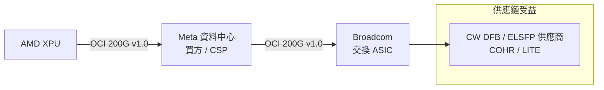

# META.US(meta)

## 基本資料

Meta Platforms 是 Facebook、Instagram、WhatsApp 的母公司，全球前五大雲端廠商之一（CSP）。在 AI 基礎建設戰略上，Meta 是 **OCI 200G MSA 的三家共同編輯之一**（買方角色），代表 CSP（資料中心買方）定義開放的 scale-up 光互連標準，與 Broadcom（交換/光）、AMD（XPU）結成對抗 NVIDIA 垂直整合的技術聯盟。

資料來源：[[research_simpletechtrend_CPO矽光子ECTC2026_20260629]]（2026-06-29）

## 核心技術／競爭優勢

### OCI 200G MSA 三巨頭共編（買方角色）

OCI 200G v1.0（2026-03-11）由 Meta（Amiralizadeh、Alduino、Peng）+ Broadcom + AMD 共同編輯。Meta 以 CSP 買方身份進入規範制定，等於把 scale-up 光互連需求「白紙黑字寫進規格」——供應鏈必須跟進。

詳見 [[技術_OCI]]

### 戰略意涵

- **買方（Meta）+ 交換/光（Broadcom）+ XPU（AMD）三角結盟**：需求端與供應端共同定義介面，推動開放 MSA 成為事實標準
- **外接雷射（ELSFP）強制化**：OCI 規範讓 CW DFB 雷射與 ELSFP 從「可選」變成「規格明確的供應環節」，直接拉動 Coherent、Lumentum 等供應商
- 對手：NVIDIA 的 NVLink 垂直整合路線

## 圖片 / 架構圖

`[待補來源圖]` 需官方 OCI 200G MSA 規格文件截圖或 Meta AI 基礎建設架構圖佐證；上方為自製三角聯盟示意圖。

![[meta-msl-1yr_original_007.png]]
*Meta Hyperion（路易斯安那）數據中心衛星圖：400MW 單棟 ×3 + 100MW ×3，世界最大規模在建數據中心之一。（SemiAnalysis Datacenter Model, 2026-07-09）*

![[meta-msl-1yr_original_002.png]]
*SemiAnalysis Tokenomics Model：Meta AI 算力預測（2026-07-09）——2026 年底 Meta AI 算力將超越 OpenAI + Anthropic 總和。*

## 供應鏈位置

- OCI 共編夥伴：[[AMD.US(amd)]]（XPU）、[[AVGO.US(broadcom)]]（交換/光）
- 光源供應鏈：[[COHR.US(coherent)]]、[[LITE.US(lumentum)]]（ELSFP 受益）
- 競爭對手（架構）：[[NVDA.US(nvidia)]] NVLink 垂直整合

## 相關公司

| 公司 | 關係 | 說明 |
|------|------|------|
| [[AVGO.US(broadcom)]] | OCI 共編夥伴 | 交換 ASIC + 光 IP |
| [[AMD.US(amd)]] | OCI 共編夥伴 | XPU |
| [[NVDA.US(nvidia)]] | 架構競爭對手 | NVLink 垂直整合 |
| [[COHR.US(coherent)]] | 光源供應商 | OCI ELSFP 規格受益 |
| [[LITE.US(lumentum)]] | 光源供應商 | OCI ELSFP 規格受益 |
| [[2382_廣達（市）]] | AI 伺服器／ASIC ODM | UBS 指 Meta 等 ASIC 專案自 2026Q2 開始貢獻廣達營收 |

## Meta Superintelligence Labs（MSL）

MSL 成立於 2025 年中，Zuck 在 Llama 4 災難性發布後全面重建 AI 研究組織。關鍵事件：
- **Scale AI 收購**（$14.3B）：從 Alexandr Wang 的 SEAL 安全評估團隊撈人
- **明星研究員高薪招聘**：Shengjia Zhao、Trapit Bansal、Jack Rae（ex-OpenAI）、Jason Wei、Hyung Won Chung（ex-OpenAI）、Andrew Tulloch（Thinking Machines 聯創）等 14+ 人。部分年薪包 >$1B
- **Muse Spark（2026-04 首作）**：落後 DeepSeek v4 Pro / Kimi K2.6，但 SemiAnalysis 強調「斜率比截距重要」

### 三支柱分析（SemiAnalysis 2026-07-09 評估）

| 支柱 | Meta 優勢 |
|------|---------|
| **資料** | 3,000 名工程師轉型做 RL 任務建立；員工螢幕/鍵盤/滑鼠錄製；70k 員工後備池 |
| **算力** | 5 座 1GW「Titan」巨型算力基地（Prometheus/Hyperion/El Paso/Iowa/Indiana）；2026 年底超過 OpenAI 和 Anthropic 的 AI 算力 |
| **人才** | 重金挖角 ex-OpenAI/Anthropic；Dina Powell McCormick 擔任 VP 建設算力關係 |

SemiAnalysis 結論：**Meta 是唯一在三個維度都有機會達到世界頂級的超大算力企業，有最大概率追上 Anthropic/OpenAI**（estimate，信心中）

> [!warning] 衝突：MSL 進度 vs Muse Spark 發布
> Muse Spark 落後 DeepSeek v4 Pro，但 SemiAnalysis 認為這是「重建負債」而非長期落後；SemiAnalysis 估計 2026 年底前仍難趕上 Anthropic/OpenAI

**風險警示**：若 Meta 簽署無提前取消條款的長期算力出售合約、解散 RL 任務創建組、頂尖研究員大量出走，則 MSL 視為失敗。

來源：報告_SemiAnalysis_Meta超級智慧實驗室一年進展_20260709

## 算力策略（2026 年）

### 5 座「Titan」算力基地

| 名稱 | 地點 | 規模 | 特色 |
|------|------|------|------|
| Prometheus | 俄亥俄州 | 1GW（目標 3GW）| 27 個數據中心散佈 6 個園區，距離最遠 75-80km；已部分上線 |
| Hyperion | 路易斯安那州 | 1.5GW 在建（400MW 單棟 ×3 + 100MW ×3）| 世界最大單棟建築（400MW）|
| Iowa | 愛荷華州 | 1GW（租賃）| 從 0 到 1GW 僅花一年（2025-05 → 2026-05）|
| El Paso | 德克薩斯州 | — | 在建中 |
| Indiana | 印第安納州 | — | 在建中 |

H1 2026 已簽約 >5GW（Cloud + Colo），不含自建加速中的部分。

### AIBackbone（AIBB）scale-across 架構

Prometheus 的 cluster 連接方案：多個 L3 Superspine（BAG）連接最多 5 個 DSF 或 7 個 NSF scale-out 區域 → L4 InterBAG hub，提供 22 Petabits/s 雙向頻寬。L3/L4 層使用 LR 光學 + DWDM ZR 光學跨園區互連（< 100km LR；> 100km 引入 500µs 延遲，需異步訓練策略）。其他 Titan 計畫跨 campus 最遠達 2,000km。

詳見 [[技術_AIBackbone]]

### Neocloud 化：四大變現選項

SemiAnalysis（2026-07-02）評估 Meta 在 MSL 之外的算力變現路徑：

| 選項 | 說明 |
|------|------|
| **SpaceX 式大宗算力交易** | 200MW → $10B/yr（$50B/GW 年收入）；90 天雙邊取消條款保留彈性 |
| **Bedrock 式 TaaS** | 私有 Claude 實例（SemiAnalysis 稱 Meta 正與 Anthropic 洽談）；對外銷售 Claude token |
| **RecSys 擴展 10x** | GEM（HSTU）廣告推薦系統每增加 1GW 直接換算更好的廣告預測 |
| **MSL 研究算力** | 隨時從上述選項調回給研究使用（90 天條款） |

> [!note] SemiAnalysis 獨家（2026-07-02）
> Meta 正處於與 Anthropic 私有 Claude 實例洽談最終階段（如 AWS Bedrock 模式）。若成真，Meta 可成為 Claude 第三方分銷渠道。（claim 類型 exclusive/rumor，信心低→中）

來源：報告_SemiAnalysis_Meta算力Neocloud策略_20260702

## RecSys / GEM 廣告基礎模型

**GEM**（Generative Recommendation Model）是 Meta 廣告推薦系統的 AI 基礎：
- 採用 **HSTU**（Hierarchical Sequential Transduction Units）技術，將廣告排名重新定義為序列預測問題，使其與 LLM 一樣能隨算力 scale
- 勝過前系統（DLRM）66% 排名指標，已量產為 GEM 廣告基礎模型
- 訓練 GPU 翻倍後：Instagram 廣告轉換率提升 5%、Facebook 廣告轉換率提升 3%
- Q1 2026：廣告曝光 YoY +19%，平均每次廣告單價 YoY +12%
- Meta Advantage+ Shopping ROAS +32%，cost/action -17%

SemiAnalysis 估計 Meta 可盈利吸收 **10x 廣告推薦算力增加**，每增加 1GW 直接對應更高廣告精準度（estimate，信心中）。

## 時間軸

| 日期 | 事件 |
|------|------|
| 2025-06 | MSL 正式成立；Zuck 開始億元挖角 |
| 2025 Q3 | Scale AI $14.3B 戰略投資（Alexandr Wang 加入） |
| 2026-01 | Dina Powell McCormick 加入擔任 VP |
| 2026-04 | Muse Spark 公開發布（落後 DeepSeek v4 Pro） |
| 2026-05 | 3,000 名工程師轉型 RL 任務建立；Meta 宣布員工螢幕錄製計畫 |
| 2026-H1 | 簽約 >5GW 算力（Cloud + Colo） |
| 2026-07-02 | SemiAnalysis 揭露 Meta 洽談 Anthropic 私有 Claude 實例 |
| 2026-07-09 | SemiAnalysis 評估 MSL 一年進展（看多，但謹慎） |

## 來源

- [[報告_UBS_廣達_20260720]]（UBS，2026-07-20；Meta 等 ASIC 專案開始貢獻廣達營收）
- [[research_simpletechtrend_CPO矽光子ECTC2026_20260629]]（OCI 200G MSA，2026-06-29）
- 報告_SemiAnalysis_Meta算力Neocloud策略_20260702（SemiAnalysis，2026-07-02）
- 報告_SemiAnalysis_Meta超級智慧實驗室一年進展_20260709（SemiAnalysis，2026-07-09）

## 相關頁面

- [[MSFT.US(microsoft)]]
- [[3605_宏致（市）]]
- [[6669_緯穎（市）]]
- [[技術_GPU_Backstop]]
- [[GOOGL.US(alphabet)]]
- [[Anthropic（未）]]
- [[技術_CPO]]
- [[技術_光互連]]
- [[技術_AIBackbone]]
- [[2360_致茂（市）]]（Aletheia 點名為 Meta 等 AI/HPC 客戶的高功耗 SLT 供應商，屬券商觀點）

### 2026-08-23 2Q26 法說更新

- [[META Q2 Earnings Call memo_Fubon 20260730]]：Meta 持續擴大 AI 資本支出與資料中心部署，重點在算力供給、模型訓練／推論效率與 AI 產品變現；具體財務與部署數字以原始 memo 為準。
- 供應鏈受惠判斷仍屬 read-across；需追蹤 AI capex 對折舊、自由現金流與廣告／生成式 AI 產品收入的轉化。
