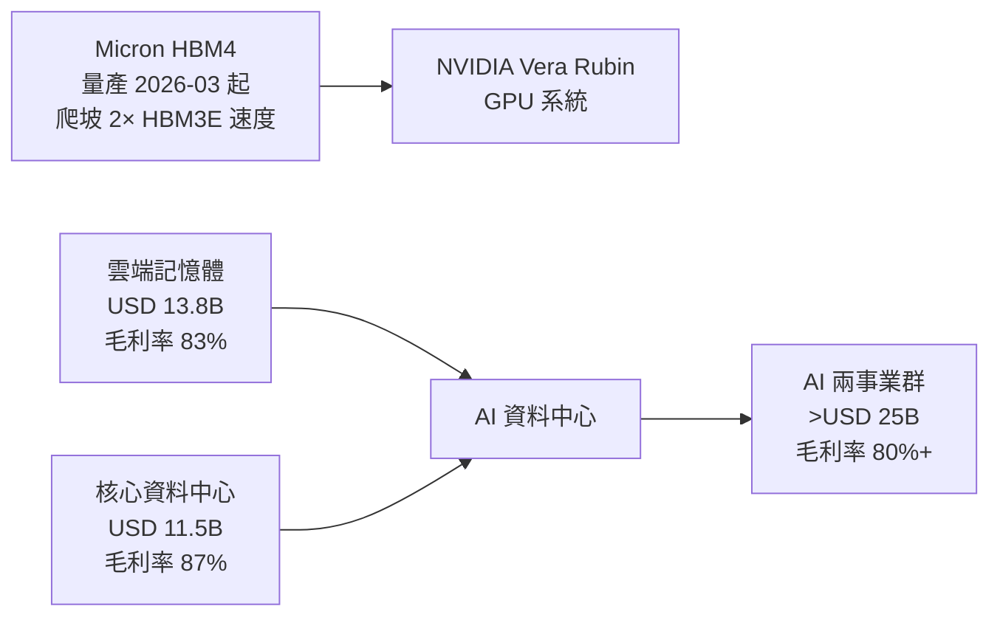

# MU.US(micron)

## 基本資料

Micron Technology 是全球三大 DRAM/NAND Flash 製造商之一（另兩家：三星、SK Hynix）。在 AI 時代，Micron 的 HBM（High Bandwidth Memory）成為 GPU/AI 加速器的標配，2026 年 FY26 Q3 業績創歷史紀錄，揭示 AI 記憶體的「稅率效應」——AI 相關事業毛利率遠高於傳統記憶體業。

資料來源：[[research_simpletechtrend_CPO矽光子ECTC2026_20260629]]（2026-06-29，STT W26 市場洞察）

## 核心技術／競爭優勢

### HBM4（NVIDIA Vera Rubin）

- HBM4 自 **2026 年 3 月起為 NVIDIA Vera Rubin 量產出貨**
- 爬坡速度是 HBM3E 12-high 的 **兩倍**
- HBM4 每顆 GPU/加速器 記憶體頻寬大幅提升

### FY26 Q3 財報（2026-06-24，法說；史上最佳）

| 指標 | FY26 Q3 | YoY | QoQ |
|------|---------|-----|-----|
| 總營收 | **USD 41.5B（415億）** | **+346%** | +74% |
| DRAM 營收 | USD 31.3B（313億） | +343% | +67% |
| NAND 營收 | USD 9.9B（99億） | +361% | +99% |
| CMBU（雲端記憶體事業部）| USD 13.8B（138億）| — | — |
| CDBU（核心資料中心事業部）| USD 11.5B（115億）| — | — |
| MCBU（行動與客戶事業部）| USD 11.5B（115億）| — | — |
| AEBU（汽車與嵌入式事業部）| USD 4.6B（46億）| — | — |
| 合併毛利率 | **84.9%** | 毛利翻倍+ | +10 pp |
| 營業利益率 | **81.2%** | +54 pp | +12 pp |
| EPS（non-GAAP diluted）| **USD 25.11** | — | **+106%** |

FY26 Q4 指引（2026-06-24 法說）：
- 營收：USD 50B（±10億），毛利率 ~86%，EPS ~USD 31（±1）

### 策略客戶協議（SCA）

- 已簽訂 **16 份 SCA**，涵蓋約 20% DRAM 及 1/3 NAND 產量
- 累計底價（以底價計）：**約 USD 100B（1,000億美元）**
- 已收到現金存款及財務承諾 **USD 22B**（其中 USD 18B 現金存款）
- SCA 通常五年（汽車三年）；底價毛利率遠超過去任何週期高峰
- 預計完全執行後涵蓋約一半以上營收

## 圖片 / 架構圖

![[報告_UBS_Micron_HBM供需_20260810_016.png]]

圖說：UBS 報告的 Micron HBM 與一般 DRAM 價格/獲利比較，顯示 HBM4/HBM4E 緊繃度高於先前預期。

`[待補來源圖]` 需官方 FY26 Q3 法說截圖或 HBM4 產品技術圖佐證；上方為自製 HBM4 供應鏈示意圖。
## 產品與應用

| 產品 / 服務 | 應用 | 相關客戶 / 下游 |
|-------------|------|-----------------|
| HBM4 | AI GPU 高頻寬記憶體 | [[NVDA.US(nvidia)]] Vera Rubin |
| HBM3E | AI GPU | NVIDIA、AMD Instinct |
| 雲端 DRAM | 資料中心一般 DRAM | 雲端大廠 |
| NAND Flash | SSD / 企業儲存 | 廣泛 |

## EPS 記錄

| 季度 | 總營收 | EPS（non-GAAP） | 毛利率 | 備註 |
|------|--------|-----------------|--------|------|
| FY26 Q4（指引） | USD 51.0B | ~USD 31.59 | ~86% | 2026-06-24 法說指引；較 consensus $43.1B 大幅超預期 |
| FY26 Q3 | USD 41.5B | USD 25.12（+106% QoQ）| 84.9% | 史上最佳；vs JPM pre-call est. $19.24，beat $5.88/share |
| FY26 Q2 | USD 23.9B | USD 12.20 | 74.4% | |
| FY26 Q1 | USD 13.6B | USD 4.78 | 56.7% | |

**JPM 全年預估（FYE Aug，FY26E → FY27E）**

| 指標 | FY25A | FY26E | FY27E |
|------|-------|-------|-------|
| 營收（$M）| 37,310 | 130,002 | 251,402 |
| YoY | +48.6% | +248.4% | +93.4% |
| Adj. EPS（$）| 8.23 | 73.69 | 153.65 |
| Adj. EPS（前次）| — | 58.84（+25.2%上調）| — |
| GM%（non-GAAP）| 40.8% | 80.7% | 85.0% |
| EBIT margin | 26.0% | 75.2% | 81.7% |
| Adj. FCF ($M) | 3,605 | 52,169 | 120,132 |

## 時間軸

| 時間 | 事件 | 類型 | 重要性 | 備註 |
|------|------|------|--------|------|
| 2026-03 | HBM4 開始為 NVIDIA Vera Rubin 量產出貨 | 出貨 | ⭐⭐⭐ | 爬坡速度 2× HBM3E 12-high |
| 2026-06-24 | FY26 Q3 法說；創紀錄財報 | 財報 | ⭐⭐⭐ | 毛利率 84.9%，EPS 25.11 |
| 2026 H2 | 新加坡先進封裝卓越中心開始貢獻 | 產能 | ⭐⭐ | 2027 H1 重要產能貢獻 |
| 2026-12-09 | CHIPS 協議簽署兩週年；開始逐步返還多餘現金 | 股利 | ⭐⭐ | |
| 2027 H1 | 台灣桐廬廠（30萬平方英尺）重要產品出貨 | 產能 | ⭐⭐⭐ | 較原計劃提前約一季 |
| 2027 H1 | 新加坡先進封裝高量產產能貢獻 | 產能 | ⭐⭐ | |
| 2027 H2 | 美國 Idaho ID1 晶圓廠首片晶圓 | 產能 | ⭐⭐ | |
| 2027 H2 | 下一代 DRAM/NAND 節點量產 | 技術 | ⭐⭐⭐ | 1-delta / G10 節點 |
| 2028 末 | 美國 Idaho ID2 晶圓廠首片晶圓 | 產能 | ⭐⭐ | |
| 2028 後 | DRAM/NAND 產業供應逐步改善 | 產業 | ⭐⭐ | 目前缺乏明確可見度 |

## 供應鏈位置

- AI 加速器客戶：[[NVDA.US(nvidia)]]（HBM4 主供）、[[AMD.US(amd)]]
- 晶圓代工：自有 IDM 製程（Boise, Idaho；台灣桐廬；新加坡）
- 上游設備：ASML.NL(asml)（多年期 EUV 供應協議，支持 One Delta 節點）

## 相關公司

| 公司 | 關係 | 說明 |
|------|------|------|
| [[NVDA.US(nvidia)]] | 主要客戶 | HBM4 for Vera Rubin GPU 系統 |
| [[AMD.US(amd)]] | 客戶 | HBM for Instinct |
| [[2330_台積電（市）]] | 無直接製造關係 | Micron 為自有 IDM；TSMC 為競品客戶代工 |
| ASML.NL(asml) | 上游設備 | 多年期 EUV 供應協議（One Delta 節點） |

> [!warning] 風險與注意事項
> - **週期性**：SCA 提供底價保護，但 NAND/DRAM 長期供需在 2028 後仍不確定；一旦供應追上需求，毛利率壓縮風險顯著
> - **資本支出密集**：全球 IDM 擴廠（Idaho、紐約、台灣、新加坡）需持續巨額投資，若需求放緩將影響 FCF
> - **地緣政治**：台灣桐廬廠依賴台灣製造；指引中未包含任何貿易/地緣政治發展影響（法說明確聲明）
> - **SCA 集中風險**：16 份 SCA 涵蓋大部分產量；若主要 SCA 客戶需求萎縮，影響有限緩衝空間

## 目標價與評等

| 券商 | 報告日 | 評等 | 目標價 | 評價基礎 | 來源 |
|------|--------|------|--------|----------|------|
| J.P. Morgan | 2026-06-25 | OW（維持）| USD $1,540（Dec-27）| 10× 10-yr median P/E × FY28E EPS $154 | 報告_JPM_Micron美光_20260625 |

**JPM 關鍵觀點（2026-06-25 post-earnings）**：

- 最重要的進展：SCA 從 1 份擴到 16 份（4 大客戶 + 3 中型 + 小型汽車），底價合計 ~$100B cumulative revenue，底價毛利率「遠超過去任何週期高峰」（vs 前次週期峰值 GM ~62%）
- FY26 capex 提高至 ~$27B；FY27 above mid-$40B level（支持 CY28+ 供應擴增）
- 資本返還：Dec 9, 2026（CHIPS Act 協議 2 週年）後，100% 超額現金以庫藏股方式返還股東
- HBM TAM：提前至 CY27 就「輕鬆超過 $100B」（前次預期 CY28）；JPM 估 ~$129B
- 供需緊張延伸：從前次預期 beyond CY26 延伸至 beyond CY27

### 沿革

- Bernstein [[報告_Bernstein_SanDisk_20260630]]（2026-06-30）：MU 的 SCA 地板價估 CQ2'26 的 **~50% 以下**（vs SNDK $0.29/GB ≈ CQ2 水平），但合約多為 5 年（vs SNDK 平均 ~4 年）；MU RPO ~$100B、現金 $22B + 信用狀 $4B，財務覆蓋率 ~22%。MU 地板毛利率「遠超過去任何週期高峰 61%」。
- J.P. Morgan 報告_JPM_Micron美光_20260625（2026-06-25）：OW，PT $1,540（from $550），FY26E EPS $73.69（+25.2%），FY27E $153.65；16份SCA底價 ~$100B；HBM TAM 提前至CY27 $100B+
- MS [[260702_ms_nand-industry]]（2026-07-02）維持 **OW**；美光為 KV SSD 主要供應商之一，DRAM/NAND 供需俱佳，<10x P/E 具評價空間、2027 有意義庫藏股。
- 大和 [[大和 韓國記憶體產業電話會議摘要]]（2026-07-02）：美光 3QFY26 優預期 20%+，3–5 月 DRAM ASP +low 60s% QoQ、NAND +85% QoQ，下季 GM 指引 86%；HBM4 營收約 $1b、2025 底 HBM 市占達 20% 後維持。
- 產業定位詳見 [[供應鏈_記憶體]]、[[分析_記憶體超級循環2026]]、[[技術_HBM高頻寬記憶體]]、[[技術_NAND快閃記憶體]]。

## 來源

- [[報告_UBS_Micron_HBM供需_20260810]] — UBS，2026-08-10；2027E 業界 HBM ASP 年增估值 79%、HBM4E >US$30/GB（estimate／中信心）

- 報告_JPM_Micron美光_20260625（J.P. Morgan，2026-06-25；OW PT $1,540；FY26E EPS $73.69；16份SCA底價 $100B；HBM TAM CY27 $100B+；Dec 2026後資本返還）
- [[260702_ms_nand-industry]]（摩根士丹利，2026-07-02；OW、KV SSD、NAND 供需模型）
- [[大和 韓國記憶體產業電話會議摘要]]（大和，2026-07-02；美光 ASP/GM/HBM 市占）
- [[research_simpletechtrend_CPO矽光子ECTC2026_20260629]]（FY26 Q3 財報數據，2026-06-29，次要來源）
- [[活動_Micron法說_20260624]]（FY26 Q3 法說逐字稿，2026-06-24，一手來源）

## 相關頁面

- [[1810.HK(xiaomi)]]
- [[CXMT（未）]]
- [[分析_CXMT_DRAM_IPO分析]]
- [[3532_台勝科（市）]]
- [[6770_力積電（市）]]
- [[DELL.US(dell)]]
- [[時程_2026記憶體與AI催化劑]]
- [[技術_光模塊]]
- [[供應鏈_記憶體]]
- [[分析_記憶體超級循環2026]]
