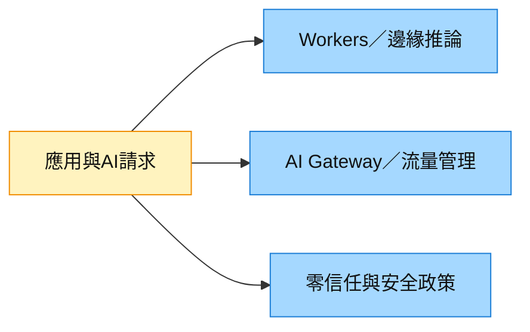

# NET.US(cloudflare)

## 基本資料

Cloudflare 是全球最大的邊緣網路（Edge Network）與零信任安全平台，總部位於美國舊金山，2009 年由 Matthew Prince（CEO）與 Michelle Zatlyn 創辦，2019 年在 NYSE 上市。公司最初以 CDN（內容遞送）與 DDoS 防護起家，演化為整合 SASE（Cloudflare One）、開發者邊緣平台（Workers/R2）、AI 推論（AI Gateway）的複合型基礎建設廠商。

在 Anthropic Project Glasswing 成員中，Cloudflare 與 Zscaler 均公開披露參與。

**近期財務規模（2026 年 6 月市場資料）**

| 指標 | 數值 | 來源 |
|---|---|---|
| 股價（2026-06-08） | $250.11 | Truist |
| 評等 | Buy | Truist |

---

## 核心業務

### 1. Cloudflare One（SASE / Zero Trust）

- 覆蓋 ZTNA、SWG、CASB、DLP、Email Security、Magic WAN
- 連接「零信任」與邊緣網路的自然整合平台——所有流量先過 Cloudflare 全球 300+ 網路節點
- Jefferies VAR 調查：NET 在 1Q26 是相對最佳表現的 SASE/資安廠商之一（-0.4% 季節性 delta，遠好於平均 -1.6%）
- CyberArk（PANW）收購後，NET 在 VAR 中的 Agentic Identity 關注度相對 SAIL/OKTA 稍低

### 2. Workers / R2 / AI Inference（開發者邊緣平台）

- Workers：無伺服器邊緣運算，用於 AI Agent 部署的輕量執行環境
- R2：對象儲存，兼容 AWS S3 API，無出口費用
- AI Inference（AI Gateway）：在 Cloudflare 邊緣執行 AI 模型推論，管理 AI 請求流量、設定速率限制、注入安全政策

### 3. AI Gateway & Agentic AI 安全

Truist（2026-06-08）的 Agentic Security Stack 中，NET 是「AI Gateway & Edge」類別的**唯一代表廠商**：

| 功能 | NET 的角色 |
|---|---|
| LLM 流量的全球邊緣過濾 | 在 300+ PoP 節點層攔截惡意 AI 請求 |
| AI Gateway | 管控 LLM API 流量、記錄 / 監控 / 速率限制 |
| MCP 安全 | Agentic 通訊的 MCP 協議安全（與 ZS 不同層次的防護） |
| Agentic Guardrails | 在全球邊緣為 AI 代理人通訊設定政策護欄 |

---

## 投資觀察

### Truist Buy 論點

1. **架構護城河**：全球 300+ PoP 節點構成的「connect-and-protect」架構，是 SASE 競爭中最低延遲的方案
2. **AI Edge 基礎建設**：Agentic AI 需要邊緣推論與邊緣安全，NET 是唯一兼具兩者的基礎建設廠商
3. **開發者生態系**：Workers/R2 建立的開發者生態系是中長期成長飛輪，AI 代理人的輕量部署自然選擇
4. **AI Gateway 訂閱化**：AI 請求流量管控是 SaaS 化訂閱服務，有高毛利潛力

### 主要風險

- SASE 市場與 PANW / ZS 直接競爭，NET 的企業 SASE 規模仍不及兩者
- 開發者平台業務高度依賴 AI 推論需求爆發的速度

---

## 相關公司

| 關係 | 公司 | 備註 |
|---|---|---|
| SASE 競品 | [[ZS.US(zscaler)]] | 同為 Glasswing 成員；SASE 市場競爭 |
| SASE 競品 | [[PANW.US(palo alto networks)]] | PANW Prisma SASE 市占更大 |
| AI 安全協作 | [[CRWD.US(crowdstrike)]] | QuiltWorks 生態系 |

---

## 來源

- [[memo_AceCamp_Akamai_CPU算力與MaaS_20260930]] — AceCamp Tech匿名專家訪談，2026-09-30；主體為Akamai，Cloudflare僅為競品比較，能力與份額說法未經確認。

- [[報告_Truist_MythosAndDaybreak_20260608]] — Truist，Rise of the Models（Cloudflare Buy），2026-06-08
- [[報告_Jefferies_資安_20260416]] — Jefferies VAR Survey（NET 相對強勁），2026-04-16

- [[Cybersec 260608 Truist_The age of Mythos & Daybreak]]（2026-06-08）
- [[Cybersec 260710 WF_Preventive security sees temporary boost]]（2026-07-10）
- [[Cybersec 260720 WF_2Q26 on-cycle security reseller survey]]（2026-07-20）

## 相關頁面

- [[分析_AI驅動資安支出2026]]
- [[技術_SASE]]

- [[技術_邊緣AI]]
- [[分析_20260930專家紀要公司辨識與商業化驗證]]

## 2026-09-30 Akamai訪談中的競品比較

[[memo_AceCamp_Akamai_CPU算力與MaaS_20260930]] 的主體高度指向Akamai（AKAM，未建頁），不是Cloudflare或Zscaler訪談。受訪者將Akamai的GPU VM／核心計算定位與Cloudflare的邊緣推論比較，偏好前者的底層算力需求；這是expert thesis，不是Cloudflare經營事實。

> [!warning] 競品資料的適用邊界
> 「未聽說Cloudflare銷售新GPU」不等同沒有GPU服務或未投資；「WAF份額平分」未定義地區、客群與市場分母，不能填入市占率。訪談列安全收入70%–80%／20%–30%及低個位數增速屬受訪主體口徑，不寫成Cloudflare財務。

## 圖片 / 架構圖

圖說：Cloudflare的開發者執行、AI流量管理與安全政策是不同服務層；不能把這些能力直接等同出租整台GPU VM。本次來源無圖，使用功能示意。
