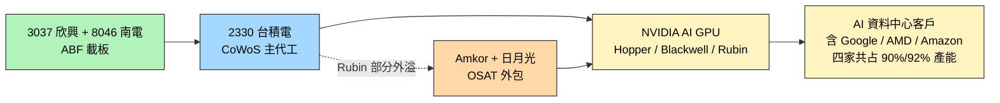

# NVDA.US(nvidia)

> [!note] 本頁範圍說明
> 本頁涵蓋：**CoWoS / Rubin 供應鏈**、**光互連技術棧與 GB300 出貨**、**光學戰略投資（Coherent / Corning）**。NVIDIA 的 GPU 路線細節、CUDA 軟體 stack、汽車等其他主題等之後 ingest 對應來源時再補。

## 基本資料
NVIDIA（輝達），全球 AI GPU 龍頭。本次主題範圍內的角色是**全球 CoWoS / HBM 產能主要消耗者**，且其 Rubin 世代已出現 CoWoS **產能外溢**訊號。

主要資料來源：[[報告_其他_玻璃基板_20260511]]（國金證券，2026-05-11）。

## 核心技術／競爭優勢（本次範圍）

- **CoWoS / HBM 雙資源主導**：[[NVDA.US(nvidia)]]、Google、AMD、Amazon 四家共占 [[2330_台積電（市）]] CoWoS / HBM **90% / 92%** 產能（國金引 Epoch AI 2025 數據；claim 類型 estimate、信心中）
- **Rubin 部分 CoWoS 外溢**：Rubin 世代部分 CoWoS 訂單外包给 [[AMKR.US(amkor)]] 與日月光，反映 TSMC CoWoS 產能仍不足以應付需求（claim 類型 fact、信心中）
- **ABF 載板需求驅動**：透過 TSMC CoWoS → 由 [[3037_欣興（市）]]、[[8046_南電（市）]] 等 ABF 載板廠供應

## 產品與應用（本次範圍）

| 產品 / 服務 | 應用 | 上游製造 |
|-------------|------|----------|
| AI GPU（Hopper / Blackwell / Rubin） | 資料中心 / AI 訓練與推論 | [[2330_台積電（市）]] CoWoS + [[3037_欣興（市）]] / [[8046_南電（市）]] ABF 載板 |
| Rubin 部分 CoWoS（外溢部分） | 同上 | [[AMKR.US(amkor)]] + 日月光（OSAT 外包） |

## 圖片 / 架構圖

![[報告_其他_玻璃基板_20260511_005.png]]
> 頭部企業包攬 CoWoS / HBM 產能：NVIDIA、Google、AMD、Amazon 共占 90%/92%（來源：國金證券，原引 Epoch AI）

## EPS 記錄
（本次來源未涉及）

| 季度 | EPS (USD) | YoY | 備註 |
|------|-----------|-----|------|
| — | — | — | 本次來源未揭露 |

## EPS 預估
（本次來源未涉及）

## 目標價與評等
（本次來源未涉及）

## 時間軸（本次範圍）

| 時間 | 事件 | 類型 | 重要性 | 備註 |
|------|------|------|--------|------|
| 2025 | 與 Google/AMD/Amazon 共占 TSMC CoWoS/HBM 90%/92% 產能 | 產能分配 | ⭐⭐⭐ | 國金引 Epoch AI 數據 |
| 2026（Rubin 時程） | Rubin 部分 CoWoS 外包给 [[AMKR.US(amkor)]] 與日月光 | 供應鏈外溢 | ⭐⭐⭐ | TSMC CoWoS 產能不足首次公開信號 |

## 供應鏈位置
- **上游晶圓代工**：[[2330_台積電（市）]]（CoWoS 主代工）
- **上游 ABF 載板**：[[3037_欣興（市）]]、[[8046_南電（市）]]、Ibiden（日）、Shinko（日）
- **上游 OSAT（Rubin 外溢）**：[[AMKR.US(amkor)]]、日月光（3711.TW，未建頁）
- **下游 AI 資料中心客戶**：Google、AMD、Amazon 等（與 NVIDIA 共同占用 CoWoS/HBM 產能）
- **所屬供應鏈**：[[供應鏈_先進封裝載板]]

## 相關公司

| 公司 | 關係 | 說明 |
|------|------|------|
| [[2330_台積電（市）]] | 上游主代工 | CoWoS 主代工，Rubin 部分外溢出口 |
| [[3037_欣興（市）]] | 上游 ABF 載板 | 載板供應，Ajinomoto 漲價傳導至此 |
| [[8046_南電（市）]] | 上游 ABF 載板 | 同上 |
| [[AMKR.US(amkor)]] | 上游 OSAT / Rubin 外包 | 接 TSMC CoWoS 外溢的 OSAT 之一 |

> [!warning] 風險與注意事項（本次範圍）
> - **CoWoS 產能瓶頸**：雖然 TSMC 擴產（2024 ~3.5 萬 → 2027 ~17 萬月產能），但 Rubin 已被迫外溢，後續需求增速是否能被吸收待觀察
> - **玻璃基板路線間接影響**：若 [[2330_台積電（市）]] CoPoS 或 [[INTC.US(intel)]] 3DGS 量產順利，NVIDIA 未來世代是否轉用玻璃基板未明（claim 類型 thesis、信心低，本次來源未直接點到 NVIDIA 與玻璃基板的關係）
> - **資料來源限制**：本次只有國金證券二手引述。NVIDIA 自家對 CoWoS / Rubin / HBM 規劃應另查 NVIDIA 法說與 Computex / GTC 發表

## 光互連技術棧（Optical Interconnect Stack，2026）

ECTC 2026 NVIDIA 論文揭示其光互連技術棧演進路線，與 [[2330_台積電（市）]] COUPE 平台、[[LITE.US(lumentum)]] 雷射陣列、[[GFS.US(globalfoundries)]] 光連接器合作多篇論文：

| 技術路線 | 合作方 | 關鍵特性 |
|---------|-------|---------|
| DWDM CW-DFB 外部雷射陣列 | TSMC COUPE + Lumentum | MRR DWDM；multiple-λ 共封裝 |
| 可拆 GLASSBRIDGE 光纖連接器 | GlobalFoundries + Corning | TE 1.44 dB/facet，PDL 0.3 dB，MT 相容，被動對準 |
| V-groove 玻璃耦合器 | Intel（平行生態）| 450 次熱循環 IL <0.7 dB，被動對準 |

> ⚠️ **路線觀察（規則 #14）**：NVIDIA 採**垂直整合**路線（NVLink 封閉生態），與 Meta+Broadcom+AMD 的 OCI 200G MSA **開放標準**路線形成對立。NVIDIA 以戰略入股 Coherent / 採購承諾 Lumentum 鎖定光學上游，而非透過開放 MSA 合作。

### 1.6T 出貨節奏（規則 #14 — 生產節奏）

| 指標 | 值 | 來源 |
|------|----|----|
| 2026 全球 1.6T 光模塊出貨 | **~850K 支**（+280% YoY）| STT AI 供應鏈 W26 |
| GB300 NVL72 機櫃 2026 年出貨 | **~55K 台**（+129% YoY）| STT AI 供應鏈 W26 |

## 光學戰略投資（規則 #14 — 關係更新）

- **NVIDIA × [[COHR.US(coherent)]]**：NVIDIA 戰略入股 **USD 20 億**，鎖定 InP CW 雷射供應（詳見 Coherent 頁）
- **NVIDIA × [[LITE.US(lumentum)]]**：採購承諾 USD 20 億，ECTC 2026 聯合發表 DWDM CW-DFB 雷射陣列論文
- **NVIDIA × [[GLW.US(corning)]]**：2026-05-06 戰略合作，確認「光進銅退」方向，光纖取代銅纜

資料來源：[[research_simpletechtrend_CPO矽光子ECTC2026_20260629]]

## 來源
- [[報告_SemiAnalysis_NvidiaCCL_20260702]]（SemiAnalysis，2026-07-02；GB300／VR NVL72／Rubin 板卡 CCL 供應：EMC/斗山/南亞，見 [[技術_CCL]]）
- [[260702_gs_TSMC]]（高盛，2026-07-02；台積電為 NVIDIA AI 加速器加速擴 CoWoS 產能、2027E 280kwpm，見 [[技術_CoWoS與先進封裝]]）
- [[報告_其他_玻璃基板_20260511]]（國金證券「玻璃基板行業深度」，2026-05-11；分析師李陽 S1130524120003）
- [[research_simpletechtrend_CPO矽光子ECTC2026_20260629]]（光互連技術棧、光學戰略投資、GB300 出貨節奏，2026-06-29）
- [[報告_Bloomberg_NVDA_Q2CY25法說_20250827]]（Bloomberg，Q2CY25 法說，2025-08-27）
- [[報告_中信_NVIDIA_20260303]]（中信投顧，NVIDIA 評析，2026-03-03）
- [[報告_中信_NVIDIA_GTC2026評析_20260319]]（中信投顧，GTC2026 評析，2026-03-19）
- [[報告_富邦_NVDA_Q1FY26法說_20250529]]（富邦投顧，Q1FY26 法說，2025-05-29）
- [[報告_富邦_NVDA_Q3FY26法說_20251120]]（富邦投顧，Q3FY26 法說，2025-11-20）
- [[報告_美股專題_NVIDIA_GTC2026台廠評析_20260319]]（美股專題，GTC2026，2026-03-19）

## 相關公司

| 公司 | 關係 | 說明 |
|------|------|------|
| [[2330_台積電（市）]] | 上游主代工 | CoWoS 主代工，COUPE 平台合作 |
| [[3037_欣興（市）]] | 上游 ABF 載板 | 載板供應 |
| [[8046_南電（市）]] | 上游 ABF 載板 | 同上 |
| [[AMKR.US(amkor)]] | 上游 OSAT / Rubin 外包 | 接 TSMC CoWoS 外溢 |
| [[COHR.US(coherent)]] | 戰略投資 | NVIDIA 入股 USD 20 億，InP CW 雷射供應 |
| [[LITE.US(lumentum)]] | 戰略採購 | USD 20 億採購承諾，ECTC 2026 聯合論文 |
| [[GFS.US(globalfoundries)]] | 光連接器合作 | GLASSBRIDGE 可拆光纖連接器 |
| [[GLW.US(corning)]] | 戰略合作 | 光纖取代銅纜（2026-05-06） |
| [[3711_日月光投控（市）]] | 封測（Rubin 外溢） | 接 CoWoS 外溢封測 |

## 相關頁面

- [[000150.KR(doosan)]]
- [[000660.KR(sk_hynix)]]
- [[005930.KR(samsung)]]
- [[1303_南亞（市）]]
- [[2059_川湖（市）]]
- [[2308_台達電（市）]]
- [[2317_鴻海（市）]]
- [[2345_智邦（市）]]
- [[2376_技嘉（市）]]
- [[2382_廣達（市）]]
- [[285A.JP(kioxia)]]
- [[3017_奇鋐（市）]]
- [[3231_緯創（市）]]
- [[3324_雙鴻（市）]]
- [[3357_台慶科（市）]]
- [[3533_嘉澤（市）]]
- [[3653_健策（市）]]
- [[6223_旺矽（櫃）]]
- [[6503.JP(mitsubishi electric)]]
- [[6510_精測（市）]]
- [[6515_穎崴（市）]]
- [[6669_緯穎（市）]]
- [[7751_竑騰（市）]]
- [[7769_鴻勁精密（市）]]
- [[8042_金山電（市）]]
- [[DELL.US(dell)]]
- [[PLTR.US(palantir)]]
- [[供應鏈_AI伺服器散熱]]
- [[供應鏈_半導體測試設備]]
- [[供應鏈_被動元件]]
- [[技術_HBM高頻寬記憶體]]
- [[技術_InP磷化銦]]
- [[2327_國巨（市）]]
- [[2360_致茂（市）]]
- [[2368_金像電（市）]]
- [[2383_台光電（市）]]
- [[3105_穩懋（市）]]
- [[3363_上詮（櫃）]]
- [[4958_臻鼎（市）]]
- [[6285_啟碁（市）]]
- [[AAOI.US(applied optoelectronics)]]
- [[AMD.US(amd)]]
- [[APH.US(amphenol)]]
- [[META.US(meta)]]
- [[MRVL.US(marvell)]]
- [[MU.US(micron)]]
- [[VRT.US(vertiv)]]
- [[供應鏈_CPO]]
- [[技術_OCI]]
- [[技術_矽光子（SiPh）]]
- [[技術_ABF載板]]
- [[技術_玻璃基板]]
- [[技術_CPO]]
- [[技術_光互連]]
