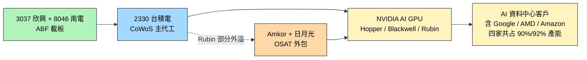

# NVDA.US(nvidia)

> [!note] 本頁範圍說明
> 本頁涵蓋：**CoWoS / Rubin 供應鏈**、**光互連技術棧與 GB300 出貨**、**光學戰略投資（Coherent / Corning）**。NVIDIA 的 GPU 路線細節、CUDA 軟體 stack、汽車等其他主題等之後 ingest 對應來源時再補。

## 基本資料
NVIDIA（輝達），全球 AI GPU 龍頭。本次主題範圍內的角色是**全球 CoWoS / HBM 產能主要消耗者**，且其 Rubin 世代已出現 CoWoS **產能外溢**訊號。

主要資料來源：[[報告_其他_玻璃基板_20260511]]（國金證券，2026-05-11）。

## 核心技術／競爭優勢

- **CoWoS / HBM 雙資源主導**：[[NVDA.US(nvidia)]]、Google、AMD、Amazon 四家共占 [[2330_台積電（市）]] CoWoS / HBM **90% / 92%** 產能（國金引 Epoch AI 2025 數據；claim 類型 estimate、信心中）
- **Rubin 部分 CoWoS 外溢**：Rubin 世代部分 CoWoS 訂單外包給 [[AMKR.US(amkor)]] 與日月光，反映 TSMC CoWoS 產能仍不足以應付需求（claim 類型 fact、信心中）
- **ABF 載板需求驅動**：透過 TSMC CoWoS → 由 [[3037_欣興（市）]]、[[8046_南電（市）]] 等 ABF 載板廠供應

## 產品與應用

| 產品 / 服務 | 應用 | 上游製造 |
|-------------|------|----------|
| AI GPU（Hopper / Blackwell / Rubin） | 資料中心 / AI 訓練與推論 | [[2330_台積電（市）]] CoWoS + [[3037_欣興（市）]] / [[8046_南電（市）]] ABF 載板 |
| Rubin 部分 CoWoS（外溢部分） | 同上 | [[AMKR.US(amkor)]] + 日月光（OSAT 外包） |
| NVLink Fusion／NVLink-C2C／NVHBM | 讓第三方客製 XPU 接入 NVIDIA rack-scale AI factory | [[2454_聯發科（市）]] 等客製 ASIC 設計夥伴 |

## 圖片 / 架構圖

![[web_NVIDIA_CPO_20250826_001.webp]]
*圖（NVIDIA Technical Blog，2025-08-26）：Quantum-X／Spectrum-X CPO 交換器的實體系統配置，對應光子引擎、光纖介面、液冷與 ELS 的整合。*

![[nvidia-800-vdc-industry-alignment-white-paper_001.png]]
*圖（NVIDIA，2026-08-20）：800VDC 由 Power Rack、Power Center 到 DC Power Block 的三層部署選項，說明其由 AI 機櫃供應延伸至 cluster 與 data hall 的系統定位。*

![[報告_其他_玻璃基板_20260511_005.png]]
> 頭部企業包攬 CoWoS / HBM 產能：NVIDIA、Google、AMD、Amazon 共占 90%/92%（來源：國金證券，原引 Epoch AI）

## EPS 記錄
（本次來源未涉及）

| 季度 | EPS (USD) | YoY | 備註 |
|------|-----------|-----|------|
| — | — | — | 本次來源未揭露 |

## EPS 預估
（本次來源未涉及）

## 目標價與評等
（本次來源未涉及）

## 時間軸

| 時間 | 事件 | 類型 | 重要性 | 備註 |
|------|------|------|--------|------|
| 2025 | 與 Google/AMD/Amazon 共占 TSMC CoWoS/HBM 90%/92% 產能 | 產能分配 | ⭐⭐⭐ | 國金引 Epoch AI 數據 |
| 2026（Rubin 時程） | Rubin 部分 CoWoS 外包給 [[AMKR.US(amkor)]] 與日月光 | 供應鏈外溢 | ⭐⭐⭐ | TSMC CoWoS 產能不足首次公開信號 |
| 2026-08-20 | 發布 800VDC Architecture: Industry Alignment & Execution 白皮書 | 技術路線 | ⭐⭐⭐ | Power Rack／Power Center／DC Power Block；系統級保護、認證與驗證框架，屬 roadmap／execution framework |
| 2025-08-26 | 公開 Quantum-X／Spectrum-X CPO 平台與 ELS 架構 | 技術下線／驗證 | ⭐⭐⭐ | 官方 Blog；200Gbps PAM4、TSMC COUPE、Q3450 115.2Tbps 全雙工與模組化 ELS 數字為公司說法 |
| 2026-08-31 | 投資聯發科 US$3.5bn 可轉債，擴大 NVLink Fusion、Cloud AI Factory、AI PC／本地運算與車用合作 | 策略投資／平台合作 | ⭐⭐⭐ | 投資與合作公告為 fact；特定 XPU design win 仍待客戶與量產驗證 |

## 供應鏈位置
- **上游晶圓代工**：[[2330_台積電（市）]]（CoWoS 主代工）
- **上游 ABF 載板**：[[3037_欣興（市）]]、[[8046_南電（市）]]、Ibiden（日）、Shinko（日）
- **上游 OSAT（Rubin 外溢）**：[[AMKR.US(amkor)]]、日月光（3711.TW，未建頁）
- **下游 AI 資料中心客戶**：Google、AMD、Amazon 等（與 NVIDIA 共同占用 CoWoS/HBM 產能）
- **CPO 光互連合作生態**：[[2330_台積電（市）]] COUPE、光纖／封裝／連接器與 ELS 供應商共同構成 Quantum-X／Spectrum-X 平台；具體合作份額仍需供應鏈資料確認。
- **客製 XPU 生態**：[[2454_聯發科（市）]] 透過 NVLink Fusion／NVLink-C2C 將客製 ASIC 接入 NVIDIA GPU、CPU、網路與 rack-scale fabric；NVIDIA 以 US$3.5bn CB 投資深化合作。
- **所屬光互連供應鏈**：[[供應鏈_CPO]]
- **所屬供應鏈**：[[供應鏈_先進封裝載板]]

## 相關公司

| 公司 | 關係 | 說明 |
|------|------|------|
| [[2330_台積電（市）]] | 上游主代工 | CoWoS 主代工，Rubin 部分外溢出口 |
| [[3037_欣興（市）]] | 上游 ABF 載板 | 載板供應，Ajinomoto 漲價傳導至此 |
| [[8046_南電（市）]] | 上游 ABF 載板 | 同上 |
| [[AMKR.US(amkor)]] | 上游 OSAT / Rubin 外包 | 接 TSMC CoWoS 外溢的 OSAT 之一 |

> [!warning] 風險與注意事項（本次範圍）
> - **CoWoS 產能瓶頸**：雖然 TSMC 擴產（2024 ~3.5 萬 → 2027 ~17 萬月產能），但 Rubin 已被迫外溢，後續需求增速是否能被吸收待觀察
> - **玻璃基板路線間接影響**：若 [[2330_台積電（市）]] CoPoS 或 [[INTC.US(intel)]] 3DGS 量產順利，NVIDIA 未來世代是否轉用玻璃基板未明（claim 類型 thesis、信心低，本次來源未直接點到 NVIDIA 與玻璃基板的關係）
> - **資料來源限制**：本次只有國金證券二手引述。NVIDIA 自家對 CoWoS / Rubin / HBM 規劃應另查 NVIDIA 法說與 Computex / GTC 發表

| 公司 | 關係 | 說明 |
|------|------|------|
| [[2330_台積電（市）]] | 上游主代工 | CoWoS 主代工，COUPE 平台合作 |
| [[3037_欣興（市）]] | 上游 ABF 載板 | 載板供應 |
| [[8046_南電（市）]] | 上游 ABF 載板 | 同上 |
| [[AMKR.US(amkor)]] | 上游 OSAT / Rubin 外包 | 接 TSMC CoWoS 外溢 |
| [[COHR.US(coherent)]] | 戰略投資 | NVIDIA 入股 USD 20 億，InP CW 雷射供應 |
| [[LITE.US(lumentum)]] | 戰略採購 | USD 20 億採購承諾，ECTC 2026 聯合論文 |
| [[GFS.US(globalfoundries)]] | 光連接器合作 | GLASSBRIDGE 可拆光纖連接器 |
| [[GLW.US(corning)]] | 戰略合作 | 光纖取代銅纜（2026-05-06） |
| [[3711_日月光投控（市）]] | 封測（Rubin 外溢） | 接 CoWoS 外溢封測 |
| [[CBRS.US(cerebras)]] | 競爭者 | NVIDIA 收購 Groq 技術整合入 Vera Rubin；fast inference 細分市場競爭（Groq LPU vs WSE）|
| [[2357_華碩（市）]] | 系統整合夥伴 | 華碩 HGX、NVL72 AI 伺服器採用 NVIDIA 平台 |
| [[2454_聯發科（市）]] | 策略投資／客製 ASIC 合作 | NVIDIA 投資 US$3.5bn CB；合作擴至 NVLink Fusion、AI factory、AI PC 與車用平台 |

## 光互連技術棧（Optical Interconnect Stack，2026）

ECTC 2026 NVIDIA 論文揭示其光互連技術棧演進路線，與 [[2330_台積電（市）]] COUPE 平台、[[LITE.US(lumentum)]] 雷射陣列、[[GFS.US(globalfoundries)]] 光連接器合作多篇論文：

| 技術路線 | 合作方 | 關鍵特性 |
|---------|-------|---------|
| DWDM CW-DFB 外部雷射陣列 | TSMC COUPE + Lumentum | MRR DWDM；multiple-λ 共封裝 |
| 可拆 GLASSBRIDGE 光纖連接器 | GlobalFoundries + Corning | TE 1.44 dB/facet，PDL 0.3 dB，MT 相容，被動對準 |
| V-groove 玻璃耦合器 | Intel（平行生態）| 450 次熱循環 IL <0.7 dB，被動對準 |

> ⚠️ **路線觀察（規則 #14）**：NVIDIA 採**垂直整合**路線（NVLink 封閉生態），與 Meta+Broadcom+AMD 的 OCI 200G MSA **開放標準**路線形成對立。NVIDIA 以戰略入股 Coherent / 採購承諾 Lumentum 鎖定光學上游，而非透過開放 MSA 合作。

### 1.6T 出貨節奏（規則 #14 — 生產節奏）

| 指標 | 值 | 來源 |
|------|----|----|
| 2026 全球 1.6T 光模塊出貨 | **~850K 支**（+280% YoY）| STT AI 供應鏈 W26 |
| GB300 NVL72 機櫃 2026 年出貨 | **~55K 台**（+129% YoY）| STT AI 供應鏈 W26 |

## 光學戰略投資（規則 #14 — 關係更新）

- **NVIDIA × [[COHR.US(coherent)]]**：NVIDIA 戰略入股 **USD 20 億**，鎖定 InP CW 雷射供應（詳見 Coherent 頁）
- **NVIDIA × [[LITE.US(lumentum)]]**：採購承諾 USD 20 億，ECTC 2026 聯合發表 DWDM CW-DFB 雷射陣列論文
- **NVIDIA × [[GLW.US(corning)]]**：2026-05-06 戰略合作，確認「光進銅退」方向，光纖取代銅纜

資料來源：[[research_simpletechtrend_CPO矽光子ECTC2026_20260629]]

## GPU Backstop 計畫（2026 新業務）

NVIDIA 作為「AI 中央銀行」角色，推出 GPU Backstop 計畫，為 Neocloud 提供最低收入保證以解鎖融資。

### 架構
- **期限**：6 年
- **保底機制**：NVIDIA 承諾以預設價格收購 Neocloud 空閒算力（take-or-pay）；Neocloud 從未調用保底為預期目標
- **收益分享**：Neocloud 實際租金超出保底部分，NVIDIA 抽取 40-60%（估計平均 take rate ~18-20%）
- **保底價格曲線**：SemiAnalysis 估計平均約 $2.36/hr/GPU（GB300，6 年平均），屬較低端；市場預期多數在此之上

### AI Project Trinity
Neocloud 建設需要三條腿同時站穩：
1. **Capital**（資本）：貸款方要求 IG 級擔保；NVIDIA AA/Aa2 信用等級使其保底可替代超大算力商保證
2. **Offtake**（租約）：保底在手讓 Neocloud 可接觸多元短期租客（inference provider 最高只要 1 年租約）
3. **Datacenter**（機房）：仍是最難解決的一環；NVIDIA 也開始保底部分 DC 租約

### 已公告案例（截至 2026-07-06）

| Neocloud | 地點 | 規模 | 保底金額 | 備註 |
|---------|------|------|---------|------|
| SharonAI | 澳洲 | 72MW / 40k GB300 | $4.88B（6 年）= 約 $2.33/hr/GPU | 首個公告案例（2026-06）|
| Firmus | 印尼峇淡島（Batam）| 360MW | $25-30B 客戶收入（6 年）| 由 Blackstone / Coatue 融資；第二個公告 |

> [!note] AMD 也有類似計畫
> AMD 從 2025 年起已向 AWS、OCI、Digital Ocean、Vultr、Tensorwave、Crusoe 等提供保底，換取客戶增購 AMD GPU。

### NVIDIA 財務影響預測（SemiAnalysis，estimate，信心中）

| 指標 | F1/27（截至 Jan 2027）| F1/29（截至 Jan 2029）|
|------|--------|--------|
| Cloud service agreements（含保底）| $77.5B | $175.3B |
| 保底相關增量收入 | $1.8B | $13.9B |
| 保底對應算力 | 932MW（432MW 已公告）| 3,432MW 累計 |
| 每 100MW 保底合約對應擔保金額 | ~$5.9B | — |

**每個 Neocloud 保底計畫的邊際收入幾乎是純利**（near-pure margin）。

詳見 [[技術_GPU_Backstop]] 及 報告_SemiAnalysis_NVIDIA_GPU_Backstop_AI_Trinity_20260706

### 大型 AI 融資預測（SemiAnalysis，2026-07-06）

- 2029 年全球 AI 相關債務餘額：**>$7T**（僅次於美國 MBS 市場 $13T，成為全球第二大 ABS 市場）
- 2024-2029 年累計 AI 資本支出（GPU + 機房）：**$11.1T**
- 2028 年年化 AI 資本支出：**>$2T**

## InferenceX 與 TileRT 關聯

NVIDIA 承諾向 SemiAnalysis InferenceX 平台提交 **Vera Rubin** 可驗證數字（Blackwell 後繼）。InferenceX 持續追蹤 NVIDIA GPU（B200/GB300/B300/NVL72 等）推理效能。

- TileRT（第三方 OSS）在 B200 8-GPU server 上，批大小=1 下達 340-494 tokens/s/user，比傳統推理引擎快 1.9-3x
- 目前 NVIDIA GPU + TileRT 軟體在超低延遲場景可部分取代 Cerebras WSE / Groq LPU 的市場

詳見 [[技術_TileRT]]

## Rubin Ultra NVL576／Oberon 架構更新（2026-08-10）

### GTC 2026 官方交換骨架

[[video_NVIDIA_GTC2026_AI平台與NVL576_202603]]（44:42–45:54）顯示 NVIDIA 已用 GB200 建立 NVL576 的多 rack 原型：rack 內 NVSwitch 採銅互連，rack 間以光纖直接連到其他 rack 的交換器，目標是把多個 rack 合成完整 576-GPU NVLink scale-up system。講者同時說明當時運行中的原型實際為 288-GPU，用於先行跑大規模訓練，為 Vera Rubin Ultra 做系統驗證。

官方已確認的是 optical scale-up 的拓撲方向；NPO／CPO 封裝形態、9+18+9 機構、每 rack 72 顆 NVLink Switch ASIC 與供應商份額，仍需分別以後續正式 BOM 或產品文件驗證。

### 2026-08-27 台灣供應鏈交叉觀察

- [[260827_ms_NVDA-implication]] 與 [[260827_citi_nvda-implication]] 均指向 FY/CY27 約 70% 營收成長展望、Rubin 已進入量產；瓶頸由 GPU 延伸至 HBM、CoWoS、網路、rack 整合、電力與資料中心實體容量。MS 估 NVIDIA 2027 年 CoWoS-L 用量約 910k wafers、年增約 40%（estimate，信心：中）。
- 台灣受惠鏈由 [[2330_台積電（市）]]、[[3711_日月光投控（市）]] 延伸至 [[2317_鴻海（市）]]、[[2382_廣達（市）]]、[[3231_緯創（市）]]；Citi 另強調 [[2308_台達電（市）]] 的電力基礎設施角色。

[[報告_SemiAnalysis_RubinUltraNVL576_20260810]] 將 Rubin Ultra 的 NVL576 Oberon 描述為 9+18+9 rack：18 個 compute tray 平分於上下方，18 個 0.75U NVLink Switch tray 置中；相較 Rubin，交換器 tray 數量加倍，以控制最遠銅背板通道距離。可擴充 Portia switch tray 有 NPO 與 CPO 兩種版本，每架 72 顆 NVLink Switch ASIC；報告認為 NPO 因 form factor 成熟度較高，可能先於 CPO 上市。上述為 SemiAnalysis 研究模型，且來源註明規格仍可能變動。

| 架構項目 | Rubin Ultra NVL576 研究模型 | 投資觀察 |
|---|---|---|
| Compute tray | 18 個，9+9 配置 | 機架與滑軌內容值增加 |
| NVLink Switch tray | 18 個、每個 0.75U | [[2059_川湖（市）]] 等機構供應商受惠方向 |
| Expandable switch | 4 顆 ASIC／tray、72 顆／rack | NPO socketed；CPO 為不可更換 optical engine |
| Tachyon HPM | PCB 26 層升至 30 層，材料不變 | 高層數 PCB／CCL 認證與良率需追蹤 |

![[報告_SemiAnalysis_Rubin_Ultra_NVL576_Flash_Overview_20260810_003.png]]
圖說：SemiAnalysis／NVIDIA 研究圖將 Rubin Ultra NVL576 的 9+18+9 rack 與 NPO／CPO scale-up 選項並列；架構尚非 NVIDIA 最終規格。

## 本次 ingest 更新（2026-08-31）

- FY2027Q2 法說逐字稿（2026-08-26）稱 Q3 營收指引約 $108bn，Vera Rubin 開始出貨；供應約為需求的 70%，FY2028 成長受供應限制。
- AWS、OpenAI 與其他 AI 實驗室的採購／融資敘述為管理層與客戶說法，需與正式申報交叉驗證；來源：[[活動_NVIDIA_FY2027Q2法說_20260826]]。

### 2026-09-01 CPO／ELS 待查證觀察

- 使用者轉述 NVIDIA 2026-08-21 新版 IB Switch System User Manual 提到一個 CPO 搭配 18 個 ELS，並將第一代 CPO InfiniBand scale-out switch 稱為 Q3450-LD；原始 manual 尚未收錄，不能視為 NVIDIA 正式規格。
- 相關觀察與 ELS-COS 架構假說詳見 [[分析_光通_CPO與ELS-COS_20260901]]；目前僅列為低信心 rumor／thesis。

## 來源
- [[報告_Citi_聯發科_20260831]]（Citi Research，2026-08-31；NVIDIA 投資與 NVLink Fusion 合作）
- [[報告_MorganStanley_聯發科_20260831]]（Morgan Stanley，2026-08-31；CB 投資與合作範圍）
- [[web_NVIDIA_CPO_industry_collaboration_20250826]] — NVIDIA Technical Blog，2025-08-26
- [[報告_CTBC_NVIDIA_20260827]]（中信投顧，2026-08-27；2QFY27 營收、Rubin／Vera CPU 與供應鏈瓶頸）
- [[報告_Daiwa_NVIDIA_2QFY27_20260827]]（大和，2026-08-27；法說摘要，供應鏈與 AI factory 需求）
- [[20260709_0823_800VDC_UBS_20260707]]（UBS，2026-07-07；800VDC 三層部署選項與 AI 資料中心電力架構）
- [[memo_OCPAPAC_CPO_NPO_XPO專家會議_20260820]]（OCP APAC panel，2026-08-20；NVIDIA CPO 系統設計、MMC／ELS／800G fabric 與 CPO 路線）
- 報告_SemiAnalysis_NVIDIA_GPU_Backstop_AI_Trinity_20260706（SemiAnalysis，2026-07-06；GPU Backstop 計畫、AI Project Trinity、Neocloud 融資）
- [[報告_SemiAnalysis_TileRT_InferenceX_20260809]]（SemiAnalysis，2026-08-09；TileRT on GPU 超低延遲推理；InferenceX 基準）
- [[報告_SemiAnalysis_RubinUltraNVL576_20260810]]（SemiAnalysis，2026-08-10；Rubin Ultra NVL576／Oberon rack、NPO／CPO 與 PCB／背板變化）
- [[video_NVIDIA_GTC2026_AI平台與NVL576_202603]]（NVIDIA GTC 2026 Session S81911，Ian Buck；NVL576 rack 內銅／rack 間光原型與 288-GPU 先行驗證）
- [[報告_SemiAnalysis_NvidiaCCL_20260702]]（SemiAnalysis，2026-07-02；GB300／VR NVL72／Rubin 板卡 CCL 供應：EMC/斗山/南亞，見 [[技術_CCL]]）
- [[260702_gs_TSMC]]（高盛，2026-07-02；台積電為 NVIDIA AI 加速器加速擴 CoWoS 產能、2027E 280kwpm，見 [[技術_CoWoS與先進封裝]]）
- [[報告_其他_玻璃基板_20260511]]（國金證券「玻璃基板行業深度」，2026-05-11；分析師李陽 S1130524120003）
- [[research_simpletechtrend_CPO矽光子ECTC2026_20260629]]（光互連技術棧、光學戰略投資、GB300 出貨節奏，2026-06-29）
- [[報告_Bloomberg_NVDA_Q2CY25法說_20250827]]（Bloomberg，Q2CY25 法說，2025-08-27）
- [[報告_中信_NVIDIA_20260303]]（中信投顧，NVIDIA 評析，2026-03-03）
- [[報告_中信_NVIDIA_GTC2026評析_20260319]]（中信投顧，GTC2026 評析，2026-03-19）
- [[報告_富邦_NVDA_Q1FY26法說_20250529]]（富邦投顧，Q1FY26 法說，2025-05-29）
- [[報告_富邦_NVDA_Q3FY26法說_20251120]]（富邦投顧，Q3FY26 法說，2025-11-20）
- [[報告_美股專題_NVIDIA_GTC2026台廠評析_20260319]]（美股專題，GTC2026，2026-03-19）

- [[(付費內容) SemiAnalysis Co-Packaged Optics (CPO) Book – Scaling with Light for the Next Wave of Interconnect]]（2026-01-03）
- [[20260624_0819_TECHNOLOGY_20260623_1150]]（2026-06-23）
- [[20260626_0803_JPM_Micron_Technology_Su_2026-06-25_5345710 (1)]]（2026-06-25）
- [[20260709_0823_260708_ms_AI-supply-chain]]（2026-07-08）
- [[20260821_1040_華鑫證券20260818_AI算力產業週報：英偉達CPO交換機量產落地，南亞塑膠調漲CCL價格]]（2026-08-18）
- [[260521_2360致茂_aletheia_ATE]]（2026-05-21）
- [[260607_ms_computex]]（2026-06-07）
- [[260817_ubs_chenbro-buy-initiation]]（2026-08-17）
- [[260827_citi_nvda-implication]]（2026-08-27）
- [[260827_ms_NVDA-implication]]（2026-08-27）
- [[260828_gs_compal]]（2026-08-28）
- [[AI供應鏈_NVL72 Server Rack_MS250602]]（2025-06-02）
- [[AMKR Q2 Earnings Call memo_Fubon 20260728]]（2026-07-28）
- [[CEREBRAS_20260608_0419]]（2026-06-08）
- [[Computex 2025評析_CTBC250523]]（2025-05-23）
- [[GF - PCB- Content Upside & PTFE Adoption 20260909]]（2026-09-09）
- [[GFHK - ASE 2Q26 review]]（2026-07-30）
- [[Hedge Fund 260220 GS trend monitor positioning]]（2026-02-20）
- [[JPM_PCB__CCL_and_Substra_2026-09-01_5431668(1)]]（2026-09-01）
- [[Jefferies— 芝加哥全球半導體大會要點 Call memo_Fubon 20260901]]（2026-09-01）
- [[MS-AI Supply Chain 20260910]]（2026-09-10）
- [[NVIDIA Computex 2025 Keynote評析_CTBC250520]]（2025-05-20）
- [[NVIDIA(NVDA,FY1Q26財報)_CTBC250529]]（2025-05-29）
- [[NVIDIA(NVDA,OW_增加持股)-CTBC250602]]（2025-06-02）
- [[NVIDIA（NVDA US）0827]]（2026-08-27）
- [[Nvidia (NVDA.US)_1150902_JPM]]（2026-09-02）
- [[Nvidia in Talks to Back OpenAI Lease of $500 Billion]]（2026-07-28）
- [[Semiconductor Outlook 251217 MS AI semi ecosystem]]（2025-12-17）
- [[Silicon Photonics 260528 TrendForce forum OCI CPO OCS memo]]（2026-05-28）
- [[Tech 250701 GF AI continues semi plateau]]（2025-07-01）
- [[Technology Monthly 250601 GFHK AI semiconductor update]]（2025-06-01）
- [[Technology Monthly 250714 GFHK AI semis electronics update]]（2025-07-14）
- [[citi 2360]]（2026-07-30）
- [[citi 6510]]（2026-07-28）
- [[memo_CPU半導體_Aletheia研究_20260402]]（2026-04-02）
- [[memo_EML_InP_CW_ELS_NPO_CPO專家觀點_日期不詳]]（null）
- [[memo_光通_CPO_ELS_COS_20260901]]（2026-09-01）
- [[memo_大量聯鈞_2Q26法說_20260818]]（2026-08-18）
- [[memo_富世達_Lumentum_Rubin_20260901]]（2026-09-01）
- [[memo_日月光_CoWoS_CPO_專家會議_20260520]]（2026-05-20）
- [[memo_永豐_Jeff分享會_AI半導體記憶體代工ASIC_20260630]]（2026-06-30）
- [[memo_騰旭_AI產業趨勢簡報_20260916]]（2026-09-16）
- [[meta-compute-neocloud]]（2026-07-02）
- [[nvidia-800-vdc-industry-alignment-white-paper]]（2026-08-20）
- [[nvidia-gpu-backstop]]（2026-07-06）
- [[tilert-inferencex]]（2026-08-09）
- [[凱基-電子硬體產業-20260616]]（2026-06-16）
- [[台達電(2308,UG,B)-CTBC250801]]（2025-08-01）
- [[報告_AMD_AdvancingAIDay_20260727]]（2026-07-27）
- [[報告_BofA_聯發科_20260901]]（2026-09-01）
- [[報告_CLSA_鴻海2Q26財報_20260812]]（2026-08-12）
- [[報告_CTBC_穎崴6515_20260701]]（2026-07-01）
- [[報告_Citi_聯發科_20260831_來源副本]]（2026-08-31）
- [[報告_GFHK_Dell_20260828]]（2026-08-28）
- [[報告_GFHK_NVIDIA_F2Q26_20260901]]（2026-08-27）
- [[報告_GHHK_AI伺服器散熱_20260901]]（2026-09-08）
- [[報告_GoldmanSachs_聯發科_20260901]]（2026-09-01）
- [[報告_JPM_台積電CoWoS先進封裝_20260709]]（2026-07-09）
- [[報告_JPMorgan_奇鋐2Q26預覽_20260723]]（2026-07-23）
- [[報告_Jefferies_日本先進封裝趨勢_20260721]]（2026-07-21）
- [[報告_KGI_半導體2H26_20260700]]（2026-07-01）
- [[報告_MS_ABF產業_20260222]]（2026-02-22）
- [[報告_MS_ABF產業_260508]]（2026-05-08）
- [[報告_MS_AI供應鏈_20251112]]（2025-11-12）
- [[報告_MS_AI供應鏈_20260810]]（2026-08-10）
- [[報告_MS_CoWoS分配NVDA_Google_TSMC_20260623]]（2026-06-23）
- [[報告_MS_GB200機櫃出貨_20250609]]（2025-06-09）
- [[報告_MS_仁寶_20260813]]（2026-08-13）
- [[報告_MS_伺服器市場_20250616]]（2025-06-16）
- [[報告_MS_勤誠_20260809]]（2026-08-09）
- [[報告_MorganStanley_NVL72機櫃_20260909]]（2026-09-09）
- [[報告_SemiAnalysis_AMD_AdvancingAI2026_20260724]]（2026-07-24）
- [[報告_SemiAnalysis_NPO光互連接棒_20260713]]（2026-07-13）
- [[報告_SemiAnalysis_PTFE延伸銅互連_20260820]]（2026-08-20）
- [[報告_Semianalysis_CPO_20260102]]（2026-01-02）
- [[報告_UBS_Micron_HBM供需_20260810]]（2026-08-10）
- [[報告_UBS_緯穎_20260717]]（2026-07-17）
- [[報告_UBS_記憶體月報_20260807]]（2026-08-07）
- [[報告_中信_Palantir_PLTR_20251104]]（2025-11-04）
- [[報告_中信證券_輝達Computex演講NVIDIAetf_20250520]]（2025-05-20）
- [[報告_外資_SEMICONTaiwan2025_Takeaways_20250905]]（2025-09-05）
- [[報告_大和_Vertiv電話會議摘要_20260810]]（2026-08-10）
- [[報告_富邦_2027年半導體展望_20260728]]（2026-07-28）
- [[報告_廣發香港_日月光3711_20260701]]（2026-07-01）
- [[報告_摩根士丹利_鴻勁精密2Q26財報_20260730]]（2026-07-30）
- [[報告_永豐_COMPUTEX2025_20250521]]（2025-05-21）
- [[報告_統一投顧_GTC2026台廠評析_20260320]]（2026-03-20）
- [[報告_美林_健策MCL時程更新_20260728]]（2026-07-28）
- [[報告_美林_鴻勁精密2Q26營收_20260729]]（2026-07-29）
- [[報告_金正禾論壇_CPO光電共封裝_20260325]]（2026-03-25）
- [[報告_金正禾論壇_InP晶圓代工CPO_20260130]]（2026-01-30）
- [[大和 Nvidia 2QFY27法說摘要]]（2026-08-27）
- [[活動_Lumentum_Fubon_LITE_IR_20260820]]（2026-08-20）
- [[活動_Lumentum_IR問答_20260916]]（2026-09-16）

## 相關頁面

- [[技術_AI推論與ASIC平台]]
- [[分析_Anthropic與OpenAI_PreIPO_TokenEconomics算力ASIC估值]]
- [[分析_Lumentum_CPO_NPO_OCS與雷射產能_20260820]]

- [[8121_越峰（市）]]
- [[SNPS.US(synopsys)]]
- [[分析_20260826_AI軟體與晶片平台法說]]
- [[分析_20260827_NVIDIA供應鏈與AI伺服器]]
- [[時程_2026Q3Q4_AI網通與硬體催化劑]]
- [[AEHR.US(aehr)]]
- [[供應鏈_AI光互聯]]
- [[分析_2026-08_AI半導體與電源供應鏈新來源]]
- [[3665_貿聯-KY（市）]]
- [[TSEM.US(tower semiconductor)]]
- [[688836.SH(unitree robotics)]]
- [[2486_一詮（市）]]
- [[分析_CPO_NPO_XPO與409.6T光互連轉折]]
- [[SMCI.US(supermicro)]]
- [[2324_仁寶（市）]]
- [[8210_勤誠（市）]]
- [[分析_MS_AI供應鏈_HBM降規與Kyber延遲_20260810]]
- [[4938_和碩（市）]]
- [[NBIS.US(nebius)]]
- [[OpenAI（未）]]
- [[3189_景碩（市）]]

- [[技術_GPU_Backstop]]
- [[技術_TileRT]]
- [[7907_源傑科技（興）]]
- [[分析_先進封裝與RDL]]
- [[分析_日月光深度報告]]
- [[ALAB.US(astera labs)]]
- [[SNX.US(td_synnex)]]
- [[時程_2026記憶體與AI催化劑]]
- [[000150.KR(doosan)]]
- [[000660.KR(sk_hynix)]]
- [[005930.KR(samsung)]]
- [[1303_南亞（市）]]
- [[2059_川湖（市）]]
- [[2308_台達電（市）]]
- [[2317_鴻海（市）]]
- [[2345_智邦（市）]]
- [[2376_技嘉（市）]]
- [[2382_廣達（市）]]
- [[285A.JP(kioxia)]]
- [[3017_奇鋐（市）]]
- [[3231_緯創（市）]]
- [[3324_雙鴻（市）]]
- [[3357_台慶科（市）]]
- [[3533_嘉澤（市）]]
- [[3653_健策（市）]]
- [[6223_旺矽（櫃）]]
- [[6503.JP(mitsubishi electric)]]
- [[6510_精測（市）]]
- [[6515_穎崴（市）]]
- [[2449_京元電子（市）]]
- [[6669_緯穎（市）]]
- [[7751_竑騰（市）]]
- [[7769_鴻勁精密（市）]]
- [[8042_金山電（市）]]
- [[DELL.US(dell)]]
- [[PLTR.US(palantir)]]
- [[供應鏈_AI伺服器散熱]]
- [[供應鏈_半導體測試設備]]
- [[供應鏈_被動元件]]
- [[技術_HBM高頻寬記憶體]]
- [[技術_InP磷化銦]]
- [[2327_國巨（市）]]
- [[2360_致茂（市）]]
- [[2368_金像電（市）]]
- [[2383_台光電（市）]]
- [[3105_穩懋（櫃）]]
- [[3363_上詮（櫃）]]
- [[4958_臻鼎（市）]]
- [[6285_啟碁（市）]]
- [[AAOI.US(applied optoelectronics)]]
- [[AMD.US(amd)]]
- [[APH.US(amphenol)]]
- [[META.US(meta)]]
- [[MRVL.US(marvell)]]
- [[MU.US(micron)]]
- [[VRT.US(vertiv)]]
- [[供應鏈_CPO]]
- [[技術_OCI]]
- [[技術_矽光子（SiPh）]]
- [[技術_ABF載板]]
- [[技術_玻璃基板]]
- [[技術_CPO]]
- [[分析_大量與聯鈞_2Q26法說_20260818]]
- [[技術_光互連]]

### 2026-08-23 OpenAI 資料中心合作新聞

- [[Nvidia in Talks to Back OpenAI Lease of $500 Billion]]（Bloomberg，2026-07-28）報導 NVIDIA 與 OpenAI 資料中心租賃／融資安排的討論；屬新聞 rumor，未視為已簽署合約或已確認訂單。

### 2026-08-27 GFHK F2Q26 更新

- F2Q26 營收 US$96.2bn、資料中心營收 US$89bn、毛利率 75%、EPS US$2.22；F3Q guidance US$108bn，Vera Rubin 預計貢獻約 20% 資料中心營收。
- FY28 營收指引約 YoY +70%（supply-constrained），Vera Rubin 每 GW 價值約 US$40bn，高於 Blackwell 約 US$25bn；屬 management outlook，不能直接轉成出貨量。
- 記憶體成本使 F4Q 毛利率指引降至 71%–72%；GFHK 維持 Buy、目標價 US$345。來源：[[報告_GFHK_NVIDIA_F2Q26_20260901]]。

### 2026-09-01 Rubin 平台分化觀察

- 使用者轉述 NVL72 TTM 資源集中，勝宏板子問題解決後 VR200 已進入 PVT，NVL72 的 L11 目標於 4Q 中出貨；這些節點仍待 NVIDIA 與供應鏈實際公告／出貨驗證。
- NVL8 的 QS 被描述為大幅遞延，可能難以在 2026 年內形成量產；屬時程風險觀察。
- L10 從既有 roadmap 轉為 Group A 的傳聞，據稱在新版 roadmap 的某一 model 開始實施，可能影響下游生態系統，但目前缺乏原始 roadmap 檔案。
- Vera rack 的 use case 仍偏 GPU server control plane；使用者據此認為短期不足以衝擊 x86 enterprise application，並不構成放空 Intel／AMD 的理由。以上為使用者觀點，信心低。

來源：[[memo_富世達_Lumentum_Rubin_20260901]]（使用者 Rubin 觀察，2026-09-01）；詳見 [[分析_富世達_Lumentum_Rubin_20260901]]。

相關公司補充：[[AVGO.US(broadcom)]]（AI ASIC／Ethernet scale-up 夥伴與供應鏈觀察）。

## 2026-09-02 J.P. Morgan／2026-09-01 富邦與大和更新

- J.P. Morgan NDR 指出 FY28 約 70% 年增框架由 hyperscaler、neocloud、AI lab、主權 AI 與企業需求共同支撐；若無供給限制，營收可能超過倍增。這是管理層／券商轉述，屬 outlook，不是已認列營收。
- 先進晶圓與記憶體是主要供給瓶頸；NVIDIA 持續與 [[2330_台積電（市）]]、[[MU.US(micron)]]、[[000660.KR(sk_hynix)]]、[[005930.KR(samsung)]] 協調供應。記憶體成本上升同時造成毛利率下壓風險。
- AI lab 與 neocloud 在終端消費 mix 的占比提高，推論工作負載占比也上升，但平台可轉用使 training／inference 無法精確拆分；OpenAI／Anthropic 約 20% 終端消費占比、FY28 可能接近 25% 為 NDR 口徑，信心中。
- 大和法說摘要補充 Q2 FY27 營收 US$96.2bn、資料中心 US$89.0bn，以及 Vera Rubin 每 GW 約 US$40bn、目前供給約滿足需求 70%；季度／年度口徑保留來源原文，未合併成單一預測。

來源：[[Nvidia (NVDA.US)_1150902_JPM]]（J.P. Morgan，2026-09-02）、[[大和 Nvidia 2QFY27法說摘要]]（大和，2026-08-27）、[[Jefferies— 芝加哥全球半導體大會要點 Call memo_Fubon 20260901]]（富邦，2026-09-01）。

- [[分析_AgenticAI光互連與先進封裝瓶頸_20260916]]
