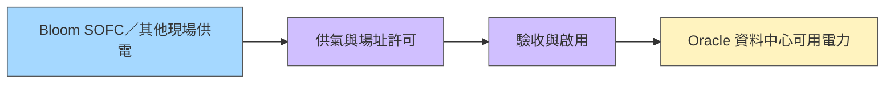

# ORCL.US(oracle)

## 基本資料

Oracle Corporation（ORCL.US）是全球最大的企業資料庫廠商，近年透過 OCI（Oracle Cloud Infrastructure）大規模切入 AI 雲端基礎設施市場。核心業務包含三大支柱：
1. **OCI（IaaS / AI Infrastructure）**：GPU 叢集、AI 訓練與推論雲端服務
2. **Oracle Database / Multi-cloud DB**：傳統 DB 領導者，持續向多雲資料庫演進（與 AWS、Azure、GCP 合作）
3. **SaaS（Fusion ERP / NetSuite / Oracle Health）**：企業 ERP、HCM、醫療記錄系統

**FY 結束月份**：5 月（FY26 = 2025 年 6 月結束）

---

## 核心技術／競爭優勢

- **OCI 差異化**：相較 AWS/Azure/GCP，OCI 以更低延遲的 RDMA 叢集網路架構及較具成本競爭力的 GPU 定價吸引 Frontier Labs（Cohere、NVIDIA 等）及大型企業
- **Multi-cloud Database**：Oracle Database @Azure / @AWS 讓企業在不遷移 workload 的前提下享用 Oracle DB 功能；F4Q26 Multi-cloud DB 營收 YoY +404%（Bookings +325%）
- **AI 資料庫功能**：Vector Search、AI Agent Memory、Deep Data Security，強化 Agent 記憶與推理治理
- **BYOH + 預付款模式**：以客戶自帶硬體或預付款合約降低 Oracle 自行承擔資本需求，累計規模達 $75bn

---

## EPS 記錄

### 近期季報

| 期間 | 總營收（$M）| OCI 營收（$M）| OCI YoY | RPO（$bn）| EPS |
|------|------------|--------------|---------|-----------|-----|
| F4Q26（2026-03~05）| 19,184 | 5,787 | +92% | 638 | $2.11 |
| F3Q26（2025-12~26-02）| 17,127 | 4,902 | +49% | 553 | — |

### FY27 展望（公司指引）

| 項目 | 指引 | 共識 | YoY |
|------|------|------|-----|
| 總營收 | $90,000M | $89,088M | **+34%** |
| CapEx | $92,500M | $69,235M | +66% |
| EPS（non-GAAP）| $8.05 | $8.06 | +6% |

---

## 目標價與評等

| 來源 | 日期 | 評等 | 目標價 | 備註 |
|------|------|------|--------|------|
| 凱基投顧 | 2026-06-11 | 正向看待（未給 TP）| — | 資料中心建置交付加速，CapEx 疑慮 |

---

## 時間軸

### 本批匿名訪談觀察（入庫 2026-10-01）

| 時間 | 事件 | 類型 | 資訊狀態 |
|---|---|---|---|
| 2026Q3–Q4（預估） | SOFC 個案供氣／營運許可與驗收 | 場址驗證 | 訪談時仍待完成，不認定已達成；[[時程_2026-2028_SOFC與載板DCI驗證]] |

### 既有時間軸

| 時間 | 事件 | 重要性 | 備註 |
|------|------|--------|------|
| 2026-06 | F4Q26 財報：OCI +92% YoY，RPO $638bn 創高 | ⭐⭐⭐⭐ | CapEx FY27 指引 $90-95bn 高於預期 34% |
| 2026-06 | 本季新增 $67bn AI 合約，累計 BYOH/預付款 $75bn | ⭐⭐⭐⭐ | 4 家客戶各簽超過 $8bn 合約 |
| FY26 全年 | 累計交付 1.2GW 資料中心容量 | ⭐⭐⭐ | F1Q27 預計再增近 1GW |
| 2027H1 | Shackleford / Doña Ana 資料中心開始客戶交付 | ⭐⭐⭐ | Shackleford 已有 115MW 上線 |
| FY27 | Oracle Health AI 版 Cerner 推出，預期重返雙位數成長 | ⭐⭐ | — |

---

## 主要風險

> [!warning]
> - **CapEx 擴張**：FY27 CapEx $90-95bn YoY +62-71%，高於市場預期 34%；計劃透過 $40bn 融資（含 $20bn ATM 增資）支應，引發股權稀釋疑慮
> - **現金流**：FY26 自由現金流 -$23.7bn；大規模資料中心 ROIC 兌現時間為市場焦點
> - **CapEx 集中度**：OCI 建置速度接近 CSP 水準（每季 1-1.2GW），需求持續驗證才能支撐估值

---

## 2026-08-29 客戶端供電訪談

[[BE.US(bloom_energy)]] 為資料中心現場 SOFC 供電方案的供應商／案例合作對象。紀要包含 Oracle 專案經驗，但受訪者雇主未確認，不能視為 Oracle 公司指引。

專家稱個案設備到場後仍需供氣、建築／消防、排放、運轉與驗收許可；不上電網不代表豁免。SOFC 個案完整部署約 9–10 個月、渦輪約 12–14 個月，與渦輪較長採購交期是不同口徑；天然氣延伸、規模與既有基礎設施均影響時程。這些是 estimate／中低信心，不是通用承諾。

EaaS 案例約 US¢14–15/kWh，電網約 8–10、渦輪約 10–12；須核對運轉時數、冗餘、儲能、維修 SLA 及燃料。轉向服務費可降低前期資本支出，仍有履約與長期成本風險。來源：[[memo_AceCamp_AI資料中心現場供電_20260829_70565950]]（2026-08-29）；上游／電堆觀察另見 [[memo_AceCamp_SOFC隔膜供應商與Bloom交付_20260829_70565484]]、[[memo_AceCamp_SOFC電堆製程與供應鏈_20260829_70566304]]。

圖說：設備與可用電力之間的驗證流程，非特定場址竣工圖。判讀見 [[分析_20260828-29專家紀要公司辨識與供給瓶頸]]。

## 來源

- [[memo_AceCamp_SOFC隔膜供應商與Bloom交付_20260829_70565484]] — AceCamp Tech，2026-08-29，匿名專家紀要。
- [[memo_AceCamp_SOFC電堆製程與供應鏈_20260829_70566304]] — AceCamp Tech，2026-08-29，匿名專家紀要。
- [[memo_AceCamp_AI資料中心現場供電_20260829_70565950]] — AceCamp Tech，2026-08-29，匿名專家紀要。

- [[報告_凱基投顧_美國軟體產業_ORCL_SNOW_MDB_20260611]]（凱基，2026-06-11；F4Q26 財報 + FY27 展望）

- [[meta-compute-neocloud]]（2026-07-02）
- [[nvidia-gpu-backstop]]（2026-07-06）
- [[報告_GFHK_Dell_20260828]]（2026-08-28）
- [[memo_索爾思光電專家會議_日期不詳]]（使用者提供；來源稱首批 1.6T 訂單預定 2026Q4 交付，會議日期未提供，待客戶／公司驗證）

## 相關頁面

- [[DELL.US(dell)]]
- [[時程_2026記憶體與AI催化劑]]
- [[META.US(meta)]]
- [[技術_GPU_Backstop]]
- [[索爾思光電（未）]]
- [[分析_索爾思光電800G與1.6T出貨追蹤]]
- [[時程_2026-2027索爾思光電]]
- [[供應鏈_AI光互聯]]
