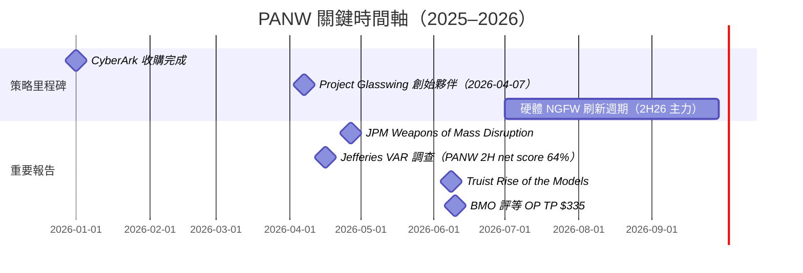

# PANW.US(palo alto networks)

## 基本資料

Palo Alto Networks 是全球最大的資安平台公司，總部位於美國加州聖塔克拉拉，2005 年由 Nir Zuk 創辦，2012 年在 NASDAQ 上市。公司從次世代防火牆（NGFW）起家，歷經多輪策略性收購（Demisto、Twistlock、Expanse、Bridgecrew、Unit 42 擴張、CyberArk 2026 年收購），演化為覆蓋網路安全（PAN-OS/SASE）、雲端安全（Prisma Cloud）、AI 驅動 SOC（Cortex/XSIAM）的三平台公司。

Anthropic Project Glasswing 的 12 家創始夥伴中，PANW 是資安廠商僅有的兩席之一（另一席為 CRWD），代表 Anthropic 對其防禦資安能力的最高信任認定。

**近期財務規模（2026 年 6 月市場資料）**

| 指標 | 數值 | 來源 |
|---|---|---|
| 市值（2026-06-10） | ~$210-228B | BMO / Truist |
| 股價（2026-06-10） | $279.53 | BMO |
| NTM EV/FCF（2026-06） | 41.7x | BMO |
| FCF Margin（CY2026E） | 37.5% | BMO |
| FCF Margin（CY2027E） | 38.9% | BMO |
| Revenue Growth（CY2026E） | 22.4% | BMO |
| Revenue Growth（CY2027E） | 17.2% | BMO |
| EV/CY27E Revenue | 14.2x | BMO |

---

## 三大平台架構

### 1. Strata（網路安全 / SASE）

| 產品 | 說明 |
|---|---|
| PAN-OS NGFW | 次世代防火牆，業界市占率最高；2026 年硬體更新週期受益 |
| Prisma SASE | 單一廠商 SASE 解決方案；Jefferies VAR 調查中 PANW 連續排名 SASE 動能第一 |
| AI-powered NGFW | 結合 Precision AI 的智慧防火牆，支援超大流量（AI 訓練 / 推論場景） |

### 2. Prisma Cloud（雲端安全）

| 產品 | 說明 |
|---|---|
| Prisma AIRS（AI Security Posture Management） | AI 工作負載的安全態勢管理，含 Shadow AI 發現 |
| CSPM / CWPP | 雲端組態安全 + 工作負載防護 |
| 代碼安全 / IaC 掃描 | Bridgecrew 技術，shift-left 雲端安全 |

### 3. Cortex（AI-SOC / XDR）

| 產品 | 說明 |
|---|---|
| Cortex XSIAM | 自主 SOC 平台，整合 SIEM + SOAR + EDR；Tier 1/2 工作自動化 |
| Precision AI | PANW 品牌 AI 引擎，驅動自動威脅分類與回應 |
| Idira（AI Identity） | 跨域身份可視性平台（UBS Gartner 峰會提及） |
| Cortex Xpanse | 外部攻擊面管理（ASM），前身為 Expanse |

### CyberArk 收購（2026 年）

Jefferies VAR 調查（2026-04-16）報告顯示 PANW 已完成對 CyberArk（CYBR）的收購，CyberArk 在特權存取管理（PAM）和 Agentic Identity Security 市場中是公認的領導者（VAR 調查 Agentic Identity 得票率 44%，遠超 MSFT 32%）。此收購大幅強化 PANW 在身份安全市場的地位。

![[報告_JPMorgan_資安_20260427_006.png]]
*JPMorgan（2026-04-27）：各資安廠商在 AI 相關資安細分領域的曝光度——PANW 在 Network / Endpoint / Identity / Data / Cloud 五大領域均有廣泛覆蓋，是涵蓋最廣的平台廠商。*

---

## Glasswing 與 AI 驅動資安定位

- **Project Glasswing 創始夥伴（2026-04-07）**：PANW 獲得 Anthropic Mythos Preview 的獨家防禦存取權，與 CRWD 並列資安廠商的最高信任地位
- **Cortex XSIAM → Agentic SOC**：部署於生產環境的 Agentic Security Workforce，完整接管 SOC Tier 1/2 自動化調查
- **平台化深化**：PANW「platformization」策略——企業整合多個安全工具至 PANW 平台，帶動 billing arrangements 和 ARR 加速

---

## 券商評等與目標價

| 報告日 | 券商 | 評等 | 目標價 | 當時股價 | 備註 |
|---|---|---|---|---|---|
| 2026-04-27 | J.P. Morgan | Overweight | — | $178.54（4/24） | Glasswing 創始夥伴 |
| 2026-06-08 | Truist Securities | Buy | — | $272.05 | Rise of the Models |
| 2026-06-10 | BMO Capital Markets | Outperform | $335 | $279.53 | 上漲空間 19.8% |
| 2026-04-16 | Jefferies VAR | 正面 | — | — | PANW 2H26 net score 64%（全場最高） |

---

## VAR 調查關鍵數據（Jefferies，2026-04-16）

| 指標 | PANW | 說明 |
|---|---|---|
| 單一廠商 SASE 動能 | 第一（遠領先） | FTNT 16%、ZS 12% |
| 2H26 vs 1H26 加速預期（net score） | **+64%**（全場最高） | 平均 +20%；PANW 大幅領先 |
| 1Q26 performance delta（yoy比較） | -3.4%（下於平均） | 季節性軟化；2H 更看好 |
| 硬體刷新預期（2026 年） | 56% VARs 選擇 2026 | 2H26 更集中（44%） |

---

## 相關公司

| 關係 | 公司 | 備註 |
|---|---|---|
| 主要競品（整合） | [[CRWD.US(crowdstrike)]] | 雙雄格局；均為 Glasswing 創始夥伴 |
| 主要競品（SASE） | [[ZS.US(zscaler)]] | SASE 市場直接競爭 |
| 主要競品（觀測性+安全） | [[DDOG.US(datadog)]] | Chronosphere 後衝擊 DDOG |
| 子品牌（收購） | CyberArk（已並入） | Agentic Identity、PAM 市場領導者 |
| AI 模型合作夥伴 | Anthropic（未建頁） | Glasswing 創始夥伴 |
| 相關技術 | [[技術_可觀測性]] | PANW Chronosphere vs DDOG |

---

## 時間軸 / 關鍵催化劑

---

## 來源

- [[報告_JPMorgan_資安_20260427]] — J.P. Morgan，Weapons of Mass Disruption，2026-04-27
- [[報告_Truist_MythosAndDaybreak_20260608]] — Truist，Rise of the Models，2026-06-08
- [[報告_UBS_Gartner資安峰會_20260609]] — UBS，Gartner 安全峰會，2026-06-09
- [[報告_BMO_資安可觀測性_20260612]] — BMO，資安可觀測性，2026-06-12
- [[報告_Jefferies_資安_20260416]] — Jefferies VAR Survey，2026-04-16
