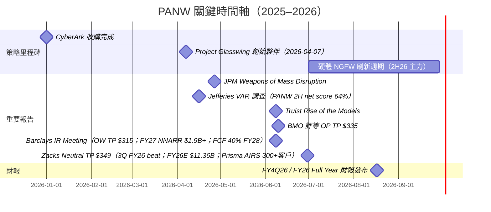

# PANW.US(palo alto networks)

## 基本資料

Palo Alto Networks 是全球最大的資安平台公司，總部位於美國加州聖塔克拉拉，2005 年由 Nir Zuk 創辦，2012 年在 NASDAQ 上市。公司從次世代防火牆（NGFW）起家，歷經多輪策略性收購（Demisto、Twistlock、Expanse、Bridgecrew、Unit 42 擴張、CyberArk 2026 年收購），演化為覆蓋網路安全（PAN-OS/SASE）、雲端安全（Prisma Cloud）、AI 驅動 SOC（Cortex/XSIAM）的三平台公司。

Anthropic Project Glasswing 的 12 家創始夥伴中，PANW 是資安廠商僅有的兩席之一（另一席為 CRWD），代表 Anthropic 對其防禦資安能力的最高信任認定。

**近期財務規模**

| 指標 | 數值 | 來源 |
|---|---|---|
| 市值（2026-06-29） | $270.6B | Zacks，2026-06-30 |
| 股價（2026-06-29） | $332.00 | Zacks |
| 52 週區間 | $139.57 – $341.83 | Zacks |
| YTD 漲幅 | +80.2% | Zacks |
| Beta | 0.94 | Zacks |
| P/E TTM | 88.3x | Zacks |
| P/E F1（FY27） | 60.6x | Zacks |
| P/S TTM | 25.5x | Zacks |
| NTM EV/FCF（2026-06） | 41.7x | BMO |
| FCF Margin（CY2026E） | 37.5% | BMO |
| Revenue Growth（CY2026E） | 22.4% | BMO |

---

## 三大平台架構

### 1. Strata（網路安全 / SASE）

| 產品 | 說明 |
|---|---|
| PAN-OS NGFW | 次世代防火牆，業界市占率最高；2026 年硬體更新週期受益 |
| Prisma SASE | 單一廠商 SASE 解決方案；Jefferies VAR 調查中 PANW 連續排名 SASE 動能第一 |
| AI-powered NGFW | 結合 Precision AI 的智慧防火牆，支援超大流量（AI 訓練 / 推論場景） |

### 2. Prisma Cloud（雲端安全）

| 產品 | 說明 |
|---|---|
| Prisma AIRS（AI Security Posture Management） | AI 工作負載的安全態勢管理，含 Shadow AI 發現 |
| CSPM / CWPP | 雲端組態安全 + 工作負載防護 |
| 代碼安全 / IaC 掃描 | Bridgecrew 技術，shift-left 雲端安全 |

### 3. Cortex（AI-SOC / XDR）

| 產品 | 說明 |
|---|---|
| Cortex XSIAM | 自主 SOC 平台，整合 SIEM + SOAR + EDR；Tier 1/2 工作自動化 |
| Precision AI | PANW 品牌 AI 引擎，驅動自動威脅分類與回應 |
| Idira（AI Identity） | 跨域身份可視性平台（UBS Gartner 峰會提及） |
| Cortex Xpanse | 外部攻擊面管理（ASM），前身為 Expanse |

### CyberArk 收購（2026 年）

Jefferies VAR 調查（2026-04-16）報告顯示 PANW 已完成對 CyberArk（CYBR）的收購，CyberArk 在特權存取管理（PAM）和 Agentic Identity Security 市場中是公認的領導者（VAR 調查 Agentic Identity 得票率 44%，遠超 MSFT 32%）。此收購大幅強化 PANW 在身份安全市場的地位。

![[報告_JPMorgan_資安_20260427_006.png]]
*JPMorgan（2026-04-27）：各資安廠商在 AI 相關資安細分領域的曝光度——PANW 在 Network / Endpoint / Identity / Data / Cloud 五大領域均有廣泛覆蓋，是涵蓋最廣的平台廠商。*

---

## Glasswing 與 AI 驅動資安定位

- **Project Glasswing 創始夥伴（2026-04-07）**：PANW 獲得 Anthropic Mythos Preview 的獨家防禦存取權，與 CRWD 並列資安廠商的最高信任地位
- **Cortex XSIAM → Agentic SOC**：部署於生產環境的 Agentic Security Workforce，完整接管 SOC Tier 1/2 自動化調查
- **平台化深化**：PANW「platformization」策略——企業整合多個安全工具至 PANW 平台，帶動 billing arrangements 和 ARR 加速

---

## 券商評等與目標價

| 報告日 | 券商 | 評等 | 目標價 | 當時股價 | 備註 |
|---|---|---|---|---|---|
| 2026-06-30 | Zacks | Neutral（自 2024-11-22；前 Outperform） | $349 | $332.00（6/29）| 21.01x fwd 12m sales；Rank 3-Hold；VGM:F |
| 2026-06-10 | BMO Capital Markets | Outperform | $335 | $279.53 | 上漲空間 19.8% |
| 2026-06-08 | Barclays | Overweight | $315 | $272.05（6/5） | IR meeting；NNARR FY27 $1.9B+；FCF 40% FY28 |
| 2026-06-08 | Truist Securities | Buy | — | $272.05 | Rise of the Models |
| 2026-04-27 | J.P. Morgan | Overweight | — | $178.54（4/24） | Glasswing 創始夥伴 |
| 2026-04-16 | Jefferies VAR | 正面 | — | — | PANW 2H26 net score 64%（全場最高） |

---

## NNARR 與 FCF 路徑（Barclays，2026-06-08 IR Meeting）

Barclays（Saket Kalia）與 PANW IR Hamza Fodderwala 會後三大要點：

- **4Q26 有機 NNARR 上調 $20M+**：4Q26 NNARR 中位數 $795M（vs 前引導 $620M），增量 $175M 中 $150-160M 為 Chronosphere（frontier lab 客戶）+ CyberArk 貢獻，有機上調 ~$20M
- **FY27 NNARR 路徑 $1.9B+（→ ARR $10.8-10.9B）**：三個變數：(1) Chronosphere 因 frontier lab 大客戶 comp 趨難，FY27 NNARR 可能 YoY 下降；(2) Prisma Cloud / Expanse / XSOAR 合計 ~$600-700M ARR 不成長，FY27 headwind 收斂；(3) Mythos 在 FY27 是否有助益尚未入模型
- **NetSec 佔 70% 且加速 → 支撐 FY28 FCF 40% 路徑**：TTM 防火牆訂單 +19%（vs 11%），SASE ARR YoY +40%；NetSec 加速可縮短 billings duration 下行，疊加 CYBR 費用協同效應，強化 FY28 FCF margin 40% 目標

> 訂閱收入成長討論：軟體防火牆 rev-rec 前置比例從 30% 升至 40%（導致訂閱比例下降），加上 Prisma Cloud 拖累，是「訂閱收入減速」的機制性原因而非基本面惡化。FY27 起將改為揭露三產品族（NetSec / Identity / Cortex）及 Total Recurring Revenue，雜訊將降低。

---

## EPS 記錄

| 年度 | 季度 | Revenue | Non-GAAP EPS | Billings | 備註 |
|------|------|---------|-------------|----------|------|
| FY25A | — | $9,222M | $3.34 | — | +15% YoY |
| FY26A | 1Q | $2,474M | $0.93 | — | Actual |
| FY26A | 2Q | $2,594M | $1.03 | — | Actual |
| FY26A | 3Q | $3,002M（+31%）| $0.85（beat $0.81+4.9%）| — | NGS ARR $8.13B +60%；RPO $18.4B +36% |

## EPS 預估

| 年度 | Q1 Rev E | Q2 Rev E | Q3 Rev E | Q4 Rev E | Annual Rev | EPS（Annual）|
|------|---------|---------|---------|---------|-----------|------------|
| FY26E | 2,474A | 2,594A | 3,002A | 3,351E | $11,359M | $3.71（Non-GAAP） |
| FY27E | 3,193E | 3,295E | 3,436E | 3,727E | $13,684M | $3.99（Non-GAAP） |

> 管理層 FY26 Guidance：Revenue $11.41-11.42B（+24%）、Non-GAAP EPS $3.77-3.79、FCF Margin 37.5%；4Q26E Rev $3.34-3.35B（+32%）、EPS $0.96-0.98

---

## 3Q FY26 財報重點（2026-06 公布）

- **Revenue $3.0B** (+31% YoY)；Non-GAAP EPS $0.85（beat 街頭 $0.81 by 4.9%）
- **NGS ARR $8.13B** (+60% YoY)，包含 CyberArk + Chronosphere；有機 NGS ARR +28%
- **RPO $18.4B** (+36% YoY)；有機 RPO +22%
- **SASE ARR $1.6B** (+40% YoY)，市場成長 2 倍速；12 個月 SASE NNARR +50%
- **Prisma AIRS**：季末客戶 300+ 家（vs 2Q 末 100 家），最快速成長產品
- **SecOps**：740 客戶，ARR $600M+，YoY +100%；多數客戶威脅回應 <10 分鐘
- **Product Revenue $594M** (+31%)；硬體佔總收入 ~10%，3Q 為十年最佳硬體季
- **Adjusted FCF $910M**（vs 去年 $578M）；TTM FCF Margin 38.5%（+430bps）
- **下季指引（4Q26E）**：Revenue $3.34-3.35B (+32%)、NGS ARR $8.90-8.95B、RPO $20.9-21.0B

> **財報日（FY4Q26 / FY26 Full Year）**：2026-08-17

---

## 近期重大收購

| 完成時間 | 收購對象 | 金額 | 戰略目的 |
|---------|---------|------|--------|
| 2026 年初 | CyberArk | $25B | PAM + Agentic Identity；首季超內部預期；1,000+ 聯合客戶接觸 |
| 2025-11 宣布→2026 完成 | Chronosphere | $3.35B | AI-driven 觀測性（Observability）；ARR $300M+，收購後幾乎翻倍 |
| 2026-05-29 | Portkey | 未揭露 | Prisma AIRS AI Gateway；監控、協調、治理 AI Agent |
| 2026-04-14 | Koi | 未揭露 | Agentic Endpoint Security；保護 AI 代理、工具與腳本 |

---

## VAR 調查關鍵數據（Jefferies，2026-04-16）

| 指標 | PANW | 說明 |
|---|---|---|
| 單一廠商 SASE 動能 | 第一（遠領先） | FTNT 16%、ZS 12% |
| 2H26 vs 1H26 加速預期（net score） | **+64%**（全場最高） | 平均 +20%；PANW 大幅領先 |
| 1Q26 performance delta（yoy比較） | -3.4%（下於平均） | 季節性軟化；2H 更看好 |
| 硬體刷新預期（2026 年） | 56% VARs 選擇 2026 | 2H26 更集中（44%） |

---

## 2026Q2 資安通路與 AI 安全更新

- Truist（2026-06-08）與 UBS（2026-06-09／07-14）將 PANW 視為平台化與 AI-SOC 受惠者；Project Glasswing 創始夥伴、Cortex XSIAM、Prisma AIRS 與既有平台整合是正面 thesis，仍須由訂單與 ARR 驗證。
- Barclays（2026-07-07）通路回饋顯示硬體刷新、Prisma Browser、Chronosphere、Prisma AIRS 與 XSIAM 可擴大企業協議金額；XSIAM 取代舊 SIEM 的案例使單筆機會增加約 30–40%，屬通路觀察。
- Evercore（2026-07-07）維持對 PANW 正面，並指出 AI 資安急迫性升高、硬體需求仍強；Wells Fargo（2026-07-20）將 CYBR／PANW 列為調查中較佳的 2Q26 表現組合，評價與後續執行仍需觀察。

## 相關公司

| 關係 | 公司 | 備註 |
|---|---|---|
| 主要競品（整合） | [[CRWD.US(crowdstrike)]] | 雙雄格局；均為 Glasswing 創始夥伴 |
| 主要競品（SASE） | [[ZS.US(zscaler)]] | SASE 市場直接競爭 |
| 主要競品（觀測性+安全） | [[DDOG.US(datadog)]] | Chronosphere 後衝擊 DDOG |
| 子品牌（收購） | CyberArk（已並入） | Agentic Identity、PAM 市場領導者 |
| AI 模型合作夥伴 | Anthropic（未建頁） | Glasswing 創始夥伴 |
| 相關技術 | [[技術_可觀測性]] | PANW Chronosphere vs DDOG |

---

## 時間軸

---

## 來源

- [[報告_JPMorgan_資安_20260427]] — J.P. Morgan，Weapons of Mass Disruption，2026-04-27
- [[報告_Truist_MythosAndDaybreak_20260608]] — Truist，Rise of the Models，2026-06-08
- [[報告_UBS_Gartner資安峰會_20260609]] — UBS，Gartner 安全峰會，2026-06-09
- [[報告_BMO_資安可觀測性_20260612]] — BMO，資安可觀測性，2026-06-12
- [[報告_Jefferies_資安_20260416]] — Jefferies VAR Survey，2026-04-16
- [[報告_Barclays_PANW_IRMeeting_20260608]] — Barclays，IR Meeting 三大要點，2026-06-08
- [[報告_Zacks_PANW_20260630]] — Zacks，Neutral TP $349，3Q FY26 beat 詳析，2026-06-30

### 本批新增來源

- [[Cybersec 260608 Truist_The age of Mythos & Daybreak]] — Truist，2026-06-08
- [[Cybersec 260609 UBS_Themes from Gartner security conference]] — UBS，2026-06-09
- [[Cybersec 260707 Barclays_Security VaR Call]] — Barclays，2026-07-07
- [[Cybersec 260707 Evercore_Cybercheck round 1]] — Evercore ISI，2026-07-07
- [[Cybersec 260714 UBS_Positive June Q checks]] — UBS，2026-07-14
- [[Cybersec 260720 WF_2Q26 on-cycle security reseller survey]] — Wells Fargo，2026-07-20

## 相關頁面

- [[分析_RBRK_Rubrik]]
- [[時程_2026Q3Q4_AI網通與硬體催化劑]]
- [[CHKP.US(check point software)]]
- [[分析_Check Point_GTM轉型與AI資安2026]]
- [[FTNT.US(fortinet)]]
- [[NET.US(cloudflare)]]
- [[RBRK.US(rubrik)]]
- [[SAIL.US(sailpoint)]]
- [[分析_AI驅動資安支出2026]]
- [[分析_DevSecOps_AI安全衝擊]]
- [[技術_EDR與XDR]]
- [[技術_SASE]]
