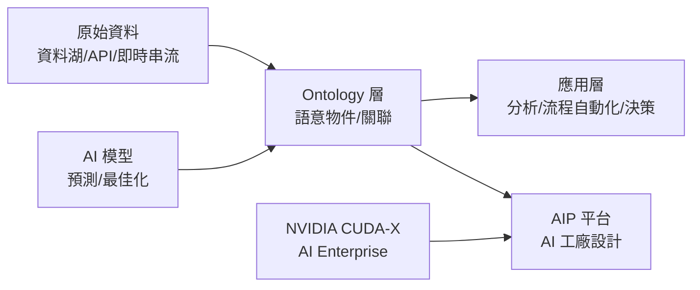

# PLTR.US(palantir)

## 基本資料

Palantir Technologies（PLTR.US）是大數據與 AI 應用平台公司，協助政府與企業從海量數據中洞察決策。起初以美國國防/情報應用為核心（Gotham 平台），近年快速擴張至企業商業客戶（Foundry + AIP 平台）。

FY3Q25 營收 11.81 億美元（YoY +62.8%），Rule of 40 達 114（業界頂尖）；美國商業客戶 530 家，YoY +108 家。公司上調 FY2025 全年財測至 43.96–44 億美元。

成長驅動：AIP（AI Platform）與 LLM 整合帶動美國商業客戶快速滲透；NVIDIA 合作推出「AI 工廠設計」，有望加速政府和企業 AI 導入。

資料來源：[[報告_中信_Palantir_PLTR_20251104]]（2025-11-04，中信投顧，張家瑜）

## 核心技術／競爭優勢

- **Ontology 壁壘**：以結構化語意模型打破企業數據孤島，資料→模型→Ontology→應用三層架構難以替代，客戶切換成本極高
- **政府國防高壁壘**：Gotham 平台服務 CIA、FBI、美國國防部、NATO 等頂級安全客戶，同業幾乎無法切入；美軍要求所有部隊整合至 Vantage 平台（Foundry+AIP）
- **AIP 平台加速商業滲透**：AIP 結合 LLM，讓企業以自然語言操作數據、流程與決策，1,000 億美元以上合約 53 筆（vs 上季 42 筆）
- **NVIDIA 合作「AI 工廠」**：結合 NVIDIA CUDA-X、AI Enterprise 與 Nemotron 推理模型，在 Palantir AIP 平台運行，加速企業/政府 AI 部署；對 Palantir 有助於商業擴張與政府 AI 導入速度
- **自主代理系統（AI Hivemind）**：協調生成式 AI 代理，自主生成可行決策，進一步拉開與通用 AI 平台的差距

## 產品與應用

| 產品 / 服務 | 應用 | 相關客戶 / 下游 |
|-------------|------|-----------------|
| Gotham | 政府情報/國防反恐/犯罪偵防 | CIA、FBI、DoD、NATO、英國政府 |
| Foundry | 企業數據整合、供應鏈/財務決策 | 全球大型企業 |
| AIP（AI Platform） | 自然語言操作數據、LLM 工作流自動化 | 美國商業客戶（530家，快速成長）|
| Apollo | 多雲/邊緣版本控制與更新 | 搭配 Gotham/Foundry 部署 |
| AI FDE / AI Hivemind | 資料整合代理 / 自主決策系統 | 企業/政府 AI 升級 |

## 圖片 / 架構圖

`[待補來源圖]` 需官方 AIP／平台架構投資人日簡報截圖佐證；上方為自製業務流程示意圖。

> Palantir Ontology 是核心壁壘：將分散的企業/政府數據轉化為語意一致的可操作模型，上層 AIP 再以 LLM 讓非技術用戶直接使用。

## EPS 記錄

| 季度 | EPS (美元) | YoY | 備註 |
|------|-----------|-----|------|
| FY3Q25 | 0.21 | +110% | 優市場預期 0.17 美元；Rule of 40 = 114 |
| FY4Q25(F) | 0.19 | — | |

## EPS 預估

| 年度 | 中信投顧 EPS（報告日：2025-11-04） | 備註 |
|------|-----------------------------------|------|
| FY2025F | 0.69 | 營收 43.84 億美元，YoY +53% |
| FY2026F | 0.96 | 營收 61.91 億美元，YoY +41.2% |
| FY2027F | 1.22 | 營收 83.74 億美元，YoY +35.3% |

## 目標價與評等

| 券商 | 報告發布日 | 評等 | 目標價 | 評價基礎 | 來源 |
|------|------------|------|--------|----------|------|
| 中信投顧 | 2025-11-04 | 買進 | 235 美元 | 75x 2027F Revenue PSR | [[報告_中信_Palantir_PLTR_20251104]] |

## 時間軸

| 時間 | 事件 | 類型 | 重要性 | 備註 |
|------|------|------|--------|------|
| 2025-10-28 | NVIDIA GTC：Palantir × NVIDIA AI 工廠設計公布 | 合作 | ⭐⭐⭐ | 加速企業/政府 AI 部署 |
| 持續 | 美軍所有部隊整合至 Vantage 平台 | 政府滲透 | ⭐⭐⭐ | 政府段強力護城河 |
| 持續 | 美國商業客戶數快速增長（530家，季增 45家） | 商業擴張 | ⭐⭐⭐ | AIP 驅動滲透率提升 |
| 2025Q4+ | 亞洲/中東市場商業擴張 | 地域擴張 | ⭐⭐ | 目前仍以美國為重心 |

## 供應鏈位置

- 合作夥伴：[[NVDA.US(nvidia)]]（AI 工廠設計合作，CUDA-X/NIM 整合）
- 平台生態：Microsoft Azure、AWS、Google Cloud（多雲部署）
- 所屬供應鏈：供應鏈_企業AI軟體

## 相關公司

| 公司 | 關係 | 說明 |
|------|------|------|
| [[NVDA.US(nvidia)]] | 技術合作夥伴 | AI 工廠設計合作，CUDA-X 基礎架構整合 |

> [!warning] 風險與注意事項
> - **高估值風險**：75x PSR 極高，任何成長放緩將導致大幅回調
> - **海外市場擴張緩慢**：歐洲 AI 落地趨勢仍慢，國際市場成長不如美國
> - **政府合約集中**：美國政府端佔比雖已降至 25% 左右，但政策/預算變化仍有影響
> - **競爭加劇**：Databricks、Snowflake、ServiceNow 等企業 AI 平台競爭加劇

## 來源

- [[報告_中信_Palantir_PLTR_20251104]]（2025-11-04，中信投顧，張家瑜）

### 2026-08-23 CTBC 更新

- [[Palantir(PLTR,B_買進)-CTBC260804]]（中信投顧，2026-08-04）整理 FY2Q26 營收 US$1.935bn、Non-GAAP EPS US$0.41、Rule of 40 155，並指出 FY2026 營收中位數上修至 US$8.14bn；數字屬公司揭露／券商整理。
- AI 主權、AIP 平台用量與美國商業／政府客戶擴大採購是本批主要 thesis；雲端託管成本、估值與政府合約仍是風險。

### 2026-08-23 來源圖

![[Palantir(PLTR,B_買進)-CTBC260804_002.png]]

圖說：中信投顧整理的 Palantir Rule of 40 趨勢，作為 FY2Q26 獲利與成長品質觀察。
