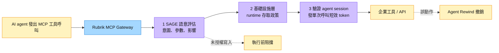

# RBRK.US(rubrik)

## 基本資料

Rubrik 是全球領先的資料安全（Data Security）與網路韌性（Cyber Resilience）平台，總部位於美國加州帕羅奧圖，2014 年由 Bipul Sinha（CEO）等人創辦，2024 年 4 月在 NYSE 上市（代號：RBRK）。公司從企業備份（Backup）起家，演化為整合 DSPM（資料安全態勢管理）、身份安全（Identity）、AI 代理人治理（Agent Cloud）的網路韌性平台。

Rubrik 的定位核心是「assume breach」——假設企業一定會遭受攻擊，因此投資重點在於備份完整性、快速恢復（Restore）、與攻擊後的精確復原。

**近期財務規模（2026 年 6 月市場資料）**

| 指標 | 數值 | 來源 |
|---|---|---|
| 市值（2026-06-10） | ~$14.5B | BMO |
| 股價（2026-06-10） | $71.45（BMO）/ $73.41（Truist） | BMO / Truist |
| NTM EV/FCF（2026-06） | 41.5x（↓ from 59.5x on 1/1/26） | BMO |
| FCF Margin（CY2026E） | 18.1% | BMO |
| FCF Margin（CY2027E） | 20.4% | BMO |
| Revenue Growth（CY2026E） | 26.3% | BMO |
| Revenue Growth（CY2027E） | 21.7% | BMO |
| TAM（2029E） | $125B，20% CAGR（含 AI 機會） | Rubrik 管理層 |
| 身份 ARR（1 年） | $50M（Identity 業務） | BMO |

---

## 核心平台：RSC（Rubrik Security Cloud）

### 1. 資料備份與恢復（核心業務）

- 覆蓋 Data Center、Cloud、SaaS 三大環境
- 自動備份與「乾淨恢復（Clean Restore）」：確保恢復的資料不含惡意程式
- 最小可行業務（MVB）定義：客戶預先設定業務恢復的最低必要系統，確保攻擊後快速復原

### 2. Rubrik AI（2026 年新產品）

- **Preemptive Recovery Engine**：在「和平時期」主動索引與分類敏感資料，實現攻擊後自動化、快速的精確恢復
- 自動化架構：人類「督導、指示、審查、批准」，執行由 AI agents 完成
- 對抗「乾淨恢復」挑戰：BMO 指出 Gartner 峰會用戶普遍關注如何確保恢復的資料乾淨（無惡意程式），是 Rubrik AI 的核心賣點

### 3. Rubrik Agent Cloud（代理人雲端安全）

Rubrik 將觸角延伸至 AI 代理人治理領域：

| 組件 | 功能 |
|---|---|
| Agent Monitoring（編排層） | 監控 AI 代理人行為、識別異常 |
| Agent Guardrails | 定義代理人行為邊界與政策 |
| Agent Remediation | 修改代理人目的或行為（含 rewind 功能） |

現狀：Agent Cloud 仍在客戶評估中，有大量廠商提供類似解決方案（ZS、Rubrik、SailPoint 等），BMO 認為此業務若成功變現將代表中期上行。

#### Agent Cloud 演進與 Agent Identity（網路搜尋補強，2026-10-05）

Rubrik 把備份的「時間點還原」能力搬到 agent：別家主打攔截，Rubrik 主打 agent 做錯事之後可以撤銷（Agent Rewind）。2026-08 起再加上每次工具呼叫的身份控管。來源：[[research_Rubrik_Agent防護_20261005]]。

| 時間 | 事件 | 內容 | 狀態 |
|---|---|---|---|
| 2025-08 | Agent Rewind 發表 | 與 Rubrik Security Cloud 整合，精準回復 agent 造成的變更 | 首發 |
| 2025-10 | Agent Cloud 首發 | Agent Monitor（自動發現 Azure／AWS、M365、Agentforce、OpenAI、Copilot Studio、Bedrock 上的 agent）、Agent Govern、Agent Remediate | limited early access |
| 2026-02-18 | Agent Cloud GA | 新增對 prompt 與回應／工具呼叫的政策控制 | 僅見搜尋摘要（Virtualization Review 標題），原文擷取失敗，低信心 |
| 2026-04-22 | Agent Cloud for Gemini Enterprise | Agent Inventory、SAGE（Semantic AI Governance Engine，語意判斷 agent 意圖）、Agent Rewind | beri.net 稱未公布定價與 GA |
| 2026-06-09 | Agent Cloud for Claude Code／Cowork（Rubrik FORWARD） | Codebase Resilience 為 GitHub／Azure DevOps 存外部不可變快照，可還原被 force-push 或刪分支的程式庫；備份並監控 CLAUDE.md、settings、skills、工具權限等 agent 設定，偵測漂移 | GA |
| 2026-06-09 | Project Hourglass | Cognizant、Deloitte、LTM、HCLTech、NTT Data、Wipro 六家 GSI 轉售與內嵌 Agent Cloud for Claude Code | 通路計畫 |
| 2026-08（Black Hat） | Agent Identity | 每次 MCP 工具呼叫用 On-Behalf-Of 聯邦委派、即時發一次性短效 token，消除常駐權限；整合 [[OKTA.US(okta)]] 與 Microsoft Entra ID | 發表，未見 GA 日期 |

圖說：依 Agent Identity 新聞稿整理的 MCP Gateway 三道檢查與 Rewind 補救流程（概念圖，非公司官方架構圖；來源無適用示意圖，待補來源圖）。

- 公司引用 Rubrik Zero Labs：86% IT 與資安主管預期 agent 會在一年內超出現有防護，只有 23% 能完整看見環境中的 agent；88% 擔心 agentic 威脅下達不到復原時間目標（公司自家調查，中信心）。
- beri.net（2026-04-28）的反方觀點：SAGE 的語意治理部分是行銷包裝，多家廠商都在做護欄評估；Agent Rewind 較能防守，因為仰賴 Rubrik 既有的日誌與時間點還原基礎設施。Google、AWS、Microsoft 也在做平台內建的 agent 控制。
- 十家比較見 [[分析_資安十強Agent端防護比較_20261005]]。

### 4. DSPM（資料安全態勢管理）

- 由 Securiti AI 收購帶入的能力
- 協助客戶識別、分類並減少冗餘備份資料，省出預算再投資 Rubrik
- 客戶發現節省備份成本後，傾向將省下的費用購買更多 Rubrik 授權

---

## 長期財務模型更新（Rubrik 2026 分析師活動）

| 指標 | 舊目標（IPO 前） | 新目標 |
|---|---|---|
| 長期毛利率 | 75-80% | 77-82% |
| R&D 佔收入 | 14-17% | 14-16% |
| 長期非 GAAP 營業利益率 | ~20% | 20%+ |
| FCF Margin 長期 | 25%+ | 25%+（維持） |
| Non-GAAP 盈虧平衡時點 | — | FY27 |

---

## 投資觀察

### 核心多頭論點

1. **AI 時代的備份升級**：AI 降低攻擊成本至接近零，攻擊速度壓縮；備份與快速恢復作為最後防線，需求結構性上升
2. **TAM 擴張至 $125B**：含 Data Center（$40B）+ Cloud（$30B）+ SaaS（$15B）+ DSPM（$20B）+ AI（$20B）
3. **「Assume Breach」定位**：在其他廠商主攻預防時，Rubrik 押注「被攻擊後的韌性」，定位差異化
4. **高 ARR 復發性**：訂閱 ARR 90% 雲端化（FY27 前完成）；高留存、模塊擴張驅動長期成長
5. **競爭地位**：Veeam PoC 勝率 60-65%，Commvault / Cohesity 以上；vs 傳統廠商 Dell/IBM 達 90%+

### 主要風險

- Agent Cloud 仍屬早期（BMO：需要新預算），變現時間表不確定
- Annapurna（AI 資料解鎖）也屬早期，中期上行機會但非短期業績驅動
- SBC（股票補償）佔 FCF 比率偏高，需逐步降至個位數股權稀釋

---

## 券商評等與目標價

| 報告日 | 券商 | 評等 | 目標價 | 當時股價 | 上漲空間 |
|---|---|---|---|---|---|
| 2026-06-08 | Truist Securities | Buy | — | $73.41 | — |
| 2026-06-10 | BMO Capital Markets | Outperform | $87 | $71.45 | +21.8% |

---

## 相關公司

| 關係 | 公司 | 備註 |
|---|---|---|
| 主要競品（備份） | Veeam（未建頁） | ARR $2.1B，市占率領先；PoC 勝率 60-65% vs Rubrik |
| 主要競品（備份） | Commvault（未建頁） | 傳統備份，Rubrik 高勝率 |
| 資料保護整合 | [[SAIL.US(sailpoint)]] | 身份治理 + 資料安全的協作 |
| 資安生態系 | [[CRWD.US(crowdstrike)]] | Rubrik 與 Falcon 在攻擊後恢復上可協作 |
| DSPM 競品 | Varonis（未建頁） | 資料存取治理 |
| 身份整合 | [[OKTA.US(okta)]] | Agent Identity 整合 Okta 與 Entra ID 延伸既有企業身份，不另建目錄（2026-08）；來源 [[research_Rubrik_Agent防護_20261005]] |
| AI 模型合作 | Anthropic（未建頁） | Agent Cloud for Claude Code／Cowork 與 Anthropic 合作推出（2026-06-09） |

## 時間軸

| 時間 | 事件 | 類型 | 來源 |
|---|---|---|---|
| 2025-10 | Agent Cloud 首發（limited early access） | 產品 | [[research_Rubrik_Agent防護_20261005]] |
| 2026-04-22 | Agent Cloud for Gemini Enterprise（Google Cloud Next） | 產品 | 同上 |
| 2026-06-09 | Agent Cloud for Claude Code／Cowork GA、Project Hourglass 六家 GSI | 產品／通路 | 同上 |
| 2026-08 | Agent Identity 發表（Black Hat） | 產品 | 同上 |

---

## 來源

- [[research_Rubrik_Agent防護_20261005]] — 網路搜尋，2026-10-05 擷取：Agent Identity 新聞稿轉載（2026-08）、Agent Cloud for Claude Code 新聞稿（2026-06-09）、SiliconANGLE（2026-06-09）、beri.net（2026-04-28）、Agent Cloud 首發轉載（2025-10）。
- [[報告_Truist_MythosAndDaybreak_20260608]] — Truist，Rise of the Models，2026-06-08
- [[報告_BMO_資安可觀測性_20260612]] — BMO，資安可觀測性（Rubrik 分析師活動），2026-06-12

- [[Cybersec 260608 Truist_The age of Mythos & Daybreak]]（2026-06-08）

## 相關頁面

- [[分析_RBRK_Rubrik]]
- [[分析_AI驅動資安支出2026]]
- [[分析_資安十強Agent端防護比較_20261005]]
