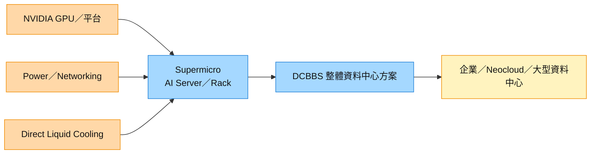

# SMCI.US(supermicro)

## 基本資料

Super Micro Computer（NASDAQ: SMCI）是 AI GPU 伺服器、HPC、儲存、網路與液冷系統供應商，正由單機伺服器廠轉向 Data Center Building Block Solution（DCBBS）整體資料中心整合平台。FY26 營收 US$39.1bn，年增 78%；國泰 2026-08-13 報告轉述公司 FY27 營收指引 US$65–72bn，成長取決於 GB300／Blackwell、整機櫃與液冷部署速度。

主要客戶涵蓋企業、OEM 與大型資料中心業者；FY26Q4 企業／通路與 OEM／大型資料中心營收各占約 50%。供應鏈位置介於 [[NVDA.US(nvidia)]] 等運算平台與終端資料中心之間，並把電源、網路、液冷、管理軟體及現場服務整合成整體方案。資料來源：[[報告_國泰_SuperMicroFY26財報_20260813]]（2026-08-13）。

## 核心技術／競爭優勢

- **DCBBS 模組化整合**：從 GPU／CPU、儲存、網路、電源到液冷與軟體採積木式設計，縮短大型叢集部署時間。
- **液冷量產規模**：報告轉述全球總產能超過每月 6,000 櫃，其中液冷機櫃超過 3,000 櫃；屬公司／券商轉述、信心中。
- **新平台導入速度**：產品涵蓋 GB300 NVL72、HGX B300／B200 與 Blackwell AI rack，可承接 GPU 世代切換。
- **整體資料中心服務**：由硬體銷售延伸到機房設計、現場部署、管理軟體與維運，長期目標是提高服務收入與毛利。

## 產品與應用

| 產品 / 服務 | 應用 | 相關客戶 / 下游 |
|-------------|------|-----------------|
| GB300 NVL72／HGX B300 AI 系統 | 大型 AI 訓練與推理 | 企業、Neocloud、資料中心業者 |
| 直接液冷整機櫃 | 高功耗 GPU 叢集 | 大型 AI 資料中心 |
| DCBBS 整體方案 | 電源、網路、液冷與軟體整合 | 企業與 OEM 客戶 |
| 通用伺服器、儲存與 IoT | 企業運算與邊緣應用 | 企業／通路 |

## 圖片 / 架構圖

圖說：Supermicro 把運算平台、電源、網路與液冷整合成 DCBBS，再交付企業、Neocloud 與大型資料中心；本次來源沒有可用產品圖，故以架構圖補位。

## EPS 記錄

| 期間 | GAAP EPS（US$） | Non-GAAP EPS（US$） | 備註 |
|------|----------------|---------------------|------|
| FY26Q4 | 1.62 | 1.70 | 營收 US$11.12bn、GAAP GM 17.5%；report fact、信心中 |
| FY26 | 5.10 | 3.63 | 券商整理口徑；需留意 GAAP／Non-GAAP 定義差異 |

## EPS 預估

| 年度 | 國泰整理（報告日：2026-08-13） | 備註 |
|------|--------------------------------|------|
| FY27E | US$8.90 | estimate；營收 US$68.5bn 中位情境 |
| FY28E | US$11.20 | estimate；Rubin、液冷與服務占比提升假設 |

## 時間軸

| 時間 | 事件 | 類型 | 重要性 | 備註 |
|------|------|------|--------|------|
| FY27 | 營收指引 US$65–72bn | 放量 | ⭐⭐⭐ | GB300／Blackwell、液冷與 backlog 轉換；公司指引轉述 |
| FY27–FY28 | DCBBS 軟體與維運服務提高占比 | 產品組合 | ⭐⭐ | 券商 thesis、信心中 |
| FY28 | Rubin 平台開始貢獻 | 新平台 | ⭐⭐⭐ | estimate；實際時程仍依 NVIDIA 與客戶機房就緒度 |

→ 跨公司時程詳見 [[時程_2026記憶體與AI催化劑]]。

## 供應鏈位置

- 上游平台：[[NVDA.US(nvidia)]] 的 GB300／Blackwell 與後續 Rubin。
- 系統整合：AI server、整機櫃、液冷、電源、網路與軟體。
- 下游：企業、Neocloud 與大型資料中心業者。
- 所屬主題鏈：[[供應鏈_AI伺服器散熱]]、[[供應鏈_AI伺服器PCB]]。

## 相關公司

| 公司 | 關係 | 說明 |
|------|------|------|
| [[NVDA.US(nvidia)]] | 上游平台夥伴 | GB300 NVL72、HGX B300／B200 與後續 Rubin 平台 |

> [!warning] 風險與注意事項
> - **建設時程**：客戶端電力、液冷與機房未就緒，會使大型專案收入延後；延後不等於取消。
> - **存貨與現金流**：FY26Q4 存貨約 US$12.9bn，高成長期的備貨與營運資金可能壓低自由現金流。
> - **公司治理**：歷史上曾有財報延遲、內控與會計爭議；若再出現 SEC 調查或揭露延遲，估值可能受壓。
> - **券商整理口徑**：US$60bn 新增訂單、產能與 FY27–FY28 預估來自 2026-08-13 二手整理報告，未由本次 ingest 另行查證，信心中。

## 來源

- [[報告_國泰_SuperMicroFY26財報_20260813]]（國泰證期研究部，2026-08-13；FY26Q4、FY27 指引、液冷產能與 DCBBS）
- [[Super Micro Computer（SMCI US）0813]]（中信投顧，2026-08-13；GB300／Blackwell、DCBBS、液冷與 FY27–FY28 財務估計）
