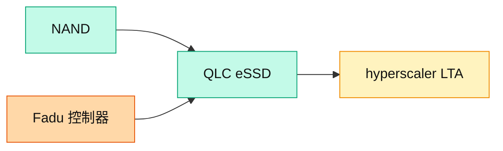

# SNDK.US(sandisk)

## 基本資料
SanDisk 為由 Western Digital 分拆的 **NAND / SSD 大廠**，摩根士丹利維持 OW，看好 NAND/DRAM 供需與資料中心儲存轉型。積極擴張 datacenter 儲存業務並取得 hyperscaler LTA；公司表示 datacenter 占營收 > 20%，未來將提升至 35–40%。業界普遍看好其 QLC eSSD。資料來源：[[260702_ms_nand-industry]]、[[大和 韓國記憶體產業電話會議摘要]]。

## 核心技術／競爭優勢
- **DC 儲存轉型**：datacenter 營收占比由 >20% 拉升目標 35–40%，QLC eSSD 為主力產品。
- **供需能見度**：LTA 支撐定價能見度，市場可望維持緊俏 2–3 年；<10x P/E，2027 有意義庫藏股。
- **控制器夥伴**：eSSD 控制器由 Fadu（韓廠，eSSD 控制器） 供應（key eSSD controller supplier to SanDisk）。

## 產品與應用
| 產品 / 服務 | 應用 | 相關客戶 / 下游 |
|-------------|------|-----------------|
| QLC eSSD | 資料中心大容量儲存 | hyperscaler |
| Client SSD / NAND | PC、消費 | 品牌、通路 |

## 圖片 / 架構圖

圖說：SanDisk 以 QLC eSSD 切入 hyperscaler 資料中心儲存，控制器由 Fadu 供應，datacenter 營收占比目標拉升至 35–40%。

## 時間軸
| 時間 | 事件 | 類型 | 重要性 | 備註 |
|------|------|------|--------|------|
| 2026 | datacenter 占比 >20% → 35–40% | 放量 | ⭐⭐⭐ | QLC eSSD 帶動 |
| 2027 | 有意義庫藏股 | 事件 | ⭐⭐ | 資本回饋 |

→ 對照 [[時程_2026記憶體與AI催化劑]]

## 供應鏈位置
- 上游：NAND 設備、eSSD 控制器（Fadu（韓廠，eSSD 控制器））
- 下游：hyperscaler、PC 品牌
- 所屬供應鏈：[[供應鏈_記憶體]]；相關技術 [[技術_NAND快閃記憶體]]

## 相關公司
| 公司 | 關係 | 說明 |
|------|------|------|
| [[285A.JP(kioxia)]] | 合資背景 / 同業 | 共同 NAND 廠背景，DC 儲存競合 |
| [[MU.US(micron)]] | 同業 | NAND/DRAM 競爭者 |
| [[005930.KR(samsung)]] | 同業 | NAND 競爭者 |

> [!warning] 風險與注意事項
> - 產品定位：業界推測其 datacenter 用低規 NAND 晶片，但仍具溢價；QLC eSSD 品質評價為觀察點。
> - 循環風險：NAND ASP 若因中國廠擴產反轉，DC 儲存溢價收斂。

## 來源
- [[260702_ms_nand-industry]] — 摩根士丹利，2026-07-02
- [[大和 韓國記憶體產業電話會議摘要]] — 大和，2026-07-02

## 相關頁面

- [[分析_記憶體超級循環2026]]
